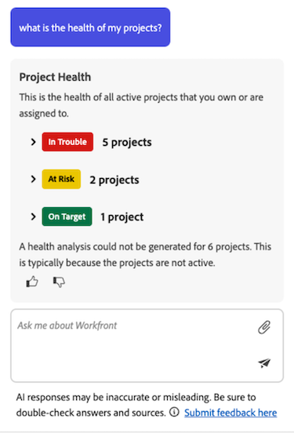

# Projektstatus - Übersicht

>[!IMPORTANT]
>
>Die Funktion Projektdiagnose ist derzeit nur für Benutzer verfügbar, die an der Beta-Phase teilnehmen.

Die Funktion „Projektdiagnose“ von Adobe Workfront nutzt die Leistungsfähigkeit des KI-Assistenten, um Ihnen sofort eine Bewertung zu geben, wie Ihre Projekte funktionieren, welche Bereiche Ihre Aufmerksamkeit erfordern und wie Probleme vermieden werden können, die Sie Zeit und Geld kosten können.

Der KI-Assistent kann eine Bewertung des Projektzustands für die folgenden Objekte erstellen:

* Ein einzelnes Projekt
* Ein einzelnes Programm
* Mehrere Projekte

Weitere Informationen zum KI-Assistenten finden Sie unter [KI-Assistent - Übersicht](/help/quicksilver/workfront-basics/ai-assistant/ai-assistant-overview.md).

+++ Erweitern Sie , um die Zugriffsanforderungen anzuzeigen. 
<table style="table-layout:auto"> 
<col> 
</col> 
<col> 
</col> 
<tbody> 
<tr> 
   <td role="rowheader">
Adobe Workfront-Plan
</td> 
   <td> 

Auswählen von, Prime oder Ultimate 
 
   </td> 
<tr> 
 <tr> 
   <td role="rowheader">
Adobe Workfront-Lizenz
</td> 
   <td> 

Standard
 
   </td> 
   </tr> 
  </tr> 
  <tr> 
   <td role="rowheader">
Konfigurationen der Zugriffsebene
</td> 
   <td>
Administrator zum Verwalten der Projektkonsistenzkonfigurationen 

   
Bearbeiten, um Projektzustandskonfigurationen anzuwenden 

     
Anzeigen, um Projektzustandskonfigurationen anzuzeigen 

  </td> 
  </tr>  
    </tr>  
</tbody> 
</table>

Weitere Informationen zu den Informationen in dieser Tabelle finden Sie unter [Zugriffsanforderungen in der Dokumentation zu Workfront](/help/quicksilver/administration-and-setup/add-users/access-levels-and-object-permissions/access-level-requirements-in-documentation.md).
+++

## Für die Betaversion zur Projektdiagnose registrieren

Um die Projektdiagnose nutzen zu können, muss in Ihrer Organisation der KI-Assistent aktiviert sein.

Um den KI-Assistenten und die Projektdiagnose für Ihre Organisation zu aktivieren, müssen alle folgenden Bedingungen erfüllt sein:

* Ihr Unternehmen muss zu Adobe IMS (Identity Management System) migriert sein.
* Ihr Unternehmen muss über einen Select-, Prime- oder Ultimate Workfront-Plan verfügen
* Das einheitliche Adobe-Erlebnis muss aktiviert sein.
* Adobe muss eine unterzeichnete Adobe Gen AI-Vereinbarung in der Datei haben.
* Der Workfront-Administrator muss den KI-Assistenten für Benutzende in Ihrer Organisation aktivieren. Der KI-Assistent wird über Zugriffsebenen aktiviert.
* Die Optionen KI aktivieren und Projektdiagnose müssen im Abschnitt KI-Voreinstellungen unter Setup > Voreinstellungen ausgewählt werden.

  

Weitere Informationen finden Sie unter [Übersicht über den KI](/help/quicksilver/workfront-basics/ai-assistant/ai-assistant-overview.md)Assistenten und [Systemeinstellungen konfigurieren](/help/quicksilver/administration-and-setup/manage-workfront/security/configure-security-preferences.md).

## Liste mit Eingabeaufforderungen des KI-Assistenten

Nachstehend finden Sie eine Liste von Eingabeaufforderungen, mit denen Sie die KI-Bewertung anfordern können, um eine Bewertung des Projektzustands für ein Projekt, ein Programm oder alle Projekte in Ihrem Konto zu generieren.

<table>
    <tr>
        <td><b>Standort</b></td>
        <td><b>Eingabeaufforderung</b></td>
    </tr>
    <tr>
        <td>Eine bestimmte Seite mit Projektdetails</td>
        <td><em>Wie gesund ist dieses Projekt?</em></td>
    </tr>
    <tr>
        <td>Beliebige Seite in Workfront </td>
        <td><em>Wie ist der Zustand von Projekt [PROJEKTNAME]?</em></td>
    </tr>
    <tr>
        <td>Beliebige Seite in Workfront </td>
        <td><em>Wie gesund sind meine Projekte?</em></td>
    </tr>
       <tr>
        <td>Eine spezifische Seite mit Programmdetails</td>
        <td><em>Was ist der Gesundheitszustand dieses Programms?</em></td>
    </tr>
       <tr>
        <td>Beliebige Seite in Workfront </td>
        <td><em>Wie sieht der Zustand des Programms [PROGRAMMNAME] aus?</em></td>
    </tr>
   </table>

## Liste der Projekt- und Programmbedingungen

Im Folgenden finden Sie die verfügbaren Bedingungen, die der KI-Assistent Ihrem Projekt oder Programm beim Generieren einer Projektzustandsbewertung zuweist.

<table>
    <tr>
        <td><b>Projektbedingung</b></td>
        <td><b>Status des Projektverlaufs</b></td>
    </tr>
    <tr>
        <td>Im Zielbereich</td>
        <td>Wenn der Fortschrittsstatus des Projekts „Pünktlich“ lautet, ist die Projektbedingung „Auf Ziel“.</td>
    </tr>
    <tr>
        <td>Gefährdet</td>
        <td>Wenn der Fortschrittsstatus des Projekts „In Verzug“ oder „Gefährdet“ ist, bedeutet die Projektbedingung „In Gefahr“.</td>
    </tr>
    <tr>
        <td>In Schwierigkeiten</td>
        <td>Wenn der Fortschrittsstatus des Projekts Verspätung lautet, ist die Projektbedingung gefährdet.</td>
    </tr>
    </tr>
   </table>

## Projektzustandskonfigurationen verwalten

Eine Konfiguration für den Projektzustand enthält spezifische Kriterien, die bestimmen, wie der Projektzustand berechnet wird. Nachdem eine Konfiguration erstellt wurde, können Sie sie auf ein Projekt anwenden.

>[!NOTE]
>
>Sie müssen Systemadministrator sein, um Projektzustandskonfigurationen verwalten zu können.

{{step-1-to-setup}}

1. Klicken Sie **linken Bereich auf** Projektvoreinstellungen“ und wählen Sie dann in **angezeigten Dropdown-Liste** Projektstatus“ aus.

1. Klicken Sie oben rechts auf der Seite auf **Neue Konfiguration**.

1. (Optional) Ersetzen Sie auf der Seite mit den Konfigurationsdetails *Nicht benannte Konfiguration* durch eine neue Konfiguration **Name**.

1. Deaktivieren Sie im **Welche Faktoren möchten Sie in den Projektzustand aufnehmen** die Auswahl aller Faktoren, die Sie bei der Bestimmung der Projektzustandskriterien nicht berücksichtigen möchten:
   * **Scope creep**: Wie sehr sich der Projektumfang seit dem Start erweitert hat.

   * **Erforderliche Felder**: Wenn erforderliche Felder fehlen (z. B. Projektbeschreibung). Diese Pflichtfelder bestimmen die Vollständigkeit des Projekts und werden im Abschnitt **Welche Felder möchten Sie auf Vollständigkeit überprüfen?** folgenden Konfigurationsabschnitt.

   * **Zeitplanänderungen**: Wie viele Zeitplanänderungen sind seit dem Start des Projekts aufgetreten.

   * **Aufgabenschätzung**: Wie genau die Aufgabenarbeit geschätzt wurde (z. B. keine überfälligen Aufgaben derzeit im Projekt).

   * **Aufgaben-Burndown**: Wie die Projektarbeit im Vergleich zur Projektzeitleiste voranschreitet.

   * **Überfällige Aufgaben**: Wie viele Aufgaben liegen derzeit nach ihrem Fälligkeitsdatum?

   * **Kosten**: Wenn das Projekt derzeit das Budget überschreitet.

1. In der **Wann beginnt Ihr Projekt offiziell?Wählen Sie** Abschnitt aus der Dropdown-Liste das Ereignis aus, das den Beginn Ihres Projekts signalisiert.

1. In der **Wie schätzen Sie den Arbeitsaufwand für ein Projekt ein?Wählen Sie** Abschnitt aus, welcher Projektfaktor mit zunehmendem Projektumfang größer wird.

1. In den **Welche Felder möchten Sie auf Vollständigkeit überprüfen?Wählen Sie** Abschnitt ein oder mehrere Felder aus, die auf ihre Vollständigkeit überprüft werden sollen.

   

1. Klicken **oben** auf „Speichern“.

## Anwenden von Projektzustandskonfigurationen

Nachdem ein Admin eine Projektzustandskonfiguration erstellt hat, können Benutzende mit Bearbeitungszugriff diese auf ein Projekt anwenden.

{{step1-to-projects}}

1. Wählen Sie auf **Seite** ein Projekt aus.

1. Klicken Sie auf das **Mehr**-Symbol  rechts neben dem Projektnamen und wählen Sie dann **Bearbeiten**. Das **Seitenbedienfeld** Projekt bearbeiten“ wird geöffnet.

1. Wählen Sie im linken Bedienfeld die Option **Projekteinstellungen**.

1. Wählen Sie **Feld** Projektzustandskonfiguration“ die Konfiguration aus, die Sie auf dieses Projekt anwenden möchten.

   

1. Klicken **unten links** Bedienfeld auf „Speichern“.

## Erstellen einer Projektzustandsbewertung für ein Projekt oder Programm

Wenn Sie Ansichtszugriff für ein Projekt oder Programm haben, können Sie mit dem KI-Assistenten die zugehörige Projektzustandsbewertung erstellen.

Wenn Sie eine Bewertung für ein Projekt generieren, kann dies entweder auf der Projektseite oder durch Verweis auf den Projektnamen erfolgen, wenn Sie den Assistenten nach der Leistung des Projekts fragen.

Wenn Sie eine Bewertung für ein Programm generieren, können Sie dies über die Seite mit den Programmdetails tun.

>[!NOTE]
>
>Eine Bewertung des Projektzustands kann erst für ein Projekt generiert werden, nachdem das Projekt gestartet wurde. Sie können konfigurieren, welche Ereignis-Trigger ein Projekt in den Projekteinstellungen starten sollen.

Weitere Informationen finden Sie im folgenden Abschnitt in diesem Artikel: [Verwalten von Projektzustandskonfigurationen](#manage-project-health-configurations).

1. Navigieren Sie zu dem Projekt oder Programm, für das Sie eine Bewertung des Projektzustands generieren möchten.

1. Klicken Sie auf der Seite mit den Projekt-/Programmdetails **das Symbol** KI in der oberen rechten Ecke des Bildschirms. KI-Assistent wird geöffnet.

1. Geben Sie im Feld **Fragen zu Workfront** Folgendes ein: *Wie sieht der Zustand dieses Projekts aus?*

   Oder

   Geben Sie im Feld **Fragen zu Workfront** Folgendes ein: *Wie sieht der Zustand dieses Programms aus?*

   >[!NOTE]
   >
   >Wenn Sie über eine andere Seite in Workfront auf den KI-Assistenten zugreifen, können Sie Folgendes eingeben *Was ist der Zustand des Projekts [PROJEKTNAME]?* oder *Was ist der Zustand des Programms [PROGRAMMNAME]?*  
   >Eine vollständige Liste der aktuellen Eingabeaufforderungen finden Sie im folgenden Abschnitt in diesem Artikel: [Liste der Eingabeaufforderungen des KI-Assistenten](#ai-assistant-prompts-list).

1. Klicken Sie auf das **Senden**-Symbol . Die Bewertung des Projektstatus wird generiert und im Bedienfeld angezeigt. Oben bei jeder Bewertung des Projektzustands wird ein Badge angezeigt, das den aktuellen Zustand des Projekts wiedergibt.

   

   Wenn Sie eine Bewertung für ein Portfolio generieren, werden mehrere Abzeichen aufgelistet, die die Bedingung jedes Projekts im Programm anzeigen. Weitere Informationen zu den Badge-Kennzeichnungen finden Sie im folgenden Abschnitt in diesem Artikel: [Liste der Projekt- und Programmbedingungen](#project-and-program-conditions-list).

1. (Optional) Klicken Sie auf einen der Bewertungspunkte, um dessen Details zu erweitern.

1. (Optional) Klicken Sie im Modus Erweiterte Details auf den Link Aufgabe , um die Aufgabendetails zu öffnen.

   

1. Klicken Sie nach Überprüfung der Projektzustandsdetails auf das **Schließen**-Symbol ) in der oberen rechten Ecke des KI-Assistenten.

## Erstellen einer Projektdiagnose für mehrere Projekte

Sie können eine kombinierte Bewertung des Projektzustands für alle Projekte generieren, für die Sie derzeit Ansichtszugriff (oder höher) haben.

Ein Projekt wird nur dann in die kombinierte Bewertung des Projektzustands einbezogen, wenn es gestartet wurde. Sie können konfigurieren, welche Ereignis-Trigger ein Projekt in den Projekteinstellungen starten sollen. Weitere Informationen finden Sie im folgenden Abschnitt in diesem Artikel: [Verwalten von Projektzustandskonfigurationen](#manage-project-health-configurations).

1. Klicken Sie auf **KI** Assistent in der rechten oberen Ecke des Bildschirms. KI-Assistent wird geöffnet.

1. Geben Sie Folgendes in das Feld **Fragen zu Workfront** ein: *Wie sieht der Zustand meiner Projekte aus?*

   Eine vollständige Liste der aktuellen Eingabeaufforderungen finden Sie im folgenden Abschnitt in diesem Artikel: [Liste der Eingabeaufforderungen des KI-Assistenten](#ai-assistant-prompts-list).

1. Klicken Sie auf das **Senden**-Symbol . Die Bewertung des Projektstatus wird generiert und im Bedienfeld angezeigt.

   

   Beim Generieren einer Bewertung für mehrere Projekte gruppiert der KI-Assistent die Ergebnisse basierend auf der aktuellen Leistung der Projekte.

1. (Optional) Klicken Sie auf eines der Projektzustandsbedingungs-Badges, um die Projektliste zu erweitern, und wählen Sie dann einen Link für ein bestimmtes Projekt aus, um zur Detailseite dieses Projekts zu gehen.

1. Klicken Sie nach Überprüfung der Projektzustandsdetails auf das **Schließen**-Symbol  in der oberen rechten Ecke des KI-Assistenten, um es zu schließen.

## Erstellen eines Tabellenberichts zum Projektzustand in einem Arbeitsflächen-Dashboard

>[!IMPORTANT]
>
>Die Funktion Canvas-Dashboards ist derzeit nur für Benutzer verfügbar, die an der Beta-Phase teilnehmen. Weitere Informationen finden Sie unter [Beta-Informationen zu Canvas-Dashboards](/help/quicksilver/product-announcements/betas/canvas-dashboards-beta/canvas-dashboards-beta-information.md).

Sie können einen Tabellenbericht zu einem Arbeitsflächen-Dashboard hinzufügen, um Ihre Projektzustandsdaten einfach in einem Tabellenformat zu visualisieren.

### Voraussetzungen

Sie müssen ein Dashboard erstellen, bevor Sie einen Tabellenbericht erstellen können.

Weitere Informationen finden Sie unter [Erstellen eines Arbeitsflächen-Dashboards](/help/quicksilver/reports-and-dashboards/canvas-dashboards/create-dashboards/create-dashboards.md).

### Erstellen eines Tabellenberichts für den Projektzustand

Es stehen viele Konfigurationsoptionen zum Erstellen eines Tabellenberichts für den Projektzustand zur Verfügung. In diesem Abschnitt führen wir Sie durch den Prozess der Erstellung einer Spalte, die die folgenden Spalten anzeigt:

* **Name**: Enthält den Projektnamen.
* **Projektzustandsanalyse**: Enthält eine Zusammenfassung der Projektzustandsbewertung.
* **Projektzustand erstellt am**: Enthält das Datum/die Uhrzeit, zu der/der die Projektzustandsbewertung zuletzt generiert wurde.
* **Projektgesundheitsbezeichnung**: Enthält die Bezeichnung des Projekts (z. B. B. am Ziel, in Gefahr oder in Schwierigkeiten).

{{step1-to-dashboards}}

1. Klicken Sie im linken Bedienfeld auf **Arbeitsflächen-Dashboards**.
1. Klicken Sie oben rechts auf **Neues Dashboard**.
1. Geben Sie in das Feld **Dashboard erstellen** den **** Namen“ und die **Beschreibung** des Dashboards ein.
1. Klicken Sie auf **Erstellen**.
1. Wählen Sie im **Bericht hinzufügen** die Option **Bericht erstellen** aus.
1. Klicken Sie auf der linken Seite auf **Tabelle**.
1. Klicken Sie oben rechts auf **Bericht erstellen**.
1. (Optional) Gehen Sie wie folgt vor, um den Abschnitt **Details**  zu konfigurieren:
   1. Einen Bericht eingeben **Name**.
   1. Einen Bericht eingeben **Beschreibung**.
1. Gehen Sie wie folgt vor, um den Abschnitt **Tabelle erstellen**  zu konfigurieren:
   1. Klicken Sie im linken Bedienfeld auf das Symbol **Tabellenspalten** .
   1. Klicken Sie **Spalte hinzufügen** und wählen Sie dann **Projekt** > **Name**.
   1. Klicken Sie **Spalte hinzufügen** und wählen Sie dann **Projekt** > **Projektintegrität** > **Gesundheitsanalyse**.
   1. Klicken Sie **Spalte hinzufügen** und wählen Sie dann **Projekt** > **Projektintegrität** > **Erstellt um**.
   1. Klicken Sie **Spalte hinzufügen** und wählen Sie dann **Projekt** > **Projektintegrität** > **Konsistenzbezeichnung**.

1. Gehen Sie wie folgt vor, um den Abschnitt **Filter**  zu konfigurieren:
   1. Klicken Sie im linken Bedienfeld auf das Symbol **Filter**.
   1. Wählen Sie **Filter bearbeiten** aus.
   1. Klicken Sie **Bedingung hinzufügen** und geben Sie dann das Feld an, nach dem Sie filtern möchten, sowie den Modifikator, der definiert, welche Art von Bedingung das Feld erfüllen muss. Die Spalte wird im Vorschaubereich auf der rechten Seite angezeigt.
   1. (Optional) Klicken Sie auf **Filtergruppe hinzufügen**, um einen weiteren Satz von Filterkriterien hinzuzufügen. Der Standardoperator zwischen den Sätzen ist UND. Klicken Sie auf den Operator, um ihn in ODER zu ändern.

1. Gehen Sie wie folgt vor, um den Abschnitt **Drilldown-Gruppeneinstellungen**  zu konfigurieren:
   1. Klicken Sie im linken Bedienfeld auf das Symbol **Gruppeneinstellungen** .
   1. Klicken Sie auf **Gruppierung hinzufügen** und wählen Sie dann das Feld aus, das Sie als Gruppierung erstellen möchten. Die Gruppierungsspalte wird im Vorschaubereich auf der rechten Seite angezeigt.

1. Klicken Sie **Speichern**, um den Bericht zu erstellen.
