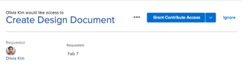

# Zugriff auf Objekte im Startbereich gewähren

Benutzer können den Zugriff auf Objekte in Adobe Workfront anfordern. Weitere Informationen zum Anfordern von Zugriff finden Sie unter  [Fordern Sie Zugriff auf Objekte an](../../workfront-basics/grant-and-request-access-to-objects/request-access.md).

Wenn Sie Eigentümer eines Objekts sind, können Sie den Zugriff auf Elemente in Ihrem Home-Bereich gewähren oder verweigern.

## Zugriffsanforderungen

<!--drafted for P&P:

<table style="table-layout:auto"> 
 <col> 
 <col> 
 <tbody> 
  <tr> 
   <td role="rowheader">Adobe Workfront plan*</td> 
   <td> 
Any
 </td> 
  </tr> 
  <tr> 
   <td role="rowheader">Adobe Workfront license*</td> 
   <td> 
Current license: Standard
 
   Or
   
Legacy license: Work or higher

   </td> 
  </tr> 
  <tr> 
   <td role="rowheader">Access level configurations*</td> 
   <td> 
View access or higher to projects, tasks, issues, or documents
 
<b>NOTE</b>
   
   If you still don't have access, ask your Workfront administrator if they set additional restrictions in your access level. For information on how a Workfront administrator can modify your access level, see <a href="../../administration-and-setup/add-users/configure-and-grant-access/create-modify-access-levels.md" class="MCXref xref">Create or modify custom access levels</a>.
 </td> 
  </tr> 
  <tr> 
   <td role="rowheader">Object permissions</td> 
   <td> 
View permissions or higher to projects, tasks, issues, or documents
 
For information on requesting additional access, see <a href="../../workfront-basics/grant-and-request-access-to-objects/request-access.md" class="MCXref xref">Request access to objects </a>.
 </td> 
  </tr> 
 </tbody> 
</table>

-->

Sie müssen über folgenden Zugriff verfügen, um die Schritte in diesem Artikel ausführen zu können:

<table style="table-layout:auto"> 
 <col> 
 <col> 
 <tbody> 
  <tr> 
   <td role="rowheader">Adobe Workfront-Plan*</td> 
   <td> 
Alle
 </td> 
  </tr> 
  <tr> 
   <td role="rowheader">Adobe Workfront-Lizenz*</td> 
   <td> 
Arbeit oder höher
 </td> 
  </tr> 
  <tr> 
   <td role="rowheader">Konfigurationen auf Zugriffsebene*</td> 
   <td> 
Anzeigen des Zugriffs oder höher auf Projekte, Aufgaben, Probleme oder Dokumente
 
<b>NOTIZ</b>

Wenn Sie immer noch keinen Zugriff haben, fragen Sie Ihren Workfront-Administrator, ob er zusätzliche Zugriffsbeschränkungen für Ihre Zugriffsebene festlegt. Informationen dazu, wie ein Workfront-Administrator Ihre Zugriffsebene ändern kann, finden Sie unter <a href="../../administration-and-setup/add-users/configure-and-grant-access/create-modify-access-levels.md" class="MCXref xref">Benutzerdefinierte Zugriffsebenen erstellen oder ändern</a>.
 </td>
</tr> 
  <tr> 
   <td role="rowheader">Objektberechtigungen</td> 
   <td> 
Anzeigen von Berechtigungen oder höher für Projekte, Aufgaben, Probleme oder Dokumente
 
Weitere Informationen zum Anfordern von zusätzlichem Zugriff finden Sie unter <a href="../../workfront-basics/grant-and-request-access-to-objects/request-access.md" class="MCXref xref">Anfordern des Zugriffs auf Objekte </a>.
 </td> 
  </tr> 
 </tbody> 
</table>

&#42;Wenden Sie sich an Ihren Workfront-Administrator, um zu erfahren, welchen Plan, welchen Lizenztyp oder welchen Zugriff Sie haben.

## Zugriff auf Objekte im Startbereich gewähren

1. Klicken Sie oben links in Adobe Workfront auf das Symbol **Startseite**  .

   >[!NOTE]
   >
   >Ihr Workfront-Administrator kann die folgenden Änderungen am Startseiten-Symbol in Ihrer Umgebung vornehmen:
   >
   >* Ersetzen Sie sie durch ein Bild, das zur Veranschaulichung Ihrer Organisation angepasst wurde. In diesem Fall sieht das Symbol anders aus als in diesem Artikel.
   >* Ersetzen Sie die verknüpfte Seite durch eine andere Seite. Klicken Sie in diesem Fall auf das **Hauptmenü**  in der oberen rechten Ecke der Seite und klicken Sie dann auf **Startseite**.

1. (Bedingt) Führen Sie aus dem veralteten Home-Bereich folgende Schritte aus:

   1. Wählen Sie in der **Arbeitsliste** die Zugriffsanforderung, die Sie verwalten möchten, im Abschnitt **Genehmigungen** aus.

   

   Die Anforderung wird rechts neben der Arbeitsliste angezeigt.

   1. Klicken Sie oben rechts auf die Schaltfläche Zugriff gewähren .\
      Je nach Art des angeforderten Zugriffs ändert sich der Schaltflächenname. Wenn der Anfragende z. B. um Zugriff auf Ansicht bittet, lautet die Schaltfläche &quot;**Zugriff auf Ansicht gewähren**&quot;.\
      

   1. (Optional) Um eine andere als die angeforderte Zugriffsstufe zu gewähren, klicken Sie auf den Pfeil neben der Schaltfläche &quot;Zugriff gewähren&quot;und wählen Sie den neuen Zugriff aus. Klicken Sie dann auf **Gewähren &lt; Berechtigungsstufe > Zugriff >**.\
      Es wird eine Meldung angezeigt, in der bestätigt wird, dass der Zugriff gewährt wurde.

   1. (Optional) Klicken Sie auf **Ignorieren** , um den Zugriff zu verweigern.\
      Es wird eine Meldung angezeigt, die bestätigt, dass der Zugriff ignoriert wurde.

1. (Bedingt) Führen Sie im neuen Startbereich folgende Schritte aus:

   1. Wechseln Sie zum Widget **Warten auf meine Genehmigung** , suchen Sie die Anforderung für weiteren Zugriff und klicken Sie dann auf **Zugriff gewähren** .

      

   1. (Optional) Um eine andere als die angeforderte Zugriffsebene zu gewähren, klicken Sie auf das Dropdown-Menü links neben der Schaltfläche Zugriff gewähren , wählen Sie den neuen Zugriff aus und klicken Sie dann auf **Zugriff gewähren**.

      Die Zugriffsanfrage wird gewährt und aus der Liste der Genehmigungsanfragen verschwindet.

   1. (Optional) Klicken Sie auf **Ignorieren** , um den Zugriff zu verweigern. Die Zugriffsanfrage wird nicht gewährt und die Anfrage wird aus der Liste der Genehmigungsanfragen entfernt.

## E-Mail-Benachrichtigungen für Anforderungen konfigurieren

Sie können konfigurieren, ob Sie E-Mail-Benachrichtigungen für Zugriffsanfragen erhalten. Ihr Workfront-Administrator kann diese Funktion deaktivieren (wie unter [Ereignisbenachrichtigungen für alle Benutzer im System konfigurieren](../../administration-and-setup/manage-workfront/emails/configure-event-notifications-for-everyone-in-the-system.md) beschrieben).

1. Klicken Sie auf das Symbol **Hauptmenü** oben rechts in Adobe Workfront und klicken Sie dann auf **Setup** .

1. Klicken Sie auf **Voreinstellungen** oder scrollen Sie zum Abschnitt &quot;Voreinstellungen&quot;.
1. Wählen oder deaktivieren Sie in der Dropdownliste **E-Mail an mich senden** die Option **Jemand fordert von mir Zugriff an**, je nachdem, ob Sie E-Mail-Benachrichtigungen erhalten möchten, wenn ein anderer Benutzer von Ihnen Zugriff anfordert oder nicht.

1. Klicken Sie auf **Änderungen speichern**.
