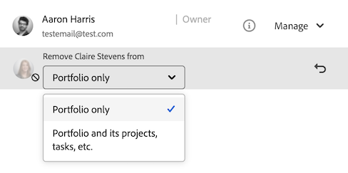

# Entfernen von Berechtigungen aus Objekten

<!--Audited: 01/2024-->

Sie können anderen Benutzern die Berechtigungen für Objekte entziehen, auf die Sie Zugriff zum Freigeben haben. Das Entfernen von Berechtigungen aus Objekten ist für alle Objekte, die freigegeben werden können, identisch.

Ähnliche Überlegungen wie bei der Freigabe von Objekten gelten auch für das Entfernen von Berechtigungen von Objekten. Weitere Informationen finden Sie im Abschnitt [Überlegungen zur Freigabe von Objekten](../../workfront-basics/grant-and-request-access-to-objects/sharing-permissions-on-objects-overview.md#consider) im Artikel [Übersicht über Freigabeberechtigungen für Objekte](../../workfront-basics/grant-and-request-access-to-objects/sharing-permissions-on-objects-overview.md)

## Zugriffsanforderungen

+++ Erweitern Sie , um die Zugriffsanforderungen für die -Funktion in diesem Artikel anzuzeigen.

Sie müssen über Folgendes verfügen, um Objekte freizugeben:

<table style="table-layout:auto"> 
 <col> 
 <col> 
 <tbody> 
  <tr> 
   <td role="rowheader">Adobe Workfront-Plan</td> 
   <td> 
Beliebig 
 </td> 
  </tr> 
  <tr> 
   <td role="rowheader">Workfront-Lizenz*</td> 
   <td> 
Neue Lizenz: Mitwirkende oder höher

   Oder  
   
Aktuelle Lizenz: Anfrage oder höher

   
<b>NOTIZ</b>

Einige Objekte erfordern einen höheren Zugriff als „Anfrage“. 

Bei der neuen Lizenz kann beispielsweise ein Mitwirkender Probleme freigeben, aber nur Benutzer mit Standardlizenz können ein Projekt freigeben.

Für die aktuelle Lizenz kann ein Antragsteller Probleme freigeben, aber nur Arbeiter oder Planende können ein Projekt freigeben.
 
   </td> 
  </tr> 
  <tr> 
   <td role="rowheader">Konfigurationen der Zugriffsebene</td> 
   <td> 
Ansichtszugriff oder höher auf die Objekte, die Sie freigeben möchten
 </td> 
  </tr> 
  <tr> 
   <td role="rowheader">Objektberechtigungen</td> 
   <td> 
Berechtigung zum Anzeigen oder höher für die Objekte, die Sie freigeben möchten
 
Verwalten von Berechtigungen zum Entfernen vererbter Berechtigungen für Objekte
  </td> 
  </tr> 
 </tbody> 
</table>

*Wenden Sie sich an Ihren Workfront-Administrator, um herauszufinden, über welchen Plan, welchen Lizenztyp oder welchen Zugriff Sie verfügen. Weitere Informationen finden Sie in [ Dokumentation zu Zugriffsanforderungen für Workfront ](/help/quicksilver/administration-and-setup/add-users/access-levels-and-object-permissions/access-level-requirements-in-documentation.md).

+++

## Entfernen von Entitäten aus der Freigabeliste eines Objekts {#remove-entities-from-the-sharing-list-of-an-object}

Sie können Entitäten (Benutzer, Aufgabengebiete, Teams, Gruppen, Firmen) aus der Freigabeliste eines Objekts entfernen. Dadurch werden ihre Berechtigungen für das Objekt entfernt.

1. Wechseln Sie zu dem Objekt, dem Sie die Berechtigungen entziehen möchten.

   Informationen dazu, welche Objekte freigegeben werden können, finden Sie unter [Übersicht über Freigabeberechtigungen für Objekte](../../workfront-basics/grant-and-request-access-to-objects/sharing-permissions-on-objects-overview.md).

1. (Bedingt) Gehen Sie für Programme, Portfolios und Dokumente wie folgt vor:

   1. Klicken Sie auf das **Mehr**-Symbol  neben dem Objektnamen und dann auf **Freigabe** oder **Freigeben.**

      

   1. Klicken Sie auf **x** neben dem Namen eines Benutzers, Teams, einer Gruppe, eines Unternehmens oder eines Aufgabengebiets, um diese im Feld „Objektzugriff“ zu entfernen.

      

   1. Wählen **[im Dropdown-Menü Benutzername] die Option Workfront-Zugriff wird aus diesem** entfernt, ob der Zugriff nur aus dem ausgewählten Objekt oder aus allen untergeordneten Objekten, die mit ihm verknüpft sind, entfernt werden soll.

1. (Bedingt) Führen Sie für Projekte, Aufgaben und Probleme die folgenden Schritte aus:

   1. Klicken **rechts neben** Objektnamen auf „Freigeben“.

      
   1. Suchen Sie den Benutzer, die Funktion, das Team, die Gruppe oder das Unternehmen, den/die Sie aus dem Objekt entfernen möchten.
   1. Klicken Sie auf **Entfernen**.
Wählen **im Dropdown-Menü Entfernen &lt; Benutzername > aus** aus, ob der Zugriff nur aus dem ausgewählten Objekt oder aus allen untergeordneten Objekten, die mit ihm verknüpft sind, entfernt werden soll.

      

   Die folgenden Szenarien sind vorhanden:

   * Wenn Sie die Entität nur aus dem Objekt entfernen, verliert diese Entität ihre Berechtigungen für das Objekt und die geerbten Berechtigungen für die untergeordneten Objekte. Wenn ihnen zuvor Berechtigungen für die untergeordneten Elemente einzeln gewährt wurden, behalten sie dieselben Berechtigungen für alle untergeordneten Objekte bei, die mit ihnen verknüpft sind, wenn Sie diese Option auswählen.
   * Wenn Sie die Entität aus dem -Objekt und allen untergeordneten -Objekten entfernen, verliert diese Entität ihre Berechtigungen für das -Objekt sowie für alle untergeordneten -Objekte, selbst wenn ihnen zuvor individuelle Berechtigungen für jedes untergeordnete Objekt erteilt wurden.

1. Klicken Sie auf **Speichern**.

<!--
## Remove permissions from several objects in bulk

You can remove entities (users, job roles, teams, groups, companies) from several objects at a time when you bulk select them in a list.

>[!NOTE]
>
>You cannot view what access entities have for all the objects selected when you select them in bulk. You must know which entity you want to remove from the sharing of the objects selected before removing their permissions.

1. Go to the list of objects that you want to share.

   For information about which objects can be shared, see [Overview of sharing permissions on objects](../../workfront-basics/grant-and-request-access-to-objects/sharing-permissions-on-objects-overview.md).

1. Select several objects in the list, then click the **Share** icon at the top of the list. 
1. Type the name of the user, role, team, group, or company for which you want to remove the access in the **Edit `<Object Name>` access to** field. 
1. From the access drop-down menu, select **No Access**.

   

1. In the `<User Name>`'s Workfront access will be removed from this drop-down menu, select whether you want their access to be removed just from the objects that you have selected, or from all other children objects associated with it.  
   The following scenarios exist:

   * If you remove the entity only from the object, that entity loses their permissions on the object, and their inherited permissions to the children objects. If they were previously granted permissions to the children items individually, they retain the same permissions on all children objects associated with it when you select this option.&nbsp;
   * If you remove the entity from the object and all the children objects, that entity loses their permissions to the object as well as all children objects, even when they were previously given individual permission on each child object.

   **Example:** Select whether to remove permissions to just the tasks you selected in a list, or to the issues and documents attached to the tasks as well.

   

1. (Optional) To change permissions in bulk for several objects, select another level of sharing for the selected entity.

   For example, if they have Manage permissions, select Contribute or View instead. 

1. Click **Save**.

-->

## Entfernen geerbter Berechtigungen

Vererbte Berechtigungen können aus Objekten entfernt werden, sodass Besitzer gezielt identifizieren können, wer Zugriff auf untergeordnete Objekte erhält, unabhängig vom Zugriff eines Benutzers auf ein übergeordnetes Objekt.

>[!IMPORTANT]
>
>Nur Benutzer mit der Berechtigung Verwalten können geerbte Berechtigungen entfernen.

So entfernen Sie geerbte Berechtigungen:

1. Navigieren Sie zu einem Objekt, für das Sie über Verwaltungsberechtigungen verfügen. Gehen Sie beispielsweise zu einer Aufgabe.
1. Gehen Sie zum Feld „Objektzugriff“, wie im Abschnitt [Entfernen von Entitäten aus der Freigabeliste eines Objekts](#remove-entities-from-the-sharing-list-of-an-object) in diesem Artikel beschrieben.
1. Wählen Sie **Deaktivieren** neben **Vererbte Berechtigung** aus, um sie zu deaktivieren.

   Dadurch wird sichergestellt, dass standardmäßig niemand, der Berechtigungen für das übergeordnete Objekt (z. B. das Projekt) erhält, über Berechtigungen für diese Aufgabe verfügt. Sie müssen einzelne Entitäten in der Freigabeliste der Aufgabe auflisten, um Berechtigungen für die Aufgabe zu erteilen.

   >[!TIP]
   >
   >Sie können keine einzelnen Entitäten aus der Liste „Geerbte Berechtigungen“ entfernen. Sie können nur die geerbten Berechtigungen für alle aufgelisteten Entitäten deaktivieren.

1. Klicken Sie **Speichern**. 

## Ein Objekt als privat festlegen

Wenn Sie ein Objekt systemweit freigegeben haben oder Sie es für externe Benutzer freigegeben haben, indem Sie es öffentlich gemacht haben, können Sie es wieder privat machen, indem Sie die systemweiten oder öffentlichen Berechtigungen entfernen. 

Weitere Informationen dazu, wie Sie ein Objekt systemweit oder öffentlich verfügbar machen, finden Sie unter [Freigeben eines Objekts](../../workfront-basics/grant-and-request-access-to-objects/share-an-object.md).

So machen Sie ein Objekt privat:

1. Navigieren Sie zu dem Objekt, das Sie als privat festlegen möchten.\
   Navigieren Sie beispielsweise zu einem Bericht.
1. Klicken Sie auf **Berichtsaktionen** und dann auf **Freigabe**.

   

1. Klicken Sie auf das Zahnradsymbol und deaktivieren Sie **Für externe Benutzer veröffentlichen**.
1. Klicken Sie im Dropdown-Menü **Wer hat Zugriff** auf **Nur eingeladene Personen können Zugriff**, um die Freigabe für alle Workfront-Benutzer zu beenden.
1. Klicken Sie auf **Speichern**.
