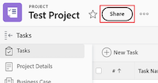

# Entfernen von Berechtigungen aus Objekten

<!--Audited: 01/2024-->

Sie können anderen Benutzern die Berechtigungen für Objekte entziehen, auf die Sie Zugriff zum Freigeben haben. Das Entfernen von Berechtigungen aus Objekten ist für alle Objekte, die freigegeben werden können, identisch.

Ähnliche Überlegungen wie bei der Freigabe von Objekten gelten auch für das Entfernen von Berechtigungen von Objekten. Weitere Informationen finden Sie im Abschnitt [Überlegungen zur Freigabe von Objekten](../../workfront-basics/grant-and-request-access-to-objects/sharing-permissions-on-objects-overview.md#consider) im Artikel [Übersicht über Freigabeberechtigungen für Objekte](../../workfront-basics/grant-and-request-access-to-objects/sharing-permissions-on-objects-overview.md)

## Zugriffsanforderungen

Sie müssen über Folgendes verfügen, um Objekte freizugeben:

<table style="table-layout:auto"> 
 <col> 
 <col> 
 <tbody> 
  <tr> 
   <td role="rowheader">Adobe Workfront-Plan</td> 
   <td> 
Beliebig 
 </td> 
  </tr> 
  <tr> 
   <td role="rowheader">Workfront-Lizenz*</td> 
   <td> 
Neue Lizenz: Mitwirkende oder höher

   Oder  
   
Aktuelle Lizenz: Anfrage oder höher

   
<b>NOTIZ</b>

Einige Objekte erfordern einen höheren Zugriff als „Anfrage“. 

Bei der neuen Lizenz kann beispielsweise ein Mitwirkender Probleme freigeben, aber nur Benutzer mit Standardlizenz können ein Projekt freigeben.

Für die aktuelle Lizenz kann ein Antragsteller Probleme freigeben, aber nur Arbeiter oder Planende können ein Projekt freigeben.
 
   </td> 
  </tr> 
  <tr> 
   <td role="rowheader">Konfigurationen der Zugriffsebene</td> 
   <td> 
Ansichtszugriff oder höher auf die Objekte, die Sie freigeben möchten
 </td> 
  </tr> 
  <tr> 
   <td role="rowheader">Objektberechtigungen</td> 
   <td> 
Berechtigung zum Anzeigen oder höher für die Objekte, die Sie freigeben möchten
 
Verwalten von Berechtigungen zum Entfernen vererbter Berechtigungen für Objekte
  </td> 
  </tr> 
 </tbody> 
</table>

*Wenden Sie sich an Ihren Workfront-Administrator, um herauszufinden, über welchen Plan, welchen Lizenztyp oder welchen Zugriff Sie verfügen. Weitere Informationen finden Sie in [ Dokumentation zu Zugriffsanforderungen für Workfront ](/help/quicksilver/administration-and-setup/add-users/access-levels-and-object-permissions/access-level-requirements-in-documentation.md).

## Entfernen von Entitäten aus der Freigabeliste eines Objekts {#remove-entities-from-the-sharing-list-of-an-object}

Sie können Entitäten (Benutzer, Aufgabengebiete, Teams, Gruppen, Firmen) aus der Freigabeliste eines Objekts entfernen. Dadurch werden ihre Berechtigungen für das Objekt entfernt.

1. Wechseln Sie zu dem Objekt, dem Sie die Berechtigungen entziehen möchten.

   Informationen dazu, welche Objekte freigegeben werden können, finden Sie unter [Übersicht über Freigabeberechtigungen für Objekte](../../workfront-basics/grant-and-request-access-to-objects/sharing-permissions-on-objects-overview.md).

1. (Bedingt) Gehen Sie für Programme, Portfolios und Dokumente wie folgt vor:

   1. Klicken Sie auf das **Mehr**-Symbol neben dem Objektnamen und dann auf **Freigabe** oder **Freigeben.**

      

   1. Klicken Sie auf **x** neben dem Namen eines Benutzers, Teams, einer Gruppe, eines Unternehmens oder eines Aufgabengebiets, um diese im Feld „Objektzugriff“ zu entfernen.

      

   1. Wählen Sie im Dropdown-Menü **&lt; Benutzername > aus, ob der Zugriff auf die Workfront nur aus dem ausgewählten Objekt** aus allen untergeordneten Objekten, die mit dem ausgewählten Objekt verknüpft sind, entfernt werden soll.

1. (Bedingt) Führen Sie für Projekte, Aufgaben und Probleme die folgenden Schritte aus:

   1. Klicken **rechts neben** Objektnamen auf „Freigeben“.

      
   1. Suchen Sie den Benutzer, die Funktion, das Team, die Gruppe oder das Unternehmen, den/die Sie aus dem Objekt entfernen möchten.
   1. Klicken Sie auf **Entfernen**.
Wählen **im Dropdown-Menü Entfernen &lt; Benutzername > aus** aus, ob der Zugriff nur aus dem ausgewählten Objekt oder aus allen untergeordneten Objekten, die mit ihm verknüpft sind, entfernt werden soll.

      

   Die folgenden Szenarien sind vorhanden:

   * Wenn Sie die Entität nur aus dem Objekt entfernen, verliert diese Entität ihre Berechtigungen für das Objekt und die geerbten Berechtigungen für die untergeordneten Objekte. Wenn ihnen zuvor Berechtigungen für die untergeordneten Elemente einzeln gewährt wurden, behalten sie dieselben Berechtigungen für alle untergeordneten Objekte bei, die mit ihnen verknüpft sind, wenn Sie diese Option auswählen.
   * Wenn Sie die Entität aus dem -Objekt und allen untergeordneten -Objekten entfernen, verliert diese Entität ihre Berechtigungen für das -Objekt sowie für alle untergeordneten -Objekte, selbst wenn ihnen zuvor individuelle Berechtigungen für jedes untergeordnete Objekt erteilt wurden.

1. Klicken Sie auf **Speichern**.

## Entfernen von Berechtigungen für mehrere Objekte in großen Mengen

Sie können Entitäten (Benutzer, Aufgabengebiete, Teams, Gruppen, Unternehmen) aus mehreren Objekten gleichzeitig entfernen, wenn Sie sie in einer Liste stapelweise auswählen.

>[!NOTE]
>
>Sie können nicht anzeigen, welche Zugriffsentitäten für alle ausgewählten Objekte haben, wenn Sie sie stapelweise auswählen. Sie müssen wissen, welche Entität Sie aus der Freigabe der ausgewählten Objekte entfernen möchten, bevor Sie deren Berechtigungen entfernen.

1. Navigieren Sie zur Liste der Objekte, die Sie freigeben möchten.

   Informationen dazu, welche Objekte freigegeben werden können, finden Sie unter [Übersicht über Freigabeberechtigungen für Objekte](../../workfront-basics/grant-and-request-access-to-objects/sharing-permissions-on-objects-overview.md).

1. Wählen Sie mehrere Objekte in der Liste aus und klicken Sie dann oben in **Liste auf** Freigeben-Symbol.
1. Geben Sie den Namen des Benutzers, der Rolle, des Teams, der Gruppe oder des Unternehmens, für den bzw. die Sie den Zugriff entfernen möchten, in das Feld **Bearbeiten `<Object Name>` Zugriffs auf** ein.
1. Wählen Sie im Dropdown-Menü Zugriff die Option **Kein Zugriff** aus.

   

1. Wählen Sie in der Dropdown-Liste Zugriff des `<User Name>` auf Workfront wird aus diesem Dropdown-Menü entfernt, ob der Zugriff nur aus den von Ihnen ausgewählten Objekten oder aus allen anderen damit verbundenen untergeordneten Objekten entfernt werden soll.\
   Die folgenden Szenarien sind vorhanden:

   * Wenn Sie die Entität nur aus dem Objekt entfernen, verliert diese Entität ihre Berechtigungen für das Objekt und die geerbten Berechtigungen für die untergeordneten Objekte. Wenn ihnen zuvor Berechtigungen für die untergeordneten Elemente einzeln gewährt wurden, behalten sie dieselben Berechtigungen für alle untergeordneten Objekte bei, die mit ihnen verknüpft sind, wenn Sie diese Option auswählen. 
   * Wenn Sie die Entität aus dem -Objekt und allen untergeordneten -Objekten entfernen, verliert diese Entität ihre Berechtigungen für das -Objekt sowie für alle untergeordneten -Objekte, selbst wenn ihnen zuvor individuelle Berechtigungen für jedes untergeordnete Objekt erteilt wurden.

   **Beispiel** Wählen Sie aus, ob Berechtigungen nur für die in einer Liste ausgewählten Aufgaben oder auch für die an die Aufgaben angehängten Probleme und Dokumente entfernt werden sollen.

   

1. (Optional) Um Berechtigungen für mehrere Objekte stapelweise zu ändern, wählen Sie eine andere Freigabeebene für die ausgewählte Entität aus.

   Wenn sie beispielsweise über Verwaltungsberechtigungen verfügen, wählen Sie stattdessen Contribute oder Ansicht aus.

1. Klicken Sie auf **Speichern**.

## Entfernen geerbter Berechtigungen

Vererbte Berechtigungen können aus Objekten entfernt werden, sodass Besitzer gezielt identifizieren können, wer Zugriff auf untergeordnete Objekte erhält, unabhängig vom Zugriff eines Benutzers auf ein übergeordnetes Objekt.

>[!IMPORTANT]
>
>Nur Benutzer mit der Berechtigung Verwalten können geerbte Berechtigungen entfernen.

So entfernen Sie geerbte Berechtigungen:

1. Navigieren Sie zu einem Objekt, für das Sie über Verwaltungsberechtigungen verfügen. Gehen Sie beispielsweise zu einer Aufgabe.
1. Gehen Sie zum Feld „Objektzugriff“, wie im Abschnitt [Entfernen von Entitäten aus der Freigabeliste eines Objekts](#remove-entities-from-the-sharing-list-of-an-object) in diesem Artikel beschrieben.
1. Wählen Sie **x** neben **Geerbte Berechtigung** im Freigabefeld aus, um die dort aufgeführten Personen zu entfernen.

   

   Dadurch wird sichergestellt, dass standardmäßig niemand, der Berechtigungen für das übergeordnete Objekt (z. B. das Projekt) erhält, über Berechtigungen für diese Aufgabe verfügt. Sie müssen auflisten  Einzelne Entitäten in der Freigabeliste der Aufgabe, um Berechtigungen für die Aufgabe zu erteilen.

   >[!TIP]
   >
   >Sie können keine einzelnen Entitäten aus der Liste „Geerbte Berechtigungen“ entfernen. Sie können nur die geerbten Berechtigungen für alle aufgelisteten Entitäten deaktivieren.

1. Klicken Sie **Speichern**. 

## Ein Objekt als privat festlegen

Wenn Sie ein Objekt systemweit freigegeben haben oder Sie es für externe Benutzer freigegeben haben, indem Sie es öffentlich gemacht haben, können Sie es wieder privat machen, indem Sie die systemweiten oder öffentlichen Berechtigungen entfernen. 

Weitere Informationen dazu, wie Sie ein Objekt systemweit oder öffentlich verfügbar machen, finden Sie unter [Freigeben eines Objekts](../../workfront-basics/grant-and-request-access-to-objects/share-an-object.md).

So machen Sie ein Objekt privat:

1. Navigieren Sie zu dem Objekt, das Sie als privat festlegen möchten.\
   Navigieren Sie beispielsweise zu einem Bericht.
1. Klicken Sie auf **Berichtsaktionen** und dann auf **Freigabe**.

   

1. Klicken Sie **Öffentlichen Zugriff entfernen**, um externen Benutzern den Zugriff zum Anzeigen des Berichts zu entziehen.
1. Klicken Sie auf **Systemweiten Zugriff entfernen**, um die Freigabe für alle Workfront-Benutzer zu beenden. 
1. Klicken Sie auf **Speichern**.
