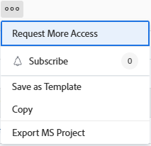

# Zugriff auf Objekte anfordern

{{preview-fast-release-general}}

Die Sichtbarkeit der Objekte in Adobe Workfront hängt von Ihrem Zugriff auf diesen Objekttyp sowie von Ihren Berechtigungen für einzelne Objekte ab.

>[!NOTE]
>
>In diesem Artikel wird beschrieben, wie Sie Berechtigungen für alle Objekte anfordern können, mit Ausnahme der folgenden:
>
>* Szenario-Planungspläne im Adobe Workfront-Szenario-Planer. Weitere Informationen finden Sie unter [Anfordern des Zugriffs auf einen Plan im Szenario-Planer](../../scenario-planner/request-access-to-plan.md). Dies erfordert eine zusätzliche Lizenz.
>
>* Ansichten und Arbeitsbereiche in der Workfront-Planung. Weitere Informationen finden Sie unter [Übersicht über die Freigabe von Berechtigungen in der Adobe Workfront-Planung](/help/quicksilver/planning/access/sharing-permissions-overview.md). Dies erfordert eine zusätzliche Lizenz.

Ihr Workfront-Administrator konfiguriert Ihren Zugriff auf einen Objekttyp in Ihrer Zugriffsebene. Weitere Informationen finden Sie unter [Wie Zugriffsebenen und Berechtigungen zusammenarbeiten](../../administration-and-setup/add-users/access-levels-and-object-permissions/how-access-levels-permissions-work-together.md).

Wenn Sie Berechtigungen für bestimmte Objekte in Workfront benötigen, können Sie den Zugriff darauf anfordern. Anstatt E-Mails an den Workfront-Administrator oder Objekteigentümer zu senden, um Ihre Anforderungen zu erläutern, können Sie innerhalb von Workfront zusätzlichen Zugriff (oder Berechtigungen) anfordern.

Sie können den anfänglichen Zugriff auf Objekte anfordern, wenn jemand eine Verknüpfung mit dem Objekt für Sie freigegeben hat, oder Sie können zusätzlichen Zugriff auf Objekte anfordern, die Sie zumindest anzeigen.

Sie können beispielsweise über Ansichtsberechtigungen für ein Projekt verfügen, müssen diesem Projekt jedoch Aufgaben hinzufügen. In diesem Fall können Sie Contribute-Berechtigungen für das Projekt anfordern.

## Zugriffsanforderungen

+++ Erweitern Sie , um die Zugriffsanforderungen für die Funktionalität in diesem Artikel anzuzeigen.

Sie müssen über Folgendes verfügen, um Objekte freizugeben:

<table style="table-layout:auto"> 
 <col> 
 <col> 
 <tbody> 
  <tr> 
   <td role="rowheader">Adobe Workfront-Abo</td> 
   <td> 
Alle 
 </td> 
  </tr> 
  <tr> 
   <td role="rowheader">Adobe Workfront-Lizenz*</td> 
   <td> 
Neu: Standard
 
   
Aktuell: Arbeit oder höher
 
   </td> 
  </tr> 
  <tr> 
   <td role="rowheader">Konfigurationen auf Zugriffsebene</td> 
   <td> 
Anzeigen des Zugriffs oder höher auf Objekte, für die Sie Berechtigungen anfordern
 </td> 
  </tr> 
 </tbody> 
</table>

*Weitere Informationen finden Sie unter [Zugriffsanforderungen in der Workfront-Dokumentation](/help/quicksilver/administration-and-setup/add-users/access-levels-and-object-permissions/access-level-requirements-in-documentation.md).

+++

## Grundlegendes zu standardmäßigen Freigaberegeln

Die folgenden standardmäßigen Freigaberegeln werden automatisch wirksam, da sie in Ihrem Workfront-System als Standardoptionen eingerichtet sind.

* Benutzer, die einer Aufgabe oder einem Problem zugewiesen sind, haben Contribute-Zugriff darauf.
* Projekt-, Portfolio- und Programmmanager haben Zugriff auf die Objekte, deren Inhaber sie sind.
* Benutzer, die in einer Konversation enthalten sind, haben Ansichtszugriff auf das Objekt, an dem die Konversation stattfindet.
* Als Genehmiger zugewiesene Benutzer haben Zugriff auf Ansicht auf das Objekt, das auf die Genehmigung wartet.
* Beim Freigeben eines Dashboards werden alle Berichte im Dashboard auch für dieselben Benutzer freigegeben.
* Objekteigentümer können den Zugriff auf ein Objekt nicht über ihren Zugriff auf dieses Objekt hinaus erweitern, wie vom Administrator definiert.

## Zugriffsberechtigung anfordern

Sie können den anfänglichen Zugriff auf Objekte anfordern, auf die Sie derzeit keinen Zugriff haben, oder Sie können zusätzlichen Zugriff auf Objekte anfordern, auf die Sie nur eingeschränkten Zugriff haben.

* [Fordern Sie den anfänglichen Zugriff an](#request-initial-access)
* [Zusätzlichen Zugriff anfordern](#request-additional-access)

### Erlangen Sie Zugriff  {#request-initial-access}

Wenn Sie noch keinen Zugriff auf ein Objekt haben und über einen Link zu diesem Objekt navigieren, wird ein Bildschirm angezeigt, der Sie darüber informiert, dass Sie keinen Zugriff auf die Informationen haben.

So fordern Sie den anfänglichen Zugriff auf ein Objekt an:

1. Klicken Sie auf **Zugriff anfordern**.\
   Das Dialogfeld **Zugriff anfordern** wird angezeigt.

1. (Bedingt) Wenn mehr als ein Benutzer über den entsprechenden Zugriff verfügt, um Ihnen zusätzlichen Zugriff zu gewähren, wird neben dem Namen des Benutzers ein Dropdown-Pfeil angezeigt. Wählen Sie den Benutzer aus der Dropdownliste aus, der Ihre Zugriffsanfrage erhalten soll.

   In der Dropdown-Liste werden nur zehn Benutzer angezeigt. Die Liste ist alphabetisch sortiert.\
   Weitere Informationen zur Reihenfolge der in diesem Dropdown-Menü aufgeführten Benutzer finden Sie unter [Hierarchie der Dropdown-Menüs &quot;Zugriff anfordern&quot;und &quot;Mehr Zugriff anfordern&quot;](#hierarchy-of-the-request-access-and-request-more-access-drop-down-menus).

1. Wählen Sie aus der Dropdown-Liste den gewünschten Zugriffstyp aus.
1. (Optional) Geben Sie im Feld **P.S.** einen Hinweis für den Benutzer an, warum Sie zusätzlichen Zugriff benötigen.

   Beispielbild in der Vorschauumgebung:
   

   Beispielbild in der Produktionsumgebung:
   

<!--
If you do not have access level rights to an object and you try to access that object from a link, a screen is displayed informing you to contact the Workfront administrator.

For example, if you do not have portfolio access, but you were given a link to a portfolio, you would see the following message:  

-->

### Zusätzlichen Zugriff anfordern {#request-additional-access}

So fordern Sie zusätzlichen Zugriff auf ein Objekt an, auf das Sie bereits eingeschränkten Zugriff haben:

1. Markieren Sie das Objekt, für das Sie zusätzlichen Zugriff anfordern möchten.

1. Klicken Sie auf das Menü **Mehr** rechts neben dem Projektnamen und dann auf **Mehr Zugriff anfordern**.

   

1. (Bedingt) Wenn mehr als ein Benutzer über den entsprechenden Zugriff verfügt, um Ihnen zusätzlichen Zugriff zu gewähren, wird neben dem Namen des Benutzers ein Dropdown-Pfeil angezeigt.
1. Wählen Sie den Benutzer aus der Dropdown-Liste aus, der Ihre Zugriffsanfrage erhalten soll.\
   In der Dropdown-Liste werden nur zehn Benutzer angezeigt. Die Liste ist alphabetisch sortiert.\
   Weitere Informationen zur Reihenfolge der in diesem Dropdown-Menü aufgeführten Benutzer finden Sie unter [Hierarchie der Dropdown-Menüs &quot;Zugriff anfordern&quot;und &quot;Mehr Zugriff anfordern&quot;](#hierarchy-of-the-request-access-and-request-more-access-drop-down-menus).

1. Wählen Sie aus der Dropdown-Liste die Zugriffsstufe aus, die Sie anfordern.
1. (Optional) Geben Sie im Feld **P.S.** einen Hinweis an, warum Sie zusätzlichen Zugriff benötigen.
1. Klicken Sie auf **Zugriff anfordern**.

   Beispielbild in der Vorschauumgebung:
   

   Beispielbild in der Produktionsumgebung:
   

## Hierarchie der Dropdown-Menüs &quot;Zugriff anfordern&quot;und &quot;Zugriff anfordern&quot; {#hierarchy-of-the-request-access-and-request-more-access-drop-down-menus}

* [Machen Sie sich mit der Hierarchie der Benutzer vertraut, die in den Dropdownmenüs Zugriff anfordern und Mehr Zugriff anfordern aufgeführt sind](#understand-the-hierarchy-of-users-listed-in-the-request-access-and-request-more-access-drop-down-menus)
* [Grundlegendes zum Eigentümer eines Objekts](#understand-the-owner-of-an-object)

### Machen Sie sich mit der Hierarchie der Benutzer vertraut, die in den Dropdownmenüs Zugriff anfordern und Mehr Zugriff anfordern aufgeführt sind. {#understand-the-hierarchy-of-users-listed-in-the-request-access-and-request-more-access-drop-down-menus}

Beim Ausfüllen der Listen &quot;Zugriff anfordern&quot;oder &quot;Mehr Zugriff anfordern&quot;für Objekte wählt Workfront eine Liste mit bis zu zehn Benutzern aus, die wie unten beschrieben verschiedene Rollen bei der Freigabe des Objekts erfüllen. Diese Benutzer können dem Benutzer, der das Objekt anfordert, Zugriff auf das Objekt gewähren.\
Die resultierende Liste wird dann nach ihrem Namen in aufsteigender alphabetischer Reihenfolge sortiert.\
Workfront zeigt bis zu 10 Benutzer in den Listen &quot;Zugriff anfordern&quot;und &quot;Mehr Zugriff anfordern&quot;an.

Die Reihenfolge der Benutzer in den Dropdown-Menüs &quot;Zugriff anfordern&quot;oder &quot;Mehr Zugriff anfordern&quot;wird durch die folgenden Regeln bestimmt:

* Der erste Benutzer in der Liste ist das Objekt &quot;owner&quot;, wie unter [Den Eigentümer eines Objekts verstehen](#understand-the-owner-of-an-object) beschrieben.
* Anschließend wird die Liste mit Benutzern gefüllt, für die das Objekt einzeln freigegeben ist. Sie werden in alphabetischer Reihenfolge aufgelistet.
* Anschließend wird die Liste mit Benutzern gefüllt, die den erforderlichen Zugriff durch die Freigabe für ihre Teams, Gruppen oder Unternehmen erhalten. Sie werden in alphabetischer Reihenfolge aufgelistet.
* Wenn die Liste leer ist, werden die Workfront-Administratoren hinzugefügt, sodass immer jemand zum Anfordern des Zugriffs verfügbar ist. Sie werden in alphabetischer Reihenfolge aufgelistet.
* Jeder Benutzer in der Liste muss über den angeforderten Zugriff auf das Objekt und Zugriff zum Freigeben des Objekts verfügen.

### Grundlegendes zum Eigentümer eines Objekts {#understand-the-owner-of-an-object}

Der Eigentümer eines Objekts wird wie folgt definiert:

<table style="table-layout:auto"> 
 <col> 
 <col> 
 <thead> 
  <tr> 
   <th><strong>Objekt</strong> </th> 
   <th><strong>Definition des Eigentümers des Objekts</strong> </th> 
  </tr> 
 </thead> 
 <tbody> 
  <tr> 
   <td>Projekte</td> 
   <td>Der Eigentümer ist der Projekteigentümer oder, falls er fehlt oder nicht über den erforderlichen Zugriff verfügt, der Eigentümer des übergeordneten Portfolios. 
Sie sind möglicherweise nicht dieselbe Person wie der Projektersteller. 
</td> 
  </tr> 
  <tr> 
   <td>Aufgaben</td> 
   <td>Der Eigentümer ist der Primäre Bevollmächtigte oder, falls er fehlt oder nicht über den erforderlichen Zugriff verfügt, der Eigentümer des Projekts, auf dem sich die Aufgabe befindet, wie oben definiert. 
Sie sind möglicherweise nicht dieselbe Person wie der Ersteller der Aufgabe. 
</td> 
  </tr> 
  <tr> 
   <td>Probleme</td> 
   <td> 
Der Eigentümer ist der Primäre Ansprechpartner für das Problem oder, falls es fehlt oder er keinen erforderlichen Zugriff hat, der Eigentümer des Projekts, in dem das Problem liegt, wie oben definiert. 
 
Sie sind möglicherweise nicht dieselbe Person wie der Ersteller des Problems. 
 </td> 
  </tr> 
  <tr> 
   <td>Portfolios</td> 
   <td>Der Eigentümer ist der Eigentümer des Portfolios. 
Sie sind möglicherweise nicht dieselbe Person wie der Ersteller des Portfolios. 
</td> 
  </tr> 
  <tr> 
   <td>Dokumente</td> 
   <td>Der Eigentümer ist der Eigentümer des Dokuments (der Benutzer, der das Dokument hochgeladen hat) oder, wenn es fehlt oder er keinen erforderlichen Zugriff hat, der Eigentümer des Objekts, in dem sich das Dokument befindet.</td> 
  </tr> 
  <tr> 
   <td>Berichte und Dashboards</td> 
   <td>Der Inhaber ist der Ersteller, der Bericht oder das Dashboard. </td> 
  </tr> 
  <tr> 
   <td>Kalender</td> 
   <td>Der Eigentümer ist der Ersteller des Kalenders. Allen Benutzern ist standardmäßig ein Kalender zugewiesen. Sie werden als Eigentümer dieses Kalenders betrachtet. </td> 
  </tr> 
  <tr> 
   <td>Filter, Ansichten und Gruppierungen</td> 
   <td>Der Eigentümer eines Filters, einer Ansicht oder einer Gruppierung ist der Ersteller. </td> 
  </tr> 
  <tr data-mc-conditions="QuicksilverOrClassic.Quicksilver"> 
   <td>Pläne </td> 
   <td> 
Der Eigentümer ist der Ersteller des Plans. 
 
Dies erfordert eine zusätzliche Lizenz. 
 
Weitere Informationen zum Workfront-Szenario-Planer finden Sie unter <a href="../../scenario-planner/scenario-planner-overview.md" class="MCXref xref">Übersicht über den Szenario-Planer</a>.
 </td> 
  </tr> 
  <tr data-mc-conditions="QuicksilverOrClassic.Quicksilver"> 
   <td>Ziele</td> 
   <td> 
Der Eigentümer ist der Benutzer, der als Inhaber bezeichnet wurde. Sie sind möglicherweise nicht dieselbe Person wie der Ersteller des Ziels. 
 
Dies erfordert eine zusätzliche Lizenz. 
 
Weitere Informationen zu Workfront-Zielen finden Sie unter <a href="../../workfront-goals/goal-management/wf-goals-overview.md" class="MCXref xref">Übersicht über Adobe Workfront-Ziele</a>. 
 </td> 
  </tr> 
 </tbody> 
</table>

