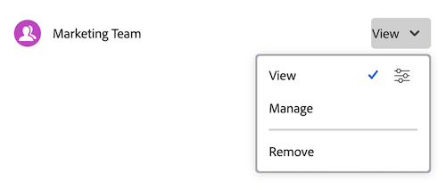

# Portfolio freigeben

Die hervorgehobenen Informationen auf dieser Seite beziehen sich auf Funktionen, die noch nicht allgemein verfügbar sind. Sie ist nur in der Sandbox-Vorschau-Umgebung verfügbar.

Ihr Adobe Workfront-Administrator kann Ihnen bei der Zuweisung Ihrer Zugriffsebene Zugriff zum Anzeigen oder Bearbeiten von Portfolios gewähren. Sie müssen über eine Plan-Lizenz verfügen, um Zugriff zum Bearbeiten eines Portfolios zu erhalten. Weitere Informationen finden Sie unter [Zugriff auf Portfolios gewähren](../../administration-and-setup/add-users/configure-and-grant-access/grant-access-portfolios.md).

Neben der Ihnen gewährten Zugriffsebene können Sie auch Berechtigungen zum Anzeigen oder Verwalten bestimmter Portfolios von Benutzern erhalten, die diese für Sie freigeben können. Weitere Informationen zu Zugriffsebenen und Berechtigungen finden Sie unter [Funktionsweise von Zugriffsebenen und Berechtigungen](../../administration-and-setup/add-users/access-levels-and-object-permissions/how-access-levels-permissions-work-together.md).

Berechtigungen sind für ein Element in Workfront spezifisch und definieren, welche Aktionen Benutzende für dieses Element ausführen können.

## Überlegungen zur Freigabe von Portfolios

Zusätzlich zu den unten stehenden Überlegungen finden Sie weitere Informationen unter [Übersicht über Freigabeberechtigungen für Objekte](../../workfront-basics/grant-and-request-access-to-objects/sharing-permissions-on-objects-overview.md).

>[!NOTE]
>
>Ein Workfront-Administrator kann für alle Benutzenden Berechtigungen zu Elementen im System hinzufügen oder entfernen, ohne Besitzer dieser Elemente zu sein.

* Der Ersteller eines Portfolios hat standardmäßig Verwaltungsberechtigungen dafür.
* Sie können ein Portfolio einzeln freigeben oder mehrere Portfolios gleichzeitig freigeben. Die Freigabe eines Portfolios ist mit der Freigabe anderer Objekte in Workfront identisch. Weitere Informationen finden Sie unter [Freigeben eines Objekts](../../workfront-basics/grant-and-request-access-to-objects/share-an-object.md).

* Sie können nur Anzeigen- oder Verwaltungsberechtigungen für Portfolios erteilen.

      

  In Vorschau:
  

* Wenn Sie ein Portfolio gemeinsam nutzen, erben Benutzer standardmäßig dieselben Berechtigungen für alle untergeordneten Objekte, die mit dem Portfolio verknüpft sind.

Weitere Informationen zur Objekthierarchie in Workfront finden Sie unter [Grundlegendes zu Objekten in Adobe Workfront](../../workfront-basics/navigate-workfront/workfront-navigation/understand-objects.md).

* Sie können geerbte Berechtigungen aus dem Portfolio entfernen. Weitere Informationen zum Entfernen von Berechtigungen aus Objekten finden Sie unter [Entfernen von Berechtigungen aus Objekten](../../workfront-basics/grant-and-request-access-to-objects/remove-permissions-from-objects.md).

## Berechtigungen für Portfolios

Die folgende Tabelle zeigt, welche Berechtigungen Sie Benutzern erteilen können, wenn sie ein Portfolio anzeigen oder verwalten möchten:

| **Aktionen** | **Verwalten** | **Anzeigen** |
|---|---|---|
| Portfolio-Details bearbeiten | ✓ |   |
| Portfolio anzeigen | ✓ | ✓ |
| Löschen eines Portfolios | ✓ |   |
| Benutzerdefiniertes Formular anhängen | ✓ |   |
| Benutzerdefiniertes Feld bearbeiten | ✓ |   |
| Ein Programm hinzufügen oder entfernen&#42; | ✓ |   |
| Ein Projekt hinzufügen oder entfernen&#42; | ✓ |   |
| Genehmigen eines Projekts | ✓ |   |
| Portfolio-Optimierung&#42; | ✓ |   |
| Dokumentenordner hinzufügen&#42; | ✓ | ✓ |
| Dokument hinzufügen | ✓ | ✓ |
| Aktualisierungen/Kommentare | ✓ | ✓ |
| Freigeben | ✓ | ✓ |
| Systemweit freigeben |   | ✓ |

*Diese Berechtigungen werden durch die Zugriffsebene und Berechtigungen für andere Objekte wie Projekte, Programme und Dokumente gesteuert.
