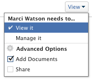

# Freigeben eines Programms

Ihr Adobe Workfront-Administrator kann Ihnen bei der Zuweisung Ihrer Zugriffsebene Zugriff zum Anzeigen oder Bearbeiten von Programmen gewähren. Sie müssen über eine Plan-Lizenz verfügen, um Zugriff zur Bearbeitung eines Programms zu erhalten. Weitere Informationen finden Sie unter [Zugriff auf Programme gewähren](../../administration-and-setup/add-users/configure-and-grant-access/grant-access-programs.md).

Neben der Ihnen gewährten Zugriffsebene können Sie auch Berechtigungen zum Anzeigen oder Verwalten bestimmter Programme von Benutzern erhalten, die diese für Sie freigeben können. Weitere Informationen zu Zugriffsebenen und Berechtigungen finden Sie unter [Funktionsweise von Zugriffsebenen und Berechtigungen](../../administration-and-setup/add-users/access-levels-and-object-permissions/how-access-levels-permissions-work-together.md).

Berechtigungen sind für jedes Element in Workfront spezifisch und definieren, welche Aktionen Benutzende für dieses Element ausführen können.

## Überlegungen zur Freigabe eines Programms

Zusätzlich zu den unten stehenden Überlegungen finden Sie weitere Informationen unter [Übersicht über Freigabeberechtigungen für Objekte](../../workfront-basics/grant-and-request-access-to-objects/sharing-permissions-on-objects-overview.md).

>[!NOTE]
>
>Ein Workfront-Administrator kann für alle Benutzenden Berechtigungen zu Elementen im System hinzufügen oder entfernen, ohne Besitzer dieser Elemente zu sein.

* Der Ersteller eines Programms hat standardmäßig Verwaltungsberechtigungen dafür.

* Sie können Programme einzeln freigeben oder mehrere davon gleichzeitig freigeben.

  Weitere Informationen zum Freigeben von Elementen in Workfront finden Sie unter [Freigeben eines Objekts](../../workfront-basics/grant-and-request-access-to-objects/share-an-object.md).

* Sie können nur Anzeigen- oder Verwaltungsberechtigungen für Programme erteilen.

      

* Wenn Sie ein Programm freigeben, erben Benutzer standardmäßig dieselben Berechtigungen für alle untergeordneten Objekte, die mit dem Programm verknüpft sind.

  Weitere Informationen zur Objekthierarchie in Workfront finden Sie unter [Grundlegendes zu Objekten in Adobe Workfront](../../workfront-basics/navigate-workfront/workfront-navigation/understand-objects.md).

* Sie können geerbte Berechtigungen aus dem Programm entfernen. Weitere Informationen zum Entfernen von Berechtigungen aus Objekten finden Sie unter  [Entfernen von Berechtigungen aus Objekten](../../workfront-basics/grant-and-request-access-to-objects/remove-permissions-from-objects.md).

## Programmberechtigungen

Die folgende Tabelle zeigt, welche Berechtigungen Sie Benutzern erteilen können, wenn sie ein Programm anzeigen oder verwalten möchten:

| **Aktionen** | **Verwalten** | **Anzeigen** |
|---|---|---|
| Programmdetails bearbeiten | ✓ |   |
| Anzeigen eines Programms | ✓ | ✓ |
| Löschen eines Programms | ✓ |   |
| Benutzerdefiniertes Formular anhängen | ✓ |   |
| Benutzerdefiniertes Feld bearbeiten | ✓ |   |
| Ein Projekt hinzufügen oder entfernen&#42; | ✓ |   |
| Genehmigen eines Projekts | ✓ |   |
| Dokumentenordner hinzufügen&#42; | ✓ | ✓ |
| Dokument hinzufügen | ✓ | ✓ |
| Aktualisierungen/Kommentare hinzufügen | ✓ | ✓ |
| Freigeben | ✓ | ✓ |
| Systemweit freigeben |   | ✓ |

*Diese Berechtigungen werden von der Zugriffsebene und den Berechtigungen für andere Objekte, z. B. Projekte, gesteuert. 
