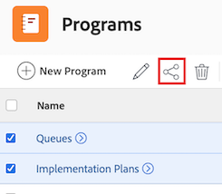

# Freigeben eines Programms

Ihr Adobe Workfront-Administrator kann Ihnen bei der Zuweisung Ihrer Zugriffsebene Zugriff zum Anzeigen oder Bearbeiten von Programmen gewähren. Sie müssen über eine Plan-Lizenz verfügen, um Zugriff zur Bearbeitung eines Programms zu erhalten. Weitere Informationen finden Sie unter [Zugriff auf Programme gewähren](../../administration-and-setup/add-users/configure-and-grant-access/grant-access-programs.md).

Neben der Ihnen gewährten Zugriffsebene können Sie auch Berechtigungen zum Anzeigen oder Verwalten bestimmter Programme von Benutzern erhalten, die diese für Sie freigeben können. Weitere Informationen zu Zugriffsebenen und Berechtigungen finden Sie unter [Funktionsweise von Zugriffsebenen und Berechtigungen](../../administration-and-setup/add-users/access-levels-and-object-permissions/how-access-levels-permissions-work-together.md).

Berechtigungen sind für jedes Element in Workfront spezifisch und definieren, welche Aktionen Benutzende für dieses Element ausführen können.

## Zugriffsanforderungen

+++ Erweitern Sie , um die Zugriffsanforderungen für die -Funktion in diesem Artikel anzuzeigen.

Sie müssen über Folgendes verfügen, um Objekte freizugeben:

<table style="table-layout:auto"> 
 <col> 
 <col> 
 <tbody> 
  <tr> 
   <td role="rowheader">Adobe Workfront-Plan</td> 
   <td> 
Beliebig 
 </td> 
  </tr> 
  <tr> 
   <td role="rowheader">Adobe Workfront-Lizenz</td> 
   <td> 
Neu: Standard
 
   Oder
   
Aktuell: Arbeit oder höher

   </td> 
  </tr> 
  <tr> 
   <td role="rowheader">Konfigurationen der Zugriffsebene</td> 
   <td> 
Ansichtszugriff oder höher auf die Objekte, die Sie freigeben möchten
 </td> 
  </tr> 
  <tr> 
   <td role="rowheader">Objektberechtigungen</td> 
   <td> 
Berechtigung zum Anzeigen oder höher für die Objekte, die Sie freigeben möchten
</td> 
  </tr> 
 </tbody> 
</table>

Weitere Informationen finden Sie unter [Zugriffsanforderungen in der Dokumentation zu Workfront](/help/quicksilver/administration-and-setup/add-users/access-levels-and-object-permissions/access-level-requirements-in-documentation.md).

+++

## Überlegungen zur Freigabe eines Programms

Zusätzlich zu den unten stehenden Überlegungen finden Sie weitere Informationen unter [Übersicht über Freigabeberechtigungen für Objekte](../../workfront-basics/grant-and-request-access-to-objects/sharing-permissions-on-objects-overview.md).

>[!NOTE]
>
>Ein Workfront-Administrator kann für alle Benutzenden Berechtigungen zu Elementen im System hinzufügen oder entfernen, ohne Besitzer dieser Elemente zu sein.

* Der Ersteller eines Programms hat standardmäßig Verwaltungsberechtigungen dafür.

* Sie können Programme einzeln freigeben oder mehrere davon gleichzeitig freigeben.

  Weitere Informationen zum Freigeben von Elementen in Workfront finden Sie unter [Freigeben eines Objekts](../../workfront-basics/grant-and-request-access-to-objects/share-an-object.md).

* Sie können nur Anzeigen- oder Verwaltungsberechtigungen für Programme erteilen:

* Wenn Sie ein Programm freigeben, erben Benutzer standardmäßig dieselben Berechtigungen für alle untergeordneten Objekte, die mit dem Programm verknüpft sind.

  Weitere Informationen zur Objekthierarchie in Workfront finden Sie unter [Grundlegendes zu Objekten in Adobe Workfront](../../workfront-basics/navigate-workfront/workfront-navigation/understand-objects.md).

* Sie können geerbte Berechtigungen aus dem Programm entfernen. Weitere Informationen zum Entfernen von Berechtigungen aus Objekten finden Sie unter  [Entfernen von Berechtigungen aus Objekten](../../workfront-basics/grant-and-request-access-to-objects/remove-permissions-from-objects.md).

## Freigeben eines Programms

{{step1-to-programs}}

1. Wählen Sie auf **Seite** das Programm aus, das Sie freigeben möchten. Die Seite Programm wird geöffnet.

1. Klicken Sie rechts neben dem Programmnamen auf &quot;**&quot;**. Das **Freigeben [Programmname]** wird geöffnet.

   

1. Geben Sie im Feld **Programmzugriff erteilen auf** den Namen des Benutzers, Teams, der Rolle, der Gruppe oder des Unternehmens ein, für den bzw. die Sie das Programm freigeben möchten, und klicken Sie dann auf den Namen, wenn er in der Dropdown-Liste angezeigt wird.

   >[!TIP]
   >
   >Sie können ein Programm nur für aktive Benutzer, Teams, Rollen oder Unternehmen freigeben.

1. (Optional) Wählen Sie die **Wer hat Zugriff** aus und wählen Sie die Zugriffsebene des Programms aus:

   * **Nur eingeladene Personen können darauf zugreifen:** Nur Benutzer, die zum Programm eingeladen sind, können darauf zugreifen (Standard).
   * **Alle Benutzer im System können anzeigen**: Alle Benutzer im System können das Programm ohne Einladung anzeigen.

1. Klicken Sie auf das Dropdown-Menü rechts neben dem Namen des Benutzers und wählen Sie seine Berechtigungsstufe für dieses Programm aus:

   * **Anzeigen**: Der Benutzer kann das Programm überprüfen und freigeben.
   * **Verwalten**: Der Benutzer hat vollen Zugriff auf das Programm ohne Administratorrechte, die auf Zugriffsebene gewährt werden (umfasst auch alle Anzeigeberechtigungen).

1. (Optional) Klicken Sie auf das Symbol Erweiterte Optionen neben der Berechtigungsstufe, die Sie gewährt haben, um bestimmte Berechtigungen für das Programm zu konfigurieren.

   

1. (Optional) Um geerbte Berechtigungen für die untergeordneten Objekte des Programms zu deaktivieren, klicken Sie auf **Deaktivieren** Inline mit **Geerbte Berechtigungen**.

1. (Optional) Um das Programm mithilfe eines Links schnell freizugeben, klicken Sie auf **Link kopieren** und leiten Sie es dann an den Empfänger weiter.

1. Klicken Sie auf **Speichern**.

## Massenfreigabe von Programmen

{{step1-to-programs}}

1. Aktivieren **auf** Seite „Programme“ das Kontrollkästchen links neben jedem Programm, das Sie freigeben möchten, und klicken Sie dann oben auf der Seite **Freigeben**-Symbol . Das Modal „Freigeben“ wird geöffnet.

   

1. Geben Sie im Feld **Programmzugriff erteilen auf** den Namen des Benutzers, Teams, der Rolle, der Gruppe oder des Unternehmens ein, für den bzw. die Sie die Programme freigeben möchten, und klicken Sie dann auf den Namen, wenn er in der Dropdown-Liste angezeigt wird.

   >[!TIP]
   >
   >Sie können Programme nur für aktive Benutzer, Teams, Rollen oder Unternehmen freigeben.

1. (Optional) Wählen Sie die **Wer hat Zugriff** aus und wählen Sie die Zugriffsebene der Programme aus:

   * **Nur eingeladene Personen können darauf zugreifen:** Nur Benutzer, die zu den Programmen eingeladen sind, können darauf zugreifen (Standard).
   * **Alle Benutzer im System können anzeigen**: Alle Benutzer im System können die Programme ohne Einladung anzeigen.

1. Klicken Sie auf das Dropdown-Menü rechts neben dem Namen des Benutzers und wählen Sie seine Berechtigungsstufe für die Programme aus:

   * **Anzeigen**: Der Benutzer kann die Programme überprüfen und freigeben.
   * **Verwalten**: Der Benutzer hat vollen Zugriff auf die Programme ohne Administratorrechte, die auf Zugriffsebene gewährt werden (umfasst auch alle Anzeigeberechtigungen).

1. (Optional) Klicken Sie auf das Symbol Erweiterte Optionen neben der Berechtigungsstufe, die Sie gewährt haben, um bestimmte Berechtigungen für die Programme zu konfigurieren.

   

1. Klicken Sie auf **Speichern**.

## Programmberechtigungen

Die folgende Tabelle zeigt, welche Berechtigungen Sie Benutzern erteilen können, wenn sie ein Programm anzeigen oder verwalten möchten:

| **Aktionen** | **Verwalten** | **Anzeigen** |
|---|---|---|
| Programmdetails bearbeiten | ✓ |   |
| Anzeigen eines Programms | ✓ | ✓ |
| Löschen eines Programms | ✓ |   |
| Benutzerdefiniertes Formular anhängen | ✓ |   |
| Benutzerdefiniertes Feld bearbeiten | ✓ |   |
| Ein Projekt hinzufügen oder entfernen&#42; | ✓ |   |
| Genehmigen eines Projekts | ✓ |   |
| Dokumentenordner hinzufügen&#42; | ✓ | ✓ |
| Dokument hinzufügen | ✓ | ✓ |
| Aktualisierungen/Kommentare hinzufügen | ✓ | ✓ |
| Freigeben | ✓ | ✓ |
| Systemweit freigeben |   | ✓ |

*Diese Berechtigungen werden von der Zugriffsebene und den Berechtigungen für andere Objekte, z. B. Projekte, gesteuert.

