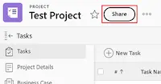

# Freigeben eines Projekts

<!-- Audited: 1/2024 -->

Ihr Adobe Workfront-Administrator kann Ihnen bei der Zuweisung Ihrer Zugriffsebene Zugriff zum Anzeigen oder Bearbeiten von Projekten gewähren. Weitere Informationen finden Sie unter [Zugriff auf Projekte ](../../administration-and-setup/add-users/configure-and-grant-access/grant-access-projects.md).

Neben der Zugriffsebene, die Benutzern gewährt wird, können Sie ihnen auch Berechtigungen zum Anzeigen, Mitwirken oder Verwalten bestimmter Projekte erteilen, auf die Sie Zugriff haben, um sie freizugeben.

Berechtigungen sind für ein Element in Workfront spezifisch und definieren, welche Aktionen man für dieses Element ausführen kann.

## Zugriffsanforderungen

+++ Erweitern, um die Zugriffsanforderungen für die in diesem Artikel beschriebene Funktionalität anzuzeigen. 

<table style="table-layout:auto"> 
 <col> 
 <col> 
 <tbody> 
  <tr> 
   <td role="rowheader">Adobe Workfront-Paket</td> 
   <td> 
Beliebig
 </td> 
  </tr> 
  <tr> 
   <td role="rowheader">Adobe Workfront-Lizenz</td> 
   <td> 
Standard
 
   
Work oder höher
 
   </td> 
  </tr> 
  <tr> 
   <td role="rowheader">Konfigurationen der Zugriffsebene</td> 
   <td> 
Ansichtszugriff oder höher auf die Objekte, die Sie freigeben möchten
 </td> 
  </tr> 
  <tr> 
   <td role="rowheader">Objektberechtigungen</td> 
   <td> 
Berechtigung zum Anzeigen oder höher für die Objekte, die Sie freigeben möchten
</td> 
  </tr> 
 </tbody> 
</table>

Weitere Informationen zu den Informationen in dieser Tabelle finden Sie unter [Zugriffsanforderungen in der Dokumentation zu Workfront](/help/quicksilver/administration-and-setup/add-users/access-levels-and-object-permissions/access-level-requirements-in-documentation.md).

+++

## Überlegungen zur Freigabe von Projekten

Zusätzlich zu den unten stehenden Überlegungen finden Sie weitere Informationen unter [Übersicht über Freigabeberechtigungen für Objekte](../../workfront-basics/grant-and-request-access-to-objects/sharing-permissions-on-objects-overview.md).

* Standardmäßig verfügt der Ersteller eines Projekts über Berechtigungen zum Verwalten des Projekts und wird auch als Projektbesitzer bezeichnet. Wenn das Projekt einem anderen Eigentümer zugewiesen ist, verfügt dieser Benutzer auch über Berechtigungen zum Verwalten des Projekts. Wenn der Projektersteller (oder -eigentümer) das Projekt für andere Benutzer freigibt, gewähren sie diesen Benutzern bestimmte Berechtigungen, um zu steuern, was sie bei der Arbeit am Projekt tun können.

  Wenn ein Projektinhaber jedoch nicht über eine Plan- oder Standardlizenz verfügt, hat er nicht den vollen Zugriff, um das Projekt zu verwalten. Nur Benutzer mit einer Plan- oder Standardlizenz können über Berechtigungen zum Verwalten eines Projekts verfügen. Weitere Informationen finden Sie unter [ der Zusammenarbeit von Zugriffsebenen und Berechtigungen](../../administration-and-setup/add-users/access-levels-and-object-permissions/how-access-levels-permissions-work-together.md).

* Sie können Projekte einzeln oder gemeinsam nutzen. Die Freigabe von Projekten ist mit der Freigabe anderer Objekte identisch. Weitere Informationen zum Freigeben von Elementen in Workfront finden Sie unter [Freigeben eines Objekts](../../workfront-basics/grant-and-request-access-to-objects/share-an-object.md).
* Sie können einem Projekt die folgenden Berechtigungen erteilen:

   * Ansicht
   * Verwalten
   * Mitwirken

* Wenn Sie ein Projekt freigeben, erben alle Aufgaben, Probleme und Dokumente dieselben Berechtigungen, sofern nicht anders angegeben.

  Informationen zur Verwaltung des Zugriffs auf Aufgaben und Probleme im Projekt auf der Grundlage der Berechtigungen eines Benutzers für das Projekt finden Sie im  Abschnitt im Artikel [Projekte bearbeiten](../../manage-work/projects/manage-projects/edit-projects.md).

  Der Workfront-Administrator kann angeben, ob Dokumente Berechtigungen von höheren Objekten auf der Zugriffsebene der Benutzenden erben sollen. Weitere Informationen zum Beschränken von geerbten Berechtigungen für Dokumente finden Sie unter [Erstellen oder Ändern benutzerdefinierter Zugriffsebenen](../../administration-and-setup/add-users/configure-and-grant-access/create-modify-access-levels.md).

* Sie können geerbte Berechtigungen aus einem Projekt entfernen, sodass die untergeordneten Objekte sie nicht erben. Weitere Informationen zum Entfernen geerbter Berechtigungen aus Objekten finden Sie unter [Entfernen von Berechtigungen aus Objekten](../../workfront-basics/grant-and-request-access-to-objects/remove-permissions-from-objects.md).

## Einschränkungen für verschiedene Lizenztypen

* Benutzer mit einer Worker-Lizenz sind nicht berechtigt, Projekte zu verwalten. Für Worker lautet die höchste Freigabeberechtigung Beitragen .
* Benutzer mit einer Anfragelizenz können Projektinformationen anzeigen, haben jedoch eingeschränkten Projektzugriff.
* Eine Ausnahme vom Ändern des Status eines Projekts tritt auf, wenn ein Benutzer mit der Berechtigung Anzeigen oder Beitragen auch in einen Genehmigungsprozess eingeschlossen wird. Sie können das Projekt genehmigen, was den Status des Projekts ändert, aber der Status ist der vordefinierte Status für die Genehmigung oder Ablehnung.
* Um ein Projekt kopieren zu können, muss ein Benutzer auch Zugriff zum Erstellen von Projekten auf seiner Zugriffsebene haben.

## Möglichkeiten zum Freigeben eines Projekts {#ways-to-share-a-project}

Sie können ein Projekt wie folgt freigeben:

* Führen Sie dazu manuell einen der folgenden Schritte aus:

   * Hinzufügen von Benutzern zum Projektteam. Wenn Sie Benutzer zum Projekt-Team hinzufügen, erhalten diese automatisch Ansichtsberechtigungen für das Projekt.\
     Weitere Informationen zum Hinzufügen von Benutzern zu einem Projektteam finden Sie im Abschnitt Hinzufügen von Benutzern zu einem Projektteam in [Übersicht über das Projektteam](../../manage-work/projects/planning-a-project/project-team-overview.md).
   * Einzeln oder für die Massenfreigabe der Projekte bei Verwendung der Option **Freigabe**.

* Automatisch durch eine der folgenden Aktionen:

   * Platzieren Sie ein Projekt in einem **Portfolio** oder **Program**, das bereits für andere freigegeben ist. Benutzer erhalten für das Projekt dieselben Berechtigungen wie für das Portfolio oder Programm.\
     Informationen zum Hinzufügen eines Projekts zu einer **Portfolio** finden Sie unter [Hinzufügen von Projekten zu einem Portfolio](../../manage-work/portfolios/create-and-manage-portfolios/add-projects-to-portfolios.md).\
     Informationen zum Hinzufügen eines Projekts zu einem **Programm** finden Sie unter [Hinzufügen eines Projekts zu einem Programm](../../manage-work/portfolios/create-and-manage-programs/add-project-to-program.md).
Weitere Informationen zum Anzeigen geerbter Berechtigungen für ein Objekt finden Sie unter [Anzeigen geerbter Berechtigungen für Objekte](../../workfront-basics/grant-and-request-access-to-objects/view-inherited-permissions-on-objects.md).

   * Entitäten zur Projektfreigabe einer Vorlage hinzufügen, mit der das Projekt erstellt wurde. Informationen zum Freigeben von Projekten aus Vorlagen finden Sie unter [Freigeben einer Vorlage](../../workfront-basics/grant-and-request-access-to-objects/share-a-template.md).
   * Definieren Sie die Projektzugriffsvorlage.

     >[!TIP]
     >
     >Beim Anhängen oder Speichern einer Vorlage können Sie die Regeln zur Projektfreigabe in der Vorlage löschen.

   * Bearbeiten Sie ein Projekt und definieren Sie die Einstellung **Wenn jemand Zugriff auf dieses Projekt erhält** .  Weitere Informationen finden Sie unter [Projekte bearbeiten](../../manage-work/projects/manage-projects/edit-projects.md).

<!--

(NOTE: drafted because I created new article and linked it above) 

To view what users have inherited the access on the project from a portfolio or a program, do the following:

<ol style="list-style-type: lower-alpha;">
<li value="1">Go to a project whose sharing permissions you want to view. </li>
<li value="2"> Click the <strong>More</strong> menu , then click <strong>Sharing</strong>. </li>
<li value="3"> 
Expand the <strong>Inherited Permissions</strong> list. 
 
This list displays the names of users that have access to either the portfolio or the program that the project belongs to and also have permissions to the project. 
  </li>
</ol>

-->

<!--
<ol data-mc-conditions="QuicksilverOrClassic.Draft mode">
<li value="1">Go to a project whose sharing permissions you want for all projects you create from scratch. (NOTE: drafted because linked above)  </li>
<li value="2"> Click the More menu, then click <strong>Sharing</strong>. </li>
<li value="3"> 
In the Project Access box that displays, near the upper-right corner, click the gear icon , then click <strong>Set as my project access template</strong>.
 
The entities that are granted permissions on the selected project have the same permissions for all the projects you create from scratch in the future.
 
 The project access template overrides the sharing defaults granted to you by the Workfront administrator in your Access Level. For more information about specifying sharing defaults for projects in the Access Level, see <a href="../../administration-and-setup/add-users/configure-and-grant-access/grant-access-projects.md" class="MCXref xref">Grant access to projects</a>.
 </li>
<li value="4">Click <strong>Save</strong>.</li>
</ol>
-->

## Freigeben eines Projekts

{{step1-to-projects}}

1. Wählen **auf der** „Projekte“ das Projekt aus, das Sie freigeben möchten. Die Projektseite wird geöffnet.

1. Klicken Sie rechts neben dem Projektnamen auf &quot;**&quot;**. Das **Freigeben [Projektname]** wird geöffnet.

   

1. Beginnen Sie im Feld **Projektzugriff erteilen auf** mit der Eingabe des Namens des Benutzers, Teams, der Rolle, der Gruppe oder des Unternehmens, für den bzw. die Sie das Projekt freigeben möchten, und klicken Sie dann auf den Namen, wenn er in der Dropdown-Liste angezeigt wird.

   >[!TIP]
   >
   >Sie können ein Projekt nur für aktive Benutzer, Teams, Rollen oder Unternehmen freigeben.

1. (Optional) Wählen Sie die **Wer hat Zugriff** aus und wählen Sie die Zugriffsebene des Projekts aus:

   * **Nur eingeladene Personen können darauf zugreifen:** Nur Benutzer, die zum Projekt eingeladen sind, können darauf zugreifen (Standard).
   * **Alle im System können anzeigen**: Alle Benutzer im System können das Projekt ohne Einladung anzeigen.

1. (Optional) Um die von Ihnen ausgewählten Projektzugriffseinstellungen automatisch auf alle neuen Projekte anzuwenden, klicken Sie auf das **Zahnradsymbol**  und aktivieren Sie dann das Kontrollkästchen inline mit **Als meine Projektzugriffsvorlage festlegen**.

   >[!NOTE]
   >
   >Die Projektzugriffsvorlage überschreibt die Freigabestandardwerte, die Ihnen vom Workfront-Administrator auf Ihrer Zugriffsebene gewährt wurden.\
   >Weitere Informationen zum Angeben von Freigabestandardwerten für Projekte in der Zugriffsebene finden Sie unter [Gewähren von Zugriff auf Projekte](../../administration-and-setup/add-users/configure-and-grant-access/grant-access-projects.md)

   <!--
   >this note also appears in Understanding Project Permissions-->

1. Klicken Sie auf das Dropdown-Menü rechts neben dem Namen des Benutzers und wählen Sie seine Berechtigungsstufe für dieses Projekt aus:

   * **Anzeigen**: Der Benutzer kann das Projekt überprüfen und freigeben.
   * **Beitragen**: Benutzende können Aktualisierungen vornehmen, Informationen protokollieren, kleinere Änderungen vornehmen und das Projekt freigeben (einschließlich aller Anzeigeberechtigungen).
   * **Verwalten**: Der Benutzer hat vollen Zugriff auf das Projekt ohne Administratorrechte, die auf Zugriffsebene gewährt werden (umfasst auch alle Anzeigen- und Beitragsberechtigungen).

1. (Optional) Klicken Sie auf das Symbol Erweiterte Optionen neben der Berechtigungsstufe, die Sie gewährt haben, um bestimmte Berechtigungen für das Projekt zu konfigurieren.

   

1. (Optional) Um das Projekt schnell über einen Link freizugeben, klicken Sie auf **Link kopieren** und leiten Sie es dann an den Empfänger weiter.

1. Klicken Sie auf **Speichern**.

## Massenfreigabe von Projekten

{{step1-to-projects}}

1. Aktivieren **auf** Seite „Projekte“ das Kästchen links neben jedem Projekt, das Sie freigeben möchten, und klicken Sie dann oben auf der Seite **Freigeben**-Symbol . Das Modal „Freigeben“ wird geöffnet.

   

1. Beginnen Sie im Feld **Projektzugriff erteilen an** mit der Eingabe des Namens des Benutzers, Teams, der Rolle, der Gruppe oder des Unternehmens, für den bzw. die Sie die Projekte freigeben möchten, und klicken Sie dann auf den Namen, wenn er in der Dropdown-Liste angezeigt wird.

   >[!TIP]
   >
   >Sie können Projekte nur für aktive Benutzer, Teams, Rollen oder Unternehmen freigeben.

1. (Optional) Wählen Sie die **Wer hat Zugriff** und wählen Sie die Zugriffsebene der Projekte:

   * **Nur eingeladene Personen können darauf zugreifen:** Nur Benutzer, die zu den Projekten eingeladen sind, können darauf zugreifen (Standard).
   * **Alle im System können anzeigen**: Alle Benutzer im System können die Projekte ohne Einladung anzeigen.

1. Klicken Sie auf das Dropdown-Menü rechts neben dem Namen des Benutzers und wählen Sie seine Berechtigungsstufe für die Projekte aus:

   * **Anzeigen**: Der Benutzer kann die Projekte überprüfen und freigeben.
   * **Beitragen**: Benutzende können Aktualisierungen vornehmen, Informationen protokollieren, kleinere Änderungen vornehmen und die Projekte freigeben (einschließlich aller Anzeigeberechtigungen).
   * **Verwalten**: Der Benutzer hat vollen Zugriff auf die Projekte ohne Administratorrechte, die auf Zugriffsebene gewährt werden (umfasst auch alle Anzeigen- und Beitragsberechtigungen).

1. (Optional) Klicken Sie auf das Symbol Erweiterte Optionen neben der Berechtigungsstufe, die Sie gewährt haben, um bestimmte Berechtigungen für die Projekte zu konfigurieren.

   

1. Klicken Sie auf **Speichern**.

<!--

<h2>Configure default permissions for a project</h2>

(NOTE: drafted because I added one more way to automatically share the project above in the bullet list and linked it to Edit Projects) 

As a project owner, you can configure the default permissions for View, Manage, and Contribute access that are used when sharing  the project with others. When users share a project, the default permissions are used. Users can then adjust the default permissions when sharing the project, as described in <a title="Project Permissions" href="#ways-to-share-a-project" class="MCXref xref">Ways to share a project</a>. 

To configure the default permissions that are included with each access level:

<ol>
<li value="1">Go to the project where you want to set the default permissions.</li>
<li value="2"> 
Click the More menu , then click <strong>Edit</strong>. 
 
 
 </li>
<li value="3">Click <strong>Access</strong> in the list on the left.</li>
<li value="4"> 
In the <strong>When someone is given access to this PROJECT</strong> section, select permissions that you want to be available when users are given access to the project via sharing.
 
Ensure that any permissions that you want to include in the selected access level are selected and deselect any permissions that you do not want to include in the selected permissions level.
 
To view which permissions are available for each level, see  <a title="Project Permissions" href="#Understanding_Project_Permissions" class="MCXref xref">Share a project in Adobe Workfront</a>.
 <note type="note">
The
<strong>Delete</strong> access in the
<strong>Manage</strong> permission level determines whether users can  delete the project itself. Users with
<strong>Manage</strong> access to the project can delete tasks and issues within the project regardless of whether this option is selected, if they have
<strong>Manage</strong> permissions to the tasks and issues.  
</note> </li>
<li value="5">Click <strong>Save Changes</strong>.</li>
</ol>

-->

## Optionen für Projektberechtigungen

In der folgenden Tabelle sind die Berechtigungen aufgeführt, die Benutzer bei der Freigabe eines Projekts erteilen können. Weitere Informationen dazu, welchen Zugriff Benutzer auf ihrer Lizenz erhalten, finden Sie unter [Zugriff auf Projekte gewähren](../../administration-and-setup/add-users/configure-and-grant-access/grant-access-projects.md).

<table border="1" cellspacing="15" cellpadding="1"> 
 <col> 
 <col> 
 <col> 
 <col> 
 <thead> 
  <tr> 
   <th> 
<strong>Aktionen</strong> 
 </th> 
   <th> 
<strong>Verwalten</strong> 
 </th> 
   <th> 
<strong>Beitragen</strong> 
 </th> 
   <th> 
<strong>Anzeigen</strong> 
 </th> 
  </tr> 
 </thead> 
 <tbody> 
  <tr> 
   <td> 
Benutzerdefiniertes Formular hinzufügen
 </td> 
   <td> 
✓
 </td> 
   <td> 
  
 </td> 
   <td> 
  
 </td> 
  </tr> 
  <tr> 
   <td> 
Benutzerdefinierte Felder aktualisieren
 </td> 
   <td> 
✓
 </td> 
   <td> 
✓
 </td> 
   <td> 
  
 </td> 
  </tr> 
  <tr> 
   <td> 
Genehmigungsprozess hinzufügen
 </td> 
   <td> 
✓
 </td> 
   <td> 
  
 </td> 
   <td> 
  
 </td> 
  </tr> 
  <tr> 
   <td> 
Genehmigen eines Projekts
 </td> 
   <td> 
✓
 </td> 
   <td> 
✓
 </td> 
   <td> 
✓
 </td> 
  </tr> 
  <tr> 
   <td> 
Stunden genehmigen
 </td> 
   <td> 
✓
 </td> 
   <td> 
✓  
 </td> 
   <td> 
  
 </td> 
  </tr> 
  <tr> 
   <td> 
Erstellen eines Projekts
 </td> 
   <td> 
✓
 </td> 
   <td> 
  
 </td> 
   <td> 
  
 </td> 
  </tr> 
  <tr> 
   <td> 
Dokument(e) hinzufügen
 </td> 
   <td> 
✓
 </td> 
   <td> 
✓
 </td> 
   <td> 
✓
 </td> 
  </tr> 
  <tr> 
   <td> 
Anfrage(n) hinzufügen
 </td> 
   <td> 
✓
 </td> 
   <td> 
✓
 </td> 
   <td> 
✓
 </td> 
  </tr> 
  <tr> 
   <td> 
Aufgabe(n) hinzufügen
 </td> 
   <td> 
✓
 </td> 
   <td> 
✓
 </td> 
   <td> 
  
 </td> 
  </tr> 
  <tr> 
   <td> 
Projekt kopieren
 </td> 
   <td> 
  
 </td> 
   <td> 
✓
 </td> 
   <td> 
  
 </td> 
  </tr> 
  <tr> 
   <td> 
Projekt löschen
 </td> 
   <td> 
✓
 </td> 
   <td> 
  
 </td> 
   <td> 
  
 </td> 
  </tr> 
  <tr> 
   <td> 
Geplante Daten ändern
 </td> 
   <td> 
✓
 </td> 
   <td> 
  
 </td> 
   <td> 
  
 </td> 
  </tr> 
  <tr> 
   <td> 
Projekt freigeben
 </td> 
   <td> 
✓
 </td> 
   <td> 
✓
 </td> 
   <td> 
✓
 </td> 
  </tr> 
  <tr> 
   <td> 
Systemweit teilen
 </td> 
   <td> 
  
 </td> 
   <td> 
  
 </td> 
   <td> 
✓
 </td> 
  </tr> 
  <tr> 
   <td> 
Projekt anzeigen
 </td> 
   <td> 
✓
 </td> 
   <td> 
✓
 </td> 
   <td> 
✓
 </td> 
  </tr> 
  <tr> 
   <td> 
Aktualisierungen/Kommentare
 </td> 
   <td> 
✓
 </td> 
   <td> 
✓
 </td> 
   <td> 
✓
 </td> 
  </tr> 
  <tr> 
   <td> 
Status ändern
 </td> 
   <td> 
✓
 </td> 
   <td> 
  
 </td> 
   <td> 
  
 </td> 
  </tr> 
  <tr> 
   <td> 
Stunden protokollieren
 </td> 
   <td> 
✓
 </td> 
   <td> 
✓
 </td> 
   <td> 
  
 </td> 
  </tr> 
  <tr> 
   <td> 
Zuweisungen bearbeiten
 </td> 
   <td> 
✓
 </td> 
   <td> 
✓
 </td> 
   <td> 
  
 </td> 
  </tr> 
  <tr> 
   <td> 
Baseline verwalten
 </td> 
   <td> 
✓
 </td> 
   <td> 
  
 </td> 
   <td> 
  
 </td> 
  </tr> 
  <tr> 
   <td> 
Risiken verwalten*
 </td> 
   <td> 
✓
 </td> 
   <td> 
  
 </td> 
   <td> 
  
 </td> 
  </tr> 
  <tr> 
   <td> 
Finanzen verwalten*
 </td> 
   <td> 
✓
 </td> 
   <td> 
  
 </td> 
   <td> 
  
 </td> 
  </tr> 
  <tr> 
   <td> 
Kosten hinzufügen/bearbeiten*
 </td> 
   <td> 
✓
 </td> 
   <td> 
✓
 </td> 
   <td> 
  
 </td> 
  </tr> 
  <tr> 
   <td> 
Finanzen anzeigen*
 </td> 
   <td> 
✓
 </td> 
   <td> 
✓
 </td> 
   <td> 
✓
 </td> 
  </tr> 
  <tr> 
   <td> 
Vorlage anfügen
 </td> 
   <td> 
✓
 </td> 
   <td> 
  
 </td> 
   <td> 
  
 </td> 
  </tr> 
  <tr> 
   <td> 
Als Vorlage speichern
 </td> 
   <td> 
✓
 </td> 
   <td> 
✓
 </td> 
   <td> 
✓
 </td> 
  </tr> 
  <tr> 
   <td> 
Business Case hinzufügen/bearbeiten
 </td> 
   <td> 
✓
 </td> 
   <td> 
  
 </td> 
   <td> 
  
 </td> 
  </tr> 
  <tr> 
   <td> 
Projektdetails bearbeiten
 </td> 
   <td> 
✓
 </td> 
   <td> 
  
 </td> 
   <td> 
  
 </td> 
  </tr> 
  <tr> 
   <td> 
Personal bearbeiten
 </td> 
   <td> 
✓
 </td> 
   <td> 
  
 </td> 
   <td> 
  
 </td> 
  </tr> 
  <tr> 
   <td> 
In MS Project exportieren
 </td> 
   <td> 
✓
 </td> 
   <td> 
✓
 </td> 
   <td> 
✓
 </td> 
  </tr> 
  <tr> 
   <td> 
Neuberechnen der Finanzen/des Zeitplans*
 </td> 
   <td> 
✓
 </td> 
   <td> 
  
 </td> 
   <td> 
  
 </td> 
  </tr> 
  <tr> 
   <td> 
Festlegen von Warteschlangeneigenschaften
 </td> 
   <td> 
✓
 </td> 
   <td> 
  
 </td> 
   <td> 
    
 </td> 
  </tr> 
  <tr> 
   <td> 
Projekt stapelweise in einer Liste bearbeiten
 </td> 
   <td> 
✓
 </td> 
   <td>  </td> 
   <td>  </td> 
  </tr> 
 </tbody> 
</table>

&#42;Benutzende ohne Zugriff auf Finanzdaten können Risiken und Finanzen für Projekte nicht verwalten, auch wenn sie Bearbeitungszugriff auf Projekte haben. Informationen zum Zugriff auf Finanzdaten finden Sie unter [Zugriff auf Finanzdaten gewähren](../../administration-and-setup/add-users/configure-and-grant-access/grant-access-financial.md).
