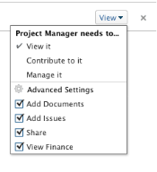

# Freigeben einer Aufgabe

Ihr Adobe Workfront-Administrator kann Ihnen Zugriff zum Anzeigen oder Bearbeiten von Aufgaben gewähren, wenn er Zugriffsebenen zuweist. Weitere Informationen zum Gewähren des Zugriffs auf Aufgaben finden Sie unter [Zugriff auf Aufgaben gewähren](../../administration-and-setup/add-users/configure-and-grant-access/grant-access-tasks.md).

Neben der Zugriffsebene, die Benutzern gewährt wird, können Sie ihnen auch Berechtigungen zum Anzeigen, Contribute oder Verwalten bestimmter Aufgaben erteilen, auf die Sie Zugriff haben.

Berechtigungen sind für ein Element in Workfront spezifisch und definieren, welche Aktionen man für dieses Element ausführen kann.

## Überlegungen zur Freigabe einer Aufgabe

Zusätzlich zu den unten stehenden Überlegungen finden Sie weitere Informationen unter [Übersicht über Freigabeberechtigungen für Objekte](../../workfront-basics/grant-and-request-access-to-objects/sharing-permissions-on-objects-overview.md).

* Der Ersteller einer Aufgabe hat standardmäßig Verwaltungsberechtigungen dafür.
* Sie können Aufgaben einzeln oder gemeinsam mit mehreren gleichzeitig ausführen.\
  Die Freigabe von Aufgaben ist mit der Freigabe anderer Objekte identisch. Weitere Informationen zum Freigeben von Elementen in Workfront finden Sie unter [Freigeben eines Objekts](../../workfront-basics/grant-and-request-access-to-objects/share-an-object.md).

* Sie können einer Aufgabe die folgenden Berechtigungen erteilen: 

   * Anzeigen
   * Verwalten
   * Mitwirken\
       

* Wenn Sie eine Aufgabe freigeben, erben Benutzerinnen und Benutzer standardmäßig dieselben Berechtigungen für alle untergeordneten Objekte, die mit der Aufgabe verknüpft sind. Beispielsweise erben sie dieselben Berechtigungen für die untergeordneten Aufgaben, Probleme und Dokumente, die an die Aufgabe angehängt sind.\
  Weitere Informationen zur Hierarchie von Objekten in Workfront finden Sie unter  [Verstehen von Objekten in Adobe Workfront](../../workfront-basics/navigate-workfront/workfront-navigation/understand-objects.md).

  Der Workfront-Administrator kann angeben, ob Dokumente Berechtigungen von höheren Objekten auf der Zugriffsebene der Benutzenden erben sollen. Weitere Informationen zum Beschränken von geerbten Berechtigungen für Dokumente finden Sie unter [Erstellen oder Ändern benutzerdefinierter Zugriffsebenen](../../administration-and-setup/add-users/configure-and-grant-access/create-modify-access-levels.md).

* Sie können geerbte Berechtigungen aus einer Aufgabe entfernen.\
  Weitere Informationen zum Entfernen geerbter Berechtigungen von Objekten finden Sie unter  [Entfernen von Berechtigungen aus Objekten](../../workfront-basics/grant-and-request-access-to-objects/remove-permissions-from-objects.md).

## Möglichkeiten zum Freigeben einer Aufgabe

Sie können eine Aufgabe wie folgt freigeben:

* Manuell, entweder einzeln oder stapelweise. Die manuelle Freigabe von Aufgaben ähnelt der Freigabe jedes anderen Objekts in Workfront.

  Weitere Informationen zum Freigeben von Objekten in Workfront finden Sie unter  [Objekt freigeben](../../workfront-basics/grant-and-request-access-to-objects/share-an-object.md).

* Gehen Sie wie folgt automatisch vor:

   * Geben Sie die Berechtigungen für eines der übergeordneten Objekte der Aufgabe an: Projekt, Programm oder Portfolio. Aufgaben erben die Berechtigungen von ihren übergeordneten Objekten. Weitere Informationen zum Anzeigen geerbter Berechtigungen für Objekte finden Sie unter [Anzeigen geerbter Berechtigungen für Objekte](../../workfront-basics/grant-and-request-access-to-objects/view-inherited-permissions-on-objects.md).
   * Entitäten zur Projektfreigabe hinzufügen, die auf einer Vorlage basieren, mit der das Projekt erstellt wurde, für das die Aufgabe ausgeführt wird. Informationen zum Freigeben von Projekten aus Vorlagen finden Sie unter [Freigeben einer Vorlage](../../workfront-basics/grant-and-request-access-to-objects/share-a-template.md).

   * Geben Sie die Berechtigungen für alle Aufgaben in einem Projekt an, wenn Sie das Projekt bearbeiten. Informationen zur Verwaltung des Zugriffs auf Aufgaben im Projekt auf der Grundlage der Berechtigungen, die ein Benutzer für das Projekt erhält, finden Sie im  Abschnitt im Artikel [Projekte bearbeiten](../../manage-work/projects/manage-projects/edit-projects.md).

  >[!TIP]
  >
  >Wenn Sie nicht angeben, welche Aufgabenberechtigungen Benutzerinnen und Benutzer haben sollen, wenn sie den Aufgaben im Projekt zugewiesen werden, erhalten sie standardmäßig dieselben Berechtigungen wie für das Projekt.

## Aufgabenberechtigungen

Die folgende Tabelle zeigt, welche Berechtigungen Sie Benutzern erteilen können, wenn Sie ihnen das Anzeigen, Contribute oder Verwalten einer Aufgabe erlauben:

<table border="2" cellspacing="15" cellpadding="1"> 
 <col> 
 <col> 
 <col> 
 <col> 
 <thead> 
  <tr> 
   <th><strong>Aktion</strong> </th> 
   <th><strong>Verwalten</strong> </th> 
   <th><strong>Contribute</strong> </th> 
   <th><strong>Anzeigen</strong> </th> 
  </tr> 
 </thead> 
 <tbody> 
  <tr> 
   <td scope="row">Aufgabe(n) hinzufügen</td> 
   <td>✓</td> 
   <td>✓</td> 
   <td> </td> 
  </tr> 
  <tr> 
   <td scope="row">Vorgänger hinzufügen</td> 
   <td>✓</td> 
   <td> </td> 
   <td> </td> 
  </tr> 
  <tr> 
   <td scope="row">Anfrage(n) hinzufügen</td> 
   <td>✓</td> 
   <td>✓</td> 
   <td>✓</td> 
  </tr> 
  <tr> 
   <td scope="row">Aufgabe löschen</td> 
   <td>✓</td> 
   <td> </td> 
   <td> </td> 
  </tr> 
  <tr> 
   <td scope="row"> 
Allgemeine Aufgabenbearbeitung 
 </td> 
   <td>✓</td> 
   <td>✓</td> 
   <td> </td> 
  </tr> 
  <tr> 
   <td scope="row">Aufgabenstatus ändern</td> 
   <td>✓</td> 
   <td>✓</td> 
   <td> </td> 
  </tr> 
  <tr> 
   <td scope="row">Aufgabenbeschränkung bearbeiten</td> 
   <td>✓</td> 
   <td> </td> 
   <td> </td> 
  </tr> 
  <tr> 
   <td scope="row">Aufgabe anzeigen</td> 
   <td>✓</td> 
   <td>✓</td> 
   <td>✓</td> 
  </tr> 
  <tr> 
   <td scope="row">Dokument(e) hinzufügen</td> 
   <td>✓</td> 
   <td>✓</td> 
   <td>✓</td> 
  </tr> 
  <tr> 
   <td scope="row">Aufgabe kopieren*</td> 
   <td>✓</td> 
   <td>✓</td> 
   <td>✓</td> 
  </tr> 
  <tr> 
   <td scope="row">Aufgabe verschieben*</td> 
   <td>✓</td> 
   <td> </td> 
   <td> </td> 
  </tr> 
  <tr> 
   <td scope="row">Stunden protokollieren</td> 
   <td>✓</td> 
   <td>✓</td> 
   <td> </td> 
  </tr> 
  <tr> 
   <td scope="row">Geplante Daten ändern</td> 
   <td>✓</td> 
   <td> </td> 
   <td> </td> 
  </tr> 
  <tr> 
   <td scope="row">Zuweisung akzeptieren</td> 
   <td>✓</td> 
   <td>✓</td> 
   <td> </td> 
  </tr> 
  <tr> 
   <td scope="row">Zuweisung vornehmen</td> 
   <td>✓</td> 
   <td>✓</td> 
   <td> </td> 
  </tr> 
  <tr> 
   <td scope="row">Benutzerdefiniertes Formular anfügen</td> 
   <td>✓</td> 
   <td> </td> 
   <td> </td> 
  </tr> 
  <tr> 
   <td scope="row">Benutzerdefinierte Felder bearbeiten</td> 
   <td>✓</td> 
   <td>✓</td> 
   <td> </td> 
  </tr> 
  <tr> 
   <td scope="row">Erstellen eines Genehmigungsprozesses</td> 
   <td>✓</td> 
   <td> </td> 
   <td> </td> 
  </tr> 
  <tr> 
   <td scope="row">Aufgabe genehmigen</td> 
   <td>✓</td> 
   <td>✓</td> 
   <td>✓</td> 
  </tr> 
  <tr> 
   <td scope="row">Finanzen bearbeiten*</td> 
   <td>✓</td> 
   <td> </td> 
   <td> </td> 
  </tr> 
  <tr> 
   <td scope="row">Kosten hinzufügen/bearbeiten</td> 
   <td>✓</td> 
   <td>✓</td> 
   <td> </td> 
  </tr> 
  <tr> 
   <td scope="row">Finanzen anzeigen</td> 
   <td>✓</td> 
   <td>✓</td> 
   <td>✓</td> 
  </tr> 
  <tr> 
   <td scope="row">Aktualisierungen/Kommentare</td> 
   <td>✓</td> 
   <td>✓</td> 
   <td>✓</td> 
  </tr> 
  <tr> 
   <td scope="row">Freigeben</td> 
   <td>✓</td> 
   <td>✓</td> 
   <td>✓</td> 
  </tr> 
  <tr> 
   <td scope="row">Systemweit teilen</td> 
   <td> </td> 
   <td> </td> 
   <td>✓</td> 
  </tr> 
 </tbody> 
</table>

&#42;Wird von der Zugriffsebene und den Berechtigungen für das Projekt gesteuert.
