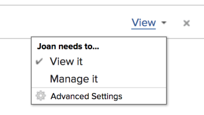

# Freigeben einer Vorlage

Als Adobe Workfront-Admin können Sie Benutzenden Zugriff gewähren, um Vorlagen anzuzeigen oder zu bearbeiten, wenn Sie ihre Zugriffsebene zuweisen. Ein Benutzer muss über eine Plan-Lizenz verfügen, um Zugriff auf die Bearbeitung von Vorlagen zu erhalten.

Weitere Informationen zum Gewähren des Zugriffs auf Vorlagen finden Sie unter [Zugriff auf Vorlagen gewähren](../../administration-and-setup/add-users/configure-and-grant-access/grant-access-templates.md).

Neben der von Ihnen gewährten Zugriffsebene kann ein Benutzer auch Berechtigungen zum Anzeigen oder Verwalten bestimmter Vorlagen von anderen Benutzern erhalten, die diese freigeben .

>[!NOTE]
>
>Berechtigungsebenen funktionieren innerhalb von Zugriffsebenen. Beispielsweise kann ein Benutzer keine Berechtigungen zum Verwalten einer Vorlage erhalten, wenn seine Zugriffsebene ihm nur das Anzeigen von Vorlagen erlaubt.

Berechtigungen sind für ein Element in Workfront spezifisch und definieren, welche Aktionen man für dieses Element ausführen kann.

## Überlegungen zur Freigabe einer Vorlage

* Zusätzlich zu den unten stehenden Überlegungen finden Sie weitere Informationen unter [Übersicht über Freigabeberechtigungen für Objekte](../../workfront-basics/grant-and-request-access-to-objects/sharing-permissions-on-objects-overview.md).
* Der Ersteller einer Vorlage sowie der Vorlagenbesitzer haben standardmäßig Verwaltungsberechtigungen für die Vorlage. Informationen zum Bestimmen eines Benutzers als Inhaber der Vorlage finden Sie unter [Projektvorlagen bearbeiten](../../manage-work/projects/create-and-manage-templates/edit-templates.md).
* Sie können bei der Freigabe einer Vorlage Folgendes freigeben:

   * Die Vorlage

     Weitere Informationen zum Freigeben einer Vorlage finden Sie unter [Freigeben von ](../../manage-work/projects/create-and-manage-templates/share-project-template.md)).

     Sie können einer Vorlage die folgenden Berechtigungen erteilen:

      * Anzeigen

        

      * Verwalten

        

   * Die zukünftigen Projekte, die mithilfe der Vorlage erstellt werden. Für Projekte, die aus einer Vorlage erstellt werden, können Sie dieselbe Berechtigungsstufe gewähren wie für ein einzelnes Projekt. 

     Informationen zum Freigeben eines Projekts über eine Vorlage auf Vorlagenebene finden Sie unter [Freigeben von Projektvorlagen](../../manage-work/projects/create-and-manage-templates/share-project-template.md).

* Wenn Sie eine Vorlage oder ein Projekt freigeben, die bzw. das über die Vorlage erstellt wird, erben Benutzerinnen und Benutzer standardmäßig dieselben Berechtigungen für alle untergeordneten Objekte, die mit der Vorlage oder dem Projekt verknüpft sind.

  Weitere Informationen zur Hierarchie von Objekten in Workfront finden Sie unter  [Verstehen von Objekten in Adobe Workfront](../../workfront-basics/navigate-workfront/workfront-navigation/understand-objects.md).

* Wenn Sie eine Vorlage freigeben, erben alle Vorlagenaufgaben und Dokumente sowie die Probleme im zukünftigen Projekt, das aus der Vorlage erstellt wurde, dieselben Berechtigungen, sofern nicht anders angegeben.

  Informationen zur Verwaltung des Zugriffs auf Vorlagenaufgaben und zu Problemen mit dem Projekt auf der Grundlage der Projektberechtigungen finden Sie im Abschnitt [Zugriff](../../manage-work/projects/create-and-manage-templates/edit-templates.md#access) im Artikel [Bearbeiten von Projektvorlagen](../../manage-work/projects/create-and-manage-templates/edit-templates.md).

* Der Workfront-Administrator kann angeben, ob Dokumente Berechtigungen von höheren Objekten auf der Zugriffsebene der Benutzenden erben sollen. Weitere Informationen zum Beschränken von geerbten Berechtigungen für Dokumente finden Sie unter [Erstellen oder Ändern benutzerdefinierter Zugriffsebenen](../../administration-and-setup/add-users/configure-and-grant-access/create-modify-access-levels.md).

* Vorlagenaufgaben können nicht einzeln freigegeben werden. Bei der Freigabe einer Vorlage werden auch die Vorlagenaufgaben freigegeben. Beim Freigeben des Projekts über die Vorlage werden auch die zukünftigen Projektaufgaben freigegeben.

<!--

<h2>Share a template</h2>

(NOTE: drafted because this is also linked above: Share project templates >> which is an article in the Manage Work section>> Templates)&nbsp;

<ol>
<li value="1"> 
Go to the template you want to share with other entities, click <strong>Template Actions</strong>, then <strong>Template Sharing</strong>. Or
 
Navigate to a list of templates, and select multiple templates from the list, then click <strong>Share Template</strong>.
 <note type="note">
If you select multiple templates, you cannot view who already has permissions to the individual templates.
</note> </li>
<li value="2"> 
Start typing the name of a user, group, team, job role, or company that you want to share the template with in the <strong>Give template access to</strong> or <strong>Edit template access for</strong> fields.
 
Select them when they appear in the list.
 <note type="tip">
You can share an object only with active users, teams,
roles, or companies.
</note> </li>
<li value="3">From the drop-down menu, select which level of permissions you want to grant: 
<ul>
<li>
<strong>View it</strong>: Users with these permissions are able to view the template and create a project using it, or attach it to an existing project.

</li>
<li><strong>Manage it</strong>: Users with these permissions are able to edit or delete the template.</li>
</ul></li>
<li value="4">(Optional) Click <strong>Advanced Settings</strong> to fine-tune your settings for each level of permissions.</li>
<li value="5">Click <strong>Save</strong>.</li>
</ol>
<h2>Share a project at the template level</h2>

You can share the future projects that are created using a template with users at the template level.

<ol>
<li value="1"> 
Go to the template whose future projects you want to share with other entities, click <strong>Template Actions</strong>, then <strong>Project Sharing</strong>.
 
Or
 
Navigate to a list of templates, and select multiple templates from the list, then click <strong>Share Project</strong>.
 <note type="note">
If you select multiple templates, you cannot view who already has project permissions to the individual templates.
</note> </li>
<li value="2"> 
Start typing and then select the name of a user, group, team, job role, or company with whom you want to share future projects created from the template in the <strong>Give project access to</strong> or <strong>Edit template access for</strong> fields.
 <note type="tip">
You can share an object only with active users, teams,
roles, or companies.
</note> </li>
<li value="3">From the drop-down menu, select which level of permissions you want to grant. Select from the following: 
<ul>
<li><strong>No access</strong>: You can specify which users will not have any access to the template. This option is available only when bulk sharing projects from templates.&nbsp;</li>
<li><strong>View</strong>: Users with these permissions can view projects created from the template.</li>
<li><strong>Contribute</strong>: Users with these permissions can contribute to projects created from the template&nbsp;</li>
<li><strong>Manage</strong>: Users with these permissions can manage or delete projects created from this template. </li>
</ul></li>
<li value="4">(Optional) Click <strong>Advanced Settings</strong> to fine-tune your settings for each level of permissions. </li>
<li value="5">Click <strong>Save</strong>.</li>
</ol>

-->

## Erweiterte Einstellungen für die Vorlagenfreigabe

Die folgende Tabelle zeigt, welche Berechtigungen Sie Benutzern erteilen können, wenn sie eine Vorlage anzeigen oder verwalten möchten. Anweisungen zum Freigeben einer Vorlage finden Sie im Abschnitt [Freigeben einer Vorlage](../../manage-work/projects/create-and-manage-templates/share-project-template.md#share) im Artikel [Freigeben von Projektvorlagen](../../manage-work/projects/create-and-manage-templates/share-project-template.md).

<table style="table-layout:auto"> 
 <col> 
 <col> 
 <col> 
 <thead> 
  <tr> 
   <th>Aktionen</th> 
   <th>Verwalten</th> 
   <th>Anzeigen</th> 
  </tr> 
 </thead> 
 <tbody> 
  <tr> 
   <td>Kopieren</td> 
   <td>✓</td> 
   <td> </td> 
  </tr> 
  <tr> 
   <td>Löschen</td> 
   <td>✓</td> 
   <td> </td> 
  </tr> 
  <tr> 
   <td>Vorlagendetails bearbeiten</td> 
   <td>✓</td> 
   <td> </td> 
  </tr> 
  <tr> 
   <td>Vorlage anzeigen</td> 
   <td>✓</td> 
   <td>✓</td> 
  </tr> 
  <tr> 
   <td>Freigeben</td> 
   <td>✓</td> 
   <td>✓</td> 
  </tr> 
  <tr> 
   <td>Systemweit teilen</td> 
   <td> </td> 
   <td>✓</td> 
  </tr> 
  <tr data-mc-conditions=""> 
   <td> 
Dokumente hinzufügen
 
Tipp: Manchmal fügen Personen Dokumente zu einer Projektvorlage hinzu, weil sie glauben, dass sie diese zu einem Projekt hinzufügen. Sie können dies für Ihre Empfänger verhindern, indem Sie diese Einstellung deaktivieren.
 </td> 
   <td> </td> 
   <td>✓</td> 
  </tr> 
 </tbody> 
</table>

Informationen zu den Berechtigungen, die Sie Benutzern für Projekte gewähren, die aus einer Vorlage erstellt wurden, finden Sie unter [Freigeben eines Projekts in Adobe Workfront](../../workfront-basics/grant-and-request-access-to-objects/share-a-project.md).
