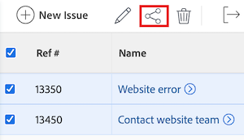

# Problem freigeben

Ihr Adobe Workfront-Administrator gewährt Benutzern Zugriff zum Anzeigen oder Bearbeiten von Problemen, wenn sie Zugriffsebenen zuweisen. Weitere Informationen zum Gewähren des Zugriffs auf Anfragen finden Sie unter [Zugriff auf Anfragen gewähren](../../administration-and-setup/add-users/configure-and-grant-access/grant-access-issues.md).

Neben der Zugriffsebene, die Benutzern gewährt wird, können Sie ihnen auch Berechtigungen zum Anzeigen, Mitwirken oder Verwalten bestimmter Probleme erteilen, für die Sie Zugriff haben. Weitere Informationen zu Zugriffsebenen und Berechtigungen finden Sie unter [Funktionsweise von Zugriffsebenen und Berechtigungen](../../administration-and-setup/add-users/access-levels-and-object-permissions/how-access-levels-permissions-work-together.md).

Berechtigungen sind für ein Element in Workfront spezifisch und definieren, welche Aktionen man für dieses Element ausführen kann.

## Zugriffsanforderungen

+++ Erweitern Sie , um die Zugriffsanforderungen für die -Funktion in diesem Artikel anzuzeigen. 

<table style="table-layout:auto"> 
 <col> 
 <col> 
 <tbody> 
  <tr> 
   <td role="rowheader">Adobe Workfront-Paket</td> 
   <td> 
Beliebig
 </td> 
  </tr> 
  <tr> 
   <td role="rowheader">Adobe Workfront-Lizenz</td> 
   <td> 
Standard
 
   
Arbeit oder höher
 
   </td> 
  </tr> 
  <tr> 
   <td role="rowheader">Konfigurationen der Zugriffsebene</td> 
   <td> 
Ansichtszugriff oder höher auf die Objekte, die Sie freigeben möchten
 </td> 
  </tr> 
  <tr> 
   <td role="rowheader">Objektberechtigungen</td> 
   <td> 
Berechtigung zum Anzeigen oder höher für die Objekte, die Sie freigeben möchten
</td> 
  </tr> 
 </tbody> 
</table>

Weitere Informationen zu den Informationen in dieser Tabelle finden Sie unter [Zugriffsanforderungen in der Dokumentation zu Workfront](/help/quicksilver/administration-and-setup/add-users/access-levels-and-object-permissions/access-level-requirements-in-documentation.md).

+++

## Überlegungen zur Problemfreigabe

Zusätzlich zu den unten stehenden Überlegungen finden Sie weitere Informationen unter [Übersicht über Freigabeberechtigungen für Objekte](../../workfront-basics/grant-and-request-access-to-objects/sharing-permissions-on-objects-overview.md).

>[!NOTE]
>
>Ein Workfront-Administrator kann für alle Benutzenden Berechtigungen zu Elementen im System hinzufügen oder entfernen, ohne Besitzer dieser Elemente zu sein.

* Der Ersteller eines Problems verfügt standardmäßig über Verwaltungsberechtigungen dafür.
* Sie können Probleme einzeln oder in mehreren gemeinsam nutzen. Die Freigabe von Problemen ist mit der Freigabe anderer Elemente in Workfront identisch. Weitere Informationen zum Freigeben von Elementen in Workfront finden Sie unter [Freigeben eines Objekts](../../workfront-basics/grant-and-request-access-to-objects/share-an-object.md).
* Sie können die folgenden Berechtigungen für ein Problem gewähren: 

   * Ansicht
   * Mitwirken
   * Verwalten

* Wenn Sie ein Problem freigeben, erben alle an das Problem angehängten Dokumente dieselben Berechtigungen.

  Der Workfront-Administrator kann angeben, ob Dokumente Berechtigungen von höheren Objekten auf der Zugriffsebene der Benutzenden erben sollen. Weitere Informationen zum Beschränken von geerbten Berechtigungen für Dokumente finden Sie unter [Erstellen oder Ändern benutzerdefinierter Zugriffsebenen](../../administration-and-setup/add-users/configure-and-grant-access/create-modify-access-levels.md).

* Sie können geerbte Berechtigungen aus einem Problem entfernen. Weitere Informationen finden Sie unter [Entfernen von Berechtigungen aus Objekten](../../workfront-basics/grant-and-request-access-to-objects/remove-permissions-from-objects.md).

## Möglichkeiten zum Freigeben eines Problems

* Manuell, was der Freigabe jedes anderen Objekts in Workfront ähnelt.
* Führen Sie automatisch einen der folgenden Schritte aus:

   * Geben Sie die Berechtigungen für eines der übergeordneten Objekte des Problems an: Projekt, Programm oder Portfolio. Probleme erben die Berechtigungen von den übergeordneten Objekten. Weitere Informationen zum Anzeigen geerbter Berechtigungen für Objekte finden Sie unter [Anzeigen geerbter Berechtigungen für Objekte](../../workfront-basics/grant-and-request-access-to-objects/view-inherited-permissions-on-objects.md).
   * Entitäten zur Projektfreigabe hinzufügen, die auf einer Vorlage basieren, mit der das Projekt erstellt wurde, an dem das Problem auftritt. Informationen zum Freigeben von Projekten aus Vorlagen finden Sie unter [Freigeben einer Vorlage](../../workfront-basics/grant-and-request-access-to-objects/share-a-template.md).

   * Geben Sie die Berechtigungen für alle Probleme in einem Projekt an, wenn Sie das Projekt bearbeiten. Informationen zur Verwaltung des Zugriffs auf Probleme oder Anfragen im Projekt basierend auf den Berechtigungen eines Benutzers für das Projekt finden Sie im [&#128279;](../../manage-work/projects/manage-projects/edit-projects.md#access) Abschnitt im Artikel [Projekte bearbeiten](../../manage-work/projects/manage-projects/edit-projects.md).

     >[!TIP]
     >
     >Wenn Sie nicht angeben, welche Problemberechtigungen Benutzerinnen und Benutzer haben sollen, wenn sie den Problemen im Projekt zugewiesen werden, erhalten sie standardmäßig dieselben Berechtigungen wie für das Projekt.

   * Geben Sie die Berechtigungen an, die Benutzer bei Problemen erhalten, die sie in einer Anfrage-Warteschlange beim Erstellen einer Anfrage-Warteschlange senden. Weitere Informationen finden Sie unter [Erstellen einer Anfrage-Warteschlange](../../manage-work/requests/create-and-manage-request-queues/create-request-queue.md).

     >[!IMPORTANT]
     >
     >Berechtigungen werden je nachdem, ob das Projekt als Anfrage-Warteschlange veröffentlicht wird oder nicht, unterschiedlich gewährt:
     >
     >   
     >   
     >   * Wenn ein(e) Benutzende(r) eine Anfrage an ein Projekt sendet, das als Anfragewarteschlange veröffentlicht wurde, wird dem/der Primären Kontakt(in) und „Eingegeben von“ die angegebene Berechtigung gewährt.
     >   * Wenn ein(e) Benutzende(r) eine Anfrage an ein Projekt sendet, das nicht als Anfrage-Warteschlange veröffentlicht wurde, erhält der/die Primäre Kontakt(in) (sofern nicht identisch mit „Von Benutzer eingegeben„) die angegebene Berechtigung und dem/der Benutzenden wird die Berechtigung Verwalten für das Problem gewährt.
     >   
     >

<!--

<h2>Automatically share an issue at the project level</h2>

(NOTE: this info duplicates in Edit projects - linked there instead (above).)&nbsp;

As the Project Owner, you can grant permissions automatically to users as the issues are added to a project.

<ol>
<li value="1">Go to the project whose issues you want to share automatically.</li>
<li value="2"> Click the More menu , then click <strong>Edit</strong>. </li>
<li value="3">In the <strong>Edit Project</strong> box that displays, click <strong>Access</strong>.</li>
<li value="4">In the <strong>When someone is assigned to an ISSUE</strong> field, select from the following permissions levels:
<ul>
<li><strong>View</strong></li>
<li><strong>Contribute</strong></li>
<li><strong>Manage</strong> Now, when someone is assigned to an issue on the selected project, they are granted the specified permissions to the issue.&nbsp;</li>
</ul></li>
<li value="5">(Optional) Select the <strong>Also grant ... access to the project</strong> field to also grant View, Contribute, or Manage permissions to the projects to the user assigned to the issue</li>
<li value="6">In the <strong>When someone submits a REQUEST ...</strong> field, select from the following permissions levels:
<ul>
<li><strong>View</strong></li>
<li><strong>Contribute</strong></li>
<li>
<strong>Manage</strong>
<note type="important">

Permissions are granted differently depending on whether or not the project is published as a request queue:

<ul>
<li>When a user submits a request to a project published as a request queue, the Primary Contact and Entered By users are granted the permission specified.</li>
<li>When a user submits a request to a project not published as a request queue, the Primary Contact (if different from Entered By user) is granted the permission specified, and the Entered By user is granted Manage permissions to the issue.</li>
</ul>
</note></li>
</ul></li>
<li value="7"> 
(Optional) Select the <strong>People from the same company will inherit the same permissions for all requests</strong> field.
 
People from the same company as the user submitting the request are granted the same permissions on the requests as the user.&nbsp;
 </li>
<li value="8">Click <strong>Save Changes</strong>.</li>
</ol>

-->

<!--

<h2>Automatically share an issue in request queues</h2>

(NOTE: drafted because it's duplicated from Create a Request Queue which is linked above)&nbsp;

As the Project Owner, you can grant permissions automatically to users as the issues are submitted to a request queue.

<ol>
<li value="1">Go to the project whose issues you want to share automatically.</li>
<li value="2">Click <strong>Edit Project</strong>.</li>
<li value="3">Click <strong>More</strong> then click <strong>Queue Setup</strong>. </li>
<li value="4"> 
On the <strong>Queue Details</strong> sub-tab, in the drop-down menu under <strong>When someone makes a request, automatically grant</strong>, select from the following permissions levels:

<ul>
<li><strong>View Access</strong> </li>
<li><strong>Contribute Access</strong> </li>
<li> 
<strong>Manage Access</strong> 
 </li>
</ul> 
Now, when someone submits a request to the selected project, they are granted the specified permissions to the request.
 </li>
<li value="5"> 
(Optional) Select the <strong>People from the same company will inherit the same permissions for all requests</strong>.
 
People from the same company as the user submitting the request are granted the same permissions on the requests as the user.&nbsp;
 </li>
<li value="6">Click <strong>Save</strong>.</li>
</ol>

-->

## Problem freigeben

1. Navigieren Sie zu dem Problem, das Sie freigeben möchten.

1. Klicken Sie rechts neben dem Problemnamen auf &quot;**&quot;**. Das **Freigeben [Problemname]** wird geöffnet.

   

1. Beginnen Sie im Feld **Problemzugriff gewähren auf** mit der Eingabe des Namens des Benutzers, Teams, der Rolle, der Gruppe oder des Unternehmens, für den bzw. die Sie das Problem freigeben möchten, und klicken Sie dann auf den Namen, wenn er in der Dropdown-Liste angezeigt wird.

   >[!TIP]
   >
   >Sie können ein Problem nur für aktive Benutzer, Teams, Rollen oder Unternehmen freigeben.

1. (Optional) Wählen Sie die **Wer hat Zugriff** aus und wählen Sie die Zugriffsebene des Problems aus:

   * **Nur eingeladene Personen können darauf zugreifen:** Nur Benutzer, die zur Anfrage eingeladen sind, können darauf zugreifen (Standard).
   * **Jeder im System kann anzeigen**: Alle Benutzer im System können das Problem ohne Einladung anzeigen.

1. Klicken Sie auf das Dropdown-Menü rechts neben dem Namen des Benutzers und wählen Sie seine Berechtigungsstufe für dieses Problem aus:

   * **Anzeigen**: Der Benutzer kann das Problem überprüfen und freigeben.
   * **Beitragen**: Benutzende können Aktualisierungen vornehmen, Informationen protokollieren, kleinere Änderungen vornehmen und das Problem freigeben (umfasst auch alle Anzeigeberechtigungen).
   * **Verwalten**: Der Benutzer hat vollen Zugriff auf das Problem ohne Administratorrechte, die auf Zugriffsebene gewährt werden (umfasst auch alle Anzeigen- und Beitragsberechtigungen).

1. (Optional) Klicken Sie auf das Symbol Erweiterte Optionen neben der Berechtigungsstufe, die Sie gewährt haben, um bestimmte Berechtigungen für das Problem zu konfigurieren.

   

1. (Optional) Um das Problem schnell über einen Link freizugeben, klicken Sie auf **Link kopieren** und leiten Sie es dann an den Empfänger weiter.

1. Klicken Sie auf **Speichern**.

## Probleme stapelweise freigeben

1. Navigieren Sie zu dem Projekt, das die Probleme enthält, die Sie freigeben möchten.

1. Wählen **auf der** „Probleme“ auf der Projektseite das Kästchen links neben jedem Problem aus, das Sie freigeben möchten, und klicken Sie dann oben auf der Seite auf **Freigeben**-Symbol . Das Modal „Freigeben“ wird geöffnet.

   

1. Beginnen Sie im Feld **Problemzugriff gewähren auf** mit der Eingabe des Namens des Benutzers, Teams, der Rolle, der Gruppe oder des Unternehmens, für den bzw. die Sie die Probleme freigeben möchten, und klicken Sie dann auf den Namen, wenn er in der Dropdown-Liste angezeigt wird.

   >[!TIP]
   >
   >Sie können Probleme nur für aktive Benutzer, Teams, Rollen oder Unternehmen freigeben.

1. (Optional) Wählen Sie die **Wer hat Zugriff** aus und wählen Sie die Zugriffsebene der Probleme aus:

   * **Nur eingeladene Personen können darauf zugreifen:** Nur Benutzer, die zu den Problemen eingeladen sind, können darauf zugreifen (Standard).
   * **Alle im System können anzeigen**: Alle Benutzer im System können die Probleme ohne Einladung anzeigen.

1. Klicken Sie auf das Dropdown-Menü rechts neben dem Namen des Benutzers und wählen Sie dessen Berechtigungsstufe für die Probleme aus:

   * **Anzeigen**: Der Benutzer kann die Probleme überprüfen und freigeben.
   * **Beitragen**: Benutzende können Aktualisierungen vornehmen, Informationen protokollieren, kleinere Änderungen vornehmen und die Probleme freigeben (einschließlich aller Anzeigeberechtigungen).
   * **Verwalten**: Der Benutzer hat vollen Zugriff auf die Probleme ohne Administratorrechte, die auf Zugriffsebene gewährt werden (umfasst auch alle Anzeigen- und Beitragsberechtigungen).

1. (Optional) Klicken Sie auf das Symbol Erweiterte Optionen neben der Berechtigungsstufe, die Sie gewährt haben, um bestimmte Berechtigungen für die Probleme zu konfigurieren.

   

1. Klicken Sie auf **Speichern**.

## Berechtigungen erteilen

Die folgende Tabelle zeigt, welche Berechtigungen Sie Benutzern erteilen können, wenn Sie ihnen das Anzeigen, Mitwirken oder Verwalten eines Problems erlauben:

<table style="table-layout:auto"> 
 <col> 
 <col> 
 <col> 
 <col> 
 <tbody> 
  <tr> 
   <td><strong>Aktionen</strong> </td> 
   <td><strong>Verwalten</strong> </td> 
   <td><strong>Beitragen</strong> </td> 
   <td><strong>Anzeigen</strong> </td> 
  </tr> 
  <tr> 
   <td> 
 Probleme hinzufügen
 </td> 
   <td>✓</td> 
   <td> </td> 
   <td> </td> 
  </tr> 
  <tr> 
   <td>Löschen </td> 
   <td>✓</td> 
   <td> </td> 
   <td> </td> 
  </tr> 
  <tr> 
   <td>Benutzerdefiniertes Formular anfügen</td> 
   <td>✓</td> 
   <td> </td> 
   <td> </td> 
  </tr> 
  <tr> 
   <td>Benutzerdefinierte Felder bearbeiten</td> 
   <td>✓</td> 
   <td>✓</td> 
   <td> </td> 
  </tr> 
  <tr> 
   <td>Anfrage genehmigen</td> 
   <td>✓</td> 
   <td>✓</td> 
   <td>✓</td> 
  </tr> 
  <tr> 
   <td>Genehmigungsprozess hinzufügen</td> 
   <td>✓</td> 
   <td> </td> 
   <td> </td> 
  </tr> 
  <tr> 
   <td>Dokumente hinzufügen</td> 
   <td>✓</td> 
   <td>✓</td> 
   <td>✓</td> 
  </tr> 
  <tr> 
   <td>Problem kopieren*</td> 
   <td>✓</td> 
   <td>✓</td> 
   <td>✓</td> 
  </tr> 
  <tr> 
   <td>Problem verschieben</td> 
   <td>✓</td> 
   <td> </td> 
   <td> </td> 
  </tr> 
  <tr> 
   <td>Stunden protokollieren</td> 
   <td>✓</td> 
   <td>✓</td> 
   <td> </td> 
  </tr> 
  <tr> 
   <td>In Projekt konvertieren*</td> 
   <td>✓</td> 
   <td> </td> 
   <td> </td> 
  </tr> 
  <tr> 
   <td>Zuweisung akzeptieren</td> 
   <td>✓</td> 
   <td>✓</td> 
   <td> </td> 
  </tr> 
  <tr> 
   <td>Aktualisierungen/Kommentare</td> 
   <td>✓</td> 
   <td>✓</td> 
   <td>✓</td> 
  </tr> 
  <tr> 
   <td>Geplante Daten ändern</td> 
   <td>✓</td> 
   <td> </td> 
   <td> </td> 
  </tr> 
  <tr> 
   <td>Zuweisungen vornehmen</td> 
   <td>✓</td> 
   <td>✓</td> 
   <td> </td> 
  </tr> 
  <tr> 
   <td>Freigeben</td> 
   <td>✓</td> 
   <td>✓</td> 
   <td>✓</td> 
  </tr> 
  <tr> 
   <td>Systemweit teilen</td> 
   <td> </td> 
   <td> </td> 
   <td>✓</td> 
  </tr> 
 </tbody> 
</table>

&#42;Wird von den Zugriffsebenen und Berechtigungen für das Projekt gesteuert.
