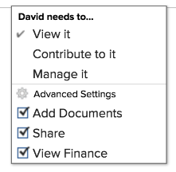

# Problem freigeben

Ihr Adobe Workfront-Administrator gewährt Benutzern Zugriff auf die Anzeige oder Bearbeitung von Problemen, wenn sie Zugriffsebenen zuweisen. Weitere Informationen zur Gewährung des Zugriffs auf Probleme finden Sie unter [Zugriff auf Probleme gewähren](../../administration-and-setup/add-users/configure-and-grant-access/grant-access-issues.md).

Neben der Zugriffsstufe, die Benutzern zugewiesen wird, können Sie ihnen auch Berechtigungen zum Anzeigen, Beitragen oder Verwalten bestimmter Probleme erteilen, auf die Sie Zugriff haben. Weitere Informationen zu Zugriffsebenen und Berechtigungen finden Sie unter [Wie Zugriffsebenen und Berechtigungen zusammenarbeiten](../../administration-and-setup/add-users/access-levels-and-object-permissions/how-access-levels-permissions-work-together.md).

Berechtigungen beziehen sich auf ein Element in Workfront und legen fest, welche Aktionen für dieses Element durchgeführt werden können.

## Überlegungen zur Freigabe von Problemen

Zusätzlich zu den unten stehenden Überlegungen siehe [Übersicht über die Freigabe von Berechtigungen für Objekte](../../workfront-basics/grant-and-request-access-to-objects/sharing-permissions-on-objects-overview.md).

>[!NOTE]
>
>Ein Workfront-Administrator kann allen Elementen im System Berechtigungen hinzufügen oder entfernen, ohne Eigentümer dieser Elemente zu sein.

* Der Ersteller eines Problems verfügt standardmäßig über die Berechtigung &quot;Verwalten&quot;.
* Sie können Probleme einzeln oder mehrere gemeinsam nutzen. Die Probleme beim Freigeben sind mit der Freigabe anderer Elemente in Workfront identisch. Weitere Informationen zum Freigeben von Elementen in Workfront finden Sie unter [Objekt freigeben](../../workfront-basics/grant-and-request-access-to-objects/share-an-object.md).
* Sie können die folgenden Berechtigungen für ein Problem gewähren: 

   * Anzeigen

      

   * Verwalten

      

   * Mitwirken\
      

* Wenn Sie ein Problem freigeben, erben alle mit dem Problem verknüpften Dokumente dieselben Berechtigungen.

   Der Workfront-Administrator kann angeben, ob Dokumente Berechtigungen von höheren Objekten in der Zugriffsebene des Benutzers erben sollen. Weitere Informationen zum Einschränken von geerbten Berechtigungen auf Dokumente finden Sie unter [Benutzerdefinierte Zugriffsebenen erstellen oder ändern](../../administration-and-setup/add-users/configure-and-grant-access/create-modify-access-levels.md).

* Sie können geerbte Berechtigungen aus einem Problem entfernen. Weitere Informationen finden Sie unter [Berechtigungen aus Objekten entfernen](../../workfront-basics/grant-and-request-access-to-objects/remove-permissions-from-objects.md).

## Möglichkeiten zum Freigeben eines Problems

* Manuell, was der Freigabe anderer Objekte in Workfront ähnelt. Weitere Informationen zum Freigeben von Objekten in Workfront finden Sie unter [Objekt freigeben](../../workfront-basics/grant-and-request-access-to-objects/share-an-object.md).
* Führen Sie automatisch einen der folgenden Schritte aus:

   * Legen Sie die Berechtigungen für die übergeordneten Objekte des Problems fest: Projekt, Programm oder Portfolio. Probleme erben die Berechtigungen von ihren übergeordneten Objekten. Informationen zum Anzeigen von geerbten Berechtigungen für Objekte finden Sie unter [Vererbte Berechtigungen für Objekte anzeigen](../../workfront-basics/grant-and-request-access-to-objects/view-inherited-permissions-on-objects.md).
   * Fügen Sie Entitäten zur Projektfreigabe in einer Vorlage hinzu, die zum Erstellen des Projekts verwendet wird, in dem sich das Problem befindet. Informationen zum Freigeben von Projekten aus Vorlagen finden Sie unter [Vorlage freigeben](../../workfront-basics/grant-and-request-access-to-objects/share-a-template.md).

   * Geben Sie die Berechtigungen für alle Probleme in einem Projekt an, wenn Sie das Projekt bearbeiten. Informationen zum Verwalten des Zugriffs auf Probleme oder Anforderungen im Projekt basierend auf den Berechtigungen eines Benutzers für das Projekt finden Sie unter  im Artikel [Projekte bearbeiten](../../manage-work/projects/manage-projects/edit-projects.md).

      >[!TIP]
      >
      >Wenn Sie nicht angeben, welche Berechtigungen Benutzern erteilt werden sollen, wenn sie den Problemen im Projekt zugewiesen sind, erhalten sie standardmäßig dieselben Berechtigungen für das Projekt.

   * Geben Sie die Berechtigungen an, die Benutzer bei Problemen erhalten, die sie in einer Anforderungswarteschlange senden, wenn sie eine Anforderungswarteschlange erstellen. Weitere Informationen finden Sie unter [Erstellen einer Anforderungswarteschlange](../../manage-work/requests/create-and-manage-request-queues/create-request-queue.md).

      >[!IMPORTANT]
      >
      >Die Berechtigungen werden je nachdem, ob das Projekt als Anforderungswarteschlange veröffentlicht wird, unterschiedlich gewährt:
      >
      >   
      >   
      >   * Wenn ein Benutzer eine Anforderung an ein Projekt sendet, das als Anforderungswarteschlange veröffentlicht wurde, erhalten die Benutzer Primärer Kontakt und Eingestiegen von die angegebenen Berechtigungen.
      >   * Wenn ein Benutzer eine Anforderung an ein Projekt sendet, das nicht als Anforderungswarteschlange veröffentlicht wurde, erhält der Primäre Kontakt (sofern nicht vom Benutzer &quot;Eingestiegen durch&quot;) die angegebene Berechtigung und der Benutzer &quot;Eingestiegen durch&quot;erhält die Berechtigung zum Verwalten des Problems.

<!--

<h2>Automatically share an issue at the project level</h2>

(NOTE: this info duplicates in Edit projects - linked there instead (above).)&nbsp;

As the Project Owner, you can grant permissions automatically to users as the issues are added to a project.

<ol>
<li value="1">Go to the project whose issues you want to share automatically.</li>
<li value="2"> Click the More menu , then click <strong>Edit</strong>. </li>
<li value="3">In the <strong>Edit Project</strong> box that displays, click <strong>Access</strong>.</li>
<li value="4">In the <strong>When someone is assigned to an ISSUE</strong> field, select from the following permissions levels:
<ul>
<li><strong>View</strong></li>
<li><strong>Contribute</strong></li>
<li><strong>Manage</strong> Now, when someone is assigned to an issue on the selected project, they are granted the specified permissions to the issue.&nbsp;</li>
</ul></li>
<li value="5">(Optional) Select the <strong>Also grant ... access to the project</strong> field to also grant View, Contribute, or Manage permissions to the projects to the user assigned to the issue</li>
<li value="6">In the <strong>When someone submits a REQUEST ...</strong> field, select from the following permissions levels:
<ul>
<li><strong>View</strong></li>
<li><strong>Contribute</strong></li>
<li>
<strong>Manage</strong>
<note type="important">

Permissions are granted differently depending on whether or not the project is published as a request queue:

<ul>
<li>When a user submits a request to a project published as a request queue, the Primary Contact and Entered By users are granted the permission specified.</li>
<li>When a user submits a request to a project not published as a request queue, the Primary Contact (if different from Entered By user) is granted the permission specified, and the Entered By user is granted Manage permissions to the issue.</li>
</ul>
</note></li>
</ul></li>
<li value="7"> 
(Optional) Select the <strong>People from the same company will inherit the same permissions for all requests</strong> field.
 
People from the same company as the user submitting the request are granted the same permissions on the requests as the user.&nbsp;
 </li>
<li value="8">Click <strong>Save Changes</strong>.</li>
</ol>

-->

<!--

<h2>Automatically share an issue in request queues</h2>

(NOTE: drafted because it's duplicated from Create a Request Queue which is linked above)&nbsp;

As the Project Owner, you can grant permissions automatically to users as the issues are submitted to a request queue.

<ol>
<li value="1">Go to the project whose issues you want to share automatically.</li>
<li value="2">Click <strong>Edit Project</strong>.</li>
<li value="3">Click <strong>More</strong> then click <strong>Queue Setup</strong>. </li>
<li value="4"> 
On the <strong>Queue Details</strong> sub-tab, in the drop-down menu under <strong>When someone makes a request, automatically grant</strong>, select from the following permissions levels:

<ul>
<li><strong>View Access</strong> </li>
<li><strong>Contribute Access</strong> </li>
<li> 
<strong>Manage Access</strong> 
 </li>
</ul> 
Now, when someone submits a request to the selected project, they are granted the specified permissions to the request.
 </li>
<li value="5"> 
(Optional) Select the <strong>People from the same company will inherit the same permissions for all requests</strong>.
 
People from the same company as the user submitting the request are granted the same permissions on the requests as the user.&nbsp;
 </li>
<li value="6">Click <strong>Save</strong>.</li>
</ol>

-->

## Berechtigungen ausgeben

Die folgende Tabelle zeigt, welche Berechtigungen Sie Benutzern gewähren können, wenn sie es ihnen ermöglichen, ein Problem anzuzeigen, beizutragen oder zu verwalten:

<table style="table-layout:auto"> 
 <col> 
 <col> 
 <col> 
 <col> 
 <tbody> 
  <tr> 
   <td><strong>Aktionen</strong> </td> 
   <td><strong>Verwalten</strong> </td> 
   <td><strong>Mitwirken</strong> </td> 
   <td><strong>Anzeigen</strong> </td> 
  </tr> 
  <tr> 
   <td> 
 Anfragen hinzufügen
 </td> 
   <td>✓</td> 
   <td> </td> 
   <td> </td> 
  </tr> 
  <tr> 
   <td>Löschen </td> 
   <td>✓</td> 
   <td> </td> 
   <td> </td> 
  </tr> 
  <tr> 
   <td>Benutzerdefiniertes Formular anfügen</td> 
   <td>✓</td> 
   <td> </td> 
   <td> </td> 
  </tr> 
  <tr> 
   <td>Benutzerdefinierte Felder bearbeiten</td> 
   <td>✓</td> 
   <td>✓</td> 
   <td> </td> 
  </tr> 
  <tr> 
   <td>Problem genehmigen</td> 
   <td>✓</td> 
   <td>✓</td> 
   <td>✓</td> 
  </tr> 
  <tr> 
   <td>Hinzufügen eines Validierungsprozesses</td> 
   <td>✓</td> 
   <td> </td> 
   <td> </td> 
  </tr> 
  <tr> 
   <td>Dokumente hinzufügen</td> 
   <td>✓</td> 
   <td>✓</td> 
   <td>✓</td> 
  </tr> 
  <tr> 
   <td>Anfrage kopieren*</td> 
   <td>✓</td> 
   <td>✓</td> 
   <td>✓</td> 
  </tr> 
  <tr> 
   <td>Anfrage verschieben</td> 
   <td>✓</td> 
   <td> </td> 
   <td> </td> 
  </tr> 
  <tr> 
   <td>Stunden protokollieren</td> 
   <td>✓</td> 
   <td>✓</td> 
   <td> </td> 
  </tr> 
  <tr> 
   <td>In Projekt konvertieren*</td> 
   <td>✓</td> 
   <td> </td> 
   <td> </td> 
  </tr> 
  <tr> 
   <td>Accept-Zuweisung</td> 
   <td>✓</td> 
   <td>✓</td> 
   <td> </td> 
  </tr> 
  <tr> 
   <td>Aktualisierungen/Kommentare</td> 
   <td>✓</td> 
   <td>✓</td> 
   <td>✓</td> 
  </tr> 
  <tr> 
   <td>Geplante Datumswerte ändern</td> 
   <td>✓</td> 
   <td> </td> 
   <td> </td> 
  </tr> 
  <tr> 
   <td>Zuweisungen vornehmen</td> 
   <td>✓</td> 
   <td>✓</td> 
   <td> </td> 
  </tr> 
  <tr> 
   <td>Freigeben</td> 
   <td>✓</td> 
   <td>✓</td> 
   <td>✓</td> 
  </tr> 
  <tr> 
   <td>Systemweit freigeben</td> 
   <td> </td> 
   <td> </td> 
   <td>✓</td> 
  </tr> 
 </tbody> 
</table>

&#42;Wird durch die Zugriffsebene und die Berechtigungen für das Projekt gesteuert.
