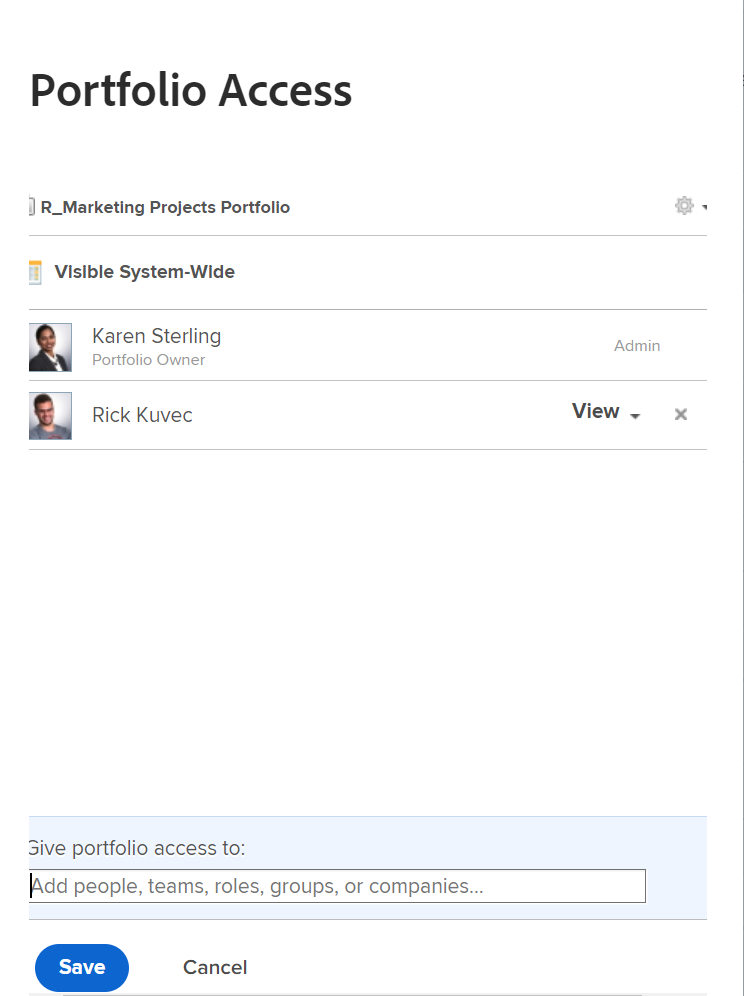
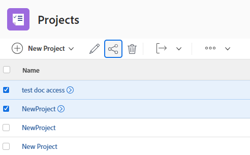

# Freigeben eines Objekts

<!--Audited: 01/2024-->

Ihr Adobe Workfront-Administrator gewährt Benutzenden Zugriff zum Anzeigen oder Bearbeiten von Objekten, wenn sie Zugriffsebenen zuweisen. Weitere Informationen zum Gewähren des Zugriffs auf Objekte finden Sie unter [Erstellen oder Ändern benutzerdefinierter Zugriffsebenen](../../administration-and-setup/add-users/configure-and-grant-access/create-modify-access-levels.md).

Neben der Zugriffsebene, die Benutzern gewährt wird, können Sie ihnen auch Berechtigungen zum Anzeigen oder Bearbeiten bestimmter Objekte erteilen, die Sie erstellt haben oder auf die Sie Zugriff haben. Weitere Informationen zu Zugriffsebenen und Berechtigungen finden Sie unter [Funktionsweise von Zugriffsebenen und Berechtigungen](../../administration-and-setup/add-users/access-levels-and-object-permissions/how-access-levels-permissions-work-together.md).

Berechtigungen sind für ein Element in Workfront spezifisch und definieren, welche Aktionen man für dieses Element ausführen kann.

Informationen zu Freigabeberechtigungen für Objekte finden Sie unter [Übersicht über Freigabeberechtigungen für Objekte](../../workfront-basics/grant-and-request-access-to-objects/sharing-permissions-on-objects-overview.md).

>[!NOTE]
>
>Ein Workfront-Administrator kann für alle Benutzenden Berechtigungen zu Elementen im System hinzufügen oder entfernen, ohne Besitzer dieser Elemente zu sein.

In diesem Artikel wird beschrieben, wie Sie die folgenden Objekte freigeben:

* Projekte, Aufgaben, Probleme
* Portfolios, Programme
* Dokumente

Informationen zum Freigeben aller anderen Objekte in Workfront finden Sie auch in den folgenden Artikeln:

* Vorlagen finden Sie unter [Freigeben von Projektvorlagen](../../manage-work/projects/create-and-manage-templates/share-project-template.md).
* Korrekturabzüge finden Sie unter [Freigeben eines Korrekturabzugs in Workfront Proof](../../workfront-proof/wp-work-proofsfiles/share-proofs-and-files/share-proof.md).
* Berichte, Dashboards und Kalender finden Sie in den folgenden Artikeln:

   * [Freigeben eines Berichts in Adobe Workfront](../../reports-and-dashboards/reports/creating-and-managing-reports/share-report.md)
   * [Dashboard freigeben](../../reports-and-dashboards/dashboards/creating-and-managing-dashboards/share-dashboard.md)
   * [Kalenderbericht freigeben](../../reports-and-dashboards/reports/calendars/share-a-calendar-report.md)

  Darüber hinaus finden Sie [Freigeben von Berichten, Dashboards und ](../../workfront-basics/grant-and-request-access-to-objects/permissions-reports-dashboards-calendars.md)) allgemeine Informationen zum Freigeben von Berichten, Dashboards und Kalendern.

* Informationen zu Filtern, Ansichten und Gruppierungen finden Sie unter [Freigeben von Filtern, Ansichten oder Gruppierungen](../../reports-and-dashboards/reports/reporting-elements/share-filter-view-grouping.md).
* Informationen zu Dokumentordnern finden Sie unter [Freigeben eines Dokumentordners](../../workfront-basics/grant-and-request-access-to-objects/share-a-document-folder.md).
* Pläne finden Sie unter [Freigeben eines Plans im Szenario-Planer](../../scenario-planner/share-a-plan.md).

  Für Workfront Scenario Planner ist möglicherweise eine zusätzliche Lizenz erforderlich.

* Informationen zu Zielen finden Sie [Freigeben eines Ziels in Workfront-Zielen](../../workfront-goals/workfront-goals-settings/share-a-goal.md).

  Für Workfront-Ziele ist möglicherweise eine zusätzliche Lizenz erforderlich.

* Informationen zu Workfront Planning-Objekten finden Sie in den folgenden Artikeln:

   * [Ansichten freigeben](/help/quicksilver/planning/access/share-views.md)
   * [Freigeben von Arbeitsbereichen](/help/quicksilver/planning/access/share-workspaces.md)

  Für den Zugriff auf Workfront Planning ist eine zusätzliche Lizenz erforderlich.

## Zugriffsanforderungen

+++ Erweitern Sie , um die Zugriffsanforderungen für die -Funktion in diesem Artikel anzuzeigen.

Sie müssen über Folgendes verfügen, um Objekte freizugeben:

<table style="table-layout:auto"> 
 <col> 
 <col> 
 <tbody> 
  <tr> 
   <td role="rowheader">Adobe Workfront-Plan</td> 
   <td> 
Beliebig 
 </td> 
  </tr> 
  <tr> 
   <td role="rowheader">Adobe Workfront-Lizenz*</td> 
   <td> 
Neue Lizenz: Standard
 
   Oder
   
Aktuelle Lizenz: Arbeit oder höher

   </td> 
  </tr> 
  <tr> 
   <td role="rowheader">Konfigurationen der Zugriffsebene</td> 
   <td> 
Ansichtszugriff oder höher auf die Objekte, die Sie freigeben möchten
 </td> 
  </tr> 
  <tr> 
   <td role="rowheader">Objektberechtigungen</td> 
   <td> 
Berechtigung zum Anzeigen oder höher für die Objekte, die Sie freigeben möchten
</td> 
  </tr> 
 </tbody> 
</table>

*Weitere Informationen finden Sie unter [Zugriffsanforderungen in der Dokumentation zu Workfront](/help/quicksilver/administration-and-setup/add-users/access-levels-and-object-permissions/access-level-requirements-in-documentation.md).

+++

## Freigeben von Projekten, Aufgaben oder Problemen über die zugehörige Seite

1. Navigieren Sie zur Seite des Projekts, der Aufgabe oder des Problems, das/die Sie freigeben möchten.

   Informationen dazu, welche Objekte freigegeben werden können, finden Sie unter [Übersicht über Freigabeberechtigungen für Objekte](../../workfront-basics/grant-and-request-access-to-objects/sharing-permissions-on-objects-overview.md).

1. Klicken Sie auf **Freigeben**-Schaltfläche neben dem Objektnamen.

   

1. Beginnen Sie im Feld **Zugriff gewähren auf** mit der Eingabe des Namens des Benutzers, Teams, der Rolle, der Gruppe oder der Firma, für den bzw. die Sie das Objekt freigeben möchten, und klicken Sie dann auf den Namen, wenn er in der Dropdown-Liste angezeigt wird.

   {width="350"}

   >[!TIP]
   >
   >Sie können ein Objekt nur für aktive Benutzer, Teams, Rollen oder Unternehmen freigeben.

   >[!TIP]
   >
   >Wenn mehrere Entitäten mit ähnlichen Namen vorhanden sind, werden sie alle unter ihrem Typ aufgeführt. Die Namen der Entitäten werden in alphabetischer Reihenfolge angezeigt. Die Reihenfolge, in der die Entitätstypen angezeigt werden, ist jedoch zufällig.
   >

1. (Optional) Wiederholen Sie Schritt 3 für jeden Benutzer, jedes Team, jede Rolle oder jede Gruppe, dem bzw. der Sie Zugriff auf das Objekt gewähren möchten.

1. Geben Sie die Berechtigungen für jeden Benutzer, jedes Team, jede Rolle, jede Gruppe oder jedes Unternehmen an, die bzw. das Sie in Schritt 3 hinzugefügt haben, indem Sie rechts neben seinem Namen auf das Dropdown-Menü klicken und dann die Berechtigungsstufe auswählen, die Sie gewähren möchten.

   

   Informationen zum Entfernen von Berechtigungen aus einem Objekt finden Sie unter [Entfernen von Berechtigungen aus Objekten](/help/quicksilver/workfront-basics/grant-and-request-access-to-objects/remove-permissions-from-objects.md).

   Die folgenden Optionen sind verfügbar:

   * **Anzeigen** Benutzer können das Element überprüfen und freigeben.
   * **Beitragen**: Benutzer können Aktualisierungen vornehmen, Informationen protokollieren, kleinere Änderungen vornehmen und Inhalte freigeben sowie alle Anzeigeberechtigungen erteilen.
   * **Verwalten:** Benutzer haben vollen Zugriff auf das Objekt ohne Administratorrechte (die auf Zugriffsebene gewährt werden). Darüber hinaus verfügen sie über alle Berechtigungen zum Anzeigen und Beitragen .

     >[!NOTE]
     >
     >Der Workfront-Administrator oder der Objektersteller hat die Möglichkeit, Berechtigungen aus diesen Entitäten zu entfernen.

1. (Optional) Klicken Sie auf das Symbol Erweiterte Optionen neben der Berechtigungsstufe, die Sie gewährt haben, um bestimmte Berechtigungen für das Objekt zu konfigurieren.

   

   Anzeigen, Verwalten und Beitragen verfügen je nach ausgewähltem Objekt über verschiedene erweiterte Optionen.

   Weitere Informationen zu Berechtigungsebenen finden Sie unter [Übersicht über Freigabeberechtigungen für Objekte](../../workfront-basics/grant-and-request-access-to-objects/sharing-permissions-on-objects-overview.md).

1. (Optional) Um dieses Objekt für alle Benutzer im System verfügbar zu machen, klicken Sie auf das Dropdown-Menü unter **Wer hat Zugriff** und klicken Sie dann im Dropdown-Menü auf **Jeder Benutzer im System kann anzeigen**.

   

   Alle Benutzer können das -Objekt basierend auf den von Ihnen festgelegten Berechtigungen sehen.

1. (Optional und bedingt) Klicken Sie bei der Freigabe eines Projekts auf das **Zahnrad**-Symbol  und aktivieren Sie dann das Kontrollkästchen neben **Als meine Projektzugriffsvorlage festlegen**, um die Berechtigungen als Vorlage festzulegen.

   Nachdem Sie Berechtigungen für ein Projekt definiert haben, werden dieselben Berechtigungen automatisch angewendet, wenn Sie ein Projekt das nächste Mal von Grund auf neu erstellen.

   >[!NOTE]
   >
   >Die Projektzugriffsvorlage überschreibt die Freigabestandardwerte, die Ihnen vom Workfront-Administrator auf Ihrer Zugriffsebene gewährt wurden.\
   >Weitere Informationen zum Angeben von Freigabestandardwerten für Projekte in der Zugriffsebene finden Sie unter [Gewähren von Zugriff auf Projekte](../../administration-and-setup/add-users/configure-and-grant-access/grant-access-projects.md)

   <!--
   >this note also appears in Understanding Project Permissions-->

   Sie können Berechtigungen für die Projekte angeben, die aus einer Vorlage erstellt werden, wenn Sie die Vorlage freigeben. Weitere Informationen finden Sie unter [Freigeben von Projektvorlagen](../../manage-work/projects/create-and-manage-templates/share-project-template.md).

1. (Bedingt) Um das Objekt schnell für Benutzer freizugeben, die Zugriff haben, klicken Sie auf **Link kopieren**.

1. Klicken Sie auf **Speichern**.

## Dokument, Portfolio oder Programm von der zugehörigen Seite aus freigeben

1. Navigieren Sie zur Seite des Dokuments, Portfolios oder Programms, das Sie freigeben möchten.

   Informationen dazu, welche Objekte freigegeben werden können, finden Sie unter [Übersicht über Freigabeberechtigungen für Objekte](../../workfront-basics/grant-and-request-access-to-objects/sharing-permissions-on-objects-overview.md).

1. Für Portfolios und Programme:

   Klicken Sie auf **Freigeben**-Schaltfläche neben dem Objektnamen.

   

   Oder

   Für Dokumente:

   Klicken Sie auf das **Mehr**-Symbol  neben dem Objektnamen und dann auf **Freigeben**.

   

1. Geben Sie im Feld **Zugriff auf &lt; Objektname >** den Namen des Benutzers, Teams, der Rolle, der Gruppe oder des Unternehmens ein, für den bzw. die Sie das Objekt freigeben möchten. Klicken Sie dann auf den Namen, wenn er in der Dropdown-Liste angezeigt wird.

   

   >[!TIP]
   >
   >* Wenn mehrere Entitäten mit ähnlichen Namen vorhanden sind, werden sie alle unter ihrem Typ aufgeführt. Die Namen der Entitäten werden in alphabetischer Reihenfolge angezeigt. Die Reihenfolge, in der die Entitätstypen angezeigt werden, ist jedoch zufällig.
   >
   >* Sie können ein Objekt nur für aktive Benutzer, Teams, Rollen oder Unternehmen freigeben.

1. (Optional) Wiederholen Sie Schritt 3 für jeden Benutzer, jedes Team, jede Rolle oder jede Gruppe, dem bzw. der Sie Zugriff auf das Objekt gewähren möchten.

1. Geben Sie die Berechtigungen für jeden Benutzer, jedes Team, jede Rolle, jede Gruppe oder jedes Unternehmen an, die bzw. das Sie in Schritt 3 hinzugefügt haben, indem Sie auf das Dropdown-Menü klicken und dann die Berechtigungsstufe auswählen, die Sie gewähren möchten.

   Informationen zum Entfernen von Berechtigungen aus einem Objekt finden Sie unter [Entfernen von Berechtigungen aus Objekten](/help/quicksilver/workfront-basics/grant-and-request-access-to-objects/remove-permissions-from-objects.md).

   Die folgenden Optionen sind verfügbar:

   * **Anzeigen** Benutzer können das Element überprüfen und freigeben.
   * **Verwalten:** Benutzer haben vollen Zugriff auf das Objekt ohne Administratorrechte (die auf Zugriffsebene gewährt werden). Darüber hinaus verfügen sie über alle Berechtigungen zum Anzeigen und Beitragen .

     >[!NOTE]
     >
     >Der Workfront-Administrator oder der Objektersteller hat die Möglichkeit, Berechtigungen aus diesen Entitäten zu entfernen.

     

1. (Optional) Klicken Sie auf **Erweiterte Einstellungen**, um bestimmte Berechtigungen für das Objekt zu konfigurieren.

   Berechtigungen zum Anzeigen und Verwalten verfügen je nach ausgewähltem Objekt über verschiedene erweiterte Optionen.\
   Weitere Informationen zu den Berechtigungsebenen finden Sie unter [Übersicht über die Freigabe von Berechtigungen für Objekte](../../workfront-basics/grant-and-request-access-to-objects/sharing-permissions-on-objects-overview.md).

1. (Optional) Um dieses Objekt für alle Benutzer im System verfügbar zu machen, klicken Sie auf das **Zahnrad**-Symbol  und klicken Sie dann im Dropdown-Menü auf **Systemweit sichtbar**.

   Alle Benutzer können das -Objekt basierend auf den von Ihnen festgelegten Berechtigungen sehen.

1. (Optional) Um das Objekt öffentlich zu machen, klicken Sie auf **Für externe Benutzer öffentlich machen**.

   >[!TIP]
   >
   >Diese Option ist nicht für alle Objekte verfügbar.

   {width="350"}

1. (Bedingt) Wenn Sie das Objekt für externe Benutzer öffentlich gemacht haben, klicken Sie auf **Link kopieren** und verteilen Sie den Link dann an externe Benutzer.

   Alle Benutzer mit dem Link können das Objekt anzeigen.

   >[!CAUTION]
   >
   >Es wird empfohlen, bei der Freigabe eines Objekts mit vertraulichen Informationen an externe Benutzer Vorsicht walten zu lassen. Auf diese Weise können sie Informationen anzeigen, ohne ein Workfront-Benutzer oder Teil Ihres Unternehmens zu sein.

1. Klicken Sie auf **Speichern**.

## Freigeben von einzelnen oder Massenobjekten aus einer Liste

1. Navigieren Sie zur Liste, die die Objekte enthält, die Sie freigeben möchten.

   Informationen dazu, welche Objekte freigegeben werden können, finden Sie unter [Übersicht über Freigabeberechtigungen für Objekte](../../workfront-basics/grant-and-request-access-to-objects/sharing-permissions-on-objects-overview.md).

1. Aktivieren Sie das Kontrollkästchen neben den Objekten, die Sie freigeben möchten, und klicken Sie dann oben auf **Seite auf** Freigabesymbol.

   Das Feld **&lt; Objekt > Zugriff** wird geöffnet.

   {width="350"}

1. Beginnen Sie im Feld **Bearbeiten &lt; Objektname > Zugriff für** mit der Eingabe des Namens des Benutzers, Teams, der Rolle, Gruppe oder Firma, für den Sie die Objekte freigeben möchten, und klicken Sie dann auf den Namen, wenn er in der Dropdown-Liste angezeigt wird.

   {width="350"}

   >[!TIP]
   >
   >* Sie können ein Objekt nur für aktive Benutzer, Teams, Rollen oder Unternehmen freigeben.
   >
   >
   >* Wenn mehrere Entitäten mit ähnlichen Namen vorhanden sind, werden sie alle unter ihrem Typ aufgeführt. Die Namen der Entitäten werden in alphabetischer Reihenfolge angezeigt. Die Reihenfolge, in der die Entitätstypen angezeigt werden, ist jedoch zufällig.
   >

1. (Optional) Wiederholen Sie Schritt 3 für jeden Benutzer, jedes Team, jede Rolle oder jede Gruppe, dem bzw. der Sie Zugriff auf die Objekte gewähren möchten.

1. Geben Sie die Berechtigungen für jeden Benutzer, jedes Team, jede Rolle, jede Gruppe oder jedes Unternehmen an, die bzw. das Sie in Schritt 3 hinzugefügt haben, indem Sie rechts neben seinem Namen auf das Dropdown-Menü klicken und dann die Berechtigungsstufe auswählen, die Sie gewähren möchten.

   Informationen zum Entfernen von Berechtigungen aus einem Objekt finden Sie unter [Entfernen von Berechtigungen aus Objekten](/help/quicksilver/workfront-basics/grant-and-request-access-to-objects/remove-permissions-from-objects.md).

   

   Die folgenden Optionen sind verfügbar:

   * **Anzeigen** Benutzer können das Element überprüfen und freigeben.
   * **Beitragen**: Benutzer können Aktualisierungen vornehmen, Informationen protokollieren, kleinere Änderungen vornehmen und Inhalte freigeben sowie alle Anzeigeberechtigungen erteilen.

     >[!TIP]
     >
     >Sie können Contribute-Berechtigungen nur für die folgenden Objekte erteilen:
     >
     >* Projekte
     >* Aufgaben
     >* Probleme
     >

   * **Verwalten:** Benutzer haben vollen Zugriff auf das Objekt ohne Administratorrechte (die auf Zugriffsebene gewährt werden). Darüber hinaus verfügen sie über alle Berechtigungen zum Anzeigen und Beitragen .

     >[!NOTE]
     >
     >Der Workfront-Administrator oder der Objektersteller hat die Möglichkeit, Berechtigungen aus diesen Entitäten zu entfernen.

1. (Optional) Klicken Sie auf **Erweiterte Einstellungen**, um bestimmte Berechtigungen für das Objekt zu konfigurieren.

   Anzeigen, Verwalten und Beitragen verfügen je nach ausgewähltem Objekt über verschiedene erweiterte Optionen.\
   Weitere Informationen zu den Berechtigungsebenen finden Sie unter [Übersicht über die Freigabe von Berechtigungen für Objekte](../../workfront-basics/grant-and-request-access-to-objects/sharing-permissions-on-objects-overview.md).

   

1. (Optional) Um dieses Objekt für alle Benutzer im System verfügbar zu machen, klicken Sie auf das **Zahnrad**-Symbol  und klicken Sie dann im Dropdown-Menü auf **Systemweit sichtbar**.

   Alle Benutzer können die Objekte sehen, die auf den von Ihnen festgelegten Berechtigungen basieren.

1. (Optional und bedingt) Klicken Sie bei der Freigabe eines Projekts auf das **Zahnrad**-Symbol  und klicken Sie dann im Dropdown-Menü auf **Als meine Projektzugriffsvorlage festlegen**, um die Berechtigungen als Vorlage festzulegen.

   Nachdem Sie Berechtigungen für ein Projekt definiert haben, werden dieselben Berechtigungen automatisch angewendet, wenn Sie ein Projekt das nächste Mal von Grund auf neu erstellen.

   >[!NOTE]
   >
   >Die Projektzugriffsvorlage überschreibt die Freigabestandardwerte, die Ihnen vom Workfront-Administrator auf Ihrer Zugriffsebene gewährt wurden.\
   >Weitere Informationen zum Angeben von Freigabestandardwerten für Projekte in der Zugriffsebene finden Sie unter [Gewähren von Zugriff auf Projekte](../../administration-and-setup/add-users/configure-and-grant-access/grant-access-projects.md)

   <!--
   >this note also appears in Understanding Project Permissions-->

   Sie können Berechtigungen für die Projekte angeben, die aus einer Vorlage erstellt werden, wenn Sie die Vorlage freigeben. Weitere Informationen finden Sie unter [Freigeben von Projektvorlagen](../../manage-work/projects/create-and-manage-templates/share-project-template.md).

1. (Optional) Um die Objekte öffentlich zu machen, klicken Sie auf **Für externe Benutzer öffentlich machen**.

   >[!TIP]
   >
   >Diese Option ist nicht für alle Objekte verfügbar.

   {width="350"}

1. (Bedingt) Wenn Sie die Objekte für externe Benutzer öffentlich gemacht haben, klicken Sie auf **Link kopieren** und verteilen Sie den Link dann an externe Benutzer.

   Alle Benutzer mit dem Link können das Objekt anzeigen.

   >[!CAUTION]
   >
   >Es wird empfohlen, bei der Freigabe eines Objekts mit vertraulichen Informationen an externe Benutzer Vorsicht walten zu lassen. Auf diese Weise können sie Informationen anzeigen, ohne ein Workfront-Benutzer oder Teil Ihres Unternehmens zu sein.

1. Klicken Sie auf **Speichern**.
