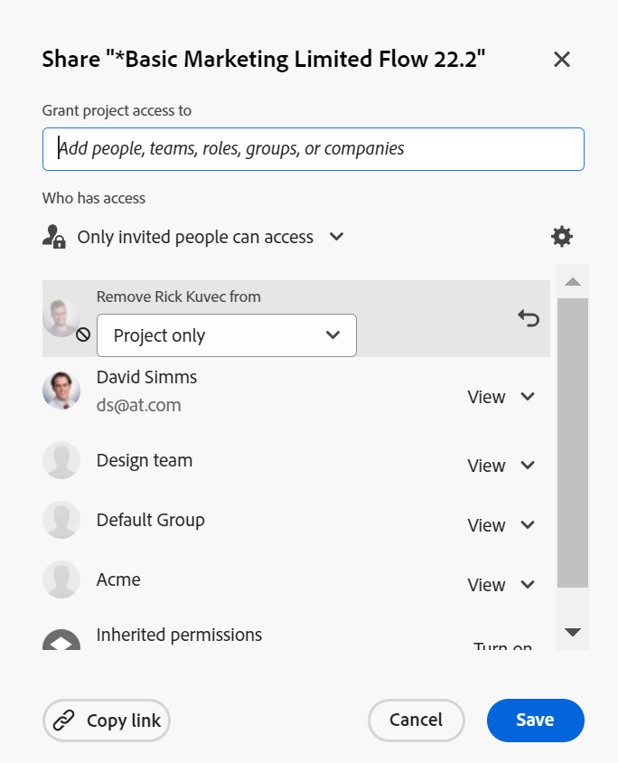

# Objekt freigeben

Ihr Adobe Workfront-Administrator gewährt Benutzern Zugriff auf die Ansicht oder Bearbeitung von Objekten, wenn sie Zugriffsebenen zuweisen. Weitere Informationen zum Gewähren des Zugriffs auf Objekte finden Sie unter [Benutzerdefinierte Zugriffsebenen erstellen oder ändern](../../administration-and-setup/add-users/configure-and-grant-access/create-modify-access-levels.md).

Neben der Zugriffsebene, die Benutzern gewährt wird, können Sie ihnen auch Berechtigungen zum Anzeigen oder Bearbeiten bestimmter von Ihnen erstellter Objekte oder zum Freigeben von Inhalten gewähren. Weitere Informationen zu Zugriffsebenen und Berechtigungen finden Sie unter [Wie Zugriffsebenen und Berechtigungen zusammenarbeiten](../../administration-and-setup/add-users/access-levels-and-object-permissions/how-access-levels-permissions-work-together.md).

Berechtigungen beziehen sich auf ein Element in Workfront und legen fest, welche Aktionen für dieses Element durchgeführt werden können.

Informationen zum Freigeben von Berechtigungen für Objekte finden Sie unter [Übersicht über die Freigabe von Berechtigungen für Objekte](../../workfront-basics/grant-and-request-access-to-objects/sharing-permissions-on-objects-overview.md).

>[!NOTE]
>
>Ein Workfront-Administrator kann allen Elementen im System Berechtigungen hinzufügen oder entfernen, ohne Eigentümer dieser Elemente zu sein.

In diesem Artikel wird beschrieben, wie Sie die folgenden Objekte freigeben: 

* Projekte, Aufgaben, Probleme
* Portfolios, Programme
* Dokumente

Weitere Informationen zum Freigeben aller anderen Objekte in Workfront finden Sie in den folgenden Artikeln:

* Informationen zu Vorlagen finden Sie unter [Projektvorlagen freigeben](../../manage-work/projects/create-and-manage-templates/share-project-template.md).
* Informationen zu Testsendungen finden Sie unter [Testversand in Workfront - Testversand freigeben](../../workfront-proof/wp-work-proofsfiles/share-proofs-and-files/share-proof.md).
* Berichte, Dashboards und Kalender finden Sie in den folgenden Artikeln:

   * [Bericht in Adobe Workfront freigeben](../../reports-and-dashboards/reports/creating-and-managing-reports/share-report.md)
   * [Dashboard freigeben](../../reports-and-dashboards/dashboards/creating-and-managing-dashboards/share-dashboard.md)
   * [Kalenderberichte freigeben](../../reports-and-dashboards/reports/calendars/share-a-calendar-report.md)

  Weitere Informationen finden Sie unter [Berichte, Dashboards und Kalender freigeben](../../workfront-basics/grant-and-request-access-to-objects/permissions-reports-dashboards-calendars.md) allgemeine Informationen zur Freigabe von Berichten, Dashboards und Kalendern. 

* Informationen zu Filtern, Ansichten und Gruppierungen finden Sie unter [Filter, Ansichten oder Gruppierungen freigeben](../../reports-and-dashboards/reports/reporting-elements/share-filter-view-grouping.md).
* Informationen zu Dokumentordnern finden Sie unter [Dokumentordner freigeben](../../workfront-basics/grant-and-request-access-to-objects/share-a-document-folder.md).
* Pläne finden Sie unter [Plan im Szenario-Planer freigeben](../../scenario-planner/share-a-plan.md).

  Dies erfordert eine zusätzliche Lizenz.

* Ziele finden Sie unter [Freigeben eines Ziels in Workfront-Zielen](../../workfront-goals/workfront-goals-settings/share-a-goal.md). Dies erfordert eine zusätzliche Lizenz.

## Zugriffsanforderungen

<!--drafted for P&P:

<table style="table-layout:auto"> 
 <col> 
 <col> 
 <tbody> 
  <tr> 
   <td role="rowheader">Adobe Workfront plan*</td> 
   <td> 
Any 
 </td> 
  </tr> 
  <tr> 
   <td role="rowheader">Adobe Workfront license*</td> 
   <td> 
Current license: Standard
 
   Or
   
Legacy license: Work or higher

   </td> 
  </tr> 
  <tr> 
   <td role="rowheader">Access level configurations*</td> 
   <td> 
View access or higher to the objects you want to share
 
<b>NOTE</b>
   
   If you still don't have access, ask your Workfront administrator if they set additional restrictions in your access level. For information on how a Workfront administrator can modify your access level, see <a href="../../administration-and-setup/add-users/configure-and-grant-access/create-modify-access-levels.md" class="MCXref xref">Create or modify custom access levels</a>.
 </td> 
  </tr> 
  <tr> 
   <td role="rowheader">Object permissions</td> 
   <td> 
View permissions or higher to the objects you want to share
 
For information on requesting additional access, see <a href="../../workfront-basics/grant-and-request-access-to-objects/request-access.md" class="MCXref xref">Request access to objects </a>.
 </td> 
  </tr> 
 </tbody> 
</table>
-->

Sie müssen über Folgendes verfügen, um Objekte freizugeben:

<table style="table-layout:auto"> 
 <col> 
 <col> 
 <tbody> 
  <tr> 
   <td role="rowheader">Adobe Workfront-Plan*</td> 
   <td> 
Beliebig 
 </td> 
  </tr> 
  <tr> 
   <td role="rowheader">Adobe Workfront-Lizenz*</td> 
   <td> 
Arbeit oder höher
 </td> 
  </tr> 
  <tr> 
   <td role="rowheader">Konfigurationen auf Zugriffsebene*</td> 
   <td> 
Zugriff auf die freizugebenden Objekte oder höher anzeigen
 
<b>NOTIZ</b>

Wenn Sie immer noch keinen Zugriff haben, fragen Sie Ihren Workfront-Administrator, ob er zusätzliche Zugriffsbeschränkungen für Ihre Zugriffsebene festlegt. Informationen dazu, wie ein Workfront-Administrator Ihre Zugriffsebene ändern kann, finden Sie unter <a href="../../administration-and-setup/add-users/configure-and-grant-access/create-modify-access-levels.md" class="MCXref xref">Benutzerdefinierte Zugriffsebenen erstellen oder ändern</a>.
 </td>
</tr> 
  <tr> 
   <td role="rowheader">Objektberechtigungen</td> 
   <td> 
Anzeigen von Berechtigungen oder höher für die Objekte, die Sie freigeben möchten
 
Informationen zum Anfordern von zusätzlichem Zugriff finden Sie unter <a href="../../workfront-basics/grant-and-request-access-to-objects/request-access.md" class="MCXref xref">Zugriff auf Objekte anfordern </a>.
 </td> 
  </tr> 
 </tbody> 
</table>

&#42;Wenden Sie sich an Ihren Workfront-Administrator, um zu erfahren, welchen Plan, welchen Lizenztyp oder welchen Zugriff Sie haben.

## Einzelnes Objekt freigeben {#share-a-single-object}

1. Wechseln Sie zu dem Objekt, das Sie freigeben möchten.

   Informationen darüber, welche Objekte freigegeben werden können, finden Sie unter [Übersicht über die Freigabe von Berechtigungen für Objekte](../../workfront-basics/grant-and-request-access-to-objects/sharing-permissions-on-objects-overview.md).
1. Für Projekte, Aufgaben und Probleme:

   Klicken Sie auf **Freigeben** neben dem Objektnamen.

   

   ODER

   Für Dokumente, Portfolios und Programme:

   Klicken Sie auf **Mehr** icon neben dem Objektnamen klicken Sie dann auf **Freigabe** oder **Freigeben.**

   

1. Im **geben `<Object Name>` Zugriff auf** eingeben, beginnen Sie mit der Eingabe des Namens des Benutzers, Teams, Rollen, Gruppen oder Unternehmens, für den Sie das Objekt freigeben möchten, und klicken Sie dann auf den Namen, wenn er in der Dropdown-Liste angezeigt wird.

   Wenn Sie beispielsweise ein Projekt freigeben, verwenden Sie die **Projekt-Zugriff gewähren an** -Feld.

   >[!TIP]
   >
   >Sie können ein Objekt nur für aktive Benutzer, Teams, Rollen oder Unternehmen freigeben.

   

   >[!TIP]
   >
   >Wenn mehrere Entitäten ähnlich benannt sind, werden sie alle unter ihrem Typ aufgelistet. Die Namen der Entitäten werden in alphabetischer Reihenfolge angezeigt. Die Reihenfolge, in der die Entitätstypen angezeigt werden, ist jedoch zufällig.
   >
   >
   >   >
   >

1. (Optional) Wiederholen Sie Schritt 3 für jeden Benutzer, jedes Team, jede Rolle oder jede Gruppe, dem/der Sie Zugriff auf das Objekt gewähren möchten.

   <!--
   <MadCap:conditionalText data-mc-conditions="QuicksilverOrClassic.Draft mode">
   (NOTE: esnure this stays accurate; in the editor it looks like step 4 but one step is conditioned entirely for one version or another)
   </MadCap:conditionalText>
   -->

1. Geben Sie die Berechtigungen für jeden Benutzer, jedes Team, jede Rolle, jede Gruppe oder jedes Unternehmen an, die Sie in Schritt 3 hinzugefügt haben, indem Sie auf das Dropdown-Menü klicken und dann die Berechtigungsebene auswählen, die Sie gewähren möchten.

   Die folgenden Optionen sind verfügbar:

   * **Ansicht:** Benutzer können das Element überprüfen und freigeben. 
   * **Beitragen****:** Benutzer können Aktualisierungen vornehmen, Protokollinformationen protokollieren, kleinere Änderungen vornehmen und alle Anzeigeberechtigungen freigeben.

     >[!TIP]
     >
     >Sie können Beitragsberechtigungen nur für die folgenden Objekte gewähren: 
     >
     >   
     >   
     * Projekte
     * Aufgaben
     * Probleme
     >   
     >

   * **Verwalten:**Benutzer haben vollen Zugriff auf das Objekt ohne Administratorrechte, die auf der Zugriffsebene gewährt werden, sowie über alle Berechtigungen für Ansicht und Beitrag .

     >[!NOTE]
     >
      Der Workfront-Administrator oder der Ersteller von Objekten kann Berechtigungen aus diesen Entitäten entfernen.

      

     

1. (Optional) Klicken Sie auf **Erweiterte Optionen** um bestimmte Berechtigungen für das Objekt zu konfigurieren.

   &quot;Anzeigen&quot;, &quot;Verwalten&quot;und &quot;Beiträge&quot;verfügen je nach ausgewähltem Objekt über unterschiedliche erweiterte Optionen.\
   Weitere Informationen zu den Berechtigungsstufen finden Sie unter [Übersicht über die Freigabe von Berechtigungen für Objekte](../../workfront-basics/grant-and-request-access-to-objects/sharing-permissions-on-objects-overview.md).

   

1. (Optional) Um dieses Objekt allen Benutzern im System zur Verfügung zu stellen, klicken Sie auf die **Fanggerät** icon  Klicken Sie dann im Dropdown-Menü auf **Diese Funktion systemweit sichtbar machen**.

   Alle Benutzer können das Objekt anhand der von Ihnen festgelegten Berechtigungen anzeigen.

1. (Optional und bedingt) Klicken Sie beim Freigeben eines Projekts auf die Schaltfläche **Fanggerät** icon Klicken Sie dann im Dropdown-Menü auf **Festlegen als meine Projektzugriffsvorlage** , um die Berechtigungen als Vorlage festzulegen.\
   Nachdem Sie Berechtigungen für ein Projekt definiert haben, werden dieselben Berechtigungen automatisch angewendet, wenn Sie ein Projekt das nächste Mal von Grund auf neu erstellen.

   >[!NOTE]
   >
   Die Projektzugriffsvorlage setzt die Standardeinstellungen für die Freigabe außer Kraft, die Ihnen der Workfront-Administrator in Ihrer Zugriffsebene erteilt hat.\
   Weitere Informationen zum Angeben von Standardwerten für die Freigabe von Projekten auf der Zugriffsebene finden Sie unter [Projektzugriff gewähren](../../administration-and-setup/add-users/configure-and-grant-access/grant-access-projects.md) . >
   >
   <!--   >
   ><MadCap:conditionalText data-mc-conditions="QuicksilverOrClassic.Draft mode">   >
   >(NOTE: (this note also appears in Understanding Project Permissions.))   >
   ></MadCap:conditionalText>   >
   >-->   >
   >

   Sie können Berechtigungen für die Projekte festlegen, die aus einer Vorlage erstellt werden, wenn Sie die Vorlage freigeben. Weitere Informationen finden Sie unter [Projektvorlagen freigeben](../../manage-work/projects/create-and-manage-templates/share-project-template.md).

1. (Optional) Um das Objekt öffentlich zu machen, klicken Sie auf **Veröffentlichen Sie dies für externe Benutzer**.

   >[!TIP]
   >
   Diese Option ist nicht für alle Objekte verfügbar.

   

1. (Bedingt) Wenn Sie das Objekt für externe Benutzer öffentlich gemacht haben, klicken Sie auf **Link kopieren,** Verteilen Sie den Link dann an externe Benutzer.\
   Alle Benutzer mit dem Link können das Objekt anzeigen.

   >[!CAUTION]
   >
   Es wird empfohlen, bei der Freigabe eines Objekts mit vertraulichen Informationen für externe Benutzer Vorsicht walten zu lassen. Dadurch können sie Informationen anzeigen, ohne Workfront-Benutzer oder Teil Ihres Unternehmens zu sein.

1. Klicken Sie auf **Speichern**.

## Objekte stapelweise freigeben

Über eine Objektliste können Sie mehrere Objekte gleichzeitig für andere Benutzer, Teams, Gruppen, Auftrags- oder Unternehmen freigeben.

>[!IMPORTANT]
>
Wenn Sie Objekte stapelweise freigeben, werden die Namen der Entitäten, die über Berechtigungen für die einzelnen Objekte verfügen, nicht angezeigt. Bei der Freigabe von Objekten in großen Mengen werden die Entitäten, die Sie der Freigabeliste hinzufügen, den ausgewählten Objekten hinzugefügt. Sie überschreiben nicht die mit den einzelnen Objekten verknüpften Entitäten. 

So geben Sie Objekte stapelweise frei:

1. Navigieren Sie zu einer Liste von Objekten.
1. Wählen Sie mindestens zwei Objekte in der Liste aus.
1. Klicken Sie auf **Freigeben** icon .\
   Benutzer, die bereits Zugriff auf das Objekt haben, werden bei der Massenweitergabe nicht als verfügbar aufgelistet.

   >[!NOTE]
   >
   Wenn Sie nicht berechtigt sind, ein von Ihnen ausgewähltes Objekt freizugeben, wird die **Freigeben** -Schaltfläche nicht angezeigt.

1. Im **Bearbeiten `<Object Name>` Zugriff auf** eingeben, beginnen Sie mit der Eingabe des Namens eines Benutzers, Teams, einer Gruppe, einer Rolle oder eines Unternehmens, dem Sie Berechtigungen erteilen möchten.

   Wenn Sie beispielsweise ein Projekt freigeben, verwenden Sie die **Projekt-Zugriff gewähren für** -Feld.

   

1. Fahren Sie mit der Freigabe der ausgewählten Objekte fort, wie in den Schritten 4 bis 9 im Abschnitt beschrieben. [Einzelnes Objekt freigeben](#share-a-single-object) in diesem Artikel.

   <!--
   <MadCap:conditionalText data-mc-conditions="QuicksilverOrClassic.Draft mode">
   (NOTE: ensure these steps stay accurate; always look at them in the viewer; because of condiitoning, the steps numbers in the editor are different!!!!!!*****)
   </MadCap:conditionalText>
   -->

1. Klicken Sie auf **Speichern**.
