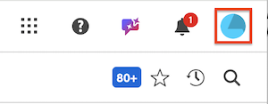
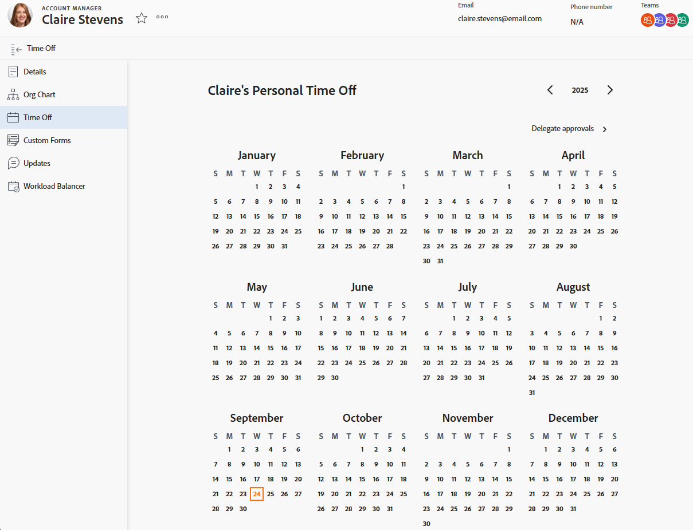
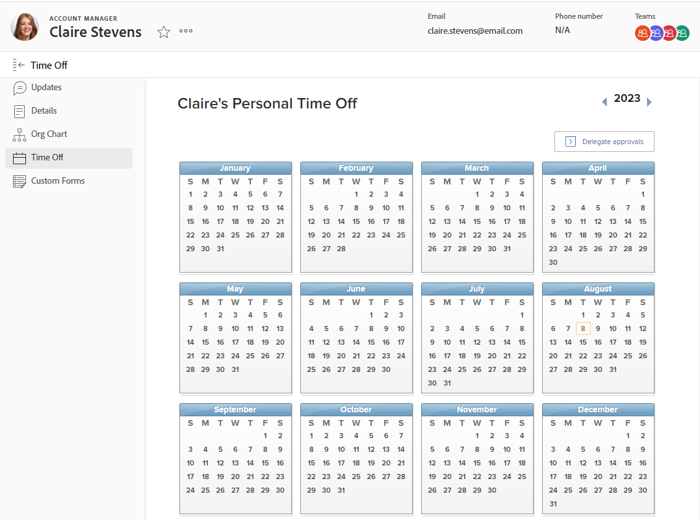

# Konfigurieren von persönlicher Ausfallzeit

<!-- Audited: 12/2025 -->

<!--The highlighted information on this page refers to functionality not yet generally available. It is available only in the Preview environment, and is being released in a phased rollout to Production.-->

[!DNL Adobe Workfront] ist nicht dafür konzipiert, bestehende Systeme zur Verwaltung, Ansammlung und Verfolgung persönlicher Ausfallzeiten zu replizieren oder zu ersetzen.

Es ist jedoch wichtig anzugeben, wann genehmigte Ausfallzeiten eintreten, da dies sowohl Ihren Zeitplan als auch [!UICONTROL geplanten Abschlussdaten] der Aufgaben beeinflusst, denen Sie zugewiesen sind.

Wenn Sie beispielsweise einer Aufgabe zugewiesen sind, die zwei Wochen dauern soll, und Sie planen, während dieser Zeit drei Tage frei zu nehmen, fügt [!DNL Workfront] der Aufgabenzeitleiste drei Tage hinzu, um die Ausfallzeit zu berücksichtigen.

Ressourcen-Management-Tools verwenden auch Ihre persönliche Auszeit, um anzugeben, wann Sie für die Arbeit zur Verfügung stehen.

>[!NOTE]
>
>Um sicherzustellen, dass es nicht zu Inkonsistenzen mit den Daten kommt, für die Sie Ihre Ausfallzeit planen, empfehlen wir, dass die Zeitzone Ihres Benutzerprofils mit der Ihres Zeitplans übereinstimmt. Weitere Informationen finden Sie in den folgenden Artikeln:
>
>* [Zeitplan erstellen](../../../administration-and-setup/set-up-workfront/configure-timesheets-schedules/create-schedules.md)
>* [Benutzerprofil bearbeiten](../../../administration-and-setup/add-users/create-and-manage-users/edit-a-users-profile.md)
>

## Zugriffsanforderungen

+++ Erweitern, um die Zugriffsanforderungen für die in diesem Artikel beschriebene Funktionalität anzuzeigen.

<table style="table-layout:auto"> 
 <col> 
 </col>
 <tbody> 
  <tr> 
   <td> Adobe Workfront-Paket</td> 
   <td>
Beliebig
</td> 
  </tr> 
  <tr> 
   <td>Adobe Workfront-Lizenz</td> 
   <td> 
Zur Konfiguration Ihrer persönlichen Ausfallzeit benötigen Sie Folgendes:

        
Standard (zur Konfiguration der Urlaubszeiten)

        
Arbeit oder höher (zur Konfiguration der Urlaubszeiten)
 </td>
  </tr> 
  <tr> 
   <td>Konfigurationen der Zugriffsebene</td> 
   <td>
Wenn Sie Änderungen am Urlaubskalender eines anderen Benutzers vornehmen möchten, müssen Sie dessen Manager sein und über Zugriff auf „Benutzer bearbeiten“ verfügen.

   
<strong>HINWEIS</strong> Wenn ein Manager den persönlichen Urlaubskalender eines anderen Benutzers bearbeitet, werden alle Einträge in der Zeitzone des Benutzers und nicht in der Zeitzone des Managers angezeigt.
</td> 
  </tr> 
 </tbody> 
</table>

Weitere Informationen finden Sie unter [Zugriffsanforderungen](/help/quicksilver/administration-and-setup/add-users/access-levels-and-object-permissions/access-level-requirements-in-documentation.md) in der Dokumentation zu Workfront.

+++

## Konfigurieren der persönlichen Ausfallzeit in [!DNL Workfront]

{{step1-click-profile-pic}}

>[!NOTE]
>
>Sie können auf Ihr Workfront-Profil zugreifen, indem Sie im oberen Navigationsbereich auf das Adobe-Kontomenü (Ihr Profilbild) klicken und dann auf Workfront-Profil klicken.
>
>

1. Klicken Sie im linken Bedienfeld auf **[!UICONTROL Auszeit]**.
1. Wählen Sie das gewünschte Datum für Ihre persönliche Auszeit aus.

   

   <!--
   Sample image in the Production environment:
   
   -->

1. Wählen Sie **[!UICONTROL Den ganzen]** aus, wenn Sie sich einen ganzen Tag freinehmen möchten.

   Lassen Sie das Kontrollkästchen deaktiviert, wenn Sie weniger als einen ganzen Tag Urlaub nehmen, und geben Sie die Anfangs- und Endzeiten Ihrer Urlaubszeit an.

1. Klicken Sie auf **[!UICONTROL Speichern]**.

   Ihre Ausfallzeit ist jetzt im gesamten [!DNL Workfront]-System in den Tools für das Ressourcenmanagement sichtbar, z. B. im Ressourcenplaner und im Workload-Balancer. Wenn Ihnen in dieser Zeit Arbeit zugewiesen wird, wird dem Benutzer ein Tooltip angezeigt, dass Sie Ausfallzeiten geplant haben.
