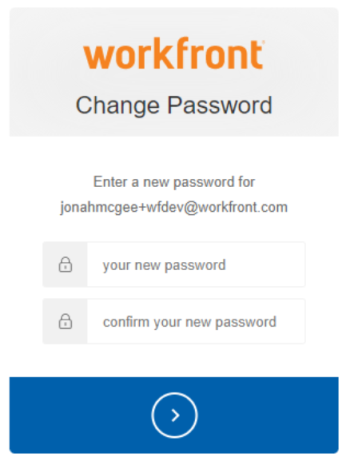

# Zurücksetzen des Kennworts eines Benutzers mit erweiterter Authentifizierung

<!--This article has been hidden by request-->

Wenn die erweiterte Authentifizierung (eAuth) für Ihre [!DNL Workfront]-Umgebung aktiviert ist, kann ein [!DNL Workfront]-Administrator die Anmeldedaten für einen anderen Benutzer nicht zurücksetzen. Dies unterscheidet sich von [!DNL Workfront] Umgebungen ohne eAuth oder den Umgebungen, für die Single Sign-On (SSO) aktiviert ist.

## Zugriffsanforderungen

Sie müssen über folgenden Zugriff verfügen, um die Schritte in diesem Artikel ausführen zu können:

<table style="table-layout:auto"> 
 <col> 
 <col> 
 <tbody> 
  <tr> 
   <td role="rowheader"><strong>[!DNL Adobe Workfront] Plan*</strong></td> 
   <td> 
 Beliebig
 </td> 
  </tr> 
  <tr> 
   <td role="rowheader"><strong>[!DNL Adobe Workfront] Lizenz*</strong></td> 
   <td> 
[!UICONTROL-Plan]
 </td> 
  </tr> 
  <tr> 
   <td role="rowheader"><strong>Konfigurationen der Zugriffsebene*</strong></td> 
   <td> 
Systemadministrator 
 </td> 
  </tr> 
 </tbody> 
</table>

Wenden Sie sich an Ihren [!DNL Workfront], um herauszufinden, über welchen Plan, welchen Lizenztyp oder welchen Zugriff Sie verfügen.

## Zurücksetzen des Passworts eines Benutzers in einer für eAuth aktivierten Umgebung

{{step-1-to-users}}

1. Wählen Sie **[!UICONTROL Benutzer]** aus, für den das Kennwort zurückgesetzt werden muss.
   

1. Klicken Sie auf die **[!UICONTROL Mehr]-Schaltfläche** die angezeigt wird, nachdem Sie die gewünschte **[!UICONTROL Benutzer]** ausgewählt haben, und wählen Sie die Option **[!UICONTROL E-Mail zu vergessenem Kennwort senden]** aus dem Dropdown-Menü aus.

   

Nach Auswahl der Option **[!UICONTROL E-Mail zu vergessenem Kennwort senden]** wird eine E-Mail an den ausgewählten Benutzer gesendet, die Anweisungen zum Ändern seines eigenen Kennworts enthält.

