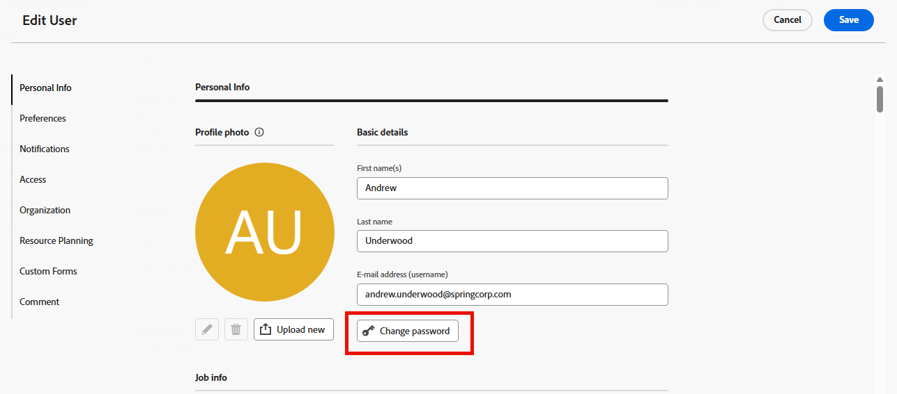

# Passwort zurücksetzen

{{important-not-on-aec}}

Sie können Ihr [!DNL Adobe Workfront] zurücksetzen. Als wichtige Sicherheitsmaßnahme empfehlen wir, dies regelmäßig zu tun.

>[!NOTE]
>
>Ein [!DNL Workfront]-Administrator kann benutzerdefinierte Kennwortbeschränkungen konfigurieren, wie unter [Konfigurieren von Systemsicherheitseinstellungen](../../../administration-and-setup/manage-workfront/security/configure-security-preferences.md) und [Konfigurieren von Kennwortrichtlinien für die Authentifizierung](../../../administration-and-setup/manage-workfront/security/configure-password-policies-authentication.md) beschrieben.
>
><!-- [!DNL Workfront] administrator can also reset your password in an Enhanced Authentication enabled environment. For more information, see [Reset a user's password with Enhanced Authentication](../../../workfront-basics/manage-your-account-and-profile/managing-your-workfront-account/reset-user-password-eauth.md).-->

## Zugriffsanforderungen

+++ Erweitern Sie , um die Zugriffsanforderungen für die -Funktion in diesem Artikel anzuzeigen.

<table style="table-layout:auto"> 
 <col> 
 </col>
 <tbody> 
  <tr> 
   <td>Adobe Workfront-Paket</td> 
   <td> 
Beliebig
 </td> 
  </tr> 
  <tr> 
   <td>Adobe Workfront-Lizenz</td> 
   <td> 
   
Mitwirkender oder höher

   
Anfrage oder höher
 </td> 
  </tr> 
 </tbody> 
</table>

Weitere Informationen finden Sie unter [Zugriffsanforderungen in der Dokumentation zu Workfront](/help/quicksilver/administration-and-setup/add-users/access-levels-and-object-permissions/access-level-requirements-in-documentation.md).

+++

## Passwort in [!DNL Adobe Workfront] zurücksetzen

{{step1-click-profile-pic}}

1. Klicken Sie auf das **[!UICONTROL Mehr]** Symbol  und dann auf **[!UICONTROL Bearbeiten]**.

1. Klicken Sie im **[!UICONTROL Person bearbeiten]** angezeigten Feld unter **[!UICONTROL Persönliche]** Info) auf **[!UICONTROL Kennwort ändern]**.

   

   Wenn Ihr Unternehmen [!DNL Workfront] mit einer SSO-Lösung integriert hat, werden Sie möglicherweise zum Zurücksetzen Ihrer Kennwörter über Ihr SSO-System weitergeleitet, wenn Sie auf **[!UICONTROL Kennwort ändern]** klicken. Dadurch wird Ihr SSO-Passwort zurückgesetzt, was sich auf die Anmeldung bei allen anderen Anwendungen in Ihrer Organisation auswirkt.

1. Geben Sie Ihr altes Kennwort und dann zweimal das gewünschte neue Kennwort ein.

   Ihr Kennwort muss mindestens 8 Zeichen lang sein und zwei der folgenden Zeichentypen enthalten:

   * Großbuchstaben
   * Kleinbuchstaben
   * Zahlen
   * Sonderzeichen (z. B. ! @ # $ %)

   Kennwortregeln sind möglicherweise strenger, je nach den Konfigurationseinstellungen, die von Ihrem [!DNL Workfront] festgelegt wurden.

1. Klicken Sie auf **[!UICONTROL Speichern]**.
