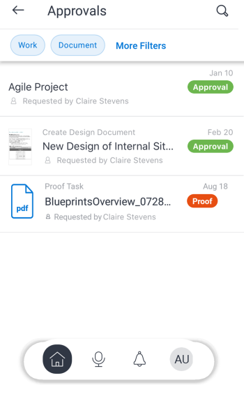
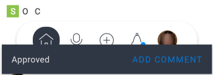

# Validierungen in der [!DNL Adobe Workfront] Mobile App

Über den Bereich [!UICONTROL Genehmigungen“ in der Mobile App von [!DNL Adobe Workfront] können Sie ] oder delegierte Genehmigungen verwalten. Im Bereich [!UICONTROL Genehmigungen] können Sie Folgendes genehmigen:

<table style="table-layout:auto"> 
 <col> 
 <col> 
 <tbody> 
  <tr> 
   <td> 
    <ul> 
     <li>Arbeit (Aufgaben und Probleme)</li> 
     <li>Dokumente</li> 
     <li>Korrekturabzüge </li> 
    </ul> </td> 
   <td> 
    <ul> 
     <li>Arbeitszeittabellen</li> 
     <li>Alle Anforderungen</li> 
    </ul> </td> 
  </tr> 
 </tbody> 
</table>

Korrekturabzüge folgen einem separaten Genehmigungsprozess. Sie können einen Korrekturabzug nicht über eine Arbeitselement- oder Dokumentgenehmigung genehmigen. Informationen zur Überprüfung und Genehmigung von Korrekturabzügen finden Sie unter [Überprüfen und Treffen von Entscheidungen zu Korrekturabzügen in der  [!DNL Adobe Workfront] -Mobile-App](../../../workfront-basics/mobile-apps/using-the-workfront-mobile-app/work-with-proofs-in-mobile-app.md).

## Validierung überprüfen

1. Wählen **[!UICONTROL Alle Genehmigungen anzeigen]** im Bereich [!UICONTROL Genehmigungen] von [!UICONTROL Meine Arbeit] aus.

   Informationen zu &quot;[!UICONTROL  Arbeit] in der Mobile App finden Sie [[!UICONTROL  Abschnitt &quot;] Arbeit“ in der Mobile App](../../../workfront-basics/mobile-apps/using-the-workfront-mobile-app/my-work-section-mobile.md).

1. Wählen Sie eine Genehmigung in der Liste aus.

   

1. Überprüfen Sie die mit der Genehmigung verbundenen Informationen, z. B. Aktualisierungen, Dokumente und Details.

   Dieses Beispiel zeigt eine Aufgabengenehmigung. Andere Genehmigungstypen enthalten möglicherweise andere Informationen.

   

## Entscheidung über eine Genehmigung treffen

1. Öffnen Sie die Genehmigung.
1. Entscheidung auswählen. Die Liste der Entscheidungsoptionen hängt von der Art der Genehmigung ab, die Sie anzeigen.

   | Symbol | Entscheidung |
   |---|---|
   |  | [!UICONTROL Genehmigen] |
   |  | [!UICONTROL Mit Änderungen genehmigen] (nur für Dokumente verfügbar) |
   |  | [!UICONTROL Ablehnen] |

   {style="table-layout:auto"}

1. (Optional) Wählen **[!UICONTROL Kommentar hinzufügen]** in der Bestätigungsmeldung am unteren Bildschirmrand aus, um der Entscheidung Kommentare hinzuzufügen. Diese Anmerkungen werden in den Aktualisierungen zur Genehmigung angezeigt.\
   \
   ODER\
   Wählen Sie den Pfeil oben links im Bereich Genehmigungen aus, um zur Seite [!UICONTROL Genehmigungen“ ] wechseln.
