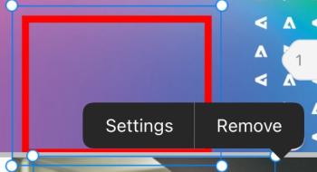

# Kommentar zu Testsendungen in [!DNL iOS]

Sie können vorhandene Kommentare zu einem Testversand überprüfen und auflösen und dem Testversand-Dokument neue Kommentare und Anmerkungen hinzufügen.

Ihr Zugriff auf Kommentare zu Testsendungen entspricht dem in [!DNL Adobe Workfront]. Informationen zu den Testversandfunktionen finden Sie unter [Profile für Testberechtigungen in  [!DNL Workfront Proof]](../../../workfront-proof/wp-acct-admin/account-settings/proof-perm-profiles-in-wp.md).

>[!NOTE]
>
>Wenn der Testversand-Besitzer den Testversand gesperrt hat, können Sie keinen Kommentar dazu abgeben. Weitere Informationen finden Sie unter [Testversand sperren und entsperren](../../../workfront-basics/mobile-apps/using-the-workfront-mobile-app/work-with-proofs-in-mobile-app.md#lock) im Artikel [Überprüfen und treffen Sie Entscheidungen über Testsendungen in der  [!DNL Adobe Workfront] mobilen App](../../../workfront-basics/mobile-apps/using-the-workfront-mobile-app/work-with-proofs-in-mobile-app.md).

## Bestehende Kommentare in einem Testversand überprüfen

Sie können Kommentare zu einem Testversand-Dokument überprüfen. Kommentare enthalten oft zugehörige Zeichnungen, um den Bereich des Dokuments anzuzeigen, auf den sich der Kommentar bezieht. Zeichnungen können Pfeile, Linien, Rechtecke, Hervorhebung und Freihand-Zeichnungen umfassen.

1. Öffnen Sie den Dokumentversand. Weitere Informationen finden Sie unter [Überprüfen und treffen von Entscheidungen zu Testsendungen in der  [!DNL Adobe Workfront] mobilen App](../../../workfront-basics/mobile-apps/using-the-workfront-mobile-app/work-with-proofs-in-mobile-app.md).
1. Wählen Sie auf der Dokumentseite das Symbol &quot; aus, um den Kommentar sowie alle zugehörigen Zeichnungen und Anlagen zu öffnen.

   Wenn der Kommentar mehr als eine Antwort enthält, können Sie **[!UICONTROL Antworten anzeigen]** auswählen, um alle Antworten anzuzeigen, oder das Kommentarblatt nach oben und unten wischen, um weitere Inhalte anzuzeigen.

1. Um eine Anlage zum Kommentar anzuzeigen, wählen Sie die Kommentarminiatur aus. Befolgen Sie die Anweisungen zum Herunterladen der Anlagendatei auf Ihr Gerät.
1. Um auf den Kommentar zu antworten, geben Sie Ihre Antwort in das Textfeld unter dem Kommentar ein und wählen Sie das Symbol **[!UICONTROL Senden]**  aus.

### Verwenden der Kommentarliste

1. Um eine Liste aller Kommentare in der Reihenfolge nach Seitenzahl anzuzeigen, wählen Sie oben rechts das Kommentarsymbol  aus.

   Die Anzahl der ungelesenen Kommentare wird auf dem Kommentarsymbol angezeigt.  Ungelesene Kommentare in der Liste sind mit einem blauen Punkt markiert. Kommentare mit Anlagen haben ein Papierklappsymbol ![[!UICONTROL Attachment] icon](assets/mobile-paper-clip-icon.png).

1. Wählen Sie in der Liste einen einzelnen Kommentar aus, um den Kommentar und die zugehörigen Zeichnungen auf der Dokumentseite anzuzeigen.
1. Wählen Sie das X aus, um die Kommentarliste zu schließen und zum Testversand zurückzukehren.

### Ergreifen Sie Maßnahmen zu Kommentaren

In der Liste [!UICONTROL Kommentar] können Sie verschiedene Aktionen ausführen, z. B. einen Kommentar auflösen oder ihn als gelesen markieren.

1. Kommentare auswählen:

   * Halten Sie einen einzelnen Kommentar gedrückt, um ihn auszuwählen.
   * Wählen Sie oben rechts **[!UICONTROL Auswählen]** aus, um neben jedem Kommentar ein Kontrollkästchen anzuzeigen. Tippen Sie dann auf die Kommentarschaltflächen oder wählen Sie oben links **[!UICONTROL Alle auswählen]** aus.

1. Um den ausgewählten Kommentar aufzulösen, wählen Sie in der unteren Symbolleiste das Symbol ![[!UICONTROL Kommentar auflösen]](assets/mobile-resolvecomment-icon-30x30.png) aus.

   Sie können jeweils nur einen Kommentar auflösen. Der Kommentar ist mit einem grünen Symbol markiert, um anzuzeigen, dass er aufgelöst wurde.

   Der ursprüngliche Kommentar bleibt zum Dokument erhalten. Eine Kommentarauflösung erscheint als Antwort auf den ursprünglichen Kommentar: &quot;[!UICONTROL Dieser Thread wurde durch [name]} aufgelöst.]&quot;

   Sie können die Auflösung rückgängig machen, indem Sie den aufgelösten Kommentar auswählen und das Symbol **[!UICONTROL Rückgängig]** auswählen.

1. Um die ausgewählten Kommentare als gelesen zu markieren, wählen Sie in der unteren Symbolleiste das Symbol **[!UICONTROL Als gelesen markieren]**  aus.

   Diese Option ist nur verfügbar, wenn ungelesene Kommentare ausgewählt sind.

1. Um die ausgewählten Kommentare zu löschen, wählen Sie in der unteren Symbolleiste das Symbol **[!UICONTROL Löschen]**  aus. Wählen Sie dann **[!UICONTROL Löschen]** in der Bestätigungsnachricht aus, um den Kommentar dauerhaft zu löschen.

## Kommentar zu einem Testversand

Sie können Ihre Testversand-Kommentare einem bestimmten Bereich im Dokument zuordnen. Verwenden Sie die Zeichenwerkzeuge, um einen Bereich auszuwählen, zu dem Kommentare abgegeben werden sollen.

1. Öffnen Sie den Dokumentversand. Weitere Informationen finden Sie unter [Überprüfen und treffen von Entscheidungen zu Testsendungen in der  [!DNL Adobe Workfront] mobilen App](../../../workfront-basics/mobile-apps/using-the-workfront-mobile-app/work-with-proofs-in-mobile-app.md).
1. Wählen Sie in der Symbolleiste am unteren Rand des Testversands ein Zeichenwerkzeug aus.

   

   Wenn das benötigte Tool nicht angezeigt wird, scrollen Sie in der Symbolleiste nach rechts.

1. Wählen Sie &quot;**[!UICONTROL Einstellungen]**&quot;neben dem Toolnamen aus, um die Farbe, Deckkraft und Dicke zu definieren. Wählen Sie das Sternsymbol aus, um diese Auswahlmöglichkeiten zu den Standardeinstellungen für das Tool zu machen.

   

1. Draw die Form auf dem Testversand-Dokument. Wählen Sie das Symbol **[!UICONTROL Rückgängig]**  aus, um die Zeichnung rückgängig zu machen.
1. (Bedingt) Wählen Sie die Form aus und wählen Sie **[!UICONTROL Einstellungen]** , um die Formeinstellungen zu bearbeiten, oder **[!UICONTROL Entfernen]** , um die Form zu löschen.

   

1. Wählen Sie **[!UICONTROL Kommentar hinzufügen]** aus.
1. Geben Sie den Kommentar in das Textfeld ein.
1. Um einen Kontakt mit dem Kommentar zu taggen, geben Sie das @-Symbol ein oder wählen Sie ![[!UICONTROL Tag contact]](assets/mobile-tag-user-icon.png) aus, um das @-Symbol hinzuzufügen, geben Sie den Namen des Kontakts ein, den Sie einbeziehen möchten, und klicken Sie dann auf den Namen, wenn er in der Dropdown-Liste angezeigt wird.

   Der Kontakt erhält eine E-Mail-Benachrichtigung, wenn der Kommentar zum Testversand hinzugefügt wird.

1. Um dem Kommentar eine Anlage hinzuzufügen, wählen Sie das Symbol ![[!UICONTROL Anlage]](assets/mobile-paper-clip-icon.png) aus. Wählen Sie **[!UICONTROL Aus Bibliothek wählen]**, **[!UICONTROL Foto aufnehmen]** oder **[!UICONTROL Dokument auswählen]** aus und befolgen Sie die Anweisungen zum Anhängen der Datei oder des Fotos an den Kommentar.

   Klicken Sie auf das X auf dem Miniaturbild, um den Anhang zu entfernen.

1. Wählen Sie das Symbol **[!UICONTROL Senden]**  aus, um den Kommentar und die Zeichnung zum Testversand hinzuzufügen.
