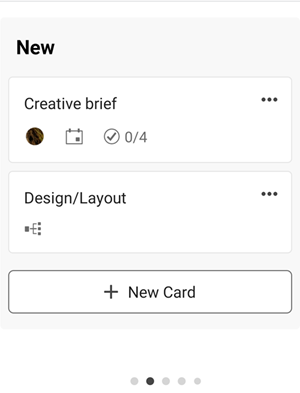

# [!DNL Adobe Workfront] [!UICONTROL Pinnwände] für Mobilgeräte

[!DNL Adobe Workfront] [!UICONTROL Pinnwände] sind flexible Tools, die die Teamzusammenarbeit ermöglichen, indem sie Zugriff auf eine freigegebene Pinnwand mit Spalten und Karten bieten. Weitere Informationen zu Pinnwänden finden Sie unter [Überblick über Pinnwände](/help/quicksilver/agile/boards-overview.md).

In der mobilen App [!DNL Workfront] können Sie alle Pinnwände sehen, die Sie in der Desktop-Version von [!DNL Workfront] erstellt haben oder zu denen Sie hinzugefügt wurden. Sie können keine neue Pinnwand in der App erstellen.

Alle Änderungen, die Sie an Pinnwänden und Karten im Programm vornehmen, werden auch in der Desktop-Version der Pinnwand übernommen.

Um Feedback zu mobilen Pinnwänden zu geben, wählen Sie oben auf einer Pinnwand das Symbol **[!UICONTROL Senden]**  aus und befolgen Sie die Anweisungen.

>[!NOTE]
>
>Derzeit unterstützt die mobile App alle Arten von Pinnwänden **außer** für Iterationsprozesse.

## Liste der Pinnwände anzeigen und filtern

1. Wählen Sie [!UICONTROL **Pinnwände**] auf der Startseite aus, um eine Liste aller Pinnwände anzuzeigen, die Sie in der Desktop-Version von [!DNL Workfront] erstellt haben oder denen Sie hinzugefügt wurden.

   

1. Um die Liste der Pinnwände zu sortieren oder zu filtern, wählen Sie [!UICONTROL **Weitere Filter**] aus.
1. Wählen Sie aus den folgenden Optionen aus:

   * Wählen Sie im Bereich Filter die Option [!UICONTROL **Archiviert**] aus, um archivierte Pinnwände in der Liste anzuzeigen. Standardmäßig werden nur aktive Pinnwände angezeigt.
   * Wählen Sie im Bereich Sortieren die Option [!UICONTROL **Datum geändert**] oder [!UICONTROL **Name**].
   * Wählen Sie im Bereich Reihenfolge die Option [!UICONTROL **Aufsteigend**] oder [!UICONTROL **Absteigend**] aus, um die Sortierreihenfolge zu definieren.

1. Wählen Sie [!UICONTROL **Anwenden**] oder  aus, um die Filter anzuwenden und zur Liste der Pinnwände zurückzukehren.

   Sie können jederzeit auf diese Optionen zugreifen, um sie zu ändern oder zu den Standardeinstellungen zurückzukehren.

1. Um eine Pinnwand zu öffnen, wählen Sie sie aus der Liste aus.

>[!NOTE]
>
>Derzeit können Sie eine Pinnwand nur aus der Desktop-Version von [!DNL Workfront] [!UICONTROL Pinnwände] und nicht aus der App archivieren oder löschen.

## Inhalt der Pinnwand anzeigen

Wenn Sie eine Pinnwand öffnen, werden deren Spalten und Karten angezeigt. Führen Sie einen horizontalen Bildlauf durch, um alle Spalten anzuzeigen, und scrollen Sie vertikal, um alle Karten in einer Spalte anzuzeigen.

Wählen Sie eine Karte aus und halten Sie sie gedrückt, um sie in eine andere Spalte zu verschieben.

Wenn die Pinnwand eine Aufnahmespalte enthält, wird sie als die ganz links liegende Spalte angezeigt. Die Karten in der Annahmespalte können erst bearbeitet werden, wenn Sie sie in andere Pinnwandspalten verschieben. Sie können eine Karte auswählen, um die Aufgabe oder das Problem zu öffnen. Die Aufnahmespaltenfilter werden in der Desktop-Version der Pinnwand gesteuert. Weitere Informationen finden Sie unter [Hinzufügen einer Aufnahmespalte zu einer Pinnwand](/help/quicksilver/agile/use-boards-agile-planning-tools/add-intake-column-to-board.md).

## Arbeiten mit verbundenen Karten

Eine verbundene Karte ist mit einer vorhandenen Aufgabe oder einem Problem in [!DNL Workfront] verbunden. In der mobilen App wird eine verbundene Karte mit dem Symbol  gekennzeichnet. In der Abbildung unten ist die zweite Karte eine verbundene Karte.

Wenn eine der folgenden Details für die Karte an einem Ort aktualisiert wird, wird sie automatisch an einem anderen Speicherort aktualisiert:

* [!UICONTROL Name]
* [!UICONTROL Beschreibung]
* [!UICONTROL Zuweisung]
* [!UICONTROL Status]

Wenn Sie beispielsweise den Namen einer verbundenen Karte auf einer Pinnwand in der mobilen App aktualisieren, wird dieser auch über die Aufgabe oder das Problem aktualisiert.

1. Wählen Sie eine Karte aus, um deren Namen, Beschreibung, Spalte, Bevollmächtigte, Verbindung, Status, Fälligkeitsdatum, Schätzung, Tags und Checklisten-Elemente anzuzeigen. Wenn Sie diese Details bearbeiten, werden sie automatisch gespeichert. Wählen Sie das X aus, um die Karte zu schließen und zur Pinnwand zurückzukehren.

   >[!NOTE]
   >
   >Sie können zwar ein anderes Tag auf der Karte auswählen, aber keine neuen Tags in der App erstellen.

1. (Optional) Um eine Karte zu löschen, wählen Sie das Menü [!UICONTROL **Mehr**] im Menü  auf der Karte aus und wählen Sie [!UICONTROL **Löschen**]. Wählen Sie dann [!UICONTROL **Löschen**] in der Bestätigungsnachricht aus.

## Arbeiten mit Ad-hoc-Karten

Eine Ad-hoc-Karte ist nicht mit einer Workfront-Aufgabe oder einem Problem verbunden. In der Abbildung unten ist die erste Karte eine Ad-hoc-Karte.

1. Wählen Sie eine Karte aus, um deren Namen, Beschreibung, Spalte, Bevollmächtigte, Status, Fälligkeitsdatum, Schätzung, Tags und Checklisten-Elemente anzuzeigen. Wenn Sie diese Details bearbeiten, werden sie automatisch gespeichert. Wählen Sie das X aus, um die Karte zu schließen und zur Pinnwand zurückzukehren.

   >[!NOTE]
   >
   >Sie können zwar ein anderes Tag auf der Karte auswählen, aber keine neuen Tags in der App erstellen.

1. (Optional) Um eine neue Ad-hoc-Karte hinzuzufügen, wählen Sie [!UICONTROL **Neue Karte**] in der Spalte, der Sie die Karte hinzufügen möchten, und geben Sie den Kartennamen ein. Um Details hinzuzufügen, wählen Sie die neu hinzugefügte Karte aus.

1. (Optional) Um eine Karte zu kopieren, wählen Sie das Menü [!UICONTROL **Mehr**] im Menü  auf der Karte aus und wählen Sie [!UICONTROL **Kopieren**].

1. (Optional) Um eine Karte zu löschen, wählen Sie das Menü [!UICONTROL **Mehr**] im Menü  auf der Karte aus und wählen Sie [!UICONTROL **Löschen**]. Wählen Sie dann [!UICONTROL **Löschen**] in der Bestätigungsnachricht aus.

## Verwalten von Checklisten-Elementen auf Karten

Checklisten-Elemente sind sowohl auf Ad Hoc- als auch auf verbundenen Karten verfügbar.

1. Um ein Element der Checkliste hinzuzufügen, öffnen Sie die Karte und wählen Sie [!UICONTROL **Neues Element der Checkliste**] aus. Geben Sie den Elementnamen der Checkliste ein. Der Zähler auf der Karte wird aktualisiert.
1. (Optional) Um ein Element der Checkliste zu kopieren, öffnen Sie die Karte, wählen Sie das Menü [!UICONTROL **Mehr**] Menü  auf dem Element aus und wählen Sie [!UICONTROL **Kopieren**]. Am Ende der Liste wird eine Kopie des Elements hinzugefügt.
1. (Optional) Um ein Element der Checkliste zu löschen, öffnen Sie die Karte, wählen Sie das Menü [!UICONTROL **Mehr**] Menü  auf dem Element aus und wählen Sie [!UICONTROL **Löschen**].
1. Um ein Element der Checkliste abzuschließen, öffnen Sie die Karte und aktivieren Sie das Kontrollkästchen neben dem Elementnamen.
Das Element ist als abgeschlossen markiert, der Zähler auf der Karte wird aktualisiert und zeigt an, wie viele Elemente der Checkliste abgeschlossen sind.

## Filtern und Suchen in einer Pinnwand

Sie können eine Pinnwand filtern, um bestimmte Personen zugewiesene Karten anzuzeigen, oder Sie können nach einer bestimmten Karte auf der Pinnwand suchen.

Wenn Filter angewendet werden, wird auf der Pinnwand  ein Indikator angezeigt. Wählen Sie das Filtersymbol und danach [!UICONTROL **Alle löschen**] aus, um alle Filter aus der Pinnwand zu entfernen.

### Pinnwand nach Bevollmächtigten filtern

1. Wählen Sie das Filter- und Suchsymbol  aus.
1. Wählen Sie [!UICONTROL **Mitglieder**] aus und wählen Sie die Person(en) aus, deren Karten Sie sehen möchten. Sie können auch nicht zugewiesene Karten anzeigen.
1. Wählen Sie [!UICONTROL **Fertig**] oder das Symbol  aus.

### Pinnwand nach Tags filtern ([!DNL iOS] nur)

1. Wählen Sie das Filter- und Suchsymbol  aus.
1. Wählen Sie [!UICONTROL **Tags**] und wählen Sie die Tags aus, die angezeigt werden sollen.
1. Wählen Sie [!UICONTROL **Fertig**] aus.

### Durchsuchen einer Pinnwand

1. Wählen Sie das Filter- und Suchsymbol  aus.
1. Geben Sie einen Suchbegriff in das Feld ein und wählen Sie [!UICONTROL **Fertig**] oder  aus.

   Alle Karten, die den Suchbegriff im Titel enthalten, werden angezeigt.
Wählen Sie das X aus, um die Suche zu löschen.

   
