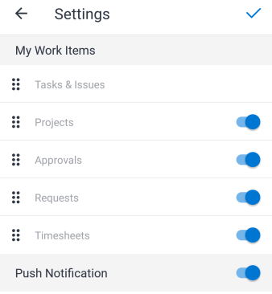

# Abschnitt [!UICONTROL Meine Arbeit] in der Mobile App

Im Abschnitt [!UICONTROL Meine Arbeit] des Bereichs [!UICONTROL Startseite] werden Ihre Aufgaben, Probleme, Projekte, Genehmigungen, Anfragen und Arbeitszeittabellen angezeigt.

>[!NOTE]
>
>[!UICONTROL Meine Arbeit] in der Mobile App ist getrennt von [!UICONTROL Meine Arbeit] in der Desktop-Version von [!UICONTROL Adobe Workfront].

## Anpassen des Abschnitts [!UICONTROL Meine Arbeit]

Sie können auswählen, welche Menüelemente in &quot;[!UICONTROL  Arbeit“ angezeigt ] sollen, und die Elementreihenfolge ändern.

1. Tippen Sie im schwebenden Menü auf Ihr Foto oder Ihre Initialen, um auf Ihr Profil zuzugreifen.
1. Scrollen Sie zum Abschnitt **[!UICONTROL Konfiguration]** und tippen Sie auf **[!UICONTROL Einstellungen]**.
1. Wählen Sie auf **[!UICONTROL Seite]** die Menüelemente aus, und ziehen Sie sie in die richtige Reihenfolge für den Bereich [!UICONTROL Startseite].
1. Tippen Sie auf das blaue Umschalter-Symbol, um alle Menüelemente auszublenden, die Sie nicht anzeigen möchten. Tippen Sie auf das graue Umschalter-Symbol, um das Element erneut anzuzeigen.

   >[!NOTE]
   >
   >Das [!UICONTROL  „Aufgaben und ]&quot; wird immer angezeigt und kann nicht ausgeblendet werden.

   
