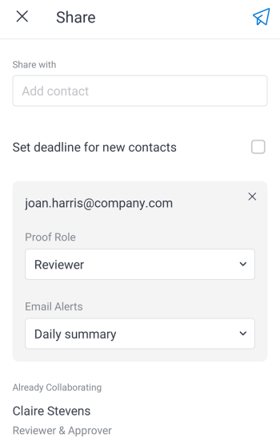

# Freigeben und Herunterladen von Testsendungen im [!DNL Adobe Workfront] mobile App

Sie können ein Testversand-Dokument direkt über die Mobile App für interne und externe Empfänger freigeben. Sie können auch ein Dokument zum Testversand auf Ihr Mobilgerät herunterladen.

>[!NOTE]
>
>Alle Empfänger müssen Zugriff auf [!DNL Workfront] , um Testsendungen zu überprüfen. Informationen zu Lizenzen und Zugriffsebenen finden Sie unter [Profile für Testberechtigungen in [!DNL Workfront Proof]](../../../workfront-proof/wp-acct-admin/account-settings/proof-perm-profiles-in-wp.md).

## Testversand freigeben

Diese Option sendet eine E-Mail mit einem eindeutigen Testversand-Link an einen Kontakt von [!DNL Workfront Proof]. Sie können auch einen neuen Kontakt hinzufügen, der Ihren Testkontakten gespeichert wird.

1. Öffnen Sie den Dokumentversand und wählen Sie die **[!UICONTROL Mehr]** Menü  rechts oben im Dokument. Wählen Sie anschließend **[!UICONTROL Mehr]**.
1. Auswählen **[!UICONTROL Freigeben]**.
1. Beginnen Sie mit der Eingabe des Kontaktnamens im **[!UICONTROL Freigeben mit]** und wählen Sie den Kontakt aus der Liste aus.

   Oder

   Wenn die Person nicht aufgeführt ist, geben Sie ihre E-Mail-Adresse in das Feld **[!UICONTROL Freigeben mit]** und wählen Sie **[!UICONTROL Empfänger hinzufügen]** , um sie hinzuzufügen.

1. Wählen Sie die **[!UICONTROL Rolle &quot;Testversand&quot;]** für den Empfänger.\
   Informationen zu Testversandrollen finden Sie unter [Übersicht über Testrollen](../../../review-and-approve-work/proofing/proofing-overview/proof-roles.md).
1. Wählen Sie die **[!UICONTROL E-Mail-Warnungen]** der Empfänger erhält.\
   Informationen zu E-Mail-Warnungen für Testsendungen finden Sie unter [E-Mail-Warnhinweiseinstellungen für einen Testversand in ändern [!DNL Workfront Proof]](../../../workfront-proof/wp-emailsntfctns/email-alerts/change-email-alert-settings-wp.md) und [E-Mail-Benachrichtigungseinstellungen konfigurieren in [!DNL Workfront Proof]](../../../workfront-proof/wp-emailsntfctns/email-alerts/config-email-notification-settings-wp.md).

   

1. Wiederholen Sie die Schritte 3 bis 5, um einen weiteren Empfänger hinzuzufügen.
1. Um ein Fälligkeitsdatum für alle Empfänger auszuwählen, die den Testversand überprüfen möchten, wählen Sie **[!UICONTROL Termine für neue Kontakte festlegen]**. Wählen Sie dann ein Datum im Kalender aus.
1. Wählen Sie die **[!UICONTROL Senden]** icon  um die E-Mail an die Empfänger zu senden.

## Link zum Testversand senden

Mit dieser Option wird ein Link in die Zwischenablage kopiert, den Sie in eine E-Mail einfügen können. Danach können Sie die E-Mail mit dem Testversand-Link an einen internen oder externen Empfänger senden.

1. Öffnen Sie den Dokumentversand und wählen Sie die **[!UICONTROL Mehr]** Menü  rechts oben im Dokument. Wählen Sie anschließend **[!UICONTROL Mehr]**.
1. Auswählen **[!UICONTROL Kopie senden]**.
1. Auswählen **[!UICONTROL In Zwischenablage kopieren]**.
1. Öffnen Sie Ihr E-Mail-Programm und fügen Sie den Testversand-Link in den Text der E-Mail ein.
1. Senden Sie die E-Mail an die Empfänger, für die Sie den Testversand freigeben möchten.

## Testversand mit einer öffentlichen URL freigeben

Diese Option sendet eine E-Mail mit einem öffentlichen Testversand-Link an einen Kontakt von [!DNL Workfront Proof]. Bei Bedarf können Sie einen neuen Kontakt hinzufügen. Sie können eine öffentliche URL, einen herunterladbaren Link oder beides senden.

1. Öffnen Sie den Dokumentversand und wählen Sie die **[!UICONTROL Mehr]** Menü  rechts oben im Dokument. Wählen Sie anschließend **[!UICONTROL Mehr]**.
1. Auswählen **[!UICONTROL Freigeben mit öffentlicher URL]**.
1. Beginnen Sie mit der Eingabe des Kontaktnamens im **[!UICONTROL Freigeben mit]** und wählen Sie den Kontakt aus der Liste aus.

   Oder

   Wenn die Person nicht aufgeführt ist, geben Sie ihre E-Mail-Adresse in das Feld **[!UICONTROL Freigeben mit]** und wählen Sie **[!UICONTROL Empfänger hinzufügen]** , um sie hinzuzufügen.

   Wiederholen Sie diesen Schritt, um einen weiteren Empfänger hinzuzufügen.

1. Auswählen **[!UICONTROL Öffentlichen Link senden]** um Empfängern zu ermöglichen, das Testversand-Dokument in [!DNL Workfront Proof].
1. Auswählen **[!UICONTROL Herunterladbaren Link senden]** , damit Empfänger das Testversand-Dokument herunterladen können.

   ![[!UICONTROL Bildschirm &quot;Öffentliche URL freigeben&quot;]](assets/mobile-sharepublicurl-proof-350x296.png)

1. Wählen Sie die **[!UICONTROL Senden]** icon  um die E-Mail an die Empfänger zu senden.

## Testversand herunterladen

Sie können eine Kopie des Testversands auf Ihr Mobilgerät herunterladen.

1. Öffnen Sie den Dokumentversand und wählen Sie die **[!UICONTROL Mehr]** Menü  rechts oben im Dokument. Wählen Sie anschließend **[!UICONTROL Mehr]**.
1. Auswählen **[!UICONTROL Download]**.
1. Befolgen Sie die Anweisungen auf Ihrem Gerät, um den Download abzuschließen und die Dokumentdatei zu öffnen.
