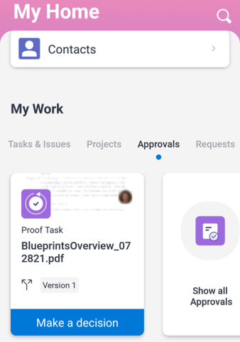

# Testsendungen in der Mobile App von [!DNL Adobe Workfront] überprüfen und Entscheidungen treffen

Wenn Ihnen ein Korrekturabzug zur Genehmigung zugewiesen wird, wird er in der Liste der Genehmigungen in der Mobile App angezeigt. Sie können den Korrekturabzug direkt in der App überprüfen und eine Entscheidung darüber treffen. Informationen zur Überprüfung und Genehmigung von Testsendungen in [!DNL Adobe Workfront] finden Sie unter [Testsendungen in überprüfen [!DNL Adobe Workfront]](../../../review-and-approve-work/proofing/reviewing-proofs-within-workfront/review-proofs-in-wf.md).

Sie können dem Korrekturabzug Kommentare hinzufügen und einen Überarbeitungsprozess durchlaufen, bevor Sie eine endgültige Entscheidung treffen. Weitere Informationen zu Kommentaren finden Sie [Kommentar zu Korrekturabzügen in [!DNL iOS]](../../../workfront-basics/mobile-apps/using-the-workfront-mobile-app/comment-on-proofs-ios.md) oder [Kommentar zu Korrekturabzügen in [!DNL Android]](../../../workfront-basics/mobile-apps/using-the-workfront-mobile-app/comment-on-proofs-android.md).

Ihr Zugriff auf die Überprüfung und Genehmigung von Korrekturabzügen entspricht dem in [!DNL Adobe Workfront]. Informationen zu Proofing-Funktionen finden Sie unter [Berechtigungen für Korrekturabzüge in Profilen [!DNL Workfront Proof]](../../../workfront-proof/wp-acct-admin/account-settings/proof-perm-profiles-in-wp.md).

## Öffnen und Überprüfen eines Korrekturabzugs

1. Öffnen Sie die Genehmigungsaufgabe für Korrekturabzüge:

   * Wählen Sie die Genehmigungsaufgabe für Korrekturabzüge im Bereich [!UICONTROL Genehmigungen] von [!UICONTROL Meine Arbeit] aus.

     \
      Oder

   * Wählen **[!UICONTROL Alle Genehmigungen anzeigen]** im Bereich [!UICONTROL Genehmigungen] von [!UICONTROL Meine Arbeit] aus. Wählen Sie dann die Aufgabe Testversand-Genehmigung in der Liste aller Genehmigungen aus.

     Informationen zu &quot;[!UICONTROL &#x200B; Arbeit] in der Mobile App finden Sie [[!UICONTROL &#x200B; Abschnitt &quot;] Arbeit“ in der Mobile App](../../../workfront-basics/mobile-apps/using-the-workfront-mobile-app/my-work-section-mobile.md).

1. Wählen Sie auf der Seite Details **[!UICONTROL Zum Korrekturabzug wechseln]** aus.

   

   >[!NOTE]
   >
   >Testsendungen können nur in der iOS Mobile App geöffnet werden. Diese Funktion ist für Android noch nicht verfügbar.

1. Überprüfen Sie das Dokument Testversand .
1. (Optional) Wählen Sie ![[!UICONTROL Einzelseitensymbol]](assets/mobile-proofpagingicon1-25x36.png) oben rechts im Dokument aus, um von der Einzelseitenansicht zur kontinuierlichen Ansicht zu wechseln. Wählen Sie ![[!UICONTROL Symbol „Fortlaufende Seite]](assets/mobile-proofpagingicon2-25x25.png) aus, um zur Einzelseitenansicht zurückzukehren.

   In der Einzelseitenansicht scrollen Sie nach rechts und links, um durch die Dokumentseiten zu navigieren. In der kontinuierlichen Ansicht scrollen Sie nach oben und unten, um durch die Seiten zu navigieren.

1. (Optional) Wechseln Sie mithilfe der Bildlaufanzeige auf der rechten Seite zu einer bestimmten Seite:

   1. Tippen Sie auf die Bildlaufanzeige.
   1. Geben Sie die Seitennummer in das Feld [!UICONTROL Zur Seite wechseln] ein und wählen Sie **[!UICONTROL OK]**.
   1. 

1. Wählen Sie den Pfeil oben links im Dokument aus, um zur Seite [!UICONTROL Details] zurückzukehren.
1. (Optional) Klicken Sie auf der [!UICONTROL Details]-Seite auf **[!UICONTROL Updates]**, um alle Aktualisierungen für den Korrekturabzug anzuzeigen, z. B. wann er erstellt und zur Genehmigung gesendet wurde.

## Korrekturabzug sperren und entsperren

Jeder Benutzer, der als Korrekturabzugsbesitzer, -autor oder -moderator zugewiesen ist, kann einen Korrekturabzug sperren, damit andere keine Kommentare dazu abgeben oder Entscheidungen dazu treffen können.

### Korrekturabzug sperren

1. Öffnen Sie den Dokument-Korrekturabzug und wählen Sie **[!UICONTROL Mehr]** Menü  oben rechts im Dokument aus. Wählen Sie dann **[!UICONTROL Mehr]** aus.
1. Wählen Sie **[!UICONTROL Dokument sperren]** aus.\
   Oben [!UICONTROL &#x200B; Dokument wird die &#x200B;] „Gesperrt“ angezeigt.

### Korrekturabzug entsperren

1. Öffnen Sie den Dokument-Korrekturabzug und wählen Sie **[!UICONTROL Mehr]** Menü  oben rechts im Dokument aus. Wählen Sie dann **[!UICONTROL Mehr]** aus.
1. Wählen Sie **[!UICONTROL Dokument entsperren]** aus.
1. Wählen **[!UICONTROL in]** Bestätigungsnachricht „Entsperren“ aus.

## Entscheidungen über einen Korrekturabzug treffen

Nachdem Sie das Korrekturabzugsdokument geprüft haben, können Sie im Korrekturabzug selbst eine Entscheidung treffen. Wenn der/die Verantwortliche des Korrekturabzugs den Korrekturabzug gesperrt hat, können Sie keine Entscheidung treffen.

### Im Testversand eine Entscheidung treffen

1. Öffnen Sie den Korrekturabzug für das Dokument.
1. Wählen Sie das Entscheidungssymbol ![[!UICONTROL Entscheidung] oben &#x200B;](assets/mobile-proofcheckmarkdecisionicon-30x30.png) im Dokument aus.
1. Wählen Sie im Feld [!UICONTROL Entscheidung treffen] eine Entscheidung aus.

   Im Folgenden finden Sie einige allgemeine Entscheidungsoptionen. Der [!DNL Adobe Workfront] oder der [!UICONTROL Workfront Proof]Administrator kann die Liste der Entscheidungsoptionen konfigurieren. Weitere Informationen zum Konfigurieren von Entscheidungen durch Admins finden Sie unter [Konfigurieren von Genehmigungsentscheidungsoptionen in Workfront Proof](../../../workfront-proof/wp-acct-admin/account-settings/configure-approval-decision-in-wp.md).

   <table style="table-layout:auto"> 
    <col> 
    <col> 
    <tbody> 
     <tr> 
      <td role="rowheader"><strong>[!UICONTROL genehmigt]</strong></td> 
      <td>Der Korrekturabzug ist bereit, mit dem nächsten Schritt des Workflows fortzufahren.</td> 
     </tr> 
     <tr> 
      <td role="rowheader"><strong>[!UICONTROL mit Änderungen genehmigt]</strong></td> 
      <td> 
Der Korrekturabzug erfordert einige Änderungen, aber Sie müssen die Revision nicht sehen, bevor er zur nächsten Phase des Workflows übergeht.
 </td> 
     </tr> 
     <tr> 
      <td role="rowheader"><strong>[!UICONTROL abgelehnt]</strong></td> 
      <td>Der Korrekturabzug wird abgelehnt und im Workflow nicht fortgesetzt.</td> 
     </tr> 
    </tbody> 
   </table>

1. (Bedingt) Wenn der [!DNL Adobe Workfront] Administrator oder [!DNL Workfront Proof] Administrator eine Liste mit [!UICONTROL Gründen] hinzugefügt hat, wählen Sie einen passenden Grund für Ihre Entscheidung aus.

   Einige Gründe erfordern möglicherweise auch Kommentare, um zu erklären, warum Sie den Grund ausgewählt haben.

   Weitere Informationen dazu, wie Administratoren Gründe konfigurieren können, finden Sie unter [Konfigurieren von Genehmigungsentscheidungsoptionen in [!DNL Workfront Proof]](../../../workfront-proof/wp-acct-admin/account-settings/configure-approval-decision-in-wp.md).

1. Wählen Sie **[!UICONTROL Senden]** aus.

### Entscheidung im Korrekturabzug ändern

1. Öffnen Sie den Korrekturabzug für das Dokument.
1. Wählen Sie das Entscheidungssymbol ![[!UICONTROL Entscheidung] oben &#x200B;](assets/mobile-proofcheckmarkdecisionicon-30x30.png) im Dokument aus.

   Das [!UICONTROL Entscheidung treffen] zeigt Ihre aktuelle Entscheidung an.

1. Wählen Sie eine andere Entscheidung aus oder wählen Sie **[!UICONTROL Auswahl löschen]**, um die Entscheidung zu entfernen.

   Bei Entscheidungen mit Gründen können Sie einen anderen Grund auswählen oder den Grund entfernen.

1. Wählen Sie **[!UICONTROL Senden]** aus.
