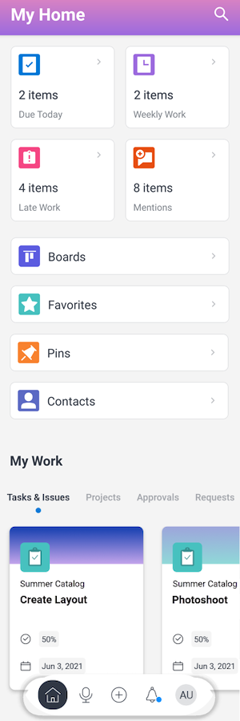

# [!DNL Adobe Workfront] für [!DNL Android]

Die [!DNL Adobe Workfront] Mit der -App können Sie auf Ihre Arbeit in allen [!DNL Android] Gerät. Sie können die [!DNL Workfront] Mobile App auf Smartphones und Tablets [!DNL Android] 5.0 oder höher.

Informationen zur Anmeldung bei der Mobile App finden Sie im Abschnitt . [Melden Sie sich bei der [!DNL Workfront] mobile App](../../../workfront-basics/manage-your-account-and-profile/managing-your-workfront-account/log-in-to-workfront.md#log) im Artikel [Anmelden bei [!DNL Adobe Workfront]](../../../workfront-basics/manage-your-account-and-profile/managing-your-workfront-account/log-in-to-workfront.md).

## [!UICONTROL Startseite]

Die [!UICONTROL Startseite] können Sie direkt an Aufgaben, Problemen und Genehmigungen arbeiten, die Ihnen zugewiesen sind. Aus dem [!UICONTROL Startseite] -Bereich des Programms können Sie:

<table style="table-layout:auto"> 
 <col> 
 <col> 
 <tbody> 
  <tr> 
   <td> 
    <ul> 
     <li>Arbeiten mit Aufgaben und Problemen</li> 
     <li>Kennzeichnen von Aufgaben und Problemen als [!UICONTROL Fertig]</li> 
     <li>Aufgaben und Probleme neu zuweisen</li> 
     <li>[!UICONTROL Zusagedatum ändern]</li> 
    </ul> </td> 
   <td> 
    <ul> 
     <li>Aktualisierung des Status von Aufgaben und Problemen</li> 
     <li>Im Bereich "Updates"posten</li> 
     <li>Dokumente anzeigen</li> 
     <li>Fotos anhängen</li> 
     <li> 
Erstellen einer Anforderung oder einer Schnellaufgabe
 
Hinweis: Schnellaufgaben, die in der Startseite erstellt werden, sind persönliche Aufgaben, es sei denn, Sie wählen die Zuweisung eines Projekts.
 </li> 
    </ul> </td> 
  </tr> 
 </tbody> 
</table>

Weitere Informationen finden Sie unter [[!UICONTROL Startseite] Bereich-Widgets](../../../workfront-basics/mobile-apps/using-the-workfront-mobile-app/home-area-widgets-mobile.md) und [[!UICONTROL Meine Arbeit] Abschnitt in der App](../../../workfront-basics/mobile-apps/using-the-workfront-mobile-app/my-work-section-mobile.md).

## [!UICONTROL Pinnwände]

Die [!UICONTROL Pinnwände] -Bereich ermöglicht Ihnen den Zugriff auf Ihre [!DNL Workfront] Pinnwände.

Weitere Informationen finden Sie unter [[!DNL Adobe Workfront] [!UICONTROL Boards] für Mobilgeräte](/help/quicksilver/workfront-basics/mobile-apps/using-the-workfront-mobile-app/mobile-boards.md).

## [!UICONTROL Projekte]

Die [!UICONTROL Projekte] -Bereich ermöglicht Ihnen die Interaktion mit und die Verwaltung von Projekten, die Ihnen gehören, sowie von Projekten, in denen Sie sich befinden. Aus dem [!UICONTROL Projekte] -Bereich des Programms können Sie:

<table style="table-layout:auto"> 
 <col> 
 <col> 
 <tbody> 
  <tr> 
   <td> 
    <ul> 
     <li>Aktualisieren des Projektstatus</li> 
     <li>Wichtige Projektdetails anzeigen</li> 
     <li>Posten im Bereich [!UICONTROL Updates]</li> 
     <li>Konvertieren von Aufgaben, Problemen und Anforderungen in Projekte</li> 
    </ul> </td> 
   <td> 
    <ul> 
     <li>Interaktion mit Projektaufgaben und -problemen</li> 
     <li>Dokumente anzeigen</li> 
     <li>Fotos anhängen</li> 
     <li> 
Kurzaufgabe erstellen
 
Hinweis: In einem Projekt erstellte Aufgaben werden automatisch dem Projekt zugewiesen, in dem Sie sich befinden. 
 </li> 
    </ul> </td> 
  </tr> 
 </tbody> 
</table>

## [!UICONTROL Genehmigungen]

Die [!UICONTROL Genehmigungen] können Sie die Ihnen zugewiesenen oder zugewiesenen Genehmigungen anzeigen und genehmigen. Aus dem [!UICONTROL Genehmigungen] -Bereich können Sie genehmigen:

<table style="table-layout:auto">
 <col>
 <col>
 <tbody>
  <tr>
   <td>
    <ul>
     <li>Arbeit (Aufgaben und Probleme)</li>
     <li>Dokumente</li>
     <li>Korrekturabzüge </li>
    </ul> </td>
   <td>
    <ul>
     <li>Arbeitszeittabellen</li>
     <li>Alle Anforderungen</li>
    </ul> </td>
  </tr>
 </tbody>
</table>

Weitere Informationen zu Genehmigungen finden Sie unter [Genehmigungen in der [!DNL Adobe Workfront] mobile App](../../../workfront-basics/mobile-apps/using-the-workfront-mobile-app/approvals-in-mobile-app.md).

Informationen zur Überprüfung und Genehmigung von Testsendungen finden Sie unter [Überprüfen und treffen Sie Entscheidungen über Testsendungen im [!DNL Adobe Workfront] mobile App](../../../workfront-basics/mobile-apps/using-the-workfront-mobile-app/work-with-proofs-in-mobile-app.md).

## [!UICONTROL Benachrichtigungen]

Die [!UICONTROL Benachrichtigungen] können Sie In-App-Benachrichtigungen für Ihre Arbeit anzeigen und darauf reagieren.

>[!NOTE]
>Hyperlinks sind in den Aktualisierungsbenachrichtigungen nur dann verfügbar, wenn der gesamte Inhalt einer Notiz ein Hyperlink ohne Anzeigetext ist.

## [!UICONTROL Anfragen]

Die [!UICONTROL Anforderungen] -Bereich können Sie Details zu Anforderungen anzeigen. Aus dem [!UICONTROL Anforderungen] -Bereich des Programms können Sie:

<table style="table-layout:auto">
 <col>
 <col>
 <tbody>
  <tr>
   <td>
    <ul>
     <li>Anforderung erneut zuweisen</li>
     <li>Status aktualisieren</li>
     <li>Priorität anpassen</li>
    </ul> </td>
   <td>
    <ul>
     <li>Im Bereich "Updates"posten</li>
     <li>Dokumente anzeigen</li>
     <li>Fotos anhängen</li>
     <li>Anforderung als Entwurf speichern</li>
    </ul> </td>
  </tr>
 </tbody>
</table>

## [!UICONTROL Arbeitszeittabellen]

Die [!UICONTROL timesheets] können Sie Details zu Ihren Timesheets anzeigen. Im Bereich &quot;Timesheets&quot;der App haben Sie folgende Möglichkeiten:

* Posten im [!UICONTROL Updates] area
* Anpassen der Stundentypen
* Ändern der protokollierten Zeit
* Kommentare zu einem Timesheet eingeben
* Zeitblatt schließen

## [!UICONTROL Favoriten]

Sie können auf vorhandene Elemente über die [!UICONTROL Favoriten] und fügen Sie dem Menü Favoriten neue Elemente hinzu.

## [!UICONTROL Kontakte]

Die [!UICONTROL Kontakte] können Sie die Kontaktinformationen für alle Benutzer in Ihrem Unternehmen anzeigen.

## [!UICONTROL Konfiguration]

Die [!UICONTROL Konfiguration] -Bereich ermöglicht Ihnen Folgendes:

* Einstellungen verwalten
* Zugewiesene Teams anzeigen
* Sicherheitseinstellungen einrichten
* Feedback senden
* Auf Hilfeinhalte zugreifen
* Abmelden

## [!UICONTROL Virtueller Assistent]

Mit dem virtuellen Assistenten können Sie die folgenden Aufgaben über den Sprachbefehl ausführen:

* [!UICONTROL Zeige mir]
* [!UICONTROL Löschen]
* [!UICONTROL Suchen nach]
* [!UICONTROL Hilf mir mit Befehlen]

Weitere Informationen zum Virtual Assistant finden Sie unter [Adobe [!DNL Workfront] Mobile App - virtueller Assistent](../../../workfront-basics/mobile-apps/using-the-workfront-mobile-app/wf-mobile-virtual-assistant.md).

## [!UICONTROL Nadeln]

Die [!UICONTROL Pin] -Bereich ermöglicht Ihnen den Zugriff auf gespeicherte virtuelle Assistenten-Befehle sowie Pins aus Ihrem Webbrowser.

Weitere Informationen zum Virtual Assistant finden Sie unter [Adobe [!DNL Workfront] Mobile App - virtueller Assistent](../../../workfront-basics/mobile-apps/using-the-workfront-mobile-app/wf-mobile-virtual-assistant.md).
