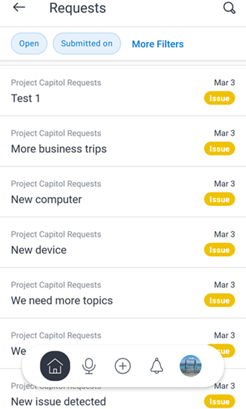

# [!DNL Adobe Workfront] für [!DNL iOS]

Mit der [!DNL Adobe Workfront] App können Sie auf jedem [!DNL iOS] Gerät auf Ihre Arbeit zugreifen. Sie können die Mobile App [!DNL Workfront] auf Smartphones und Tablets installieren und verwenden, auf denen iOS 10 oder höher ausgeführt wird. Eine dedizierte [!DNL Workfront]-App ist sowohl für die [!DNL iPhone] als auch für die [!DNL iPad] verfügbar.

Informationen zur Anmeldung bei der Mobile App finden Sie im Abschnitt [Anmelden bei der [!UICONTROL Workfront] Mobile App](../../../workfront-basics/manage-your-account-and-profile/managing-your-workfront-account/log-in-to-workfront.md#log) im Artikel [Anmelden bei [!DNL Adobe Workfront]](../../../workfront-basics/manage-your-account-and-profile/managing-your-workfront-account/log-in-to-workfront.md).

## [!UICONTROL Startseite]

Im Bereich [!UICONTROL Startseite] können Sie direkt an Aufgaben, Problemen und Genehmigungen arbeiten, die Ihnen zugewiesen wurden. Im Bereich [!UICONTROL Startseite] der App haben Sie folgende Möglichkeiten:

<table style="table-layout:auto"> 
 <col> 
 <col> 
 <tbody> 
  <tr> 
   <td> 
    <ul> 
     <li>Beginn der Arbeit an Aufgaben und Problemen</li> 
     <li>Aufgaben und Probleme als erledigt markieren [!UICONTROL]</li> 
     <li>Aufgaben und Probleme neu zuweisen</li> 
     <li>Ändern des [!UICONTROL Commit-Datums]</li> 
    </ul> </td> 
   <td> 
    <ul> 
     <li>Aufgaben- und Problemstatus aktualisieren</li> 
     <li>Beitrag im Bereich Updates</li> 
     <li>Dokumente anzeigen</li> 
     <li>Fotos anhängen</li> 
     <li> 
Erstellen einer Anfrage oder einer Schnellaufgabe
 
Hinweis: Schnellaufgaben, die in der Startseite erstellt werden, sind persönliche Aufgaben, es sei denn, Sie weisen ein Projekt zu.
 </li> 
    </ul> </td> 
  </tr> 
 </tbody> 
</table>

Weitere Informationen finden Sie unter [[!UICONTROL Startseite] Bereichswidgets](../../../workfront-basics/mobile-apps/using-the-workfront-mobile-app/home-area-widgets-mobile.md) und [[!UICONTROL Meine Arbeit] in der Mobile App](../../../workfront-basics/mobile-apps/using-the-workfront-mobile-app/my-work-section-mobile.md).

## [!UICONTROL Pinnwände]

Im [!UICONTROL Boards] Bereich können Sie auf Ihre [!DNL Workfront] Boards zugreifen.

Weitere Informationen finden Sie unter [[!DNL Adobe Workfront] [!UICONTROL Pinnwände] für Mobilgeräte](/help/quicksilver/workfront-basics/mobile-apps/using-the-workfront-mobile-app/mobile-boards.md).

## [!UICONTROL Projekte]

Der [!UICONTROL Projekte] Bereich ermöglicht die Interaktion und Verwaltung von [!UICONTROL Projekten] deren Inhabern und Projekten, an denen Sie mitarbeiten. Im Bereich Projekte der App haben Sie folgende Möglichkeiten:

<table style="table-layout:auto"> 
 <col> 
 <col> 
 <tbody> 
  <tr> 
   <td> 
    <ul> 
     <li>Projektstatus aktualisieren</li> 
     <li>Wichtige Projektdetails anzeigen</li> 
     <li>Beitrag im Bereich [!UICONTROL Updates]</li> 
     <li>Aufgaben, Probleme und Anfragen in Projekte konvertieren</li> 
    </ul> </td> 
   <td> 
    <ul> 
     <li>Interaktion mit Projektaufgaben und -problemen</li> 
     <li>Dokumente anzeigen</li> 
     <li>Fotos anhängen</li> 
     <li> 
Erstellen einer Schnellaufgabe
 
Hinweis: In einem Projekt erstellte Aufgaben werden automatisch dem Projekt zugewiesen, in dem Sie sich befinden. 
 </li> 
    </ul> </td> 
  </tr> 
 </tbody> 
</table>

## Genehmigungen

Im Bereich [!UICONTROL Genehmigungen] können Sie [!UICONTROL Genehmigungen“ anzeigen und genehmigen] die Ihnen zugewiesen oder delegiert wurden. Im Bereich Genehmigungen können Sie Folgendes genehmigen:

<table style="table-layout:auto">
 <col>
 <col>
 <tbody>
  <tr>
   <td>
    <ul>
     <li>Arbeit (Aufgaben und Probleme)</li>
     <li>Dokumente</li>
     <li>Korrekturabzüge </li>
    </ul> </td>
   <td>
    <ul>
     <li>Arbeitszeit- tabellen</li>
     <li>Alle Anforderungen</li>
    </ul> </td>
  </tr>
 </tbody>
</table>

Weitere Informationen zu Genehmigungen finden Sie unter [Genehmigungen in der Mobile [!DNL Adobe Workfront] App](../../../workfront-basics/mobile-apps/using-the-workfront-mobile-app/approvals-in-mobile-app.md).

Informationen zur Überprüfung und Genehmigung von Korrekturabzügen finden Sie unter [Überprüfen und Treffen von Entscheidungen zu Korrekturabzügen in der  [!DNL Adobe Workfront] -Mobile-App](../../../workfront-basics/mobile-apps/using-the-workfront-mobile-app/work-with-proofs-in-mobile-app.md).

## [!UICONTROL Benachrichtigungen]

Im [!UICONTROL Benachrichtigungen] können Sie In-App-Benachrichtigungen für Ihre Arbeit anzeigen und darauf reagieren.

>[!NOTE]
>Hyperlinks sind in den Aktualisierungsbenachrichtigungen nur verfügbar, wenn der gesamte Inhalt einer Anmerkung ein Hyperlink ohne Anzeigetext ist.

## [!UICONTROL Anfragen]

Im Bereich [!UICONTROL Anfragen] können Sie Details zu Anfragen anzeigen. Im Bereich [!UICONTROL Anfragen] der App haben Sie folgende Möglichkeiten:

<table style="table-layout:auto">
 <col>
 <col>
 <tbody>
  <tr>
   <td>
    <ul>
     <li>Anfrage neu zuweisen</li>
     <li>Status aktualisieren</li>
     <li>Priorität anpassen</li>
    </ul> </td>
   <td>
    <ul>
     <li>Beitrag im Bereich [!UICONTROL Updates]</li>
     <li>Dokumente anzeigen</li>
     <li>Fotos anhängen</li>
     <li>Speichern einer Anfrage als Entwurf</li>
    </ul> </td>
  </tr>
 </tbody>
</table>

## Arbeitszeit- tabellen

Im [!UICONTROL Arbeitszeittabellen] können Sie Details zu Ihren Arbeitszeittabellen anzeigen. Im Bereich [!UICONTROL Arbeitszeittabellen] der App haben Sie folgende Möglichkeiten:

* Beitrag im Bereich [!UICONTROL Updates]
* Stundentypen anpassen
* Ändern der protokollierten Zeit
* Kommentare auf der Arbeitszeittabelle eingeben
* Arbeitszeittabelle schließen

## [!UICONTROL Favoriten]

Sie können über das Menü Favoriten auf vorhandene Elemente zugreifen und dem Menü [!UICONTROL Favoriten] neue Elemente hinzufügen.

## [!UICONTROL Kontakte]

Im Bereich [!UICONTROL Kontakte] können Sie die Kontaktinformationen für alle Benutzer in Ihrem Unternehmen anzeigen.

## [!UICONTROL Konfiguration]

Der [!UICONTROL Konfiguration] ermöglicht Folgendes:

* Einstellungen verwalten
* Zugewiesene Teams anzeigen
* Sicherheitseinstellungen einrichten
* Feedback senden
* Zugriff auf Hilfeinhalte
* Abmelden

