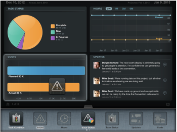

# Aktualisieren von Widgets in der Ansicht [!UICONTROL Projektdetails]

Nachdem Sie in der Projektliste darauf zugegriffen haben[!UICONTROL  können Sie zusätzliche Informationen über das ]Projekt“ anzeigen, indem Sie Widgets zu Ihrem Bildschirm [!UICONTROL Projektdetails] hinzufügen. Jeder Benutzer kann seine eigenen Widgets anpassen.

## Zugriffsanforderungen

+++ Erweitern, um die Zugriffsanforderungen für die in diesem Artikel beschriebene Funktionalität anzuzeigen.

<table style="table-layout:auto"> 
 <col> 
 </col> 
 <col> 
 </col> 
 <tbody> 
  <tr> 
   <td role="rowheader"><strong>Adobe Workfront-Paket</strong></td> 
   <td> 
Beliebig
 </td> 
  </tr> 
  <tr> 
   <td role="rowheader"><strong>Adobe Workfront-Lizenz</strong></td> 
   <td> 
   
Mitwirkende oder höher

   
Überprüfen oder höher
 </td> 
  </tr> 
 </tbody> 
</table>

Weitere Informationen finden Sie unter [Zugriffsanforderungen](/help/quicksilver/administration-and-setup/add-users/access-levels-and-object-permissions/access-level-requirements-in-documentation.md) in der Dokumentation zu Workfront.

+++

## Aktualisieren Sie die Widgets in der Ansicht [!UICONTROL Projektdetails].

1. Navigieren Sie auf der [!DNL Adobe Workfront View]-Startseite zu einem Projekt, indem Sie auf dessen Namen tippen.
1. Tippen Sie unten in der Mitte des Bildschirms auf die Registerkarte.\
   Der Bereich [!UICONTROL Widget] wird angezeigt.\
   Scrollen Sie durch die Widgets, indem Sie von links nach rechts wischen.\
   

1. Ziehen Sie ein Widget per Drag-and-Drop, um das Layout Ihrer Projektseite anzupassen.\
   Es können bis zu vier Widgets gleichzeitig angezeigt werden.\
   Sie können die Widgets neu anordnen, indem Sie sie ziehen und an einer anderen Position ablegen.\
   Die Widget-Anordnung wird beim Navigieren zwischen Projekten gespeichert.

1. Wählen Sie aus den folgenden Widgets:

   * **[!UICONTROL Aufgabenbedingung]** Zeigt alle Aufgaben im Projekt nach [!UICONTROL Bedingung] in einem Tortendiagramm an.
   * **[!UICONTROL Probleme]**: Zeigt die Zeitleiste aller Probleme in einem Liniendiagramm an. Die Anzahl der offenen Probleme ist in Klammern angegeben.
   * **[!UICONTROL Stunden]**: Zeigt die [!UICONTROL Ist] und [!UICONTROL Geplanten Stunden] für die Aufgaben des Projekts in einem kombinierten Liniendiagramm an.
   * **[!UICONTROL Problem]** [!UICONTROL Status]: Zeigt alle Probleme nach Status in einem Tortendiagramm an.
   * **[!UICONTROL Aktualisierungen]**: Zeigt alle Aktualisierungen und Kommentare zum Projekt an.
   * **[!UICONTROL Kosten]**: Zeigt die [!UICONTROL Ist] und [!UICONTROL Geplanten Kosten] des Projekts in einem kombinierten Balkendiagramm an.
   * **[!UICONTROL Umsatz]**: Zeigt [!UICONTROL Ist] und den [!UICONTROL Geplanten Umsatz] des Projekts in einem kombinierten Balkendiagramm an.
   * **[!UICONTROL Aufgabenstatus]** Zeigt alle Aufgaben im Projekt nach [!UICONTROL Fortschrittsstatus] in einem Tortendiagramm an.
   * **[!UICONTROL Anstehende Aufgaben]**: Zeigt bis zu 6 anstehende Aufgaben an. Das Widget sortiert die Projektaufgaben in der folgenden Reihenfolge:

      * zunächst bis zum [!UICONTROL Geschätzten Fälligkeitsdatum]
      * zweitens nach [!UICONTROL Struktur der Arbeitsaufteilung]

     Es werden die letzten beiden abgeschlossenen Aufgaben (falls zutreffend) und die nächsten vier Aufgaben angezeigt. Um zu verstehen, welche Aufgaben in der Mobile App [!DNL Workfront] angezeigt werden, können Sie einen Aufgabenbericht für das angezeigte Projekt erstellen und ihn nach dem voraussichtlichen Fälligkeitsdatum und dann nach der [!DNL Workfront] sortieren. Die ersten 6 Aufgaben sind die Aufgaben, die in der Mobile App von Workfront View im Widget [!UICONTROL Kommende ]&quot; aufgeführt sind.

   * **[!UICONTROL Verbleibende Aufgaben]**: Zeigt die unvollständigen Aufgaben in einem Liniendiagramm an.
   * **[!UICONTROL Dokumente]**: Zeigt eine Liste der an das Projekt angehängten Dokumente an.\

     Sie können die folgenden Dokumentenformate mit [!DNL Workfront View] öffnen:

      * Alle Textdateien
      * .pdf
      * Bilddateien (.jpg, .jpeg, .png usw.)
      * .xls
   * **[!UICONTROL Details]**: Zeigt die folgenden Details zum Projekt an:

      * Projektname
      * Name des Erstellers des Projekts
      * Projektstatus
      * Projektgruppe
      * Projektzeitplan
   * **[!UICONTROL Team]**: Zeigt die Namen der Benutzer an, die dem Projektteam angehören.\

     Weitere Informationen zu Projektteams finden Sie unter [Übersicht über das Projektteam](../../../manage-work/projects/planning-a-project/project-team-overview.md).
