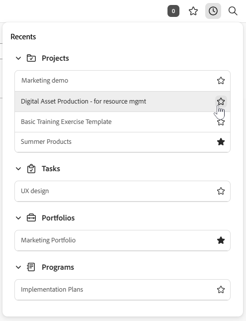
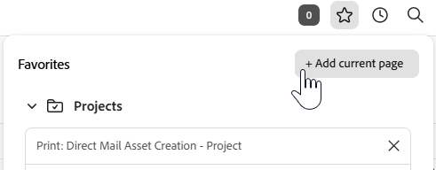

# Anzeigen und Verwalten von Favoriten

<!-- Audited: 5/2025 -->

Das [!UICONTROL Favoriten] Menü ermöglicht den schnellen Zugriff auf Elemente. Elemente verbleiben im Menü [!UICONTROL Favoriten], bis Sie sie entfernen. Im Menü Favoriten können bis zu 40 Elemente angezeigt werden.

## Zugriffsanforderungen

+++ Erweitern, um die Zugriffsanforderungen für die in diesem Artikel beschriebene Funktionalität anzuzeigen.

<table style="table-layout:auto"> 
 <col> 
 </col> 
 <col> 
 </col> 
 <tbody> 
  <tr> 
   <td role="rowheader">Adobe Workfront-Paket</td> 
   <td> 
Beliebig
 </td> 
  </tr> 
  <tr> 
   <td role="rowheader">Adobe Workfront-Lizenz</td> 
   <td> 

      
Mitwirkende oder höher

      
Anfragende oder höher</td> 
  </tr> 
 </tbody> 
</table>

Weitere Details zu den Informationen in dieser Tabelle finden Sie unter [Zugriffsanforderungen in der Dokumentation zu Workfront](/help/quicksilver/administration-and-setup/add-users/access-levels-and-object-permissions/access-level-requirements-in-documentation.md).

+++

## Favoriten anzeigen

So zeigen Sie ein Element an, das Sie zuvor als Favorit hinzugefügt haben:

1. Klicken Sie auf **[!UICONTROL Favoriten]**-Symbol  in der oberen rechten Ecke einer beliebigen [!DNL Adobe Workfront].

1. Klicken Sie in **Liste** Favoriten“ auf das Element, das Sie anzeigen möchten.

## Element als Favorit hinzufügen

Sie können dem Menü [!UICONTROL Favoriten“ die letzten Elemente oder die aktuelle Seite ].

* [Zuletzt verwendete Elemente als Favoriten hinzufügen](#add-recent-items-as-a-favorite)
* [Aktuelles Element als Favorit hinzufügen](#add-the-current-item-as-a-favorite)

### Zuletzt verwendete Elemente als Favoriten hinzufügen

1. Klicken Sie auf **[!UICONTROL Zuletzt verwendet]** Symbol  in der oberen rechten Ecke einer beliebigen Seite in der neuen [!DNL Adobe Workfront].
1. Klicken Sie auf den Stern, der mit dem Element übereinstimmt, das Sie als Favorit speichern möchten. Das zuletzt verwendete Element wird im Menü **Favoriten** angezeigt.

   

### Aktuelles Element als Favorit hinzufügen

1. Navigieren Sie zu der Seite, die Sie als Favorit hinzufügen möchten.
1. **[!DNL Favorites]** Klicken Sie oben rechts auf Favoriten“ und dann auf **[!UICONTROL Aktuelle Seite hinzufügen]**.

   

   >[!NOTE]
   >
   >Wenn Sie auf das Symbol **[!UICONTROL Favoriten]** auf einem Objekt klicken, das Sie bereits als Favorit hinzugefügt haben, wird das Objekt aus dem Menü [!UICONTROL Favoriten] entfernt.\
   >

## Entfernen eines Elements aus dem Menü [!UICONTROL Favoriten]

1. Klicken Sie auf **[!UICONTROL Favoriten]**-Symbol  in der oberen rechten Ecke einer beliebigen [!DNL Workfront].

1. Bewegen Sie den Mauszeiger über das Element, das Sie als Favorit entfernen möchten, und klicken Sie dann auf **X** daneben.

   ODER

   Wenn Sie sich auf der Seite befinden, die Sie als Favorit entfernen möchten, klicken Sie auf das Symbol **[!UICONTROL Favoriten]**  neben dem Objektnamen, um es aus dem Menü **Favoriten** zu entfernen.
