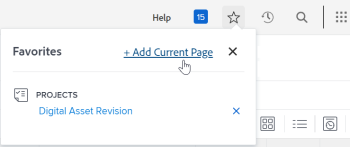

# Anzeigen und Verwalten von Favoriten

Die [!UICONTROL Favoriten] können Sie schnell auf Elemente zugreifen. Die Elemente verbleiben im [!UICONTROL Favoriten] , bis Sie sie entfernen. Sie können bis zu 40 Elemente im Menü Favoriten haben.

## Zugriffsanforderungen

Sie müssen über folgenden Zugriff verfügen, um die Schritte in diesem Artikel ausführen zu können:

<table style="table-layout:auto"> 
 <col> 
 </col> 
 <col> 
 </col> 
 <tbody> 
  <tr> 
   <td role="rowheader"><strong>[!DNL Adobe Workfront] Plan*</strong></td> 
   <td> 
Beliebig
 </td> 
  </tr> 
  <tr> 
   <td role="rowheader"><strong>[!DNL Adobe Workfront] license*</strong></td> 
   <td> 
[!UICONTROL Anforderung] oder höher
 </td> 
  </tr> 
 </tbody> 
</table>

&#42;Wenden Sie sich an Ihren [!DNL Workfront] Administrator.

## Favoriten anzeigen

So zeigen Sie ein Element an, das Sie zuvor als Favoriten hinzugefügt haben:

1. Klicken Sie auf **[!UICONTROL Favoriten]** icon  in der oberen rechten Ecke eines [!DNL Adobe Workfront] Seite.

1. Im [!UICONTROL Favoriten] und klicken Sie auf das Element, das Sie anzeigen möchten.

## Hinzufügen eines Elements als Favoriten

Sie können dem [!UICONTROL Favoriten] Menü.

* [Hinzufügen aktueller Artikel als Favoriten](#add-recent-items-as-a-favorite)
* [Aktuelles Element als Favoriten hinzufügen](#add-the-current-item-as-a-favorite)

### Hinzufügen aktueller Artikel als Favoriten

1. Klicken Sie auf **[!UICONTROL Letzte]** icon ![[!UICONTROL Letzte]](assets/recents-icon-40x43.png) in der rechten oberen Ecke einer beliebigen Seite in der neuen [!DNL Adobe Workfront] Erlebnis.
1. Bewegen Sie den Mauszeiger über das aktuelle Element, das Sie als Favoriten speichern möchten, und klicken Sie dann auf den Stern.

   Das aktuelle Element wird im [!UICONTROL Favoriten] Menü.

   Klicken Sie auf das X oben rechts, um die Liste zu schließen.

   

### Aktuelles Element als Favoriten hinzufügen

1. Rufen Sie die Seite auf, die Sie als Favoriten hinzufügen möchten.
1. Klicken Sie auf **[!DNL Favorites]** icon  in der oberen rechten Ecke eines [!DNL Workfront] Seite und klicken Sie dann auf **[!UICONTROL Aktuelle Seite hinzufügen]**.

   

   Klicken Sie auf das X oben rechts, um die Liste zu schließen.

   Oder

   Klicken Sie auf **[!UICONTROL Favoriten]** icon  rechts neben dem Objektnamen.

   >[!NOTE]
   >
   >Wenn Sie auf die **[!UICONTROL Favoriten]** auf einem Objekt, das Sie bereits als Favoriten hinzugefügt haben, wird das Objekt aus dem [!UICONTROL Favoriten] Menü.\
   >

## Entfernen Sie ein Element aus der [!UICONTROL Favoriten] Menü

1. Klicken Sie auf **[!UICONTROL Favoriten]** icon  in der oberen rechten Ecke eines [!DNL Workfront] Seite.

1. Bewegen Sie den Mauszeiger über das Element, das Sie als Favoriten entfernen möchten, und klicken Sie dann auf **X** daneben.

   Oder

   Wenn Sie sich auf der Seite befinden, die Sie als Favoriten entfernen möchten, klicken Sie auf die **[!UICONTROL Favoriten]** icon  neben dem Objektnamen, um ihn aus dem Menü &quot;Favoriten&quot;zu entfernen.
