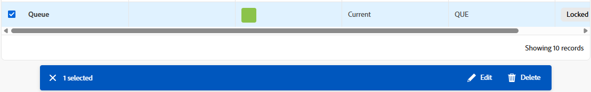
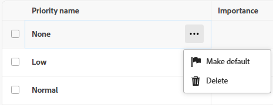
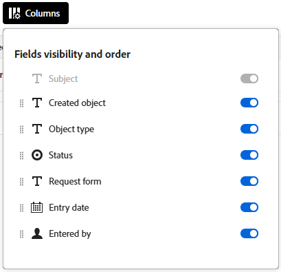

# Verwenden von erweiterten Listen

{{preview-fast-release-general}}

Erweiterte Listen sind in einigen Bereichen von Adobe Workfront verfügbar. Diese Listen verwenden ein Tabellenformat für die Anzeige der Listenelemente und haben ein anderes Erscheinungsbild als die Standardlisten. Die Verwaltung von Ansichten wurde ebenfalls verbessert, einschließlich Filtern, Gruppieren, Verwalten von Spalten und Suchen.

Informationen zu den Standardlisten finden Sie unter [Erste Schritte mit Listen in Adobe Workfront](/help/quicksilver/workfront-basics/navigate-workfront/use-lists/view-items-in-a-list.md).

>[!NOTE]
>
>Jede erweiterte Liste kann anders konfiguriert werden, damit Sie die benötigten Daten anzeigen können. Nicht alle in diesem Artikel beschriebenen Funktionen werden in jeder Liste verwendet, und einige Listen können spezielle Funktionen enthalten, die nur für diese Liste gelten.

## Zugriffsanforderungen

+++ Erweitern, um die Zugriffsanforderungen für die in diesem Artikel beschriebene Funktionalität anzuzeigen.

<table style="table-layout:auto">
 <col> 
 <col>
 <tbody> 
  <tr> 
   <td>Adobe Workfront-Paket</td> 
   <td>
Beliebig
</td> 
  </tr> 
  <tr> 
   <td>Adobe Workfront-Lizenz</td> 
   <td>
   
Mitwirkende oder höher

   
Anfragende oder höher
</td>
  </tr>
 </tbody> 
</table>

Weitere Informationen finden Sie unter [Zugriffsanforderungen in der Dokumentation zu Workfront](/help/quicksilver/administration-and-setup/add-users/access-levels-and-object-permissions/access-level-requirements-in-documentation.md).

+++

## Objekte, die erweiterte Listen verwenden

Im Folgenden finden Sie einige Typen von Workfront-Objektlisten, die das erweiterte Listenformat verwenden, sowie einige der Bereiche, in denen sie standardmäßig angezeigt werden, wenn Sie über die Berechtigung zum Anzeigen des Objekts verfügen.

>[!NOTE]
>
>Diese Liste ist nicht vollständig. Jede dieser Objektlisten kann auch in einem Bericht oder Dashboard angezeigt werden. Beispielsweise zeigt ein Anfragebericht oder ein Dashboard, das einen Anfragebericht enthält, auch eine Liste von Anfragen an.

| Workfront-Liste | Speicherort der Objektliste |
| --- | --- |
| Prioritäten | <ul><li>Startseite > Wählen Sie im linken Menü das Symbol Prioritäten aus.</li><li>Hauptmenü > Prioritäten</li></ul> |
| Liste der Anfragen | <ul><li>Anfragen (nur für neue Erlebnisse)</li><li>Widget „Meine Anfragen“ auf der Startseite</li></ul> |
| Listen mit Status, Prioritäten, Schweregraden und Wechselkursen im Setup | <ul><li>Setup > Projektvoreinstellungen > Status</li><li>Setup > Projektvoreinstellungen > Prioritäten</li><li>Setup > Projektvoreinstellungen > Schweregrade</li><li>Einrichten > Projektvoreinstellungen > Wechselkurse</li></ul> |
| Liste der Berichte | Hauptmenü > Berichte 
Das erweiterte Listenformat wird nur angewendet, wenn **Freigebbare Ordner verwenden** aktiviert ist. Weitere Informationen finden Sie unter [Verwenden von freigebbaren Berichtsordnern](/help/quicksilver/reports-and-dashboards/reports/report-usage/use-sharable-report-folders.md). |

## Hinzufügen von Elementen zu einer erweiterten Liste

Führen Sie je nach angezeigter erweiterter Liste eine der folgenden Aktionen aus:

1. Klicken Sie oben rechts in der Liste auf die blaue Schaltfläche. Diese Option öffnet ein Dialogfeld, in dem Sie Informationen eingeben können. Die Daten werden als neue Zeile in der Tabelle gespeichert.

   ODER

1. Klicken Sie **Neue**) unten in der Liste auf. Mit dieser Option wird der Tabelle eine neue Zeile hinzugefügt. Doppelklicken Sie in eine Zelle, um darin Informationen einzugeben. Jede Zelle stellt ein Feld für das Listenelement dar. Felder müssen vorhanden sein, bevor sie in der Liste angezeigt werden.

   Erweiterte Listen unterstützen diese Feldtypen:

   * Text
   * Zahl
   * Währung
   * Datum
   * Datum und Uhrzeit
   * Dropdown-Listen für Einzel-/Mehrfachauswahl
   * Typeahead
   * Absatz
   * Zugewiesener (ein oder mehrere)
   * Farbwähler

   >[!NOTE]
   >
   >Jeder Feldtyp verfügt über seine eigenen Bearbeitungsoptionen. Einige Felder sind möglicherweise schreibgeschützt.

## Elemente über die Aktionsleiste bearbeiten

Sie können die Aktionsleiste in einer erweiterten Liste verwenden, um Elemente in der Liste zu bearbeiten. Nicht alle Aktionsleisten enthalten dieselben Optionen. Außerdem können Sie in einigen Listen möglicherweise keine Elemente auswählen, und die Aktionsleiste ist nicht verfügbar.

1. Aktivieren Sie das Kontrollkästchen neben einem Element in einer erweiterten Liste.

   Die Aktionsleiste wird am unteren Bildschirmrand angezeigt.

   >[!NOTE]
   >
   >Je nachdem, welche Liste Sie bearbeiten, können Sie ein oder mehrere Elemente auswählen, um die Aktionsleiste zu verwenden.

1. Klicken Sie auf eine Aktion in der Leiste, um Elemente zu bearbeiten. Beispiele für Aktionen, die Sie auswählen können:

   * Ansicht
   * Bearbeiten
   * Löschen

   Wenn für das ausgewählte Element keine Aktionen verfügbar sind, wird in der Aktionsleiste „Keine verfügbaren Aktionen“ angezeigt.

   

1. Bewegen Sie den Mauszeiger über das Primärfeld eines Listenelements und klicken Sie dann auf das **Mehr** Menü , um zusätzliche Aktionen anzuzeigen. Einige Aktionen sind möglicherweise spezifisch für diese Liste.

   >[!TIP]
   >
   >Das primäre Feld wird in der ersten Spalte der Liste angezeigt.

   

## Spalten anpassen

Je nachdem, welche Objekte Sie in einer erweiterten Liste anzeigen, können Sie Spalten in der Liste ausblenden, anzeigen oder neu anordnen.

1. Klicken Sie **Spalten** über der Liste auf.

   

1. Verwenden Sie die Umschalter zum Anzeigen oder Ausblenden von Spalten in der Liste.
1. Um die Spalten neu anzuordnen, klicken Sie auf das Symbol **Ziehen** ( und verschieben Sie eine Spalte an die gewünschte Position. Durch das Verschieben von Spalten wird die Liste automatisch geändert.

   >[!NOTE]
   >
   >Das primäre Feld ist die erste Spalte in der Liste. Sie ist an der ersten Position fixiert und kann nicht geändert werden. Wenn die Anzahl der Spalten groß ist, wird das primäre Feld nach links eingefroren, und wenn Sie horizontal scrollen, wird es immer angezeigt.
   >
   >Das Symbol neben einem Feldnamen zeigt den Feldtyp an, z. B. Text oder Datumsfeld.

   Ein Indikator wird auf der Schaltfläche **Spalten** angezeigt, wenn Spalten ausgeblendet sind. Der Indikator wird bei der Neuanordnung der Spalten nicht angezeigt.

   

### Spalten umbenennen

Einige Spalten ermöglichen es Ihnen, einen benutzerdefinierten Namen für den Spaltentitel zu speichern.

1. Bewegen Sie den Mauszeiger über die Spalte, klicken Sie dann auf den Abwärtspfeil und wählen Sie **Umbenennen** aus.

   

1. Geben Sie im Dialogfeld **Umbenennen** den Namen für die Spalte in das Feld **Benutzerdefinierte**) ein und klicken Sie auf **Speichern**.

   Der neue Spaltenname wird in der Liste angezeigt.

## Hinzufügen und Entfernen von Spalten mit dem Spalten-Manager

Sie können den **Spalten-Manager** in einigen erweiterten Listen verwenden, um Spalten einfach zur Liste hinzuzufügen und daraus zu entfernen. Sie können sowohl System- als auch benutzerdefinierte Felder, die bereits in Workfront als Spalten vorhanden sind, zu einer erweiterten Liste hinzufügen oder entfernen.

So fügen Sie Spalten hinzu und entfernen sie:

1. Klicken Sie oben rechts in der Tabelle auf das Symbol &quot;+&quot;, um das Feld **Spalten-Manager“** öffnen.
1. Suchen Sie in der Spalte **Verfügbar** nach einem vorhandenen Objektfeld und klicken Sie dann rechts neben dem Feldnamen auf + , um es der Spalte **Ausgewählt** hinzuzufügen.
1. Klicken Sie rechts neben einem Feld in der Spalte **Ausgewählt**, um es aus der Liste zu entfernen.

   >[!NOTE]
   >
   >Einige Felder sind möglicherweise unveränderlich und können nicht entfernt werden.

   <!-- Add info about Properties and KPIs when something gets released with those options -->

1. Klicken Sie auf **Speichern**.

   

   Die Liste aktualisiert die Spalten entsprechend den von Ihnen getroffenen Entscheidungen.

## Aktualisieren von erweiterten Listenelementen

Die folgenden Elemente sind Komponenten einer erweiterten Liste:

* Ansicht : Definiert die Spalten, Filter und Gruppierungen in der Liste mit den Voreinstellungen.
* Filter: Begrenzt die Anzahl der in der Liste angezeigten Informationen
* Gruppierungen: Organisieren der Listenelemente nach gemeinsamen Feldern
* Sortieren: Ordnet die Elemente in einer Liste entsprechend der Reihenfolge an, die Sie für ein bestimmtes Feld angeben
* Suche: Schnelles Auffinden eines Elements mithilfe eines Suchbegriffs

### Anwenden und Erstellen von Ansichten

>[!NOTE]
>
>Nicht alle erweiterten Listen enthalten alle in diesem Abschnitt beschriebenen Elemente.

So wenden Sie eine Ansicht an bzw. erstellen eine Ansicht:

1. Klicken Sie auf **Ansichten** und wählen Sie eine vorhandene Ansicht aus, um sie auf die Liste anzuwenden

   ODER

   Klicken Sie auf **Neue Ansicht**, um eine Ansicht zu erstellen.

1. (Bedingt) Geben Sie zum Hinzufügen einer neuen Ansicht einen Namen für die Ansicht ein und klicken Sie dann auf **Erstellen**.
1. (Optional) Ausblenden, Anzeigen oder Neuanordnen der Spalten. Weitere Informationen finden Sie unter [Anpassen von Spalten in einer erweiterten Liste](#customize-columns-in-an-enhanced-list).
1. (Optional) Filtern Sie die Liste. Weitere Informationen finden Sie unter [Elemente in einer erweiterten Liste filtern](#filter-items-in-an-enhanced-list).
1. (Optional) Gruppieren Sie die Elemente in der Liste. Weitere Informationen finden Sie unter [Gruppieren von Elementen in einer erweiterten Liste](#group-items-in-an-enhanced-list).

   Änderungen an Ansichten werden automatisch gespeichert. Wenn Sie diese Ansicht das nächste Mal anwenden, bleiben die Spalten- und Filtereinstellungen so, wie Sie sie festlegen.

### Elemente in einer erweiterten Liste filtern

>[!NOTE]
>
>Nicht alle erweiterten Listen enthalten alle in diesem Abschnitt beschriebenen Elemente.

Filter helfen Ihnen, die Menge an Informationen zu reduzieren, die Sie in der Liste anzeigen.

1. Klicken Sie **Filter** über der Liste auf.
1. Klicken Sie im Feld Filter auf **Bedingung hinzufügen**.
1. Wählen Sie ein Feld aus, nach dem gefiltert werden soll.
1. Wählen Sie einen Filtermodifikator aus, z. B. „Hat eines von“, „Hat keines von“, „ist vor“ oder „ist nach“. Die Modifikatoroptionen unterscheiden sich je nach dem Typ des Felds, nach dem Sie filtern.
1. Wählen Sie die Feldwerte aus. Je nach Feldtyp, nach dem Sie filtern, werden Sie möglicherweise aufgefordert, das Element aus einer Liste auszuwählen, danach zu suchen oder einen Kalender zu verwenden, um einen Datumsbereich auszuwählen.

   

   Der Filter wird automatisch auf die Liste angewendet.

   >[!TIP]
   >
   >Um einen Platzhalter für einen aktuellen Benutzer anzuwenden, wählen Sie **Ich (angemeldeter Benutzer)** als Feldwert aus. Der Filter gilt dann für den Benutzer, der die Liste anzeigt. Dieser Platzhalter ist in Feldern verfügbar, in denen der Wert ein Benutzer ist.

1. Klicken Sie **Bedingung hinzufügen**, um dem Filter eine weitere Bedingung hinzuzufügen.

   Sie können mehrere Filter über einen AND- oder EINEN OR-Connector verbinden.

1. Wenn der Filter angewendet wird, können Sie die Optionen **Filter** erneut öffnen, um die Filteroptionen zu ändern oder alle Filter zu löschen.

   Wenn ein Filter auf die Liste angewendet wird **wird auf der** „Filter“ ein Indikator angezeigt.

   

### Elemente in einer erweiterten Liste gruppieren

>[!NOTE]
>
>Nicht alle erweiterten Listen enthalten alle in diesem Abschnitt beschriebenen Elemente.

Durch Gruppierungen werden die Objekte auf der Liste anhand bestimmter Kriterien in Bereiche unterteilt.

Workfront bietet eine begrenzte Anzahl vordefinierter Gruppierungen, die Sie nicht ändern können.

1. Klicken Sie **Gruppe** über der Liste auf.
1. Gruppierung auswählen, um die Liste zu organisieren.

   

1. Klicken Sie **Alle reduzieren**, um die Liste mit allen reduzierten Gruppierungen anzuzeigen. Die Standardoption besteht darin, die Liste mit allen Gruppierungen anzuzeigen.
1. Wenn die Gruppierung angewendet wird, können Sie die Gruppenoptionen erneut öffnen, um alle Gruppierungen gleichzeitig ein- oder auszublenden, die Gruppierung in ein anderes Feld zu ändern oder alle Gruppierungen zu löschen.

   

   Auf der Schaltfläche **Gruppe** wird ein Indikator angezeigt, wenn eine Gruppierung auf die Liste angewendet wird.

   

### Sortieren in eine erweiterte Liste

>[!NOTE]
>
>Nicht alle erweiterten Listen enthalten alle in diesem Abschnitt beschriebenen Elemente.

So sortieren Sie einzelne Spalten:

1. Bewegen Sie den Mauszeiger über die Spalte, klicken Sie dann auf den Abwärtspfeil und wählen Sie **Sortieren** aus.

   Ein Symbol neben einem Spaltennamen gibt an, dass die Liste nach den Werten in dieser Spalte und der Sortierrichtung sortiert wird.

   >[!NOTE]
   >
   >Einige Spalten sind je nach Liste möglicherweise nicht sortierbar.

   

So sortieren Sie Ihre Arbeit innerhalb einer Gruppierung:

1. Klicken Sie **Gruppieren**, gehen Sie zur Zeile der angewendeten Gruppierung, klicken Sie auf das Sortier-Dropdown-Menü und wählen Sie eine aufsteigende oder absteigende Reihenfolge aus.

   

### Suche in einer erweiterten Liste

>[!NOTE]
>
>Nicht alle erweiterten Listen enthalten alle in diesem Abschnitt beschriebenen Elemente.

1. Geben Sie einen Suchbegriff ein, nach dem Sie suchen möchten, in das Feld Suchen in der rechten oberen Ecke der Liste. Die Ergebnisse werden bei der Eingabe in der Liste hervorgehoben.

   

   >[!NOTE]
   >
   >Die Suche untersucht alle Spalten in allen Listenelementen. Wenn die Liste lang ist, enthält die Suche Elemente, die Sie möglicherweise scrollen müssen, um sie zu sehen. Wenn die Liste gefiltert wird, bezieht sich die Suche nur auf das, was gerade angezeigt wird.

### Ansicht freigeben

>[!NOTE]
>
>Nicht alle erweiterten Listen enthalten alle in diesem Abschnitt beschriebenen Elemente.

In der **Ansichten** Dropdown-Liste werden möglicherweise drei Kategorien von Ansichten angezeigt:

* **Systemansichten**: Ansichten, die Ihnen vom Systemadministrator zugewiesen wurden. Systemansichten können nicht freigegeben werden.
* **Freigegebene**: Ansichten, die von anderen Benutzern für Sie freigegeben wurden.
* **Meine Ansichten**: Ansichten, die Sie erstellt haben und für andere freigeben können. Sie können Ansichten für andere Benutzer, Teams oder Gruppen freigeben.

Wenn Sie eine Ansicht freigeben, sind alle Ansichtselemente (Spalten, Filter und Gruppierungen) enthalten.

So geben Sie eine Ansicht frei:

1. Bewegen Sie **Dropdown** Ansichten) den Mauszeiger über die Ansicht in **Meine Ansichten**, die Sie freigeben möchten, klicken Sie auf das **Mehr** Menü  und klicken Sie auf **Freigeben**.
1. Geben Sie im Dialogfeld Freigeben die Namen der Benutzer, Teams, Gruppen, Unternehmen oder Aufgabengebiete ein, für die Sie die Ansicht freigeben möchten, und wählen Sie sie dann aus der Liste aus, wenn sie angezeigt werden.

   Sie können den Empfängerinnen und Empfängern die folgenden Berechtigungen erteilen:

   * **Ansicht**: Benutzer können die Ansicht auf die Liste anwenden, sie jedoch nicht freigeben.

     Wenn Benutzer mit Ansichtszugriff die Ansicht aktualisieren, werden diese Änderungen in den persönlichen Voreinstellungen des Benutzers gespeichert. Ein blauer Punkt auf dem Ansichtsnamen (in der **Freigegebenen Ansichten**) zeigt an, dass persönliche Aktualisierungen auf die Ansicht angewendet werden.

   * **Verwalten**: Benutzer können die Ansicht umbenennen, freigeben oder löschen und die Elemente der Ansicht bearbeiten.

     Wenn Benutzer „Zugriff verwalten“ Änderungen an der Ansicht vornehmen, werden diese Aktualisierungen allen Benutzern angezeigt, für die die Ansicht freigegeben ist, wenn die Ansicht auf die Liste angewendet wird.

1. Klicken Sie auf **Speichern**.

   Wenn Sie eine Ansicht für einen Benutzer freigeben und diesen Zugriff dann entfernen, wird die Ansicht aus den „Freigegebenen **&quot; des Benutzers**. Wenn die freigegebene Ansicht des Benutzers auf die Liste angewendet wurde, als sein Zugriff entfernt wurde, wird die Systemstandardansicht angewendet.

### Kopieren einer Ansicht

>[!NOTE]
>
>Nicht alle erweiterten Listen enthalten alle in diesem Abschnitt beschriebenen Elemente.

Wenn eine Ansicht für Sie freigegeben wurde und Sie nicht über die erforderlichen Bearbeitungsberechtigungen verfügen, können Sie die Ansicht kopieren und unter einem neuen Namen speichern. Sie müssen zunächst Änderungen an der Ansicht vornehmen, bevor Sie sie kopieren können.

1. Bewegen Sie in der Dropdown-Liste Ansichten den Mauszeiger über die Ansicht **Freigegebene Ansichten** die Sie kopieren möchten, klicken Sie auf das **Mehr**-Menü  und klicken Sie auf **Mit Voreinstellungen kopieren**.

   Eine neue Ansicht wird automatisch erstellt. Er verwendet den ursprünglichen Ansichtsnamen mit (Kopie) am Ende und wird im Abschnitt **Meine Ansichten** der Ansichten angezeigt.

   Sie sind der Eigentümer dieser Ansicht und können sie umbenennen, bearbeiten, freigeben oder löschen. Wenn der Eigentümer der Originalansicht Ihren freigegebenen Zugriff auf diese Ansicht entfernt, haben Sie immer noch Zugriff auf diese Ansicht, die Sie erstellt haben.

   >[!NOTE]
   >
   >Die **Mit Voreinstellungen kopieren** ist nur verfügbar, wenn Sie Änderungen an einer Ansicht vorgenommen haben, die für Sie freigegeben wurde.

### Ansicht zurücksetzen

>[!NOTE]
>
>Nicht alle erweiterten Listen enthalten alle in diesem Abschnitt beschriebenen Elemente.

Wenn eine Ansicht für Sie freigegeben wurde, für die Sie keine Bearbeitungsberechtigung haben, und Sie diese Ansicht aktualisieren, können Sie sie auf die ursprüngliche Ansicht zurücksetzen.

1. Bewegen Sie in **Dropdown** Ansicht“ den Mauszeiger über die Ansicht in **Freigegebene Ansichten**, die Sie zurücksetzen möchten, klicken Sie auf das **Mehr** Menü  und klicken Sie auf **Auf Standard zurücksetzen**.

   Die Ansichtselemente (Spalten, Filter und Gruppierungen) werden auf die ursprünglichen Einstellungen zurückgesetzt, die für Sie freigegeben wurden.

   >[!NOTE]
   >
   >Die **Auf Standard zurücksetzen** ist nur verfügbar, wenn Sie Änderungen an einer Ansicht vorgenommen haben, die für Sie freigegeben wurde.

   

