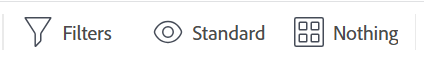
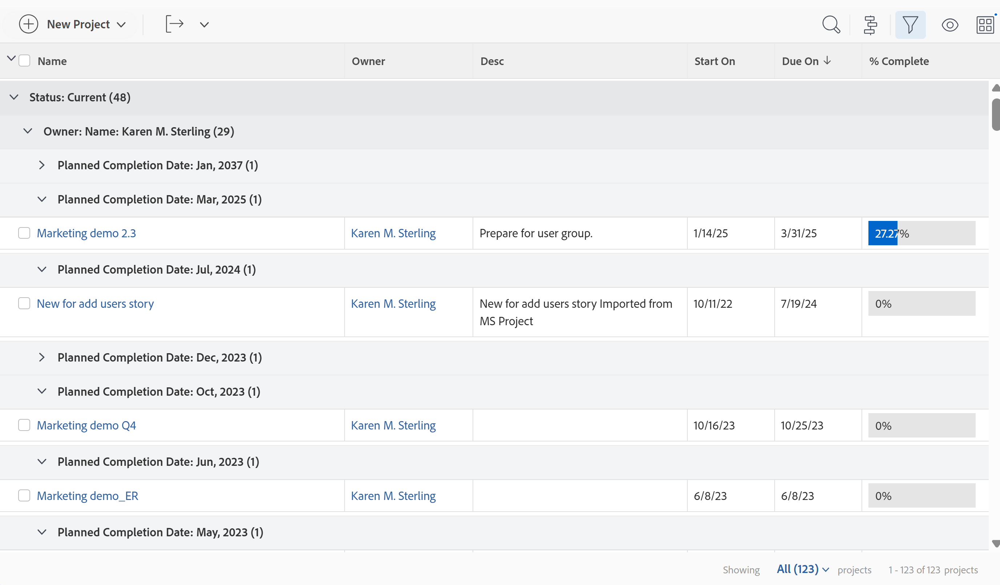
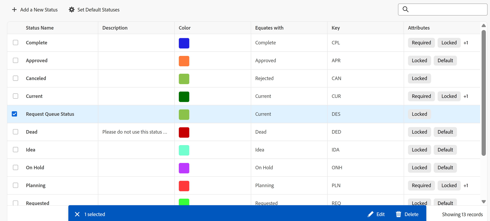

# Erste Schritte mit Listen in [!DNL Adobe Workfront]

<!--Audited: 12/2025-->

Sie können Listen von Objekten in [!DNL Adobe Workfront] anzeigen, um Informationen zu ihnen abzurufen, z. B. ihr Start- und Fälligkeitsdatum, ihnen zugewiesene Benutzer und andere Objekte, die ihnen zugeordnet sind.

Im Folgenden sind einige Eigenschaften von Listen in [!DNL Workfront] aufgeführt:

* Führt die automatische Aktualisierung alle fünf Minuten auf, um Informationen zu aktualisieren, die andere Benutzer im System anderswo aktualisieren.
* Einige Bereiche in [!DNL Workfront] sind mit standardmäßigen Objektlisten vorkonfiguriert.

  Sie können die meisten dieser vorkonfigurierten Listen anpassen.

* Ein [!DNL Workfront] kann benutzerdefinierte Listen erstellen, die auf verschiedene Bereiche von [!DNL Workfront] angewendet werden können.

  Weitere Informationen zum Erstellen von Listen auf Systemebene finden Sie im Artikel [Erstellen, Bearbeiten und Freigeben von Standardfiltern, -ansichten und -gruppierungen](../../../administration-and-setup/set-up-workfront/configure-system-defaults/create-and-share-default-fvgs.md).

* Im Folgenden sind die Listentypen in Workfront aufgeführt:

   * Standardlisten
   * Verbesserte Listen

  Weitere Informationen finden Sie im Abschnitt [Der Unterschied zwischen der Standardliste und der erweiterten Liste](#the-difference-between-the-standard-and-the-enhanced-lists) in diesem Artikel.

## Zugriffsanforderungen

+++ Erweitern, um die Zugriffsanforderungen für die in diesem Artikel beschriebene Funktionalität anzuzeigen. 

<table style="table-layout:auto"> 
 <col> 
 <col> 
 <tbody> 
  <tr> 
   <td role="rowheader">Adobe Workfront-Paket</td> 
   <td> 
Beliebig
 </td> 
  </tr> 
  <tr> 
   <td role="rowheader">Adobe Workfront-Lizenz</td> 
   <td> 
   
Mitwirkende oder höher

   
Anfragende oder höher

   </td> 
  </tr> 
  <tr> 
   <td role="rowheader">Konfigurationen der Zugriffsebene</td> 
   <td> 
Bearbeitungszugriff auf Filter, Ansichten, Gruppierungen 
 </td> 
  </tr> 
  <tr> 
   <td role="rowheader">Objektberechtigungen</td> 
   <td> 
Berechtigung für einen Filter, eine Ansicht oder eine Gruppierung mit Zugriff auf die Freigabe anzeigen oder höher 
  </td> 
  </tr> 
 </tbody> 
</table>

Weitere Informationen finden Sie unter [Zugriffsanforderungen](/help/quicksilver/administration-and-setup/add-users/access-levels-and-object-permissions/access-level-requirements-in-documentation.md) in der Dokumentation zu Workfront.

+++

<!--Old access: 

You must have the following access to perform the steps in this article:

<table style="table-layout:auto"> 
 <col> 
 <col> 
 <tbody> 
  <tr> 
   <td role="rowheader"><strong>[!DNL Adobe Workfront] plan*</strong></td> 
   <td> 
Any
 </td> 
  </tr> 
  <tr> 
   <td role="rowheader"><strong>[!DNL Adobe Workfront] license*</strong></td> 
   <td> 
[!UICONTROL Request] or higher
 </td> 
  </tr> 
  <tr> 
   <td role="rowheader"><strong>Access level configurations*</strong></td> 
   <td> 
[!UICONTROL View] or higher access to filters, views, groupings
 
For items in the [!UICONTROL Setup] area, you need administrative access for the item or the [!UICONTROL System Administrator] access level.
 
Note: If you still don't have access, ask your [!DNL Workfront] administrator if they set additional restrictions in your access level. For information on how a [!DNL Workfront] administrator can change your access level, see <a href="../../../administration-and-setup/add-users/configure-and-grant-access/create-modify-access-levels.md" class="MCXref xref">Create or modify custom access levels</a>.
 </td> 
  </tr> 
  <tr> 
   <td role="rowheader"><strong>Object permissions</strong></td> 
   <td> 
[!UICONTROL View] or higher permissions with access to share
 
For information on requesting additional access, see <a href="../../../workfront-basics/grant-and-request-access-to-objects/request-access.md" class="MCXref xref">Request access to objects </a>.
 </td>
  </tr> 
 </tbody> 
</table>

To find out what plan, license type, or access you have, contact your [!DNL Workfront] administrator.
-->

## Objektlisten

Im Folgenden sind einige Typen von Objektlisten aufgeführt, die Sie in [!DNL Workfront] finden können, sowie einige Bereiche, in denen sie standardmäßig angezeigt werden, wenn Sie über Rechte zum Anzeigen eines Objekts verfügen.

>[!NOTE]
>
>Diese Liste ist nicht umfassend. Jede dieser Objektlisten kann auch in einem Bericht oder in einem Dashboard angezeigt werden. Beispielsweise zeigt ein Projektbericht oder ein Dashboard, der bzw. das einen Projektbericht enthält, auch eine Liste von Projekten an.

<table style="table-layout:auto"> 
 <col> 
 <col> 
 <thead> 
  <tr> 
   <th><strong>[!DNL Workfront] list</strong></th> 
   <th><strong>Position der Objektliste</strong></th> 
  </tr> 
 </thead> 
 <tbody> 
  <tr> 
   <td>Liste der Portfolios</td> 
   <td> 
    <ul> 
     <li> 
[!UICONTROL Portfolios]
 </li> 
    </ul> </td> 
  </tr> 
  <tr> 
   <td>Liste der Programme</td> 
   <td> 
    <ul> 
     <li> 
[!UICONTROL-Portfolio] &gt;[!UICONTROL auf ein Portfolio klicken] &gt;[!UICONTROL-Programme]
 </li> 
     <li data-mc-conditions="QuicksilverOrClassic.Quicksilver"> 
[!UICONTROL Programme]
 </li> 
    </ul> </td> 
  </tr> 
  <tr> 
   <td>Liste der Projekte</td> 
   <td> 
    <ul> 
     <li> 
[!UICONTROL Projekte]
 </li> 
     <li> 
[!UICONTROL Portfolios] &gt;[!UICONTROL auf ein Portfolio klicken] &gt;[!UICONTROL Projekte]
 </li> 
     <li> 
[!UICONTROL Portfolios] &gt;[!UICONTROL klicken Sie auf ein Portfolio] &gt;[!UICONTROL Programme] &gt;[!UICONTROL klicken Sie auf ein Programm] &gt;[!UICONTROL Projekte]
 </li> 
    </ul> </td> 
  </tr> 
  <tr> 
   <td>Liste der Aufgaben</td> 
   <td> 
    <ul> 
     <li> 
[!UICONTROL-Projekte] &gt;[!UICONTROL klicken auf ein Projekt] &gt; [!UICONTROL-Aufgaben]
 </li> 
     <li> 
[!UICONTROL Projekte] &gt;[!UICONTROL auf ein Projekt klicken] &gt;[!UICONTROL Aufgaben] &gt;[!UICONTROL auf eine Aufgabe klicken] &gt;[!UICONTROL Unteraufgaben]
 </li> 
     <li> 
[!UICONTROL Projekte] &gt;[!UICONTROL auf ein Projekt klicken] &gt;[!UICONTROL Aufgaben] &gt;[!UICONTROL auf eine Aufgabe klicken] &gt; [!UICONTROL Vorgänger*]
 </li> 
    </ul> </td> 
  </tr> 
  <tr> 
   <td>Problemliste</td> 
   <td> 
    <ul> 
     <li> 
[!UICONTROL Projekte] &gt; [!UICONTROL Klicken] Sie auf ein Projekt &gt;[!UICONTROL Probleme]
 </li> 
     <li> 
[!UICONTROL Projekte] &gt;[!UICONTROL auf ein Projekt klicken] &gt;[!UICONTROL Aufgaben] &gt;[!UICONTROL auf eine Aufgabe klicken] &gt; [!UICONTROL Probleme]
 </li> 
     <li> 
[!UICONTROL Projekte] &gt;[!UICONTROL auf ein Projekt klicken] &gt;[!UICONTROL Aufgaben] &gt;[!UICONTROL auf eine Aufgabe klicken] &gt;[!UICONTROL auf eine Aufgabe klicken] &gt;[!UICONTROL auf eine Aufgabe klicken] &gt; [!UICONTROL Probleme]
 </li> 
    </ul> </td> 
  </tr> 
  <tr> 
   <td>Liste von Berichten</td> 
   <td> 
    <ul> 
     <li> 
  [!UICONTROL Berichte]  
 </li> 
    </ul> </td> 
  </tr> 
  <tr> 
   <td>Liste der Dashboards</td> 
   <td> 
    <ul> 
     <li> 
[!UICONTROL Dashboards]
 </li> 
    </ul> </td> 
  </tr> 
  <tr> 
   <td>Liste der Iterationen</td> 
   <td> 
    <ul> 
     <li> 
[!UICONTROL Teams] &gt; [!UICONTROL Iterationen]
 </li> 
    </ul> </td> 
  </tr> 
  <tr> 
   <td>Benutzerliste</td> 
   <td> 
    <ul> 
     <li> 
[!UICONTROL Benutzende]
 </li> 
    </ul> </td> 
  </tr> 
  <tr> 
   <td>Liste der Dokumente</td> 
   <td> 
    <ul> 
     <li> 
[!UICONTROL Dokumente]
 </li> 
     <li> 
[!UICONTROL Portfolios] &gt;[!UICONTROL auf ein Portfolio klicken] &gt; [!UICONTROL Dokumente]
 </li> 
     <li> 
[!UICONTROL Portfolios] &gt; [!UICONTROL auf ein Portfolio klicken] &gt;[!UICONTROL Programme] &gt;[!UICONTROL auf ein Programm klicken] &gt;[!UICONTROL Dokumente]
 </li> 
     <li> 
[!UICONTROL-Projekte] &gt;[!UICONTROL klicken auf ein Projekt] &gt;[!UICONTROL-Dokumente]
 </li> 
     <li> 
[!UICONTROL-Projekte] &gt;[!UICONTROL klicken auf ein Projekt] &gt;[!UICONTROL-Aufgaben] &gt;[!UICONTROL klicken auf eine Aufgabe] &gt; [!UICONTROL-Dokumente]
 </li> 
     <li> 
[!UICONTROL-Projekte] &gt; [!UICONTROL klicken] auf ein Projekt &gt; [!UICONTROL-Probleme] &gt;[!UICONTROL klicken auf ein Problem] &gt; [!UICONTROL-Dokumente]
 </li> 
    </ul> </td> 
  </tr> 
  <tr> 
   <td>Liste der Arbeitszeittabellen</td> 
   <td> 
    <ul> 
     <li> 
[!UICONTROL-Arbeitszeittabellen] &gt; [!UICONTROL-Arbeitszeittabellen]*
 </li> 
    </ul> </td> 
  </tr> 
  <tr> 
   <td>Liste der Abrechnungssätze</td> 
   <td> 
    <ul> 
     <li> 
[!UICONTROL Projekte] &gt;[!UICONTROL auf ein Projekt klicken] &gt;[!UICONTROL Abrechnungssätze*]
 </li> 
    </ul> </td> 
  </tr> 
  <tr> 
   <td>Liste der Rechnungsnachweise</td> 
   <td> 
    <ul> 
     <li> 
[!UICONTROL Projekte] &gt; [!UICONTROL auf ein Projekt klicken] &gt; [!UICONTROL Rechnungsnachweise]
 </li> 
    </ul> </td> 
  </tr> 
  <tr> 
   <td>Liste der Risiken</td> 
   <td> 
    <ul> 
     <li> 
[!UICONTROL-Projekte] &gt;[!UICONTROL klicken auf ein Projekt] &gt;[!UICONTROL-Risiken]
 </li> 
    </ul> </td> 
  </tr> 
  <tr> 
   <td>Liste der Ausgaben</td> 
   <td> 
    <ul> 
     <li> 
[!UICONTROL Projekte] &gt;[!UICONTROL klicken] Sie auf ein Projekt &gt;[!UICONTROL Ausgaben]
 </li> 
     <li> 
[!UICONTROL-Projekte] &gt; [!UICONTROL klicken auf ein Projekt] &gt;[!UICONTROL-Aufgaben] &gt;[!UICONTROL klicken auf eine Aufgabe] &gt;[!UICONTROL-Ausgaben]
 </li> 
    </ul> </td> 
  </tr> 
  <tr> 
   <td>Liste der Stundeneinträge</td> 
   <td> 
    <ul> 
     <li> 
[!UICONTROL Projekte] &gt;[!UICONTROL] Klicken Sie auf ein Projekt
 </li> 
     <li> 
[!UICONTROL-Projekte] &gt;[!UICONTROL klicken auf ein Projekt] &gt;[!UICONTROL-Aufgaben] &gt;[!UICONTROL klicken auf eine Aufgabe] &gt;[!UICONTROL-Stunden]
 </li> 
     <li> 
[!UICONTROL Projects] &gt;[!UICONTROL click] a project &gt;[!UICONTROL Issues] &gt;[!UICONTROL click] a issue &gt;[!UICONTROL Hours]
 </li>
    </ul> </td> 
  </tr>
  <tr> 
   <td>Liste der benutzerdefinierten Formulare</td> 
   <td> 
    <ul> 
     <li>[!UICONTROL Setup] &gt;[!UICONTROL Custom Forms] </li> 
    </ul> </td> 
  </tr> 
  <tr> 
    <td>Liste der Gruppen oder Untergruppen</td> 
   <td> 
    <ul> 
     <li> 
[!UICONTROL-Setup] &gt;[!UICONTROL-Gruppen]
 </li>
     <li> 
[!UICONTROL Setup] &gt;[!UICONTROL Groups] &gt;[!UICONTROL klicken Sie auf die übergeordnete Gruppe] &gt;[!UICONTROL-Untergruppen] </li> 
    </ul> </td> 
  </tr> 
  <tr> 
   <td>Team-Liste</td> 
   <td> 
    <ul> 
     <li> 
[!UICONTROL Setup] &gt;[!UICONTROL Teams]
 </li> 
    </ul> </td> 
  </tr>
  <tr> 
   <td>Liste der Unternehmen</td> 
   <td> 
    <ul> 
     <li> 
[!UICONTROL Setup] &gt;[!UICONTROL Firmen]
 </li> 
    </ul> </td> 
  </tr>
  <tr> 
   <td>Liste der Zeitpläne</td> 
   <td> 
    <ul> 
     <li> 
[!UICONTROL-Setup] &gt;[!UICONTROL-Zeitpläne]
 </li> 
    </ul> </td> 
  </tr>
  <tr> 
   <td>Liste der Layoutvorlagen</td> 
   <td> 
    <ul> 
     <li> 
[!UICONTROL-Setup] &gt;[!UICONTROL-Layoutvorlagen]
 </li> 
    </ul> </td> 
  </tr>
 </tbody> 
</table>

*Sie können die Liste im angegebenen Bereich nicht anpassen. Ein [!DNL Workfront]-Administrator kann eine benutzerdefinierte Liste auf Systemebene erstellen. Sie können auch einen Bericht für dieses Objekt erstellen, wenn Sie auf der Zugriffsebene Zugriff zum Bearbeiten von Berichten haben.

## Elemente auflisten

Eine Liste enthält bestimmte Elemente, die ihr Format und die angezeigten Informationen definieren. Sie können verschiedene Systemlistenelemente finden, die standardmäßig verfügbar sind. Sie können auch benutzerdefinierte Elemente erstellen, die Ihren Anforderungen entsprechen.

>[!NOTE]
>
>Wenn Sie einen neuen Filter, eine neue Ansicht oder eine neue Gruppierung aus einer Liste auswählen, bleibt diese Auswahl erhalten, selbst wenn Sie sich von [!DNL Workfront] abmelden oder Ihren Browser schließen.

Im Folgenden sind die Elemente einer Liste aufgeführt:

<table style="table-layout:auto"> 
 <col> 
 <col> 
 <thead> 
  <tr> 
   <th><strong>Element</strong></th> 
   <th><strong>Erklärung</strong></th> 
  </tr> 
 </thead> 
 <tbody> 
  <tr> 
   <td><strong>[!UICONTROL Filter]</strong></td> 
   <td> 
Filter verhindern, dass unnötige Informationen basierend auf den von Ihnen angegebenen Kriterien aus einer Liste entfernt werden. 
 
Weitere Informationen finden Sie unter <a href="../../../reports-and-dashboards/reports/reporting-elements/filters-overview.md" class="MCXref xref">Übersicht über Filter</a>.
 </td> 
  </tr> 
  <tr> 
   <td><strong>[!UICONTROL Ansicht]</strong></td> 
   <td> 
Ansichten definieren, welche Felder (Spalten) auf dem Bildschirm angezeigt werden.
 
Weitere Informationen finden Sie unter <a href="../../../reports-and-dashboards/reports/reporting-elements/views-overview.md" class="MCXref xref">Übersicht über Ansichten in [!DNL Adobe Workfront]</a>.
 </td> 
  </tr> 
  <tr> 
   <td><strong>[!UICONTROL Gruppierung]</strong></td> 
   <td> 
Durch Gruppierungen werden die Objekte in der Liste anhand der von Ihnen angegebenen Kriterien in Bereiche getrennt.
 
Beispielsweise können die Probleme in einer Liste in Abschnitten nach Status oder Priorität angezeigt werden.
 
In einer Standardgruppierung können bis zu drei Ebenen von Gruppierungen vorhanden sein. Wenn Sie im Textmodus eine Gruppierung konfigurieren, können Sie eine vierte Ebene hinzufügen.
 
Weitere Informationen zu Gruppierungen finden Sie unter <a href="../../../reports-and-dashboards/reports/reporting-elements/groupings-overview.md" class="MCXref xref">Gruppierungen - Übersicht in [!DNL Adobe Workfront]</a>.
 
Weitere Informationen zum Textmodus finden Sie unter <a href="../../../reports-and-dashboards/reports/text-mode/understand-text-mode.md" class="MCXref xref">Textmodus - Übersicht</a>.
 </td> 
  </tr> 
 </tbody> 
</table>

Diese Elemente werden standardmäßig oben in jeder Liste angezeigt. Sie bleiben haften und bewegen sich nicht, wenn Sie durch die Liste scrollen. Bewegen Sie den Mauszeiger über das Symbol für jedes Element, um es zu identifizieren.

Sie können Listenelemente in den folgenden Bereichen anpassen und für andere Benutzer freigeben:

* Jede standardmäßige Systemliste, die im Abschnitt [Erste Schritte mit Listen in [!DNL Adobe Workfront]](#default-workfront-lists) in diesem Artikel gefunden wird
* Alle Berichte, die für Sie freigegeben wurden

Die Bauelemente für Listen sind die gleichen wie die Bauelemente für Berichte.

Weitere Informationen zum Erstellen und Anpassen der Erstellungselemente von Listen und Berichten finden Sie [Berichterstellungselemente: Filter, Ansichten und Gruppierungen](../../../reports-and-dashboards/reports/reporting-elements/reporting-elements-filters-views-groupings.md).

## Aktionen auflisten

Sie können die folgenden Aktionen in einer Liste ausführen:

<table style="table-layout:auto"> 
 <col> 
 <col> 
 <thead> 
  <tr> 
   <th><strong>Aktion</strong></th> 
   <th><strong>Information</strong></th> 
  </tr> 
 </thead> 
 <tbody> 
  <tr> 
   <td><strong>Inline-Bearbeitung</strong> </td> 
   <td> 
Objekte und deren Informationen direkt in der Liste bearbeiten.
 
Weitere Informationen finden Sie unter <a href="../../../workfront-basics/navigate-workfront/use-lists/inline-edit-objects.md" class="MCXref xref">Inline-Bearbeitung von Elementen in einer Liste in [!DNL Adobe Workfront]</a>.
 
   
<b>HINWEIS:</b>

   
In einer Gruppierung ist keine Inline-Bearbeitung möglich.

</td> 
  </tr> 
  <tr data-mc-conditions="QuicksilverOrClassic.Quicksilver"> 
   <td><strong>Aktualisierung mit der [!UICONTROL Summary]</strong> </td> 
   <td> 
Aktualisieren Sie Aufgaben und Probleme auf Projektebene mithilfe des Bedienfelds [!UICONTROL Zusammenfassung].
 
<b>TIPP:</b>
 
Die Zusammenfassung ist nicht für alle Objekte verfügbar und nicht in den Aufgaben- oder Problemberichten.
 
Weitere Informationen finden Sie unter <a href="../../../workfront-basics/the-new-workfront-experience/summary-overview.md" class="MCXref xref">Übersicht </a>.
 </td> 
  </tr> 
  <tr> 
   <td><strong>Listenanzeige anpassen</strong> </td> 
   <td> 
Sie können das Erscheinungsbild einer Liste, die Spaltenanordnung, die Sortierreihenfolge von Elementen oder die Anzahl der angezeigten Elemente anpassen.
 
<b>HINWEIS:</b>
 
Änderungen an der Anzahl der Elemente, die auf einer Seite angezeigt werden sollen, werden zurückgesetzt, wenn Sie sich von [!DNL Workfront] abmelden oder Ihren Browser schließen. Änderungen können auch nach 8 Stunden rückgängig gemacht werden.
 
Weitere Informationen finden Sie unter <a href="../../../workfront-basics/navigate-workfront/use-lists/modify-list-display.md" class="MCXref xref">Ändern der Anzeige einer Liste</a>.
 </td> 
  </tr> 
  <tr> 
   <td><strong>Schnellfilter</strong> </td> 
   <td> 
Mit einem Schnellfilter können Sie nur Elemente finden, die Ihnen wichtig sind, sodass Sie diese schnell überprüfen, aktualisieren oder für andere freigeben können.
 
<b>WICHTIG:</b>
 
 Sie können nach Elementen suchen, die ein Suchwort enthalten, indem Sie den Schnellfilter verwenden, unabhängig davon, ob dieses Element auf Ihrem Bildschirm angezeigt wird oder nachdem Sie zum Ende der Seite gescrollt haben. Wenn Sie die Suchfunktionen Ihres Browsers verwenden, können Sie nur Elemente finden, die bereits auf dem Bildschirm sichtbar sind. Wenn Ihre Liste mehrere Seiten enthält, werden mit Schnellfiltern nur die Elemente auf der aktuellen Seite gesucht.
 
Weitere Informationen finden Sie unter <a href="../../../workfront-basics/navigate-workfront/use-lists/apply-quick-filter-list.md" class="MCXref xref">Anwenden des Schnellfilters auf eine Liste</a>.
 </td> 
  </tr> 
  <tr> 
   <td><strong>Exportieren</strong> </td> 
   <td> 
Eine Liste von Objekten aus [!DNL Workfront] exportieren. Wenn eine Liste mehr als 2000 Elemente enthält, ist das Exportieren der Liste die einzige Möglichkeit, alle Elemente auf einer Seite zu überprüfen.
 
Weitere Informationen zum Exportieren einer Liste finden Sie unter <a href="../../../workfront-basics/navigate-workfront/use-lists/export-lists.md" class="MCXref xref">Exportieren einer Liste</a>. Weitere Informationen zu Exportformaten und -beschränkungen finden Sie unter <a href="../../../reports-and-dashboards/reports/creating-and-managing-reports/export-data.md" class="MCXref xref">Exportieren von Daten</a>.
 </td> 
  </tr> 
 </tbody> 
</table>

### Listen-Symbolleiste

In der folgenden Tabelle werden viele der in der Symbolleiste verfügbaren Symbole aufgelistet und angegeben, was passiert, wenn Sie darauf klicken:

<table style="table-layout:auto"> 
 <col> 
 <col> 
 <col> 
 <tbody> 
  <tr> 
   <td><strong>Symbol</strong></td> 
   <td><strong>Beschreibung</strong></td> 
   <td><strong>Bei Klick</strong></td> 
  </tr> 
  <tr> 
   <td>  </td> 
   <td>[!UICONTROL Element oder Benutzer hinzufügen]</td> 
   <td>Öffnen Sie weitere Optionen, einschließlich eines neuen Elements oder Benutzers.</td> 
  </tr> 
  <tr> 
   <td>  </td> 
   <td>[!UICONTROL Aufgabe oben einfügen]</td> 
   <td> 
Aufgabe oberhalb der ausgewählten Aufgabe einfügen.
 
Dies ist nur für Aufgaben verfügbar. 
 </td> 
  </tr> 
  <tr> 
   <td>  </td> 
   <td>[!UICONTROL Aufgabe unten einfügen]</td> 
   <td> 
Fügen Sie eine Aufgabe unter der ausgewählten Aufgabe ein.
 
Dies ist nur für Aufgaben verfügbar. 
 </td> 
  </tr> 
  <tr> 
   <td>  </td> 
   <td>[!UICONTROL Bearbeiten]</td> 
   <td>Bearbeiten Sie das ausgewählte Element.</td> 
  </tr> 
  <tr> 
   <td>  </td> 
   <td>[!UICONTROL Copy]</td> 
   <td>Kopieren Sie das ausgewählte Element.</td> 
  </tr> 
  <tr> 
   <td>  </td> 
   <td>[!UICONTROL Löschen]</td> 
   <td>Löschen Sie das ausgewählte Element.</td> 
  </tr> 
  <tr> 
   <td>  </td> 
   <td>[!UICONTROL Hinzufügen zu]</td> 
   <td> 
Öffnen Sie das Dialogfeld, um das ausgewählte Problem zu einer Iteration hinzuzufügen.
 
Dies ist nur für Probleme verfügbar.
 </td> 
  </tr> 
  <tr> 
   <td>  </td> 
   <td>[!UICONTROL Freigabe]</td> 
   <td>Freigeben des ausgewählten Elements.</td> 
  </tr> 
  <tr> 
   <td>  </td> 
   <td>[!UICONTROL Aufgaben einrücken und ausrücken] </td> 
   <td> 
Ausgewählte Aufgabe ein- oder ausrücken. 
 
Dies ist nur für Aufgaben verfügbar. 
 </td> 
  </tr> 
  <tr> 
   <td></a> </td> 
   <td>[!UICONTROL Mehr]</td> 
   <td>Zusätzliche Optionen für das ausgewählte Element öffnen.</td> 
  </tr> 
  <tr> 
   <td> 
  
 </td> 
   <td> 
[!UICONTROL Schnellfilter] 
 </td> 
   <td> 
Öffnen Sie das Schnellfilter-Suchfeld, um Elemente in der angezeigten Liste zu finden.
 </td> 
  </tr> 
  <tr> 
   <td>  </td> 
   <td>[!UICONTROL-Export]</td> 
   <td>Exportieren Sie die Liste in PDF-, Excel- oder tabulatorgetrennte Dateien.</td> 
  </tr> 
  <tr> 
   <td>  </td> 
   <td>[!UICONTROL Agile View]</td> 
   <td>Zeigt die Liste in der agilen Ansicht an. Diese Option ist nur für Aufgaben verfügbar.</td> 
  </tr> 
  <tr> 
   <td>  </td> 
   <td>[!UICONTROL Gantt-Diagramm]</td> 
   <td> 
Zeigt die Liste in der [!UICONTROL Gantt Chart]-Ansicht an.
 
Dies ist nur für Projekte und Aufgaben verfügbar.
 </td> 
  </tr> 
  <tr data-mc-conditions=""> 
   <td>  
  
 </td> 
   <td>Dropdown-Menü [!UICONTROL Filter]</td> 
   <td> 
Zeigt eine Liste von Filtern und zusätzliche Optionen zum Verwalten von Filtern an, einschließlich der Erstellung von Filtern. 
 
Auf einem kleinen Bildschirm wird der Filtername durch das Filtersymbol ersetzt. Wenn Sie einen anderen Filter als "[!UICONTROL All]" anwenden, wird auf dem Filtersymbol ein blauer Punkt angezeigt.
 </td> 
  </tr> 
  <tr data-mc-conditions=""> 
   <td>  
  
 </td> 
   <td>Dropdown-Menü [!UICONTROL View]</td> 
   <td> 
Zeigt eine Liste mit Ansichten und zusätzliche Optionen zum Verwalten von Ansichten an, einschließlich der Erstellung einer Ansicht. 
 
Auf einem kleinen Bildschirm wird der Anzeigename durch das Symbol [!UICONTROL-Ansicht] ersetzt. Ein blauer Punkt wird auf dem Symbol [!UICONTROL View] angezeigt, wenn Sie eine andere Ansicht als "[!UICONTROL Standard]" anwenden.
 </td> 
  </tr> 
  <tr data-mc-conditions=""> 
   <td>  
  
 </td> 
   <td>Dropdown-Menü [!UICONTROL Grouping]</td> 
   <td> 
Zeigt eine Liste von Gruppierungen an sowie zusätzliche Optionen zum Verwalten von Gruppierungen, einschließlich der Erstellung einer Gruppierung. 
 
Auf einem kleinen Bildschirm wird der Gruppierungsname durch das Symbol [!UICONTROL grouping] ersetzt. Auf dem Symbol [!UICONTROL Grouping] wird ein blauer Punkt angezeigt, wenn Sie eine andere Gruppierung als "[!UICONTROL Nothing]" anwenden.
 </td> 
  </tr> 
  <tr data-mc-conditions=""> 
   <td>  </td> 
   <td> 
[!UICONTROL Planmodus]
 </td> 
   <td> 
Wählen Sie aus, ob Sie die Änderungen, die Sie in einer Aufgabenliste vornehmen, automatisch oder manuell speichern möchten. 
 
Informationen zum Bearbeiten von Aufgaben in einer Liste finden Sie unter <a href="/help/quicksilver/manage-work/tasks/manage-tasks/edit-tasks-in-a-list.md" class="MCXref xref">Bearbeiten von Aufgaben in einer Liste</a>. 
 
Dies ist nur für Aufgaben verfügbar.
 </td> 
  </tr> 
  <tr> 
   <td>  </td> 
   <td>[!UICONTROL Zusammenfassung]</td> 
   <td> 
Zeigt das Feld [!UICONTROL Zusammenfassung] für das ausgewählte Element an oder blendet es aus.
 
Dies ist nur für Aufgaben und Probleme verfügbar.
 
Informationen zum Bedienfeld [!UICONTROL Summary] finden Sie unter <a href="/help/quicksilver/workfront-basics/the-new-workfront-experience/summary-overview.md" class="MCXref xref">Übersicht</a>.
 </td> 
  </tr> 
  <tr> 
   <td>  </td> 
   <td>[!UICONTROL entfernen]</td> 
   <td>Entfernen Sie etwas aus der Liste. Als Gruppenadministrator bzw. -administratorin, der Gruppen- oder Untergruppenmitgliedschaften verwaltet, entfernen Sie beispielsweise ein Gruppenmitglied, wie unter <a href="/help/quicksilver/administration-and-setup/manage-groups/create-and-manage-groups/view-and-manage-a-groups-memberships.md" class="MCXref xref">Anzeigen und Verwalten der Gruppenmitgliedschaften</a> beschrieben.</td> 
  </tr> 
  <tr> 
   <td>  </td> 
   <td>[!UICONTROL-Kommentar] /[!UICONTROL-Update]</td> 
   <td> 
Geben Sie einen Kommentar oder eine Aktualisierung ein.
 </td> 
  </tr> 
 </tbody> 
</table>

## Der Unterschied zwischen Listen und Berichten

Sowohl Listen als auch Berichte sind Raster, die Informationen zu einem Objekttyp enthalten.

In der folgenden Tabelle sind die Ähnlichkeiten und Unterschiede zwischen Listen und Berichten aufgeführt:

<table style="table-layout:auto"> 
 <col> 
 <col> 
 <col> 
 <thead> 
  <tr> 
   <th><strong>Funktionalität</strong> </th> 
   <th><strong>Liste</strong> </th> 
   <th><strong>Bericht</strong> </th> 
  </tr> 
 </thead> 
 <tbody> 
  <tr> 
   <td> 
Jeder kann sie erstellen
 </td> 
   <td>✓* </td> 
   <td> </td> 
  </tr> 
  <tr> 
   <td> 
Nur ein [!DNL Workfront]-Administrator und Benutzer mit einer [!UICONTROL Plan]-Lizenz können sie erstellen.
 </td> 
   <td> </td> 
   <td>✓**</td> 
  </tr> 
  <tr> 
   <td> 
Ein Standardsatz ist verfügbar unter [!DNL Workfront]
 </td> 
   <td>✓</td> 
   <td>✓</td> 
  </tr> 
  <tr> 
   <td> 
Anpassbar im Standardmodus
 </td> 
   <td>✓</td> 
   <td>✓</td> 
  </tr> 
  <tr> 
   <td> 
Anpassbar im Textmodus
 </td> 
   <td>✓</td> 
   <td>✓</td> 
  </tr> 
  <tr> 
   <td> 
Sie können sie für andere Benutzer freigeben
 </td> 
   <td>✓</td> 
   <td>✓</td> 
  </tr> 
  <tr> 
   <td> 
Sie können sie systemweit freigeben
 </td> 
   <td>✓</td> 
   <td> ✓ </td> 
  </tr> 
  <tr> 
   <td> 
Sie können sie außerhalb des Systems freigeben
 </td> 
   <td> </td> 
   <td>✓ </td> 
  </tr> 
  <tr> 
   <td> 
Sie können in Formate exportieren, die durch PDF, [!DNL Excel] und Tabulatoren getrennt sind
 </td> 
   <td>✓</td> 
   <td> ✓ </td> 
  </tr> 
  <tr> 
   <td> 
Sie können die Übermittlung per E-Mail planen.
 </td> 
   <td> </td> 
   <td>✓ </td> 
  </tr> 
  <tr> 
   <td> 
Sie können einer Layoutvorlage
 </td> 
   <td>✓</td> 
   <td> </td> 
  </tr> 
  <tr> 
   <td> 
Sie können sie benutzerdefinierten Abschnitten hinzufügen 
 </td> 
   <td> </td> 
   <td>✓</td> 
  </tr> 
  <tr> 
   <td> 
Sie können sie zu einem Dashboard hinzufügen
 </td> 
   <td> ✓*** </td> 
   <td>✓</td> 
  </tr> 
  <tr> 
   <td> 
Sie können Eingabeaufforderungen verwenden, um ihre Anzeige anzupassen
 </td> 
   <td> </td> 
   <td>✓</td> 
  </tr> 
  <tr> 
   <td> 
Sie können sie in einem Diagramm anzeigen
 </td> 
   <td> </td> 
   <td>✓</td> 
  </tr> 
  <tr> 
   <td> 
Sie können darin enthaltene Objekte inline bearbeiten
 </td> 
   <td>✓</td> 
   <td>✓</td> 
  </tr> 
 </tbody> 
</table>

*Sie müssen Zugriff auf Filter, Ansichten und Gruppierungen haben, um sie erstellen zu können. Weitere Informationen finden Sie unter [Zugriff auf Filter, Ansichten und Gruppierungen gewähren](../../../administration-and-setup/add-users/configure-and-grant-access/grant-access-fvg.md).

**Sie müssen Zugriff auf Filter, Ansichten und Gruppierungen sowie auf Berichte, Dashboards und Kalender haben, um diese erstellen zu können. Weitere Informationen finden Sie unter [Zugriff auf Berichte, Dashboards und Kalender gewähren](../../../administration-and-setup/add-users/configure-and-grant-access/grant-access-reports-dashboards-calendars.md).

***Sie können Listen für Berichte, die in einem Dashboard platziert werden, nur anpassen, wenn der Ersteller des Berichts die Listenelemente so konfiguriert hat, dass sie im Dashboard sichtbar sind.

>[!NOTE]
>
>Sie können keine Liste zu einem Dashboard hinzufügen, ohne zuvor einen Bericht zu erstellen und ihn zum Dashboard hinzuzufügen.

Weitere Informationen zum Erstellen eines Berichts finden Sie unter [Erstellen eines benutzerdefinierten Berichts](../../../reports-and-dashboards/reports/creating-and-managing-reports/create-custom-report.md). Informationen zum Erstellen benutzerdefinierter Abschnitte finden Sie unter [Erstellen benutzerdefinierter Registerkarten oder Abschnitte](../../../workfront-basics/manage-your-account-and-profile/configuring-your-user-profile/create-custom-tabs.md).

## Der Unterschied zwischen der Standard- und der erweiterten Liste

In [!DNL Workfront] gibt es zwei Arten von Listen:

* Standardlisten

  

* Erweiterte Listen

  

Die Funktionen der einzelnen erweiterten Listen unterscheiden sich je nachdem, auf welche Seite Sie zugreifen.

Weitere Informationen zu erweiterten Listen finden Sie unter [Verwenden erweiterter Listen](/help/quicksilver/workfront-basics/navigate-workfront/use-lists/enhanced-lists.md).

Die folgende Tabelle zeigt einige der Unterschiede zwischen den standardmäßigen und erweiterten Listen in [!DNL Workfront]:

<table style="table-layout:auto"> 
 <col> 
 <col> 
 <tbody> 
  <tr> 
   <td><b>Standardlisten</b></td> 
   <td><b>Erweiterte Listen</b></td> 
  </tr> 
  <tr>
  <td> 
Standardmäßig <strong> (alle</strong> oder bis <strong>2000</strong> Elemente angezeigt
 </td> 
   <td> Anzeigen aller Elemente in der Liste nach manuellem Scrollen </td> 
  </tr>

<tr> 
   <td>Die Interaktion mit den Elementen in der Liste ist bei allen Objekttypen gleich und erfolgt über die Symbole oben in der Liste.  </td> 
   <td>Die Interaktion mit den Elementen in der Liste kann je nach Objekttyp unterschiedlich sein. Verwenden Sie dazu die Symbole oben in der Liste sowie die blaue Symbolleiste, die nach der Auswahl von Listenelementen aktiviert wird. </td> 
  </tr>

</td> 
  </tr> 
  <tr> 
   <td>
Sie können Änderungen der Zellfarbe auf Elemente in einer Liste anwenden
</td>
   <td>
Die Zellenfarbänderungen können nicht auf Elemente in einer Liste angewendet werden. 
</td>
   </td> 
   <td></td> 
  </tr> 
 </tbody> 
</table>

<!--
consider adding things like adding fields on the fly in an enhanced list when we will be able to do this-->

<!--old table: 
<table style="table-layout:auto"> 
 <col> 
 <col> 
 <tbody> 
  <tr> 
   <td><b>Legacy lists</b></td> 
   <td><b>Updated lists</b></td> 
  </tr> 
  <td> 
Display <strong>100</strong> items by default
 </td> 
   <td> 
Display <strong>All</strong> or up to <strong>2000</strong> items by default
 </td> 
  </tr> 
  <tr> 
   <td> 
Use CTRL+F to find items in a list
 </td> 
   <td> 
Use quick filters to quickly find information in a large list
 
For information about using quick filters in lists, see <a href="../../../workfront-basics/navigate-workfront/use-lists/apply-quick-filter-list.md" class="MCXref xref">Apply the quick filter to a list</a>.
 </td> 
  </tr> 
  <tr> 
   <td>You can't inline edit custom fields with rich text formatting.</td> 
   <td> 
Text in custom fields with formatting can be configured to allow bold, italics, underline, bullets, numbering, hyperlinks, and block quotes.
 
For more information, see <a href="/help/quicksilver/administration-and-setup/customize-workfront/create-manage-custom-forms/form-designer/design-a-form/design-a-form.md">Create a custom form</a>.
 </td> 
  </tr> 
  <tr> 
   <td>Conditional formatting can change the text color of links in a list</td> 
   <td>Cannot apply text color changes to links in a list</td> 
  </tr> 
 </tbody> 
</table>
-->
