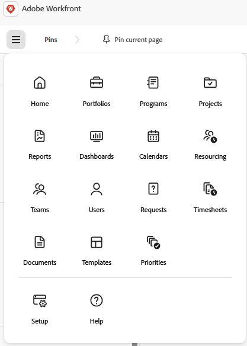

# [!DNL Adobe Unified Experience] for [!DNL Workfront]

<!--Audited: 10/2024-->

Der Zugriff auf [!DNL Workfront] über [!DNL Adobe CX Enterprise] bietet Ihnen ein nahtloses, einheitliches Erlebnis für die Verwaltung aller Ihrer [!DNL Adobe]. Single Identity Management bietet Ihnen einen Ort für die Anmeldung, ohne mehrere URLs oder Login-IDs.

## Zugriffsanforderungen

+++ Erweitern, um die Zugriffsanforderungen für die in diesem Artikel beschriebene Funktionalität anzuzeigen. 

<table style="table-layout:auto"> 
 <col> 
 <col> 
 <tbody> 
  <tr> 
   <td role="rowheader"><strong>Adobe Workfront-Paket</strong></td> 
   <td> 
Beliebig
 </td> 
  </tr> 
  <tr> 
   <td role="rowheader"><strong>Adobe Workfront-Lizenz</strong></td> 
   <td> 
Mitwirkende oder höher
 
   
Anfragende oder höher
 </td> 
  </tr> 
 </tbody> 
</table>

Weitere Informationen finden Sie unter [Zugriffsanforderungen in der Dokumentation zu Workfront](/help/quicksilver/administration-and-setup/add-users/access-levels-and-object-permissions/access-level-requirements-in-documentation.md).

+++

## Voraussetzungen

Die [!DNL Workfront]-Instanz Ihres Unternehmens muss in die [!DNL Adobe Business Platform] oder die [!DNL Adobe Admin Console] integriert werden.

Wenn Sie Fragen zum Onboarding bei der [!DNL Adobe Admin Console] haben, lesen Sie die [[!DNL Adobe Unified Experience] FAQ](/help/quicksilver/workfront-basics/navigate-workfront/workfront-navigation/unified-experience-faq.md/).

## Adobe Identity Management System (IMS)

Im Zuge der Umstellung auf das einheitliche Adobe-Erlebnis verwendet Ihr Unternehmen jetzt das Identity Management-System von Adobe zur Authentifizierung von Benutzern. Das bedeutet, dass Sie sich über Adobe bei Workfront anmelden, anstatt sich direkt bei Workfront anzumelden. Adobe IMS verlangt außerdem, dass Workfront-Administratoren die Benutzerverwaltung in der Adobe Admin Console und nicht in Workfront durchführen.

Informationen zur Anmeldung bei Workfront in Adobe Unified Experience finden Sie unter [Bei Adobe CX Enterprise anmelden](#log-in-to-adobe-cx-enterprise) in diesem Artikel.

Informationen zur Benutzerverwaltung in der Adobe Admin Console finden Sie im Artikel [Verwalten von Benutzern in der Adobe Admin Console](/help/quicksilver/administration-and-setup/add-users/create-and-manage-users/admin-console.md).

## Melden Sie sich bei [!DNL Adobe CX Enterprise] an.

1. Öffnen Sie ein Browser-Fenster und navigieren Sie zu <https://experience.adobe.com>.
1. Geben Sie auf dem Bildschirm [!UICONTROL **Anmelden**] Ihre E-Mail-Adresse ein und klicken Sie auf **[!UICONTROL Weiter]**.

   ![Bei [!DNL Adobe CX Enterprise]](assets/aec-login-page.png) anmelden

>[!NOTE]
>
>Wenn eine Browser-Registerkartensitzung auf einer Seite abläuft, auf der Workfront geöffnet ist, und Sie eine aktive Workfront-Sitzung auf einer anderen Browser-Registerkarte haben, können Sie die abgelaufene Registerkarte neu laden, um die Workfront-Seite erneut zu öffnen.

## Zugriff auf [!DNL Workfront]

Sobald Sie bei [!DNL Adobe CX Enterprise] angemeldet sind, können Sie alle [!DNL Workfront] Organisationen und Umgebungen anzeigen, auf die Sie Zugriff haben, indem Sie auf den Organisationswechsel im oberen Navigationsbereich klicken. Wählen Sie die [!DNL Workfront] Organisation oder Umgebung aus, in der Sie arbeiten möchten. Umgebungen können [!UICONTROL Vorschau] und [!UICONTROL Sandbox) ], wenn Ihr Unternehmen sie verwendet.

![Anzeigen [!DNL Workfront] Organisationen und Umgebungen](assets/wf-org-instance-switcher-2026.png)

>[!NOTE]
>
>Bei der ersten Anmeldung bei [!DNL Adobe CX Enterprise] wird für die Organisation standardmäßig die erste Instanz in der alphabetischen Liste verwendet. Bei der nächsten Anmeldung wird für die Organisation standardmäßig das zuletzt besuchte verwendet.

[!DNL Workfront] wird in der Liste der [!DNL Adobe CX Enterprise] Produkte angezeigt, auf die Sie Zugriff haben. Sie können [!DNL Workfront] im Schnellzugriffsmenü auf der [!DNL CX Enterprise]-Startseite auswählen oder den Produktumschalter (, um die Anwendungen jederzeit zu wechseln.

![Wählen Sie [!DNL Workfront] aus, um auf die Anwendung zuzugreifen](assets/cx-enterprise-home-2026.png)

## [!DNL Workfront] navigieren

Klicken Sie auf [!UICONTROL Hauptmenü]-Symbol  auf der linken Seite der [!DNL Workfront] Navigationsleiste, um zu allen Seiten zu navigieren, auf die Sie Zugriff haben. Welche Optionen im [!UICONTROL Hauptmenü“ verfügbar sind] hängt von Folgendem ab:

* **Konfigurationen von Layout-Vorlagen**: Informationen dazu, wie ein [!DNL Workfront]-Administrator das [!UICONTROL Hauptmenü] einer Layout-Vorlage ändern kann, finden Sie unter [Anpassen des [!UICONTROL Hauptmenüs] mithilfe einer Layout-Vorlage](/help/quicksilver/administration-and-setup/customize-workfront/use-layout-templates/customize-main-menu.md).
* **Lizenztyp**: Informationen zu den Standardkonfigurationen für verschiedene Lizenztypen finden Sie unter [Grundlegendes zur Navigation für einen [!UICONTROL Light]-Lizenzbenutzer](/help/quicksilver/workfront-basics/navigate-workfront/workfront-navigation/reviewer-global-navigation-bar.md) oder [Grundlegendes zur Navigation für einen [!UICONTROL Work]-License-Benutzer](/help/quicksilver/workfront-basics/navigate-workfront/workfront-navigation/worker-global-navigation-bar.md).

## Zugriff auf Ihr Profil und Ihre Voreinstellungen

Sie können auf Ihre Profil- und Voreinstellungsoptionen zugreifen, indem Sie auf das Adobe-Kontomenü (Ihr Profilbild) im oberen Navigationsbereich klicken.

Dieses Menü bietet folgende Möglichkeiten:

* Wählen Sie **[!UICONTROL Dunkles Design]** Formatierung für [!DNL Adobe CX Enterprise].
* Legen Sie **[!UICONTROL Voreinstellungen]** für [!DNL Adobe CX Enterprise] fest, einschließlich der Voreinstellungen für primäre und sekundäre Sprachen.

  >[!NOTE]
  >
  >Ihre Datumseinstellungen basieren auf Ihren primären Spracheinstellungen. Wenn Sie beispielsweise **Englisch (Vereinigte Staaten)**, werden Datumsangaben im Format MM/TT/JJJJ angezeigt, wenn Sie **Englisch (Vereinigtes Königreich)** wählen, werden Datumsangaben im Format TT/MM/JJJJ angezeigt.

* Greifen Sie auf Ihr **[!UICONTROL [!DNL Workfront]zu]**. Wenn Sie sich im Profil befinden, klicken Sie auf das Menü **[!UICONTROL Mehr]**  und wählen Sie **[!UICONTROL Bearbeiten]**. Weitere Informationen zum Profil finden Sie unter [Konfigurieren meiner Einstellungen](/help/quicksilver/workfront-basics/manage-your-account-and-profile/configuring-your-user-profile/configure-my-settings.md).
* **[!UICONTROL Abmelden]** von [!DNL Adobe CX Enterprise].

## Passwort verwalten

>[!NOTE]
>
>Durch Ändern des Kennworts wird es für alle Ihre [!DNL Adobe CX Enterprise]-Programme geändert.

Ihr Kennwort wird in [!DNL Workfront] nicht verwaltet.

Wenn Ihr Unternehmen eine separate Anwendung zum Verwalten von Kennwörtern verwendet, ändern Sie Ihr Kennwort über diesen Anbieter.

Wenn Ihr Kennwort von [!DNL Adobe] verwaltet wird, können Sie das Kennwort in Ihrem Adobe-Konto ändern.

[In diesem Artikel erfahren Sie, wie Sie Ihr Adobe-Kennwort ändern.](https://helpx.adobe.com/account/individual/sign-in-and-security/security-and-recovery/reset-adobe-password.html){target="_blank"}

Wenden Sie sich an Ihren Administrator, um weitere Informationen zum Ändern Ihres Kennworts zu erhalten.
