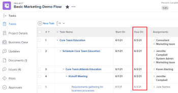

# Übersicht über die Projekt-, Aufgaben- und Problemdaten in [!DNL Workfront]

<!-- Audited: 05/2024 -->

<!--consider expanding on this article with ALL dates for PTIs - Hand off dates, Approval Dates, etc-->

<!-- there are dates below that need definition - ask Product-->

Dieser Artikel enthält Definitionen der häufigsten Termine, die mit Projekten, Aufgaben und Problemen in [!DNL Adobe Workfront] verbunden sind. Die hier enthaltenen Bilder sind Beispiele dafür, dass die Datumsangaben in Workfront angezeigt werden und sie nicht vollständig sind. Es gibt andere Bereiche, in denen die Daten angezeigt werden. Alle Datumsangaben sind auch in Projekt-, Aufgaben- und Problemberichten und -listen sichtbar.

Informationen zu Berichten und Listen finden Sie in den folgenden Artikeln:

* [Erste Schritte mit Listen in [!DNL Adobe Workfront]](../../../workfront-basics/navigate-workfront/use-lists/view-items-in-a-list.md)
* [Erste Schritte mit Berichten](../../../reports-and-dashboards/reports/reporting/get-started-reports-workfront.md)

Weitere Informationen zu Projekt-, Aufgaben- und Problemfeldern finden Sie unter [Glossar der  [!DNL Adobe Workfront] -Terminologie](../../../workfront-basics/navigate-workfront/workfront-navigation/workfront-terminology-glossary.md).

## [!UICONTROL Tatsächliches Startdatum]

Das [!UICONTROL Tatsächliche Startdatum] ist das Datum, an dem ein Benutzer tatsächlich mit der Arbeit an einem Projekt, einer Aufgabe oder einem Problem beginnt. Das [!UICONTROL Tatsächliche Startdatum] ist leer, wenn das Projekt, die Aufgabe oder das Problem erstellt wird.

Sie können manuell angeben, wann die Arbeit an einer Aufgabe oder einem Problem begonnen hat, oder das [!UICONTROL Tatsächliches Startdatum] wird automatisch angezeigt, wenn sich der Aufgaben- oder Problemstatus von [!UICONTROL Neu] in [!UICONTROL In Bearbeitung] oder [!UICONTROL Abgeschlossen] ändert. Das [!UICONTROL Tatsächliche Startdatum] eines Projekts fällt mit dem Datum zusammen, an dem die erste Aufgabe im Projekt beginnt.

>[!TIP]
>
>Das [!UICONTROL Tatsächliche Startdatum] stimmt möglicherweise nicht mit dem [!UICONTROL Geplanten Startdatum) ] Projekts, der Aufgabe oder des Problems überein, da der/die Benutzende die Arbeit möglicherweise später oder früher als das geplante Datum beginnen wird.

Weitere Informationen finden Sie unter [Übersicht über das Projekt [!UICONTROL Tatsächliches Startdatum]](../../../manage-work/projects/planning-a-project/project-actual-start-date.md).

>[!NOTE]
>
>Die [!UICONTROL Muss beginnen am] oder die Begrenzungen Feste Datumswerte wirken sich auf [!UICONTROL  (Geplantes Startdatum] einer Aufgabe aus, nicht auf [!UICONTROL Tatsächliches Startdatum]. Dadurch wird das [!UICONTROL Geplantes Startdatum] auf ein von Ihnen angegebenes Datum aktualisiert. Das [!UICONTROL Tatsächliche Startdatum] wird unabhängig vom [!UICONTROL Geplanten Startdatum] aktualisiert, wie oben beschrieben.

## [!UICONTROL Tatsächliches Abschlussdatum]

Das [!UICONTROL Tatsächliche Abschlussdatum] ist das Datum, an dem ein Benutzer ein Projekt, eine Aufgabe oder ein Problem tatsächlich abschließt. Das [!UICONTROL Tatsächliche Abschlussdatum] ist leer, wenn das Projekt, die Aufgabe oder das Problem erstellt wird.

Sie können manuell angeben, wann die Arbeit an einer Aufgabe oder einem Problem abgeschlossen ist, oder das [!UICONTROL Tatsächliche Abschlussdatum] wird automatisch ausgefüllt, wenn eine der folgenden Situationen eintritt:

* Der Projekt-, Aufgaben- oder Problemstatus ändert sich in [!UICONTROL Abgeschlossen], [!UICONTROL Geschlossen] oder [!UICONTROL Gelöst].
* Der Prozentwert der abgeschlossenen Aufgaben oder Projekte beträgt 100 %.

Das [!UICONTROL Tatsächliche Abschlussdatum] eines Projekts fällt mit dem Datum zusammen, an dem Sie die letzte Aufgabe im Projekt abgeschlossen haben.

>[!TIP]
>
>Das [!UICONTROL Tatsächliche Abschlussdatum] stimmt möglicherweise nicht mit dem [!UICONTROL Geplanten Abschlussdatum] überein.

Weitere Informationen finden Sie unter [Übersicht über das Projekt [!UICONTROL Tatsächliches Abschlussdatum]](../../../manage-work/projects/planning-a-project/project-actual-completion-date.md).

## Genehmigungspfad – Abschlussdatum

Das Abschlussdatum des Genehmigungspfads ist das Datum, an dem die Genehmigung für ein Projekt, eine Aufgabe oder ein Problem erteilt und der Status des Elements geändert wurde.

Das Abschlussdatum des Genehmigungspfads ist in Projekt-, Aufgaben- und Problemlisten und Berichten sichtbar.

## Genehmigungspfad – Startdatum

Das Startdatum des Genehmigungspfads ist das Datum, an dem der Projekt-, Aufgaben- oder Problemstatus in „Ausstehende Genehmigung“ geändert und die Anforderung zur Projektgenehmigung an die genehmigenden Personen gesendet wurde.

Das Startdatum des Genehmigungspfads ist in Projekt-, Aufgaben- und Problemlisten und Berichten sichtbar.

<!--## Auto Closure Date -->

## Budgetiertes Abschlussdatum

Dies ist ein veraltetes Feld für Projekte. Alle Informationen, die dieses Feld in einer Liste oder einem Bericht anzeigen kann, beziehen sich auf eine Funktion, die von Workfront entfernt wurde. Dieses Feld kann nicht aktualisiert werden.

Das Feld ist in Projektberichten und -listen sichtbar.

## Budgetiertes Startdatum

Dies ist ein veraltetes Feld für Projekte. Alle in diesem Feld angezeigten Informationen beziehen sich auf eine Funktion, die von Workfront entfernt wurde. Dieses Feld kann nicht aktualisiert werden.

Das Feld ist in Projektberichten und -listen sichtbar.

## [!UICONTROL Commit-Datum]

Das [!UICONTROL Commit-Datum] ist das Datum, zu dem sich ein Benutzer, der einer Aufgabe oder einem Problem zugewiesen wurde, verpflichtet hat, die Aufgabe oder das Problem abzuschließen. Dies unterscheidet sich vom [!UICONTROL Geplantes Abschlussdatum] da es eine realistischere Schätzung des Abschlussdatums ist, die nur von dem Benutzer gegeben wird, der für die Arbeit verantwortlich ist. Weitere Informationen finden Sie unter [[!UICONTROL Commit-Datum] - Übersicht](../../../manage-work/projects/updating-work-in-a-project/overview-of-commit-dates.md).

>[!NOTE]
>
>Eine Änderung des [!UICONTROL Commit] wirkt sich auf das [!UICONTROL Voraussichtliche Abschlussdatum], aber nicht auf [!UICONTROL Geplantes Abschlussdatum] einer Aufgabe oder eines Problems aus. Der Projekt-Manager kann die Änderungen verwenden, die ein Verantwortlicher am [!UICONTROL Commit-Datum] vornimmt, um das [!UICONTROL Geplantes Abschlussdatum] einer Aufgabe oder eines Problems zu aktualisieren.

<!--## Completion Pending Date-->

## Einschränkungsdatum

Wenn Sie eine Aufgabenbeschränkung verwenden, die mit einem bestimmten Datum verknüpft ist, wird dieses bestimmte Datum zum Einschränkungsdatum der Aufgabe.

Die folgenden Aufgabenbeschränkungen aktualisieren das Feld Einschränkungsdatum :

* Muss beginnen am
* Muss beendet werden am
* Nicht später anfangen als
* Nicht früher anfangen als

>[!TIP]
>
>Eine Aufgabe mit einer Beschränkung fester Termine hat kein Einschränkungsdatum.
>

Das Einschränkungsdatum ist in einer Aufgabenliste oder einem Bericht sichtbar.

## Problem-Eingabedatum konvertiert

Das Datum, an dem das Problem, das in das Projekt oder die Aufgabe konvertiert wurde, erstellt wurde.

Das konvertierte Problem-Eingabedatum ist in Projekt- und Aufgabenlisten und Berichten sichtbar.

## Fälligkeitsdatum

Das Datum, an dem eine Aufgabe oder ein Problem abgeschlossen sein soll. Das Fälligkeitsdatum einer Aufgabe oder eines Problems entspricht dem geplanten Abschlussdatum.

Das Fälligkeitsdatum von Aufgaben und Problemen ist in Aufgaben- und Problemlisten und Berichten sichtbar.

Weitere Informationen finden Sie [ Abschnitt „Geplantes ](#planned-completion-date)&quot; in diesem Artikel.

## Fällig am

Das Datum, an dem das Projekt abgeschlossen sein soll. Das geplante Abschlussdatum eines Projekts entspricht dem geplanten Abschlussdatum des Projekts.

Das Fälligkeitsdatum des Projekts wird in Projektlisten und Berichten angezeigt.

Weitere Informationen finden Sie [ Abschnitt „Geplantes ](#planned-completion-date)&quot; in diesem Artikel.

## [!UICONTROL Eingabedatum]

Das [!UICONTROL Eingabedatum] ist das Datum, an dem ein Projekt, eine Aufgabe oder ein Problem in [!DNL Workfront] erstellt wurde.

Das [!UICONTROL Eingabedatum] hat keinen Einfluss auf die Zeitleiste von Projekten, Aufgaben oder Problemen, ist aber für Tracking- und Berichtszwecke wichtig. [!DNL Workfront] generiert automatisch das [!UICONTROL Eingabedatum] wenn das Objekt erstellt wird und Sie es nicht manuell bearbeiten können.

## Geschätztes Fälligkeitsdatum

Das voraussichtliche Fälligkeitsdatum für Aufgabe und Projekt zeigt ein realistischeres Datum an, an dem das Projekt oder die Aufgabe abgeschlossen sein sollte.

Die voraussichtlichen Termine stehen eher im Einklang mit der Realität des Projekts und der Aufgabe, da sie berücksichtigen, was sich auf den tatsächlichen Abschluss des Projekts oder der Aufgabe auswirkt. Die geschätzten Fälligkeitsdaten ähneln den voraussichtlichen Abschlussdaten.

Weitere Informationen finden Sie unter [Übersicht über geplante und geschätzte Termine](/help/quicksilver/manage-work/tasks/task-information/differentiate-projected-estimated-dates.md).

Die geschätzten Fälligkeitsdaten für Projekte und Aufgaben sind in Projekt- und Aufgabenlisten und Berichten sichtbar.

## Voraussichtliches Startdatum

Das voraussichtliche Startdatum für die Aufgabe und das Projekt zeigt ein realistischeres Datum an, an dem das Projekt oder die Aufgabe beginnen konnte.

Die voraussichtlichen Termine entsprechen eher der Realität des Projekts und der Aufgabe, da sie berücksichtigen, was den tatsächlichen Start des Projekts oder der Aufgabe beeinflusst. Das geschätzte Startdatum ähnelt dem voraussichtlichen Startdatum.

Weitere Informationen finden Sie unter [Übersicht über geplante und geschätzte Termine](/help/quicksilver/manage-work/tasks/task-information/differentiate-projected-estimated-dates.md).

Die geschätzten Startdaten des Projekts und der Aufgabe sind in Projekt- und Aufgabenlisten und Berichten sichtbar.

<!--## Exchange Rate Date-->

## Festes Enddatum

Der Antragsteller oder Projektbesitzer gibt beim Abschließen des Business Case das feste Enddatum eines Projekts an. Es ist das Datum, bis zu dem das Projekt abgeschlossen sein sollte.

Dies ist eine manuelle Schätzung, bei der der tatsächliche Fortschritt der Aufgaben im Projekt nicht berücksichtigt wird.

Das feste Enddatum eines Projekts ist im Abschnitt Business Case des Projekts sowie in Projektlisten und Berichten sichtbar.

## Festes Startdatum

Der Antragsteller oder Projektbesitzer gibt beim Abschließen des Business Case das feste Startdatum eines Projekts an. Es ist das Datum, bis zu dem das Projekt gestartet werden sollte.

Dies ist eine manuelle Schätzung, bei der der tatsächliche Fortschritt der Aufgaben im Projekt nicht berücksichtigt wird.

Das feste Startdatum eines Projekts ist im Abschnitt Business Case des Projekts sowie in Projektlisten und Berichten sichtbar.

## Übergabedatum

Das Datum, an dem eine Aufgabe für die Arbeit verfügbar wird. Das bedeutet, dass alle Einschränkungen, Genehmigungen und Abhängigkeiten abgeschlossen sind und die Benutzer mit der Arbeit an der Aufgabe beginnen können.

Das Übergabedatum ist eine Berechnung und kann nicht manuell festgelegt werden.

Weitere Informationen zum Übergabedatum finden Sie unter [Übersicht über das Übergabedatum einer Aufgabe](/help/quicksilver/manage-work/tasks/task-information/handoff-task-date.md).

Das Übergabedatum einer Aufgabe ist in Aufgabenlisten und Berichten sichtbar.

## Datum der letzten Finanzaktualisierung

Das Datum, an dem Finanzinformationen zu einem Projekt aktualisiert wurden. Dazu gehört die Aktualisierung von Finanzfeldern im Abschnitt „Finanzen“ oder im Abschnitt „Business Case“ des Projekts.

Das Datum der letzten Finanzaktualisierung wird in Projektlisten und Berichten angezeigt.

## Datum der letzten Aktualisierung

Das Datum, an dem das Projekt, die Aufgabe oder das Problem zuletzt aktualisiert wurde. Eine Aktualisierung gilt als jede Änderung, durch die ein Projekt, eine Aufgabe oder ein Problem zum Speichern Trigger wird. Dazu gehören Änderungen des Status, der Bedingung, der Zeitleiste, der Finanzen oder eines anderen Felds.

Das Datum der letzten Aktualisierung ist in Projekt-, Aufgaben- und Problemlisten und Berichten sichtbar.

## [!UICONTROL Stunde Eingabedatum]

Wenn Sie Zeit für Projekte, Aufgaben und Probleme protokollieren, um anzugeben, wie viel Zeit (in Stunden) Sie tatsächlich mit der Arbeit an dem Projekt, der Aufgabe oder dem Problem verbringen, wird die protokollierte Zeit zu [!UICONTROL tatsächlichen Stunden] des Projekts, der Aufgabe oder des Problems.

Das Datum, für das Sie die Zeit erfassen, ist das Feld [!UICONTROL Stundeneintragsdatum] im Stundeneintrag.

Das Datum der Stundeneingabe wird in Stundenlisten und Berichten angezeigt.

>[!TIP]
>
>Das [!UICONTROL Eingabedatum] einer Stunde unterscheidet sich vom [!UICONTROL Eingabedatum] eines anderen Workfront-Objekts, da es nicht das Datum ist, an dem das Stundenprotokoll erstellt wurde, sondern das Datum, mit dem die Stunden verknüpft werden sollen.
>
>Sie können beispielsweise Stunden für eine Aufgabe am 5. September protokollieren, die Stunden jedoch mit dem 1. September verknüpfen. Das Datum für den Eintritt der Stunde ist der 1. September.

Informationen zum Protokollieren der Zeit in Workfront finden Sie unter [Zeit protokollieren](../../../timesheets/create-and-manage-timesheets/log-time.md).

>[!TIP]
>
>Es wird empfohlen, Zeit für laufende Aufgaben und Probleme zu erfassen, anstatt für übergeordnete Aufgaben oder Projekte. Die für die Arbeitsaufgaben protokollierte Zeit wird für die übergeordneten Aufgaben und das Projekt als [!UICONTROL Tatsächliche Stunden] aggregiert. Die für Probleme protokollierte Zeit wird für das Projekt als [!UICONTROL Tatsächliche Stunden] aggregiert.

## [!UICONTROL Geplantes Abschlussdatum]

Das [!UICONTROL Geplantes Abschlussdatum] oder das [!UICONTROL Fällig am] ist das Datum, an dem ein Projekt, eine Aufgabe oder ein Problem planmäßig abgeschlossen wird.

Abhängig von der [!UICONTROL Aufgabenbeschränkung] können Sie möglicherweise das [!UICONTROL geplante Abschlussdatum] einer Aufgabe nicht bearbeiten. Je nach [!UICONTROL Zeitplanmodus] können Sie möglicherweise das „Geplante [!UICONTROL &quot; eines Projekts nicht ] bearbeiten.

Das [!UICONTROL Geplantes Abschlussdatum] wird in einigen Bereichen von [!DNL Workfront] als Fälligkeitsdatum angezeigt.

Weitere Informationen finden Sie in den folgenden Artikeln:

* [Übersicht über die Aufgabe [!UICONTROL Geplantes Abschlussdatum]](../../../manage-work/tasks/task-information/task-planned-completion-date.md)
* [Legen Sie das Projekt [!UICONTROL Geplantes Abschlussdatum) ]](../../../manage-work/projects/planning-a-project/project-planned-completion-date.md)
* [Übersicht über das Problem [!UICONTROL Geplantes Abschlussdatum]](../../../manage-work/issues/issue-information/issue-planned-completion-date.md)

## Ausrichtung am geplanten Datum

Hierbei handelt es sich um einen automatischen Indikator, mit dem Workfront Projekte, Aufgaben und Probleme zuweist, um anzuzeigen, wann ein Element in Bezug auf das geplante Abschlussdatum abgeschlossen wird.

Im Folgenden finden Sie mögliche Werte für den Indikator für die Ausrichtung am geplanten Datum:

* Wird zum geplanten Abschlussdatum fertiggestellt
* Wird vor dem geplanten Abschlussdatum fertiggestellt
* Wird nach dem geplanten Abschlussdatum fertiggestellt

Die Ausrichtung am geplanten Datum ist in Projekt-, Aufgaben- und Problemlisten und Berichten sichtbar.

## [!UICONTROL Geplantes Startdatum]

Das [!UICONTROL Geplantes Startdatum] ist das Datum, an dem ein Projekt, eine Aufgabe oder ein Problem geplant ist.

Abhängig von der [!UICONTROL Aufgabenbeschränkung] können Sie möglicherweise das [!UICONTROL Geplantes Startdatum) ] Aufgabe nicht bearbeiten. Abhängig vom [!UICONTROL Planungsmodus] können Sie möglicherweise das „Geplante Startdatum[!UICONTROL  eines Projekts ] bearbeiten.

Weitere Informationen finden Sie unter [Übersicht über das Projekt [!UICONTROL Geplantes Startdatum]](../../../manage-work/projects/planning-a-project/project-planned-start-date.md).

## [!UICONTROL Voraussichtliches Abschlussdatum]

Das [!UICONTROL voraussichtliche Abschlussdatum] ist ein berechneter Echtzeitindikator für den Zeitpunkt, zu dem das Projekt, die Aufgabe oder das Problem abgeschlossen wird. Wenn das Projekt, die Aufgabe oder das Problem als abgeschlossen markiert ist[!UICONTROL  ändert sich das &quot;] Abschlussdatum“ in das Datum [!UICONTROL Tatsächliches Abschlussdatum].

Wenn alles reibungslos und wie geplant verläuft[!UICONTROL  sollte das &quot;] Abschlussdatum“ mit dem [!UICONTROL Geplantes Abschlussdatum“ ]. Andernfalls kann aufgrund der Verzögerungen bei den Vorgängeraufgaben das [!UICONTROL voraussichtliche Abschlussdatum] vom [!UICONTROL geplanten Abschlussdatum“ ].

Weitere Informationen finden Sie unter [Übersicht über das [!UICONTROL Voraussichtliche Abschlussdatum] für Projekte, Aufgaben und Probleme](../../../manage-work/projects/planning-a-project/project-projected-completion-date.md).

## [!UICONTROL Voraussichtliches Startdatum]

Das [!UICONTROL Voraussichtliche Startdatum] ist ein Echtzeitdatum für den Beginn des Projekts, der Aufgabe oder des Problems und berücksichtigt alle Verzögerungen. Dies ist ein genaueres Startdatum für das Projekt, die Aufgabe oder das Problem als [!UICONTROL Geplantes Startdatum]. Das [!UICONTROL Geplantes Startdatum] berücksichtigt keine Verzögerungen oder früheren Datumsangaben.

Wenn Sie ein Projekt zum ersten Mal planen[!UICONTROL  sind das ]Geplanter Starttermin) und [!UICONTROL Geplanter Starttermin] der Aufgaben und des Projekts identisch. Da es zu Verzögerungen kommen kann oder Aufgaben früher abgeschlossen werden können[!UICONTROL  kann sich das &quot;] Startdatum“ vom [!UICONTROL  „Geplantes Startdatum“ ].

Bei einer Aufgabe kann [!UICONTROL  „Voraussichtliches Startdatum] auch von ihrem [!UICONTROL Geplantes Startdatum“ abweichen] wenn einer ihrer Vorgänger hinter dem Zeitplan liegt.

>[!TIP]
>
>Sie können das [!UICONTROL Voraussichtliche Startdatum) ] Problems nur in einer Liste oder in einem Bericht anzeigen.

Weitere Informationen finden Sie unter [Übersicht über das Projekt [!UICONTROL Voraussichtlicher Starttermin]](../../../manage-work/projects/planning-a-project/project-projected-start-date.md).

<!--## Rejection Date-->

## Slack-Datum

Aufgaben können manchmal beginnen und abgeschlossen werden, ohne dass sich dies auf das Abschlussdatum des Projekts auswirkt.

Das Slack-Datum zeigt das genaue Datum an, an dem sich eine Aufgabe auf jeden Fall auf das Abschlussdatum des Projekts auswirken könnte.

Informationen zum Slack-Datum einer Aufgabe finden Sie unter [Übersicht über das Task-Slack](/help/quicksilver/manage-work/tasks/task-information/task-slack-date.md).

Slack-Termine von Aufgaben werden in Aufgabenlisten und Berichten angezeigt.

## Starten am

Das Datum, an dem das Projekt beginnen soll. Das Startdatum eines Projekts entspricht dem geplanten Startdatum des Projekts.

Dieses Feld ist in Projektlisten und Berichten sichtbar.

Weitere Informationen finden Sie [ Abschnitt „Geplantes ](#planned-start-date)&quot; in diesem Artikel.

