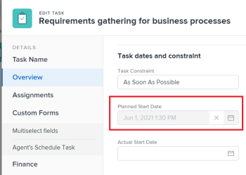

# Übersicht über die Projekt-, Aufgaben- und Problemdaten in [!DNL Adobe Workfront]

<!--

(NOTE: consider expanding on this article with ALL dates for PTIs - Hand off dates, Approval Dates, etc) 

-->

Dieser Artikel enthält Definitionen zu den häufigsten Daten, die mit Projekten, Aufgaben und Problemen in [!DNL Adobe Workfront]. Die hier enthaltenen Bilder zeigen, wo die Daten in Workfront angezeigt werden und nicht vollständig sind. Es gibt andere Bereiche, in denen die Daten angezeigt werden. Alle Daten sind auch in Projekt-, Aufgaben- und Problemberichten und Listen sichtbar.

Informationen zu Berichten und Listen finden Sie in den folgenden Artikeln:

* [Erste Schritte mit Listen in [!DNL Adobe Workfront]](../../../workfront-basics/navigate-workfront/use-lists/view-items-in-a-list.md)
* [Erste Schritte mit Berichten](../../../reports-and-dashboards/reports/reporting/get-started-reports-workfront.md)

Weitere Informationen zu Projekt-, Aufgaben- und Problemfeldern finden Sie unter [Glossar [!DNL Adobe Workfront] Terminologie](../../../workfront-basics/navigate-workfront/workfront-navigation/workfront-terminology-glossary.md).

## [!UICONTROL Geplantes Startdatum]

Die [!UICONTROL Geplantes Startdatum] ist das Datum, an dem ein Projekt, eine Aufgabe oder ein Problem beginnen soll.

Je nach [!UICONTROL Aufgabenbegrenzung], können Sie die [!UICONTROL Geplantes Startdatum] einer Aufgabe. Je nach [!UICONTROL Planmodus] des Projekts können Sie die [!UICONTROL Geplantes Startdatum] eines Projekts.

Weitere Informationen finden Sie unter [Überblick über das Projekt [!UICONTROL Geplantes Startdatum]](../../../manage-work/projects/planning-a-project/project-planned-start-date.md).

## [!UICONTROL Geplantes Abschlussdatum]

Die [!UICONTROL Geplantes Abschlussdatum] oder [!UICONTROL aufgrund von] date ist das Datum, an dem ein Projekt, eine Aufgabe oder ein Problem abgeschlossen werden soll.

Je nach [!UICONTROL Aufgabenbegrenzung], können Sie die [!UICONTROL Geplantes Abschlussdatum] einer Aufgabe. Je nach [!UICONTROL Planmodus] des Projekts können Sie die [!UICONTROL Geplantes Abschlussdatum] eines Projekts.

Die [!UICONTROL Geplantes Abschlussdatum] wird in einigen Bereichen von [!DNL Workfront].

Weitere Informationen finden Sie in den folgenden Artikeln:

* [Übersicht über die Aufgabe [!UICONTROL Geplantes Abschlussdatum]](../../../manage-work/tasks/task-information/task-planned-completion-date.md)
* [Festlegen des Projekts [!UICONTROL Geplantes Abschlussdatum]](../../../manage-work/projects/planning-a-project/project-planned-completion-date.md)
* [Überblick über das Problem [!UICONTROL Geplantes Abschlussdatum]](../../../manage-work/issues/issue-information/issue-planned-completion-date.md)

## [!UICONTROL Datum der Einsendung]

Die [!UICONTROL Datum der Einsendung] ist das Datum, an dem ein Projekt, eine Aufgabe oder ein Problem in Workfront erstellt wurde.

Die [!UICONTROL Datum der Einsendung] hat keinen Einfluss auf die Zeitleiste von Projekten, Aufgaben oder Problemen, ist jedoch für Tracking- und Berichtszwecke wichtig. [!DNL Workfront] generiert automatisch das [!UICONTROL Datum der Einsendung] wenn das Objekt erstellt wurde und Sie es nicht manuell bearbeiten können.

## [!UICONTROL Tatsächliches Startdatum]

Die [!UICONTROL Tatsächliches Startdatum] ist das Datum, an dem ein Benutzer mit der Arbeit an einem Projekt, einer Aufgabe oder einem Problem beginnt. Die [!UICONTROL Tatsächliches Startdatum] leer ist, wenn das Projekt, die Aufgabe oder das Problem erstellt wird.

Sie können manuell angeben, wann die Arbeit an einer Aufgabe oder einem Problem begonnen hat, oder [!UICONTROL Tatsächliches Startdatum] wird automatisch ausgefüllt, wenn sich der Status der Aufgabe oder des Problems von [!UICONTROL Neu] nach [!UICONTROL In Bearbeitung] oder [!UICONTROL Fertig]. Die [!UICONTROL Tatsächliches Startdatum] eines Projekts entspricht dem Datum, an dem die erste Aufgabe im Projekt beginnt.

>[!TIP]
>
>Die [!UICONTROL Tatsächliches Startdatum] kann nicht mit einer [!UICONTROL Geplantes Startdatum] eines Projekts, einer Aufgabe oder eines Problems, da der Benutzer die Arbeit möglicherweise später oder früher als geplant starten kann.

Weitere Informationen finden Sie unter [Überblick über das Projekt [!UICONTROL Tatsächliches Startdatum]](../../../manage-work/projects/planning-a-project/project-actual-start-date.md).

>[!NOTE]
>
>Die [!UICONTROL Muss beginnen bei] -Aufgabe oder die Beschränkungen für feste Datumswerte wirken sich auf die [!UICONTROL Geplantes Startdatum] einer Aufgabe, nicht der [!UICONTROL Tatsächliches Startdatum]. Dadurch wird die [!UICONTROL Geplantes Startdatum] zu einem von Ihnen angegebenen Datum. Die [!UICONTROL Tatsächliches Startdatum] unabhängig von der [!UICONTROL Geplantes Startdatum], wie oben beschrieben.

## [!UICONTROL Tatsächliches Abschlussdatum]

Die [!UICONTROL Tatsächliches Abschlussdatum] ist das Datum, an dem ein Benutzer ein Projekt, eine Aufgabe oder ein Problem tatsächlich abschließt. Die [!UICONTROL Tatsächliches Abschlussdatum] leer ist, wenn das Projekt, die Aufgabe oder das Problem erstellt wird.

Sie können manuell angeben, wann die Arbeit an einer Aufgabe, einem Problem oder dem [!UICONTROL Tatsächliches Abschlussdatum] wird automatisch ausgefüllt, wenn eines der folgenden Ereignisse eintritt:

* Der Projekt-, Aufgaben- oder Problemstatus ändert sich in [!UICONTROL Fertig], [!UICONTROL Geschlossen]oder [!UICONTROL Gelöst].
* Der prozentuale Abschluss der Aufgabe bzw. des Projekts beträgt 100 %.

Die [!UICONTROL Tatsächliches Abschlussdatum] eines Projekts entspricht dem Datum, an dem Sie die letzte Aufgabe im Projekt abgeschlossen haben.

>[!TIP]
>
>Die [!UICONTROL Tatsächliches Abschlussdatum] kann nicht mit der [!UICONTROL Geplantes Abschlussdatum].

Weitere Informationen finden Sie unter [Überblick über das Projekt [!UICONTROL Tatsächliches Abschlussdatum]](../../../manage-work/projects/planning-a-project/project-actual-completion-date.md).

## [!UICONTROL Datum der Übermittlung]

Die [!UICONTROL Datum der Übermittlung] ist das Datum, bis zu dem ein Benutzer, der einer Aufgabe zugewiesen ist, oder ein Problem verpflichtet, die Aufgabe oder das Problem abzuschließen. Dies unterscheidet sich von der [!UICONTROL Geplantes Abschlussdatum], da es sich um eine realistischere Schätzung des Fertigstellungsdatums handelt, das nur vom für die Arbeit verantwortlichen Benutzer angegeben wird. Weitere Informationen finden Sie unter [[!UICONTROL Datum der Übermittlung] Übersicht](../../../manage-work/projects/updating-work-in-a-project/overview-of-commit-dates.md).

>[!NOTE]
>
>Ändern der [!UICONTROL Datum der Übermittlung] betrifft die [!UICONTROL Voraussichtlicher Abschluss] aber nicht [!UICONTROL Geplantes Abschlussdatum] einer Aufgabe oder eines Problems. Der Projektmanager kann die Änderungen verwenden, die ein Verantwortlicher an der [!UICONTROL Datum der Übermittlung] , um die [!UICONTROL Geplantes Abschlussdatum] einer Aufgabe oder eines Problems.

## [!UICONTROL Projiziertes Startdatum]

Die [!UICONTROL Projiziertes Startdatum] ist ein Echtzeit-Datum, an dem das Projekt, die Aufgabe oder die Ausgabe erfolgt und alle Verzögerungen berücksichtigt werden. Dies ist ein genaueres Startdatum für das Projekt, die Aufgabe oder das Problem als das [!UICONTROL Geplantes Startdatum]. Die [!UICONTROL Geplantes Startdatum] berücksichtigt keine Verzögerungen oder vergangene Daten.

Bei der ersten Planung eines Projekts wird die [!UICONTROL Geplantes Startdatum] und [!UICONTROL Projiziertes Startdatum] der Aufgaben und des Projekts identisch sind. Da Verzögerungen auftreten können oder Aufgaben früher abgeschlossen werden können, wird die [!UICONTROL Projiziertes Startdatum] kann sich von der [!UICONTROL Geplantes Startdatum].

Bei einer Aufgabe wird eine [!UICONTROL Projiziertes Startdatum] kann auch [!UICONTROL Geplantes Startdatum] wenn einer seiner Vorgänger hinter dem Zeitplan steht.

>[!TIP]
>
>Sie können die [!UICONTROL Projiziertes Startdatum] eines Problems, das nur in einer Liste oder einem Bericht enthalten ist.

Weitere Informationen finden Sie unter [Überblick über das Projekt [!UICONTROL Projiziertes Startdatum]](../../../manage-work/projects/planning-a-project/project-projected-start-date.md).

## [!UICONTROL Voraussichtlicher Abschluss]

Die [!UICONTROL Voraussichtlicher Abschluss] ist ein berechneter Echtzeitindikator dafür, wann das Projekt, die Aufgabe oder das Problem abgeschlossen sein wird. Wenn das Projekt, die Aufgabe oder das Problem als abgeschlossen markiert ist, wird die [!UICONTROL Voraussichtlicher Abschluss] Änderungen am Datum der [!UICONTROL Tatsächliches Abschlussdatum].

Wenn alles reibungslos und planmäßig verläuft, wird die [!UICONTROL Voraussichtlicher Abschluss] sollte mit dem [!UICONTROL Geplantes Abschlussdatum]. Andernfalls aufgrund der Verzögerungen bei den Aufgaben des Vorgängers [!UICONTROL Voraussichtlicher Abschluss] kann sich von der [!UICONTROL Geplantes Abschlussdatum].

Weitere Informationen finden Sie unter [Übersicht über die [!UICONTROL Voraussichtlicher Abschluss] für Projekte, Aufgaben und Probleme](../../../manage-work/projects/planning-a-project/project-projected-completion-date.md).

## [!UICONTROL Stündlicher Eingangsdatum]

Wenn Sie die Zeit für Projekte, Aufgaben und Probleme protokollieren, um anzugeben, wie viel Zeit (in Stunden) Sie mit der Arbeit an dem Projekt, der Aufgabe oder dem Problem verbringen, wird die Zeit für die Protokollierung zur [!UICONTROL Tatsächliche Stunden] des Projekts, der Aufgabe oder des Problems.

Das Datum, an dem Sie die Uhrzeit protokollieren, ist die [!UICONTROL Stündlicher Eingangsdatum] auf dem Stundeneintrag. In einigen Stundenlisten und Berichten wird das stündliche Einstiegsdatum als Datum angezeigt.

>[!TIP]
>
>Die [!UICONTROL Stündlicher Eingangsdatum] unterscheidet sich vom [!UICONTROL Datum der Einsendung] nicht das Datum, an dem das Stundenprotokoll erstellt wurde, sondern das Datum, mit dem Stunden verknüpft werden sollen.

Sie können die Zeit in den folgenden Bereichen von Workfront protokollieren und anzeigen:

* Protokoll- und Anzeigezeit in [!UICONTROL Projekt], [!UICONTROL Aufgabe]oder [!UICONTROL Problemaktualisierungen] oder im Abschnitt [!UICONTROL Stunden] Abschnitt. Beim Protokollieren der Zeit in [!UICONTROL Stunden] -Abschnitt können Sie manuell das Einstiegsdatum und den Benutzer, zu dem die Stunden gehören, angeben.

  

  Weitere Informationen finden Sie unter [Protokollzeit](../../../timesheets/create-and-manage-timesheets/log-time.md).

  >[!TIP]
  >
  >Es wird empfohlen, keine übergeordneten Aufgaben oder Projekte mehr mit Arbeitsaufgaben und Problemen zu protokollieren. Die bei den Arbeitsaufgaben angemeldete Zeit wird zu den übergeordneten Aufgaben und dem Projekt als [!UICONTROL Tatsächliche Stunden] für die übergeordneten Aufgaben und das Projekt. Die bei Problemen angemeldete Zeit wird als [!UICONTROL Tatsächliche Stunden] für das Projekt.

* Protokollieren der Zeit im Aktualisierungsstream einer Aufgabe oder eines Problems.

  

* Anzeigen der [!UICONTROL Stündliche Eintrittstage] in Stunden-Berichten und -Listen.

  
