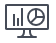

# Übersicht über [!DNL Adobe Workfront]

<!--Audited: 12/2023-->

<!--
<***Linked to several articles, do not remove/ change. 
-->

Die in [!DNL Adobe Workfront] angezeigten Informationen werden durch Objekte dargestellt, die in der [!DNL Workfront] Datenbank gespeichert sind. Die Objekte sind es, die die Informationen in [!DNL Workfront] antreiben.

Es ist wichtig zu verstehen, wie die Objekte in [!DNL Workfront] definiert werden, damit Sie das richtige Objekt für die Anforderungen in Ihrem Unternehmen verwenden können.

Wenn Sie z. B. einen großen Arbeitsaufwand planen, müssen Sie das [!UICONTROL Projektobjekt] verwenden, um diesen Arbeitsaufwand zu definieren. Um diese Arbeit in kleinere geplante Inkremente zu unterteilen, können Sie das Objekt [!UICONTROL Aufgabe] verwenden. Für einen kleineren Arbeitsaufwand, der nicht geplant ist und unerwartet auftreten kann, können Sie das Objekt „Problem“ verwenden. Wenn Sie den Fortschritt und die Einhaltung von Budget und Zeitplan einer Gruppe von Projekten verfolgen möchten, können Sie sie in &quot;[!UICONTROL &quot; &#x200B;] &quot;[!UICONTROL &quot; &#x200B;]. Um andere Elemente zu definieren, die Sie bei der Bearbeitung unterstützen, sollten Sie andere Objekte verwenden, die unter [!UICONTROL Projekte], [!UICONTROL Aufgaben], [!UICONTROL Probleme] oder [!UICONTROL Portfolios] gespeichert sind, z. B. [!UICONTROL Dokumente], [!UICONTROL Updates], [!UICONTROL Stunden], [!UICONTROL Benutzer] oder [!UICONTROL Aufgabengebiete].

[!UICONTROL Berichte] und [!UICONTROL Dashboards] sind ein weiteres Beispiel für Objekte, mit denen Sie die Datenmenge in [!DNL Workfront] visuell organisieren können, um sie für alle Benutzer leicht zugänglich zu machen.

Eine vollständige Liste der Objekte in [!DNL Workfront] finden Sie im [API-Explorer](../../../wf-api/general/api-explorer.md).

## Interdependenz und Hierarchie der Objekte

Objekte sind in [!UICONTROL Workfront] miteinander verknüpft. Beispielsweise kann eine Aufgabe oder ein Problem niemals unabhängig außerhalb eines Projekts vorhanden sein. [!UICONTROL Aufgaben] und [!UICONTROL Probleme] sind Beispiele für Objekte, die im [!UICONTROL Projekt]Objekt gespeichert sind. [!UICONTROL Aufgaben] und [!UICONTROL Probleme] werden als untergeordnete Objekte von Projekten betrachtet.

Im Folgenden finden Sie einige der am häufigsten verwendeten Objekte in [!DNL Workfront] und die entsprechenden übergeordneten und untergeordneten Objekte:

| **Objekt** | **Übergeordnete Objekte** | **Untergeordnete Objekte** |
|---|---|---|
| [!UICONTROL Portfolios] |  | [!UICONTROL Programme], [!UICONTROL Projekte], [!UICONTROL Dokumente], [!DNL Notes], [!UICONTROL Benutzer] |
| [!UICONTROL Programme] | [!UICONTROL Portfolios] | [!UICONTROL Projekte], [!UICONTROL Dokumente], [!UICONTROL Anmerkungen], [!UICONTROL Benutzer] |
| [!UICONTROL Projekte] | [!UICONTROL Portfolios], [!UICONTROL Programme] | [!UICONTROL Aufgaben], [!UICONTROL Probleme], [!UICONTROL Dokumente], [!UICONTROL Anmerkungen], [!UICONTROL Stunden], [!UICONTROL Benutzer] |
| [!UICONTROL Aufgaben] | [!UICONTROL Projekte] | [!UICONTROL Probleme], [!UICONTROL untergeordnete Aufgaben], [!UICONTROL Dokumente], [!UICONTROL Anmerkungen], [!UICONTROL Stunden], [!UICONTROL Benutzer] |
| [!UICONTROL Probleme] | [!UICONTROL Aufgaben], [!UICONTROL Projekte] | [!UICONTROL Dokumente], [!UICONTROL Notizen], [!UICONTROL Stunden], [!UICONTROL Benutzer] |
| [!UICONTROL Dashboards] |  | [!UICONTROL Berichte], externe Seiten |
| [!UICONTROL Berichte] | [!UICONTROL Dashboards] |  |
| [!UICONTROL Gruppen] |  | [!UICONTROL Benutzende] |
| [!UICONTROL Teams] |  | [!UICONTROL Benutzende] |
| [!UICONTROL Benutzende] | [!UICONTROL Gruppen], [!UICONTROL Teams], [!UICONTROL Firmen] | [!UICONTROL Aufgabengebiete] |
| [!UICONTROL Firmen] |  | [!UICONTROL Benutzende] |
| [!UICONTROL Dokumente] | [!UICONTROL Aufgaben], [!UICONTROL Probleme], [!UICONTROL Projekte], [!UICONTROL Portfolios], [!UICONTROL Programme], [!UICONTROL Benutzer] |  |
| [!UICONTROL Pläne]* |  | [!UICONTROL Initiativen] |
| [!DNL Goals]* |  | [!UICONTROL Ergebnisse], [!UICONTROL Aktivitäten] |

Eine vollständige Liste der Objekte in [!DNL Workfront] finden Sie im [API-Explorer](../../../wf-api/general/api-explorer.md).

*Pläne sind die Objekte der [!DNL Adobe Workfront Scenario Planner]. Weitere Informationen zum [!DNL Scenario Planner] finden Sie unter [Der [!UICONTROL Szenarioplaner] - Übersicht](../../../scenario-planner/scenario-planner-overview.md).

*[!UICONTROL Ziele] sind Objekte von [!DNL Adobe Workfront Goals]. Weitere Informationen zu [!DNL Workfront Goals] finden Sie unter [[!DNL Adobe Workfront Goals] Übersicht](../../../workfront-goals/goal-management/wf-goals-overview.md).

## Anpassen von Objektnamen

Als [!DNL Workfront] können Sie Objektnamen in [!DNL Workfront] mithilfe einer „Layout[!UICONTROL Vorlage“ &#x200B;].

Weitere Informationen zum Anpassen von Objektnamen mithilfe einer [!UICONTROL Layout-Vorlage] finden Sie unter [Erstellen und Verwalten von Layout-Vorlagen](../../../administration-and-setup/customize-workfront/use-layout-templates/create-and-manage-layout-templates.md).

Nachdem Sie eine Layout-Vorlage angepasst und Benutzern zugewiesen haben, sehen diese Benutzer die benutzerdefinierten Namen für die Objekte. Die Benutzer, die der Layout-Vorlage zugewiesen wurden, sehen an keiner Stelle im Web-Programm mehr die Standardnamen für die Objekte.

Wenn beispielsweise der größere Arbeitsaufwand in Ihrer Organisation als „Interaktion“ bezeichnet wird, können Sie den Namen &quot;[!UICONTROL Projekt] durch „Interaktion“ ersetzen. Auf Ihrer [!DNL Workfront] wird überall dort „Interaktion“ anstelle [!UICONTROL &#x200B; „Projekt] angezeigt, wo der Name [!UICONTROL Projekt] angezeigt würde.

>[!NOTE]
>
>Damit die neuen Namen der Objekte für Ihre Benutzer sichtbar sind, müssen sie sich nach dem Speichern der [!UICONTROL Layout-Vorlage“ ab- und wieder bei [!DNL Workfront] &#x200B;].

>[!IMPORTANT]
>
>Die [!DNL Workfront] Dokumentation bezieht sich immer auf die Standardnamen der Objekte. Stellen Sie als [!DNL Workfront]-Admin sicher, dass Sie die Benutzenden über die Änderungen der Objektnamen informieren, damit sie verstehen können, wie die [!DNL Workfront]-Dokumentation verwendet wird, sowie über die Bereiche der Anwendungen, die die Änderungen der Objektnamen nicht widerspiegeln.

* [Objektnamen, die mit einer „Layout[!UICONTROL Vorlage“ angepasst werden &#x200B;]](#object-names-that-can-be-customized-using-a-layout-template)
* [Bereiche von  [!DNL Workfront] , die die benutzerdefinierten Objektnamen widerspiegeln](#areas-of-workfront-that-reflect-the-customized-object-names)
* [Bereiche von  [!DNL Workfront] , die nicht den benutzerdefinierten Objektnamen entsprechen](#areas-of-workfront-that-do-not-reflect-the-customized-object-names)

### Objektnamen, die mit einer „Layout[!UICONTROL Vorlage“ angepasst werden &#x200B;]

Als [!DNL Workfront] können Sie die Namen der folgenden Objekte an die Terminologie in Ihrer Organisation anpassen:

* [!UICONTROL Portfolio]
* [!UICONTROL Programm]
* [!UICONTROL Projekt]
* [!UICONTROL Aufgabe]
* [!UICONTROL Probleme]
* [!UICONTROL Ziel]*
* [!UICONTROL Ergebnis]*
* [!UICONTROL Aktivität]*

  *[!UICONTROL Ziele], [!UICONTROL Ergebnisse] und [!UICONTROL Aktivitäten] sind nur verfügbar, wenn Ihr Unternehmen [!DNL Workfront Goals] erworben hat. Weitere Informationen zu [!DNL Workfront Goals] finden Sie unter [[!DNL Adobe Workfront Goals] Übersicht](../../../workfront-goals/goal-management/wf-goals-overview.md).

* [!UICONTROL Initiative]**
* [!UICONTROL Szenario]**
* [!UICONTROL Plan]**

  **[!UICONTROL Initiativen], [!UICONTROL Szenarien] und [!UICONTROL Pläne] sind nur verfügbar, wenn Ihr Unternehmen die [!DNL Workfront Scenario Planner] erworben hat. Weitere Informationen zum [!DNL Scenario Planner] finden Sie unter [Erste Schritte mit dem [!DNL Scenario Planner]](../../../scenario-planner/get-started-with-scenario-planning.md).

Weitere Informationen zum Anpassen von Objektnamen mithilfe von [!UICONTROL Layout-Vorlagen] finden Sie unter [Erstellen und Verwalten von Layout-Vorlagen](../../../administration-and-setup/customize-workfront/use-layout-templates/create-and-manage-layout-templates.md).

Sie können die Namen von anderen Objekten in Workfront nicht anpassen. Eine vollständige Liste der Objekte in [!DNL Workfront] finden Sie im [API-Explorer](../../../wf-api/general/api-explorer.md).

Wenn Sie den Namen eines Objekts anpassen, wird der neue Name für dieses Objekt in den meisten Bereichen der [!DNL Workfront]-Anwendung angezeigt, in denen dieser Objektname erscheinen würde.

### [!DNL Workfront], die die benutzerdefinierten Objektnamen widerspiegeln

Die folgenden Bereiche zeigen den aktualisierten Namen der Objekte an:

* Navigation oben
* Alle Abschnitte im Navigationsbereich des linken Bedienfelds
* Alle Menüs
* In-App-Benachrichtigungen
* Report Builder- und Berichterstellungselemente (Ansichten, Filter und Gruppierungen)
* [!UICONTROL Speichern] Schaltflächen
* Exportierte Dateien
* E-Mails
* Mobile Apps

### [!DNL Workfront], die nicht den benutzerdefinierten Objektnamen entsprechen

In den folgenden Bereichen wird der aktualisierte Name der Objekte nicht angezeigt:

<!--
  <li data-mc-conditions="QuicksilverOrClassic.Draft mode"> 
Referenced Object Type selection for a Typeahead field in a Custom Form 
 
(NOTE: drafting this because I don't think this is true)
 </li>
  -->

* [!DNL Outlook]-Add-in

### Auswirkungen der Anpassung von Objektnamen

Beachten Sie beim Anpassen von Objektnamen in [!DNL Workfront] Folgendes:

* In Systemanzeigen können stilistische oder grammatische Fehler auftreten. Wenn Sie z. B. &quot;[!UICONTROL Problem] in „Anfrage“ umbenennen und im System überall die Phrase „Eine Anfrage“ sehen, funktioniert dies wie beabsichtigt und sollte nicht als Fehler betrachtet werden.
* Ihre benutzerdefinierten Namen für die Objekte sind nicht übersetzbar. Nur die [!DNL Workfront] Standardnamen können in die unterstützten Sprachen übersetzt werden. Weitere Informationen zu Sprachen, die in [!DNL Workfront] unterstützt werden, finden Sie unter [Unterstützte Sprachen in [!DNL Adobe Workfront]](../../../workfront-basics/supported-languages-in-workfront.md). Die Felder für den benutzerdefinierten Objektnamen unterstützen Fremdzeichen, damit Sie Terminologie in jeder Sprache eingeben können.
* Beim Anpassen von Objektnamen mit einer [!UICONTROL Layout-Vorlage] empfehlen wir, Ihre [!UICONTROL Layout-Vorlagen] basierend auf Ihren Geschäftseinheiten (Teams oder Gruppen) zuzuweisen.\
   Es wird empfohlen, Namen zu verwenden, die von den Benutzern dieser Geschäftsbereiche klar verstanden werden, um Verwirrung zu vermeiden.
* E-Mail-Benachrichtigungen und zugestellte Berichte enthalten immer Objektnamen, wie sie in der [!UICONTROL Layout-Vorlage] des Benutzers definiert sind, der die E-Mail generiert. Ihre Benutzer sollten darauf vorbereitet sein, Objektnamen in ihren E-Mails zu sehen, die nicht zu ihrer Gruppe oder ihrem Team gehören, wenn sie E-Mail-Benachrichtigungen von Benutzern aus anderen Teams und Gruppen erhalten.\
   Als [!DNL Workfront]-Admin empfehlen wir Benutzenden, die mit den einzelnen Objekten verbundenen Symbole zu beachten. Die Symbole bleiben zwischen verschiedenen Objektnamen konsistent und entsprechen dem Standardobjekt, wie es in der Datenbank angezeigt wird. Eine Liste aller [!DNL Workfront], die mit Objekten verknüpft sind, finden Sie unter [Objektsymbole](#object-icons).

  >[!TIP]
  >
  >Für gängige Aufgaben in Ihrer Organisation sollten Sie ggf. eine benutzerdefinierte Dokumentation erstellen, die Ihrer Terminologie entspricht.

## Objektsymbole

Die [!DNL Workfront] Dokumentation bezieht sich immer auf die Standardnamen von Objekten. Wenn die Namen der Objekte angepasst wurden, können Sie sich auf das ihnen zugeordnete Symbol verlassen, um zu verstehen, welches benutzerdefinierte Objekt [!DNL Workfront] Standardobjekt entspricht.

Weitere Informationen dazu, welche Objekte in [!DNL Workfront] benutzerdefinierte Namen haben können, finden Sie unter [Objektnamen, die mit einer Layout-[!UICONTROL &#x200B; angepasst werden können]](#object-names-that-can-be-customized-using-a-layout-template).

Im Folgenden finden Sie eine Liste der Objekte und der zugehörigen Symbole in Workfront.

| **Objekt** | **Symbol** | **Anpassbarer Objektname** |
|---|---|---|
| [!UICONTROL Firma] |  ,  |  |
| [!UICONTROL Dashboard] |  ,  |  |
| [!UICONTROL Ziel] |  | ✔ |
| [!UICONTROL Gruppe] |  ,  |  |
| [!UICONTROL Probleme] |  ,  | ✔ |
| [!UICONTROL Aufgabengebiet] | , , ,  |  |
| [!UICONTROL Plan] | ,  |  |
| [!UICONTROL Portfolio] |  ,  | ✔ |
| [!UICONTROL Programm] |  ,  | ✔ |
| [!UICONTROL Projekt] |  ,  | ✔ |
| [!UICONTROL Bericht] |  ,  |  |
| [!UICONTROL Aufgabe] |  ,  | ✔ |
| [!UICONTROL Team] | ,  ,  |  |
| [!UICONTROL Vorlage] |  ,  |  |
| [!UICONTROL Benutzer] |  ,  ,  ,  ,  |  |

## Referenznummern von Objekten

Jedem in [!DNL Workfront] erstellten Objekt wird eine eindeutige Referenznummer zugewiesen. Referenznummern sind nützlich, um zwischen zwei ansonsten ähnlichen Objekten (z. B. Aufgaben mit demselben Namen) zu unterscheiden. Sie können anhand der Referenznummern nach Objekten suchen und Referenznummern in Berichte einfügen.

Informationen zum Suchen nach Objekten anhand der Referenznummer finden Sie unter [Verwenden der Referenznummer von Objekten](../../../workfront-basics/navigate-workfront/search/reference-number-of-objects.md).

## Objektspezifische Suchvorgänge

Sie können alle Objekte durchsuchen, die in [!DNL Workfront] durchsuchbar sind, oder Sie können ein bestimmtes Objekt auswählen, nach dem Sie in Ihren einfachen und erweiterten Suchen suchen möchten.

Nicht alle Objekte sind in [!DNL Workfront] durchsuchbar. Sie können in [!DNL Workfront] einfache und erweiterte Suchen nach den folgenden Objekten durchführen:

| **Objekt** | **Einfache Suche** | **Erweiterte Suche** |
|---|---|---|
| [!UICONTROL Projekte] | ✓ | ✓ |
| [!UICONTROL Aufgaben] | ✓ | ✓ |
| [!UICONTROL Probleme] | ✓ | ✓ |
| [!UICONTROL Berichte] | ✓ | ✓ |
| [!UICONTROL Benutzende] | ✓ | ✓ |
| [!UICONTROL Vorlagen] | ✓ | ✓ |
| [!UICONTROL Dokumente] | ✓ | ✓ |
| [!UICONTROL Portfolios] | ✓ | ✓ |
| [!UICONTROL Programme] | ✓ | ✓ |
| [!UICONTROL Dashboards] | ✓ | ✓ |
| [!UICONTROL Firmen] | ✓ | ✓ |
| [!UICONTROL Notizen] (oder [!UICONTROL Aktualisierungen]) | ✓ |  |

Weitere Informationen zum Ausführen einfacher und erweiterter Suchen in [!DNL Workfront] finden Sie unter [Suche [!DNL Adobe Workfront]](../../../workfront-basics/navigate-workfront/search/search-workfront.md).

## Eingeschränkter Zugriff auf Objekte

Wenn ein(e) Benutzende(r) keinen Zugriff auf ein Objekt hat, wird „Kein Zugriff“ überall dort angezeigt, wo der Objektname in Workfront angezeigt wird.

Der Zugriff auf Objekte kann in der Zugriffsebene oder in den Berechtigungen eines bestimmten Objekts eingeschränkt werden.

Dies gilt für alle Objekte und untergeordneten Objekte, die im Abschnitt [Interdependenz und Hierarchie der Objekte](#interdependency-and-hierarchy-of-objects) dieses Artikels aufgeführt sind. Dies gilt nicht für Team - und Benutzerobjekte.

## Bericht zu Objekten

Es ist sehr wichtig, die Hierarchie und Interdependenz von Objekten zu verstehen, bevor Sie mit der Erstellung von Berichten in [!DNL Workfront] beginnen. Berichte sind objektspezifisch. Sie müssen das richtige Objekt für Ihren Bericht auswählen, bevor Sie die gewünschten Daten anzeigen können.

>[!IMPORTANT]
>
>Sie können nur Berichte zu dem ausgewählten Objekt und den übergeordneten Objekten im selben Bericht erstellen. Sie können keine Informationen über die untergeordneten Objekte in einem übergeordneten Objektbericht haben. Sie können beispielsweise Projektinformationen in einem Aufgabenbericht anzeigen, jedoch keine Aufgabeninformationen in einem Projektbericht.

Sie können Berichte zu allen Objekten in der Datenbank mithilfe unserer offenen API erstellen. Eine vollständige Liste aller Objekte in der Datenbank finden Sie unter [API-Explorer](../../../wf-api/general/api-explorer.md).

>[!NOTE]
>
> * Wenn Sie die Namen Ihrer Objekte mithilfe einer Layout-Vorlage angepasst haben, wurden auch die Namen für das Objekt im Report Builder angepasst. Stellen Sie sicher, dass Sie wissen, welche Objekte angepasst wurden, und suchen Sie im Report Builder nach dem angepassten Namen. Weitere Informationen dazu, welche Objekte in [!DNL Workfront] benutzerdefinierte Namen haben können, finden Sie unter [Objektnamen, die mit einer [!UICONTROL Layout-Vorlage“ &#x200B;]](#object-names-that-can-be-customized-using-a-layout-template) diesem Artikel.
> * Wenn Sie in Ihren Berichten den Textmodus verwenden, sind die Namen der Objekte in Textmodusausdrücken die Standardnamen in [!DNL Workfront] und nicht die benutzerdefinierten Objektnamen. Weitere Informationen zur Verwendung des Textmodus in Berichten finden Sie unter [Textmodus - Übersicht](../../../reports-and-dashboards/reports/text-mode/understand-text-mode.md).

Weitere Informationen zum Erstellen eines Berichts finden Sie unter [Erstellen eines benutzerdefinierten Berichts](../../../reports-and-dashboards/reports/creating-and-managing-reports/create-custom-report.md).\
Weitere Informationen zu unserer API finden Sie unter [API Explorer](../../../wf-api/general/api-explorer.md).

### Für Berichte verfügbare Objekte

Bei Verwendung von Report Builder in der [!DNL Workfront]-Webanwendung können Sie Berichte zu den folgenden Objekten erstellen. Eingezogene Aufzählungspunkte geben weitere Informationen über das Objekt an und stellen keine zusätzlichen Objekte dar.

* [!UICONTROL Projekt]
* [!UICONTROL Aufgabe]
* [!UICONTROL Stunde]
* [!UICONTROL Probleme]
* [!UICONTROL Benutzer]
* [!UICONTROL Zugriffsebene]
* [!UICONTROL Genehmigung]
* [!UICONTROL Genehmigungsprozess]
* [!UICONTROL Zuweisung]
* [!UICONTROL Baseline]
* [!UICONTROL Baseline-Aufgabe]
* [!UICONTROL Rechnungsnachweis]
* [!UICONTROL Budgetierte Stunde]
   * Dies sind die [!UICONTROL budgetierten Stunden], wie sie in älteren, veralteten Ressourcenverwaltungstools angezeigt werden.
   * Der „Bud. Stunden“ im Bericht [!UICONTROL Budgetierte Stunde] bezieht sich auf die budgetierten Stunden für Aufgabengebiete im [!UICONTROL Ressourcenplaner]. Weitere Informationen finden Sie unter [[!UICONTROL Budgetierte Lohnkosten] und [!UICONTROL Budgetierte Stunden] für Projekte](../../../manage-work/projects/project-finances/budgeted-labor-cost.md).

* [!UICONTROL Kalenderereignis]
* [!UICONTROL Firma]
* [!UICONTROL Benutzerdefiniertes Formular]
* [!UICONTROL Dashboard]
* [!UICONTROL Dokument]
* [!UICONTROL Dokumentengenehmigung]
* [!UICONTROL Dokumentversion]
   * Sie können Informationen über die Dokumentversion, das Dokument, mit dem die Version verknüpft ist, die Person, die die Version erstellt hat, und den Benutzer, der den Korrekturabzug für die Dokumentversion erstellt hat (sofern vorhanden), anzeigen.
* [!UICONTROL E-Mail-Vorlage]
* [!UICONTROL Ausgabe]
* [!UICONTROL Ausgabentyp]
* [!UICONTROL Externe Seite]
* [!UICONTROL Favorit]
* [!UICONTROL filter]
* [!UICONTROL Ziel]
   * Sie können einen Bericht für strategische Ziele erstellen oder zielbezogene Informationen in einem Projektbericht anzeigen, wenn Projekte mit Zielen als Zielaktivitäten verknüpft sind. Nur wenn Ihr Unternehmen eine [!DNL Workfront Goals]-Lizenz erworben hat, können Sie strategische Ziele erstellen und Projekte miteinander verbinden. Weitere Informationen zu [!DNL Workfront Goals] finden Sie unter [[!DNL Workfront Goals] Übersicht](../../../workfront-goals/goal-management/wf-goals-overview.md). Informationen zum Verbinden von Projekten mit strategischen Zielen finden Sie unter [Hinzufügen von Projekten zu Zielen in Adobe Workfront Goals](../../../workfront-goals/results-and-activities/connect-projects-to-goals-overview.md).
* Sie können keine Berichte zu Projektzielen erstellen, die mit einem &quot;[!UICONTROL &quot; verknüpft &#x200B;]. Informationen zu Projektzielen und strategischen Zielen finden Sie im [Glossar der  [!DNL Adobe Workfront] -Terminologie](../../../workfront-basics/navigate-workfront/workfront-navigation/workfront-terminology-glossary.md).

* [!UICONTROL Gruppe]
* [!UICONTROL Gruppierung]
* [!UICONTROL Stundentyp]
* [!UICONTROL Initiative]
   * Sie können einen Bericht nur dann für Initiativen erstellen, die untergeordnete Elemente eines Plans sind, wenn Ihr Unternehmen eine [!DNL Workfront Scenario Planner] Lizenz erworben hat. Informationen zu Initiativen finden Sie unter [Überblick über Initiativen in der [!DNL Workfront Scenario Planner]](../../../scenario-planner/initiatives-overview.md).

* Aufgabengebiet für Initiative
   * Sie können nur dann einen Bericht für die Aufgabengebiete erstellen, die mit den Initiativen in einem Plan verknüpft sind, wenn Ihr Unternehmen eine [!DNL Workfront Scenario Planner] Lizenz erworben hat. Informationen zum Erstellen von Initiativen und deren Verknüpfung mit Aufgabengebieten finden Sie unter [Erstellen und Bearbeiten von Initiativen in der [!DNL Workfront Scenario Planner]](../../../scenario-planner/create-and-edit-initiatives.md).

* [!UICONTROL Iteration]
* [!UICONTROL Aufgabengebiet]
* [!UICONTROL Tagebucheintrag]
   * Sie können Berichte zu verfolgten Systemaktualisierungen im Bereich [!UICONTROL Aktualisierungen] von Objekten wie Aufgaben, Projekten, Problemen usw. erstellen. Weitere Informationen finden Sie unter [Bericht im Bereich Aktualisierungen mit einem Journaleintragsbericht](../../../reports-and-dashboards/reports/creating-and-managing-reports/create-journal-entry-report.md).

* [!UICONTROL Layoutvorlage]
* [!UICONTROL Meilenstein]
* [!UICONTROL Meilensteinpfad]
* [!UICONTROL Hinweis] oder [!UICONTROL Aktualisierungen]
   * Sie können Berichte zu Kommentaren erstellen, die von einzelnen Benutzern hinzugefügt wurden.

* [!UICONTROL Parameter] (oder [!UICONTROL benutzerdefiniertes Feld])
* [!UICONTROL Parametergruppe] (oder [!UICONTROL Abschnittsumbruch])
* [!UICONTROL Portfolio]
* [!UICONTROL Programm]
* [!UICONTROL Projekt (Finanzdaten)]
   * Finanzinformationen werden nur dann in [!UICONTROL Projekt (Finanzdaten) ausgefüllt] wenn die damit verbundenen Daten weniger als 5 Jahre alt sind. Wenn beispielsweise einer Aufgabe im Januar 2015 ein Aufgabengebiet zugewiesen wurde und heute der September 2021 ist, wird ein Finanzfeld wie [!UICONTROL Zuordnungsdatum] für das Aufgabengebiet nicht im Bericht [!UICONTROL Projekt (Finanzdaten)] ausgefüllt.

  >[!CAUTION]
  >
  >Durch die Ausführung eines Projektberichts (Finanzdaten) werden Ihre Finanzdaten neu berechnet, wodurch frühere Finanzdaten überschrieben werden können und dies unter Umständen sehr viel Zeit in Anspruch nimmt. Weitere Informationen zu den Folgen der Neuberechnung von Finanzdaten finden Sie unter [Projektfinanzen neu berechnen](/help/quicksilver/manage-work/projects/project-finances/recalculate-project-finances.md).

* [!UICONTROL Korrekturabzug-Genehmigung]
   * Ermöglicht die Anzeige verschiedener Informationen zur Korrekturabzugs-Genehmigung, einschließlich: des zur Genehmigung übermittelten Korrekturabzugs, Informationen zum [!UICONTROL Genehmiger], Informationen zum Anfordernden (wenn der Anfordernde ein lizenzierter [!DNL Workfront] ist), Versionsinformationen, die Korrekturabzugs-ID und das Erstellungsdatum des Korrekturabzugs.\
      [!UICONTROL Korrekturabzugsgenehmigung] enthalten nur Korrekturabzüge, die in den Bereichen Meine Arbeit der Benutzenden verfügbar sind, für die noch keine Entscheidungen getroffen wurden.\
   * Genehmigungen von Korrekturabzügen werden in [!DNL Workfront] wie [Benutzer zu einem Korrekturabzug hinzufügen](../../../review-and-approve-work/proofing/managing-proofs-within-workfront/share-a-proof-in-workfront.md#add) unter [Freigeben eines Korrekturabzugs für [!DNL Adobe Workfront]](../../../review-and-approve-work/proofing/managing-proofs-within-workfront/share-a-proof-in-workfront.md) beschrieben zugewiesen.

* [!UICONTROL Warteschlange]
* [!UICONTROL Warteschlangenthema]
* [!UICONTROL Rate] (zeigt Aufgabengebiet [!UICONTROL Abrechnungssatz] an)
* [!UICONTROL Erinnerungsnachricht]
* [!UICONTROL Bericht]
* [!UICONTROL Ressourcenpool]
* [!UICONTROL Risiko]
* [!UICONTROL Risikotyp]
* [!UICONTROL Zeitplan]
* [!UICONTROL Scorecard]
* [!UICONTROL Team]
* [!UICONTROL Vorlage]
* [!UICONTROL Vorlagenaufgabe]
* [!UICONTROL Ausfallzeit]
   * Sie können Berichte zu den Urlaubszeiten der Benutzenden erstellen, wie vom jeweiligen Profil des/r Benutzenden angegeben.

* [!UICONTROL Arbeitszeittabelle]
* [!UICONTROL Arbeitszeittabellen-Profil]
* [!UICONTROL Themengruppe]
* [!UICONTROL Benutzergenehmigung]
* [!UICONTROL Benutzerdelegierung]

   * Sie können Berichte zu Benutzern erstellen, die delegiert wurden, um die Aufgaben und Probleme anderer auszuführen, während sie nicht im Büro sind. Dieser Bericht zeigt die Person an, die nicht im Büro ist, sowie die Person, die ihre Pflichten erfüllt, während sie nicht anwesend ist.

* [!UICONTROL Benutzerentscheidungen]

   * Sie können berichten, wie viele Entscheidungen Benutzer im aktuellen Monat in Bezug auf Korrekturabzüge und Dokumente getroffen haben.

* [!UICONTROL Anzeigen]
* [!UICONTROL Arbeitselement] (dadurch wird ein Bericht zu Aufgaben und Problemen erstellt)
