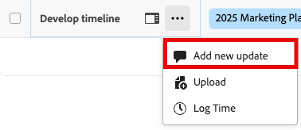

# Hinzufügen und Anzeigen von Kommentaren unter Prioritäten

Sie können eine Aktualisierung zu einer Aufgabe oder einem Problem hinzufügen, um anderen über den Fortschritt des Arbeitselements zu kommunizieren.

Mit Priorität werden die Ihnen zugewiesenen Arbeitselemente angezeigt. Sie können keine Arbeitselemente sehen, die Ihrem Team zugewiesen sind.

## Zugriffsanforderungen

+++ Erweitern Sie , um die Zugriffsanforderungen für die -Funktion in diesem Artikel anzuzeigen.

Sie müssen über folgenden Zugriff verfügen, um die Schritte in diesem Artikel ausführen zu können:

<table style="table-layout:auto"> 
 <col> 
 </col> 
 <col> 
 </col> 
 <tbody> 
  <tr> 
   <td role="rowheader"><strong>Adobe Workfront-Plan</strong></td> 
   <td> 
Beliebig
 </td> 
  </tr> 
  <tr> 
   <td role="rowheader"><strong>Adobe Workfront-Lizenz*</strong></td> 
   <td> 
   
Aktuell: Anfrage oder höher für Anfragen <!--and documents-->; Überprüfung oder höher für alle anderen Objekte

   
Neu: Mitwirkender oder höher für Probleme <!--and documents-->: Leicht oder höher für alle anderen Objekte
 
   </td> 
  </tr> 
  <tr> 
   <td role="rowheader"><strong>Konfigurationen der Zugriffsebene</strong></td> 
   <td> 
Anzeigen- oder Bearbeitungszugriff für das Objekt, auf dem die Aktualisierung ausgeführt wird
</td> 
  </tr> 
  <tr> 
   <td role="rowheader"><strong>Objektberechtigungen</strong></td> 
   <td> 
Anzeigen des Zugriffs auf das Objekt
</td> 
  </tr> 
 </tbody> 
</table>

*Weitere Informationen finden Sie unter [Zugriffsanforderungen in der Dokumentation zu Workfront](/help/quicksilver/administration-and-setup/add-users/access-levels-and-object-permissions/access-level-requirements-in-documentation.md).

+++

## Kurzkommentar hinzufügen

Sie können einen Kommentar aus der Arbeitsliste hinzufügen:

{{step1-to-priorities}}

1. Suchen Sie das Arbeitselement, das Sie aktualisieren möchten.
1. Bewegen Sie den Mauszeiger über den Namen und klicken Sie dann auf **Neues Update hinzufügen**.
   
   <!--new screen for prod -->
1. Beginnen Sie mit der Eingabe Ihres Kommentars.
1. (Optional) Geben Sie in das Feld **Personen oder Teams taggen** den Namen oder die E-Mail-Adresse eines Benutzers oder eines Teams ein, das Sie in diesen Kommentar einbeziehen möchten, und wählen Sie es aus, wenn es in der Liste angezeigt wird.
1. (Optional) Verwenden Sie die Optionen in der Rich-Text-Symbolleiste, um Ihren Text zu formatieren, Ihrem Kommentar Emojis, Links oder Bilder hinzuzufügen, um Ihre Inhalte zu verbessern.
1. Klicken Sie **Senden**, um den Kommentar zum Arbeitselement hinzuzufügen.

   >[!IMPORTANT]
   >
   >Sie können Ihren Kommentar nur innerhalb von 15 Minuten nach seiner Übermittlung bearbeiten. Um einen Kommentar zu bearbeiten, klicken Sie auf das **Mehr**-Menü in der oberen rechten Ecke des Kommentars und dann auf **Bearbeiten**.

Weitere Informationen zum Hinzufügen von Aktualisierungen finden Sie unter [Hinzufügen einer Aktualisierung zu einem Arbeitselement](/help/quicksilver/workfront-basics/updating-work-items-and-viewing-updates/update-work.md).

## Anzeigen und Hinzufügen von Kommentaren und Systemaktualisierungen in einem Arbeitselement

Sie können Kommentare hinzufügen und Kommentare und Systemaktualisierungen in einem einzelnen Arbeitselement anzeigen:

{{step1-to-priorities}}

1. Klicken Sie auf den Namen eines Arbeitselements, um die Seite **Übersicht** zu öffnen.
1. Suchen Sie den **Updates** in der rechten unteren Ecke des Bildschirms.
1. (Optional) Verwenden Sie die **Kommentare**, um Aktualisierungen anzuzeigen, die andere im Arbeitselement vorgenommen haben.
1. (Optional) Auf der Registerkarte **Systemaktivität** können Sie die Systemaktivität im Zusammenhang mit dem Arbeitselement anzeigen.
1. (Optional) Um einen Kommentar hinzuzufügen, wechseln Sie zur Registerkarte **Kommentar** und beginnen Sie mit der Eingabe in das Feld **Neuer Kommentar**. Klicken Sie **Absenden** wenn Sie fertig sind.
   

## Auf einen Kommentar antworten

Sie können auf einen Kommentar in einem Arbeitselement antworten:

{{step1-to-priorities}}

1. Klicken Sie auf den Namen eines Arbeitselements, um die Seite **Übersicht** zu öffnen.
1. Suchen Sie den **Updates** in der rechten unteren Ecke des Bildschirms.
1. Suchen Sie auf **Registerkarte** den Kommentar, auf den Sie antworten möchten, und klicken Sie dann auf **Antworten**.
1. (Bedingt) Wenn Sie den Inhalt einer Nachricht in Ihre Antwort übernehmen möchten, klicken Sie auf das **Mehr** Menüsymbol  neben dem Nachrichtentext und wählen Sie **Antwort zitieren**.

1. Geben Sie Ihre Antwort ein und klicken Sie dann auf **Senden**.

   >[!IMPORTANT]
   >
   >Sie können Ihren Kommentar nur innerhalb von 15 Minuten nach seiner Übermittlung bearbeiten. Um einen Kommentar zu bearbeiten, klicken Sie auf das **Mehr**-Menü in der oberen rechten Ecke des Kommentars und dann auf **Bearbeiten**.

   
