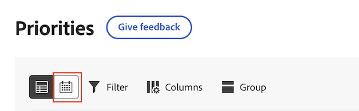
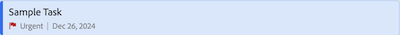

# Arbeiten im Prioritätskalender verwalten

Verfolgen Sie Ihre Arbeit einfach mit einem klaren, visuellen Kalender. Mit dem Prioritätskalender können Sie

* Verwenden von Filtern, um Ihre Arbeit zu finden
* Anwenden benutzerdefinierter Felder wie Status und Fokusebene zur Identifizierung von Arbeiten mit hoher Priorität
* Farben für schnelle Organisation anwenden

>[!IMPORTANT]
>
>Projekte müssen den Status „Aktuell“ oder einen Status aufweisen, der „Aktuell“ entspricht, damit Projekte sowie deren untergeordnete Aufgaben und Probleme angezeigt werden.

## Zugriffsanforderungen

+++ Erweitern Sie , um die Zugriffsanforderungen für die -Funktion in diesem Artikel anzuzeigen.

<table style="table-layout:auto"> 
 <col> 
 </col> 
 <col> 
 </col> 
 <tbody> 
  <tr> 
   <td role="rowheader">Adobe Workfront-Paket</td> 
   <td> 
Beliebig
 </td> 
  </tr> 
  <tr> 
   <td role="rowheader">Adobe Workfront-Lizenz</td> 
   <td> 
   
Reviewer oder höher

   
Licht oder höher
 
   </td> 
  </tr> 
  <tr> 
   <td role="rowheader">Konfigurationen der Zugriffsebene</td> 
   <td> 
Anzeigen- oder Bearbeitungszugriff für das Objekt, auf dem die Aktualisierung ausgeführt wird
</td> 
  </tr> 
  <tr> 
   <td role="rowheader">Objektberechtigungen</td> 
   <td> 
Anzeigen des Zugriffs auf das Objekt
</td> 
  </tr> 
 </tbody> 
</table>

Weitere Informationen finden Sie unter [Zugriffsanforderungen in der Dokumentation zu Workfront](/help/quicksilver/administration-and-setup/add-users/access-levels-and-object-permissions/access-level-requirements-in-documentation.md).

+++

## Arbeiten im Kalender anzeigen

Mit Priorität werden die Ihnen zugewiesenen Arbeitselemente angezeigt. Sie können keine Arbeitselemente sehen, die Ihrem Team im Prioritätskalender zugewiesen sind.

{{step1-to-priorities}}

1. Klicken Sie oben **der Arbeitsliste** das Symbol „Kalender“.
   
1. Wählen Sie einen oder mehrere Filter aus, um Ihre Arbeitselemente einzugrenzen.

   +++Erweitern um detaillierte Informationen zu den verfügbaren Filtern
   <table>
    <tbody>
    <tr>
    <th>Filter</th>
    <th>Beschreibung</th>
    </tr>
        <tr>
        <td>Es wird daran gearbeitet</td>
        <td>Zeigt Elemente an, an denen Sie derzeit arbeiten.</td>
        </tr>
        <tr>
        <td>Startbereit</td>
        <td>Zeigt Elemente an mit 
        <ul>
        <li>Keine unvollständigen Vorgänger oder Aufgabenbeschränkungen</li>
        
und

        <li>Das geplante Startdatum liegt in den letzten oder bis zu zwei Wochen in der Zukunft</li>
        </ul>
        </td>
        </tr>
        <tr>
        <td>Nicht bereit</td>
        <td>Zeigt Elemente an, die
        <ul>
        <li>Unvollständige Vorgänger oder Aufgabenbeschränkungen verhindern, dass das Element bearbeitet wird</li>
        
oder

        <li>Das geplante Startdatum liegt mehr als zwei Wochen in der Zukunft.</li>
        </ul>
        </td>
        </tr>
        <tr>
        <td>Angefordert</td>
        <td>Zeigt Probleme an, mit denen Sie noch nicht begonnen haben zu arbeiten.</td>
        </tr>
        <td>Fertig</td>
        <td>Zeigt Arbeiten an, die in den letzten zwei Wochen abgeschlossen wurden. Diese Filteroption umfasst keine Genehmigungen.</td>
        </tr>
        <tr>
        <td>Projekt</td>
        <td>Zeigt Projekte an, die Aufgaben oder Probleme enthalten, denen Sie zugewiesen wurden.</td>
        </tr>
        <tr>
        <td>Fälligkeitsdatum</td>
        <td>Zeigt Arbeit nach geplantem Abschlussdatum an.</td>
        </tr>
        <tr>
        <td>Status</td>
        <td>Zeigt Aufgaben oder Probleme in den Status Neu, In Bearbeitung und Abgeschlossen an.</td>
        </tr>
        <tr>
        <td>Mein Fokus</td>
        <td>Zeigt Aufgaben oder Probleme in an, denen Fokusebenen zugewiesen sind. Fokusebenen werden von den einzelnen Benutzenden zugewiesen und verwaltet.</td>
        </tr>
    </tbody>
    </table>

   +++

1. Klicken Sie auf die Arbeitselementleiste im Kalender, um die seitliche Zusammenfassung zu öffnen. Die Seitenzusammenfassung ermöglicht Ihnen Folgendes

   * Anzeigen und Bearbeiten von Projekt- und Arbeitselementdetails
   * Kommentare erstellen und anzeigen
   * Dokumente anzeigen und hochladen
   * Erstellen eines Korrekturabzugs
   * Navigieren Sie zur Projektseite in Workfront
   * Navigieren Sie zur Seite mit den Arbeitsaufgabendetails unter Prioritäten
   * Zeit erfassen
   * Schnellverknüpfungen hinzufügen

1. (Optional) Klicken Sie auf **Neu erstellen**, um dem Kalender ein neues Arbeitselement hinzuzufügen. Weitere Informationen finden Sie unter [Erstellen einer neuen Aufgabe oder eines neuen Problems in Prioritäten](/help/quicksilver/workfront-basics/priorities/create-task-issue-priorities.md).

## Kalender konfigurieren

{{step1-to-priorities}}

1. Klicken Sie oben **der Arbeitsliste** das Symbol „Kalender“.
   
1. Klicken Sie auf **Einstellungen** in der rechten Ecke des Kalenders.

1. Wählen Sie auf **Registerkarte**&#x200B;Balkenstil) bis zu 5 Felder aus, die auf der Arbeitsaufgabenleiste im Kalender angezeigt werden sollen.
   

1. Wählen Sie auf **Registerkarte** Farbe“ aus, wie Ihre Arbeitselemente angezeigt werden sollen. Wenn Sie beispielsweise **Projekt** auswählen, werden Ihre Arbeitselemente entsprechend der Farbe angezeigt, die dem Projekt in der Arbeitsliste zugewiesen wurde.
   
