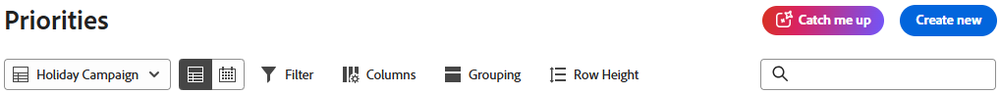

# Aktuelle Informationen zur Arbeit in „Prioritäten“

Catch me up - powered by Workfront AI Assistant - fasst Aktualisierungen, hochgeladene Dokumente und andere wichtige Änderungen an Ihren Projekten innerhalb der folgenden Zeitrahmen zusammen: 24 Stunden, 3 Tage, 7 Tage. Dadurch wird der Zeitaufwand für die Suche nach Informationen zu aktiven Projekten reduziert.

>[!NOTE]
>
>Diese Funktion ist nur für Kundinnen und Kunden im Unified Adobe-Erlebnis mit dem KI-Assistenten verfügbar. Weitere Informationen zum KI-Assistenten finden Sie unter [KI-Assistent - Übersicht](/help/quicksilver/workfront-basics/ai-assistant/ai-assistant-overview.md).

## Zugriffsanforderungen

+++ Erweitern, um die Zugriffsanforderungen für die in diesem Artikel beschriebene Funktionalität anzuzeigen.

<table style="table-layout:auto"> 
 <col> 
 <col> 
 <tbody> 
  <tr> 
   <td role="rowheader">Adobe Workfront-Paket</td> 
   <td>Beliebig</td>
  </tr> 
  <tr> 
   <td role="rowheader">Adobe Workfront-Lizenz</td> 
   <td>
Standard</td>
  </tr> 
 </tbody> 
</table>

Weitere Details zu den Informationen in dieser Tabelle finden Sie unter [Zugriffsanforderungen in der Dokumentation zu Workfront](/help/quicksilver/administration-and-setup/add-users/access-levels-and-object-permissions/access-level-requirements-in-documentation.md).

+++

## Zugriff - Aufholen

{{step1-to-priorities}}

1. Klicken Sie oben auf der Seite auf die Schaltfläche **Aufholen**.

   

1. Wählen Sie den gewünschten Zeitrahmen aus:
   * **Fassen Sie die letzten 24 Stunden zusammen**
   * **Zusammenfassen der letzten 3 Tage**
   * **Fassen Sie die letzten 7 Tage zusammen**

   >[!NOTE]
   >
   > Wenn Sie mit diesem Bedienfeld nicht interagieren können, hat Ihr Unternehmen keine unterzeichnete Adobe Gen AI-Vereinbarung in der Datei.

