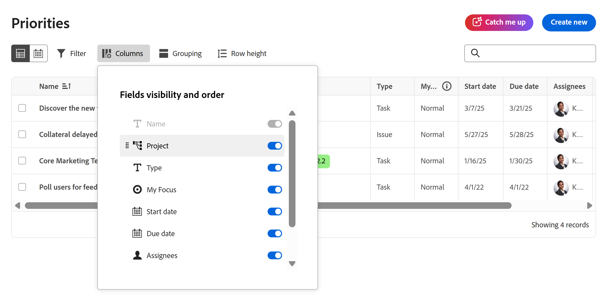

# Anpassen der Spalten der Arbeitsliste „Prioritäten“

Die auf dieser Seite hervorgehobenen Informationen beziehen sich auf Funktionen, die noch nicht allgemein verfügbar sind. Sie ist nur in der Vorschau -Umgebung für alle Kunden verfügbar. Nach den monatlichen Releases in der Produktion stehen dieselben Funktionen auch in der Produktionsumgebung für Kunden zur Verfügung, die schnelle Releases aktiviert haben. 

Informationen zu Schnellversionen finden Sie unter [Aktivieren oder Deaktivieren von Schnellversionen für Ihre Organisation](/help/quicksilver/administration-and-setup/set-up-workfront/configure-system-defaults/enable-fast-release-process.md). 

Sie können die Spalten auf der Arbeitsliste in Prioritäten anpassen, um Ihre Arbeitsweise zu unterstützen.

Mit Priorität werden die Ihnen zugewiesenen Arbeitselemente angezeigt. Sie können keine Arbeitselemente sehen, die Ihrem Team zugewiesen sind.

>[!NOTE]
>
>Benutzerdefinierte Daten können derzeit nicht zu Spalten hinzugefügt werden.

## Zugriffsanforderungen

+++ Erweitern, um die Zugriffsanforderungen für die in diesem Artikel beschriebene Funktionalität anzuzeigen.

<table style="table-layout:auto"> 
 <col> 
 </col> 
 <col> 
 </col> 
 <tbody> 
  <tr> 
   <td role="rowheader"><strong>Adobe Workfront-Paket</strong></td> 
   <td> 
Beliebig
 </td> 
  </tr> 
  <tr> 
   <td role="rowheader"><strong>Adobe Workfront-Lizenz</strong></td> 
   <td> 
   
Reviewer oder höher

   
Licht oder höher
 
   </td> 
  </tr> 
  <tr> 
   <td role="rowheader"><strong>Konfigurationen der Zugriffsebene</strong></td> 
   <td> 
Anzeigen- oder Bearbeitungszugriff für das Objekt, auf dem die Aktualisierung ausgeführt wird
</td> 
  </tr> 
  <tr> 
   <td role="rowheader"><strong>Objektberechtigungen</strong></td> 
   <td> 
Anzeigen des Zugriffs auf das Objekt
</td> 
  </tr> 
 </tbody> 
</table>

Weitere Details zu den Informationen in dieser Tabelle finden Sie unter [Zugriffsanforderungen in der Dokumentation zu Workfront](/help/quicksilver/administration-and-setup/add-users/access-levels-and-object-permissions/access-level-requirements-in-documentation.md).

+++

## Anpassen der Spalten der Arbeitsliste „Prioritäten“

### Aktivieren oder Deaktivieren von Spalten

{{step1-to-priorities}}

1. Klicken Sie **der linken** auf „Spalten“.
   
1. Verwenden Sie die Umschalter, um Spalten in der Arbeitsliste zu aktivieren oder zu deaktivieren.

### Spalten neu anordnen

{{step1-to-priorities}}

1. Klicken Sie **der linken** auf „Spalten“.
1. Klicken Sie auf **Ziehen** und verschieben Sie die Spalte an die gewünschte Position. Das Verschieben von Spalten aktualisiert sich automatisch in der Arbeitsliste.
   

>[!NOTE]
>
>Die Spalte Name ist fest und kann nicht verschoben werden.

### Ändern der Zeilenhöhe in der Prioritätenliste

{{step1-to-priorities}}

1. Klicken Sie auf **Symbol „Zeilenhöhe**.

   Dadurch wird die vertikale Länge einer Zeile aktualisiert. Wählen Sie aus den folgenden Optionen:

   * Kurz
   * Standard. Dies ist die Standardauswahl.
   * Mittel
   * Groß

   Die Liste wird sofort aktualisiert.

