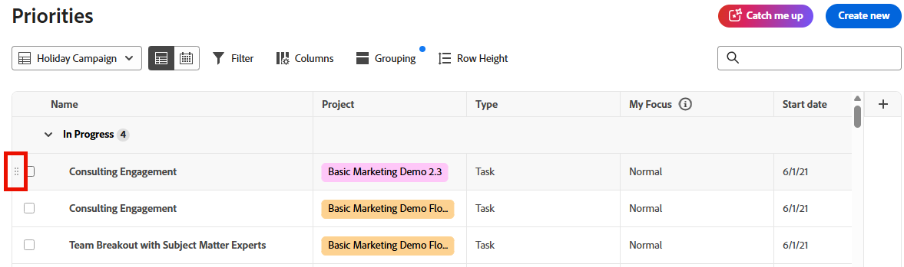
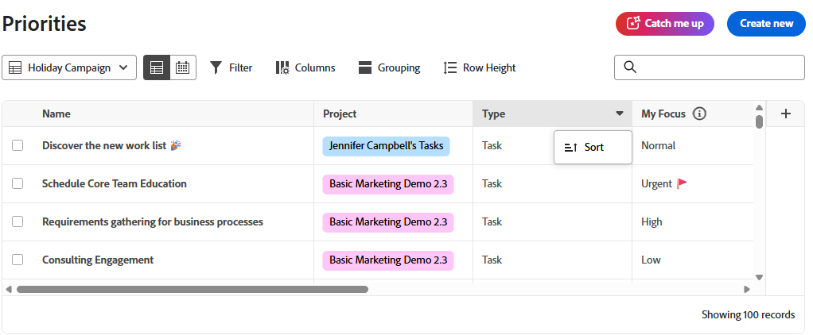

# Filtern, Gruppieren und Sortieren Ihrer Arbeit mit Prioritäten

Sie können Filter verwenden, um die gesuchte Arbeit zu finden, und dann eine Gruppierung anwenden, um sie zu organisieren.

Mit Priorität werden die Ihnen zugewiesenen Arbeitselemente angezeigt. Sie können keine Arbeitselemente sehen, die Ihrem Team in der Prioritätenarbeitsliste zugewiesen sind.

## Zugriffsanforderungen

+++ Erweitern, um die Zugriffsanforderungen für die in diesem Artikel beschriebene Funktionalität anzuzeigen.

Sie benötigen die folgenden Zugriffsrechte, um die Schritte in diesem Artikel auszuführen:

<table style="table-layout:auto"> 
 <col> 
 </col> 
 <col> 
 </col> 
 <tbody> 
  <tr> 
   <td role="rowheader"><strong>Adobe Workfront-Paket</strong></td> 
   <td> 
Beliebig
 </td> 
  </tr> 
  <tr> 
   <td role="rowheader"><strong>Adobe Workfront-Lizenz</strong></td> 
   <td> 
   
Anfragende oder höher

   
Mitwirkende oder höher
 
   </td> 
  </tr> 
  <tr> 
   <td role="rowheader"><strong>Konfigurationen der Zugriffsebene</strong></td> 
   <td> 
Anzeigen- oder Bearbeitungszugriff für das Objekt, auf dem die Aktualisierung ausgeführt wird
</td> 
  </tr> 
  <tr> 
   <td role="rowheader"><strong>Objektberechtigungen</strong></td> 
   <td> 
Anzeigen des Zugriffs auf das Objekt
</td> 
  </tr> 
 </tbody> 
</table>

*Weitere Informationen finden Sie unter [Zugriffsanforderungen in der Dokumentation zu Workfront](/help/quicksilver/administration-and-setup/add-users/access-levels-and-object-permissions/access-level-requirements-in-documentation.md).

+++

## Arbeiten mit Standardfiltern filtern

Sie können die Ihnen zugewiesenen Aufgaben und Probleme filtern.

{{step1-to-priorities}}

1. Klicken **oben links** der Arbeitsliste auf „Filter“.
1. Wählen Sie im **Standardfilter** einen oder mehrere Filter aus, um Ihre Arbeitselemente einzugrenzen.
   

+++Erweitern um detaillierte Informationen zu den verfügbaren Filtern
<table>
  <tbody>
   <tr>
   <th>Filter</th>
   <th>Beschreibung</th>
   </tr>
    <tr>
      <td>Es wird daran gearbeitet</td>
      <td>Zeigt Elemente an, an denen Sie derzeit arbeiten</td>
    </tr>
    <tr>
      <td>Startbereit</td>
      <td>Zeigt Elemente an mit 
      <ul>
      <li>Keine unvollständigen Vorgänger oder Aufgabenbeschränkungen</li>
      
und

      <li>Das geplante Startdatum liegt in den letzten oder bis zu zwei Wochen in der Zukunft</li>
      </ul>
      </td>
    </tr>
    <tr>
      <td>Nicht bereit</td>
      <td>Zeigt Elemente an, die
       <ul>
      <li>Unvollständige Vorgänger oder Aufgabenbeschränkungen verhindern, dass das Element bearbeitet wird</li></ul>
      
oder

      <ul>
      <li>Das geplante Startdatum liegt mehr als zwei Wochen in der Zukunft</li>
      </ul>
       </td>
    </tr>
    <tr>
      <td>Angefordert</td>
      <td>Zeigt Probleme an, mit denen Sie noch nicht begonnen haben</td>
    </tr>
      <td>Fertig</td>
      <td>Zeigt Arbeiten an, die in den letzten zwei Wochen abgeschlossen wurden. Diese Filteroption umfasst keine Genehmigungen.</td>
    </tr>
    <tr>
    <td>Projekt</td>
    <td>Zeigt Projekte mit Aufgaben oder Problemen an, denen Sie zugewiesen wurden</td>
    </tr>
    <tr>
    <td>Fälligkeitsdatum</td>
    <td>Zeigt Arbeit nach geplantem Abschlussdatum an</td>
    </tr>
    <tr>
    <td>Mein Fokus</td>
    <td>Zeigt Aufgaben oder Probleme an, denen Fokusebenen zugewiesen wurden. Fokusebenen werden von den einzelnen Benutzenden zugewiesen und verwaltet.</td>
    </tr>
    <tr>
    <td>Status</td>
    <td>Zeigt Aufgaben oder Probleme in den Status Neu, In Bearbeitung und Abgeschlossen an.</td>
    </tr>
  </tbody>
</table>

+++

1. (Optional) Klicken Sie auf **Zurück zur Standardeinstellung**, um Ihre Auswahl zurückzusetzen.

## Arbeiten mit Smart-Filtern filtern

Verwenden Sie natürliche Sprache, um Arbeit schnell zu filtern.

>[!NOTE]
>
>Diese Funktion ist nur für Kunden im Unified Adobe-Erlebnis mit dem KI-Assistenten verfügbar. Weitere Informationen zum KI-Assistenten finden Sie unter [KI-Assistent - Übersicht](/help/quicksilver/workfront-basics/ai-assistant/ai-assistant-overview.md).

{{step1-to-priorities}}

1. Klicken **oben links** der Arbeitsliste auf „Filter“.
1. Klicken Sie **Smart-Filter**.
1. Geben Sie ein, wie Sie Ihre Arbeit filtern möchten.

   Sie können z. B. Folgendes eingeben:

   * *Anzeige verspäteter Aufgaben*
   * *Meine obersten Prioritäten anzeigen*
   * *Heute fällige Arbeiten anzeigen*

## Arbeiten gruppieren

{{step1-to-priorities}}

1. Klicken **oben links** der Arbeitsliste auf „Gruppierung“.
1. Gruppierung auswählen, um die Arbeitsliste zu organisieren.

+++Erweitern um detaillierte Informationen zu verfügbaren Gruppen anzuzeigen

| Gruppe | Beschreibung |
|-----------|-------------|
| Projekt | Dadurch werden Elemente nach Projekt gruppiert. |
| Fälligkeitsdatum | Dadurch werden Elemente nach Fälligkeitsdatum gruppiert. Fälligkeitsdaten werden durch das geplante Abschlussdatum bestimmt. |
| Mein Fokus | Dadurch werden Elemente basierend auf der zugewiesenen Fokusebene gruppiert. |
| Status | Elemente werden nach folgenden Status gruppiert: Neu, In Bearbeitung, Abgeschlossen.  <b>Hinweis</b>: Benutzerdefinierte Status können derzeit nicht in Prioritäten verwendet werden. |

+++

### Arbeitselemente beim Gruppieren nach „Meine Priorität“ oder „Status“ per Drag-and-Drop verschieben

Sie können einzelne Arbeitselemente beim Gruppieren nach „Meine Priorität“ oder „Status“ per Drag-and-Drop zwischen Kategorien ziehen.

1. Gruppieren Sie Ihre Arbeit nach **Status** oder **Mein Fokus**.
2. Bewegen Sie den Mauszeiger über das Arbeitselement, um auf das Symbol **Ziehen** zu klicken und es in die gewünschte Kategorie zu verschieben.
   

## Arbeit sortieren

### In Gruppierungen sortieren

Um Ihre Arbeit innerhalb einer Gruppierung zu sortieren, öffnen Sie **Gruppierung** und wählen Sie aus, ob Sie in auf- oder absteigender Reihenfolge sortieren möchten.

### Sortierungsspalten

Um einzelne Spalten zu sortieren, gehen Sie zur Spalte und klicken Sie auf den Abwärtspfeil.

### Alle Gruppenabschnitte erweitern oder reduzieren

Um alle Gruppenabschnitte zu erweitern oder zu reduzieren, öffnen Sie **Gruppe** und klicken Sie auf **Alle erweitern** wenn die Gruppierungen reduziert sind, oder **Alle reduzieren** wenn die Gruppierungen erweitert sind.

