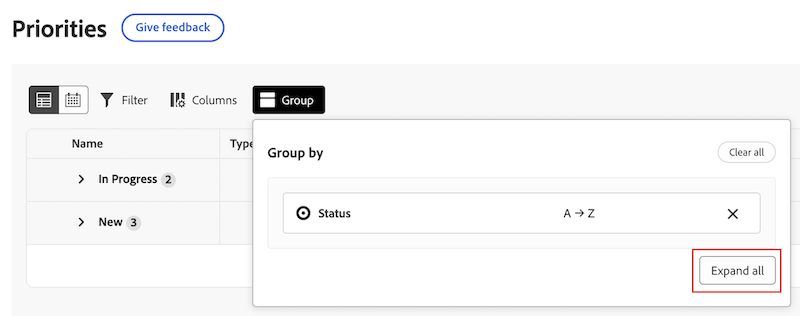

# Filtern und Gruppieren Ihrer Arbeit mit Prioritäten

Die hervorgehobenen Informationen auf dieser Seite beziehen sich auf Funktionen, die noch nicht allgemein verfügbar sind. Sie ist nur in der Vorschau-Sandbox-Umgebung verfügbar.

Sie können Filter verwenden, um die gesuchte Arbeit zu finden, und dann eine Gruppierung anwenden, um sie zu organisieren.

## Zugriffsanforderungen

+++ Erweitern Sie , um die Zugriffsanforderungen für die Funktionalität in diesem Artikel anzuzeigen.

Sie müssen über folgenden Zugriff verfügen, um die Schritte in diesem Artikel ausführen zu können:

<table style="table-layout:auto"> 
 <col> 
 </col> 
 <col> 
 </col> 
 <tbody> 
  <tr> 
   <td role="rowheader"><strong>Adobe Workfront-Abo</strong></td> 
   <td> 
Alle
 </td> 
  </tr> 
  <tr> 
   <td role="rowheader"><strong>Adobe Workfront-Lizenz*</strong></td> 
   <td> 
   
Aktuell: Anforderung oder höher

   
Neu: Mitarbeiter oder höher
 
   </td> 
  </tr> 
  <tr> 
   <td role="rowheader"><strong>Konfigurationen auf Zugriffsebene</strong></td> 
   <td> 
Anzeigen oder Bearbeiten des Zugriffs für das Objekt, auf dem die Aktualisierung ausgeführt wird
</td> 
  </tr> 
  <tr> 
   <td role="rowheader"><strong>Objektberechtigungen</strong></td> 
   <td> 
Zugriff auf das Objekt anzeigen
</td> 
  </tr> 
 </tbody> 
</table>

*Weitere Informationen finden Sie unter [Zugriffsanforderungen in der Workfront-Dokumentation](/help/quicksilver/administration-and-setup/add-users/access-levels-and-object-permissions/access-level-requirements-in-documentation.md).

+++

## Filtern und Gruppieren Ihrer Arbeit mit Prioritäten in der Produktion

### Filtern Ihrer Arbeit

Sie können zugewiesene Aufgaben und Probleme filtern.

{{step1-to-priorities}}

1. Klicken Sie oben rechts in der Arbeitsliste auf **Filter** .
1. Wählen Sie einen oder mehrere Filter aus, um Ihre Arbeitselemente einzugrenzen.
   

++ + Erweitern , um detaillierte Informationen zu verfügbaren Filtern anzuzeigen
<table>
  <tbody>
   <tr>
   <th>Filter</th>
   <th>Beschreibung</th>
   </tr>
    <tr>
      <td>Es wird daran gearbeitet</td>
      <td>Zeigt Elemente an, an denen Sie derzeit arbeiten</td>
    </tr>
    <tr>
      <td>Startbereit</td>
      <td>Zeigt Elemente mit 
      <ul>
      <li>Keine unvollständigen Vorgänger oder Aufgabeneinschränkungen</li>
      
und

      <li>Das geplante Startdatum liegt in der Vergangenheit oder bis zu zwei Wochen in der Zukunft</li>
      </ul>
      </td>
    </tr>
    <tr>
      <td>Nicht bereit</td>
      <td>Zeigt Elemente an,
       <ul>
      <li>Unvollständige Vorgänger oder Aufgabenbeschränkungen, die verhindern, dass das Element bearbeitet wird</li>
      
oder

      <li>Das geplante Startdatum liegt in Zukunft bei mehr als zwei Wochen.</li>
      </ul>
       </td>
    </tr>
    <tr>
      <td>Angefordert</td>
      <td>Zeigt Probleme an, mit denen Sie noch nicht begonnen haben</td>
    </tr>
      <td>Fertig</td>
      <td>Zeigt die Arbeit an, die in den letzten zwei Wochen abgeschlossen wurde. Diese Filteroption umfasst keine Genehmigungen.</td>
    </tr>
    <tr>
    <td>Projekt</td>
    <td>Zeigt Projekte an, die Aufgaben oder Probleme enthalten, denen Sie zugewiesen wurden</td>
    </tr>
    <tr>
    <td>Fälligkeitsdatum</td>
    <td>Zeigt die Arbeit nach dem geplanten Abschlussdatum an</td>
    </tr>
    <tr>
    <td>Status</td>
    <td>Zeigt Aufgaben oder Probleme im neuen, in Gang befindlichen und vollständigen Status an</td>
    </tr>
    <tr>
    <td>Mein Fokus</td>
    <td>Zeigt Aufgaben oder Probleme in an, denen Fokusebenen zugewiesen sind. Die Fokusebenen werden vom jeweiligen Benutzer zugewiesen und verwaltet.</td>
    </tr>
  </tbody>
</table>

+++

1. (Optional) Klicken Sie auf **Zurück zum Standard** , um Ihre Auswahl zurückzusetzen.

### Arbeiten gruppieren

{{step1-to-priorities}}

1. Klicken Sie oben rechts in der Arbeitsliste auf **Gruppen** .
1. Auswählen einer Gruppe zur Organisation Ihrer Arbeitsliste
   

++ + Erweitern , um detaillierte Informationen zu verfügbaren Gruppen anzuzeigen

| Gruppe | Beschreibung |
|-----------|-------------|
| Keine | Dadurch werden Gruppierungen aus der Arbeitsliste entfernt. |
| Mein Fokus | Diese Gruppe gruppiert Elemente basierend auf der von Ihnen zugewiesenen Fokusebene. |
| Fällige Woche | Gruppiert Artikel nach der Woche, für die sie fällig sind. Die Fälligkeitsdaten werden durch das geplante Abschlussdatum bestimmt. |
| Status | Gruppiert Elemente nach folgendem Status: Neu, Gestartet, Abgeschlossen.  Hinweis: Sie können derzeit keine benutzerdefinierten Status in Prioritäten verwenden. |
| Projekt | Hiermit werden Elemente nach Projekt gruppiert. |

+++

### Sortieren Sie Ihre Arbeit

Um Ihre Arbeit zu sortieren, öffnen Sie **Gruppe** und klicken Sie auf **Aufsteigend sortieren** oder auf **Absteigende Sortierung**.

>[!IMPORTANT]
>
>Die Sortieroption ist vorübergehend nicht verfügbar, wenn Sie eine Gruppe angewendet haben.

### Alle Abschnitte ein- oder ausblenden

Um alle Abschnitte ein- oder auszublenden, öffnen Sie **Gruppe** und klicken Sie auf **Alle erweitern** oder **Alle ausblenden**.

## Filtern und Gruppieren Ihrer Arbeit mit Prioritäten in der Vorschau

### Filtern Ihrer Arbeit

Sie können zugewiesene Aufgaben und Probleme filtern.

{{step1-to-priorities}}

1. Klicken Sie oben links in der Arbeitsliste auf **Filter** .
1. Wählen Sie einen oder mehrere Filter aus, um Ihre Arbeitselemente einzugrenzen.
   

++ + Erweitern , um detaillierte Informationen zu verfügbaren Filtern anzuzeigen
<table>
  <tbody>
   <tr>
   <th>Filter</th>
   <th>Beschreibung</th>
   </tr>
    <tr>
      <td>Es wird daran gearbeitet</td>
      <td>Zeigt Elemente an, an denen Sie derzeit arbeiten</td>
    </tr>
    <tr>
      <td>Startbereit</td>
      <td>Zeigt Elemente mit 
      <ul>
      <li>Keine unvollständigen Vorgänger oder Aufgabeneinschränkungen</li>
      
und

      <li>Das geplante Startdatum liegt in der Vergangenheit oder bis zu zwei Wochen in der Zukunft</li>
      </ul>
      </td>
    </tr>
    <tr>
      <td>Nicht bereit</td>
      <td>Zeigt Elemente an,
       <ul>
      <li>Unvollständige Vorgänger oder Aufgabenbeschränkungen, die verhindern, dass das Element bearbeitet wird</li>
      
oder

      <li>Das geplante Startdatum liegt in Zukunft bei mehr als zwei Wochen.</li>
      </ul>
       </td>
    </tr>
    <tr>
      <td>Angefordert</td>
      <td>Zeigt Probleme an, mit denen Sie noch nicht begonnen haben</td>
    </tr>
      <td>Fertig</td>
      <td>Zeigt die Arbeit an, die in den letzten zwei Wochen abgeschlossen wurde. Diese Filteroption umfasst keine Genehmigungen.</td>
    </tr>
    <tr>
    <td>Projekt</td>
    <td>Zeigt Projekte an, die Aufgaben oder Probleme enthalten, denen Sie zugewiesen wurden</td>
    </tr>
    <tr>
    <td>Fälligkeitsdatum</td>
    <td>Zeigt die Arbeit nach dem geplanten Abschlussdatum an</td>
    </tr>
    <tr>
    <td>Status</td>
    <td>Zeigt Aufgaben oder Probleme im neuen, in Gang befindlichen und vollständigen Status an</td>
    </tr>
    <tr>
    <td>Mein Fokus</td>
    <td>Zeigt Aufgaben oder Probleme in an, denen Fokusebenen zugewiesen sind. Die Fokusebenen werden vom jeweiligen Benutzer zugewiesen und verwaltet.</td>
    </tr>
  </tbody>
</table>

+++

1. (Optional) Klicken Sie auf **Zurück zum Standard** , um Ihre Auswahl zurückzusetzen.

### Arbeiten gruppieren

{{step1-to-priorities}}

1. Klicken Sie oben links in der Arbeitsliste auf **Gruppen** .
1. Auswählen einer Gruppe zur Organisation Ihrer Arbeitsliste
   

++ + Erweitern , um detaillierte Informationen zu verfügbaren Gruppen anzuzeigen

| Gruppe | Beschreibung |
|-----------|-------------|
| Projekt | Hiermit werden Elemente nach Projekt gruppiert. |
| Mein Fokus | Diese Gruppe gruppiert Elemente basierend auf der von Ihnen zugewiesenen Fokusebene. |
| Fällige Woche | Gruppiert Artikel nach der Woche, für die sie fällig sind. Die Fälligkeitsdaten werden durch das geplante Abschlussdatum bestimmt. |
| Status | Gruppiert Elemente nach folgendem Status: Neu, Gestartet, Abgeschlossen.  Hinweis: Sie können derzeit keine benutzerdefinierten Status in Prioritäten verwenden. |

+++

### Sortieren Sie Ihre Arbeit

**In Gruppen sortieren**

Um Ihre Arbeit innerhalb einer Gruppe zu sortieren, öffnen Sie **Gruppe** und klicken Sie auf **Aufsteigende Sortierung** oder auf **Absteigende Sortierung**.

**Spalten sortieren**

Um einzelne Spalten zu sortieren, klicken Sie in der Spalte auf den Abwärtspfeil.

### Erweitern oder Reduzieren aller Gruppenabschnitte

Um alle Gruppenabschnitte zu erweitern oder zu reduzieren, öffnen Sie **Gruppe** und klicken Sie auf **Alle erweitern** oder **Alle reduzieren**.

