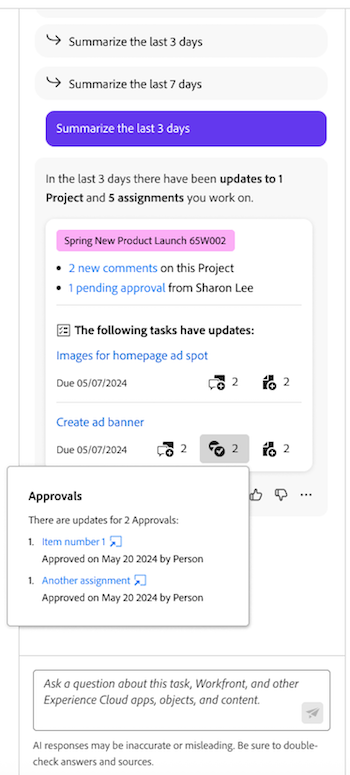

# Erste Schritte mit [!DNL Priorities]

{{preview-fast-release-general}}

Priorities ist ein optimiertes, intuitives Erlebnis, das auf Aufgabenbesitzer zugeschnitten ist. Die Prioritäten werden schrittweise eingeführt, beginnend mit der Arbeitsliste.

Mit Prioritäten können Sie Folgendes genießen

* Tägliche Aufgaben verwalten und priorisieren: Organisieren Sie Ihren Tag oder Ihre Woche mit konsolidierter Navigation für mehr Klarheit
* Höhere Produktivität: Schnellerer Zugriff auf den Projektkontext und schnellere Ausführung von Aufgaben mit weniger Klicks
* Personalisierte Funktionen: Profitieren Sie von Funktionen, die speziell für Aufgabenbesitzer entwickelt wurden

Die Prioritätenarbeitsliste und der Kalender zeigen Arbeitselemente an, die Ihnen zugewiesen sind. Sie können keine Arbeitselemente sehen, die Ihrem Team zugewiesen sind.

Ein Workfront-Administrator kann in der Layout-Vorlage Prioritäten für die Benutzerin bzw. den Benutzer aktivieren. Weitere Informationen finden Sie unter [Anpassen des Hauptmenüs mithilfe einer Layout-Vorlage](/help/quicksilver/administration-and-setup/customize-workfront/use-layout-templates/customize-main-menu.md).

## Suchen und Organisieren Ihrer Arbeit

Unter „Prioritäten“ können Sie Ihre Arbeit filtern und gruppieren, damit Sie Fristen verwalten und Prioritäten für das setzen können, was für Sie wichtig ist. Sie können dringende Arbeiten auch schnell in der Spalte Mein Fokus identifizieren.

### Arbeiten mit Filtern suchen

Finden Sie Ihre wichtigste Arbeit mit Filtern. Sie können eine natürliche Sprache verwenden, um Arbeit mit dem intelligenten Filter zu finden, oder
Sie können den Standardfilter verwenden, um die Ihnen zugewiesenen Aufgaben und Probleme zu finden:

<table>
  <tbody>
   <tr>
   <th>Filter</th>
   <th>Beschreibung</th>
   </tr>
    <tr>
      <td>Wird bearbeitet an</td>
      <td>Zeigt Elemente an, an denen Sie derzeit arbeiten</td>
    </tr>
    <tr>
      <td>Startbereit</td>
      <td>Zeigt Elemente an mit 
      <ul>
      <li>Keine unvollständigen Vorgänger oder Aufgabenbeschränkungen</li>
      
und

      <li>Das geplante Startdatum liegt in den letzten oder bis zu zwei Wochen in der Zukunft</li>
      </ul>
      </td>
    </tr>
    <tr>
      <td>Nicht bereit</td>
      <td>Zeigt Elemente an, die
       <ul>
      <li>Unvollständige Vorgänger oder Aufgabenbeschränkungen verhindern, dass das Element bearbeitet wird</li>
      
oder

      <li>Das geplante Startdatum liegt mehr als zwei Wochen in der Zukunft</li>
      </ul>
       </td>
    </tr>
    <tr>
      <td>Angefordert</td>
      <td>Zeigt Probleme an, mit denen Sie noch nicht begonnen haben</td>
    </tr>
      <td>Fertig</td>
      <td>Zeigt Arbeiten an, die in den letzten zwei Wochen abgeschlossen wurden. Diese Filteroption umfasst keine Genehmigungen.</td>
    </tr>
    <tr>
    <td>Projekt</td>
    <td>Zeigt Projekte mit Aufgaben oder Problemen an, denen Sie zugewiesen wurden</td>
    </tr>
    <tr>
    <td>Fälligkeitsdatum</td>
    <td>Zeigt Arbeit nach geplantem Abschlussdatum an</td>
    </tr>
    <tr>
    <td>Status</td>
    <td>Zeigt Aufgaben oder Probleme mit dem Status Neu, In Bearbeitung und Abgeschlossen an</td>
    </tr>
     <tr>
    <td>Mein Fokus</td>
    <td>Zeigt Aufgaben oder Probleme in an, denen Fokusebenen zugewiesen sind. Fokusebenen werden von den einzelnen Benutzenden zugewiesen und verwaltet.</td>
    </tr>
  </tbody>
</table>

### Organisieren der Arbeit mit Gruppen

Nachdem Sie Ihre Arbeit gefiltert haben, können Sie Elemente gruppieren nach

* Mein Fokus
* Fällige Woche
* Status
* Projekt

Weitere Informationen finden Sie unter [Filtern und Gruppieren Ihrer Arbeit in Prioritäten](/help/quicksilver/workfront-basics/priorities/filter-group-work-priorities.md).

### Wichtige Arbeitselemente mit „Mein Fokus“ priorisieren

Mein Fokus ist eine Spalte in der Arbeitsliste, die Ihnen hilft, Ihre Arbeit zu priorisieren. Der Wert Mein Fokus ist persönlich und hat keine Auswirkungen auf Projekt-, Aufgaben- oder Problemdaten. Sie können die folgenden Fokusebenen verwenden:

* Dringend
* Hoch
* Normal (Standard)
* Niedrig

Nachdem Sie Ihren Arbeitselementen Fokusebenen zugewiesen haben, können Sie die Spalte so sortieren, dass dringende Elemente oben in Ihrer Arbeitsliste angezeigt werden.

Weitere Informationen finden Sie unter [Priorisieren wichtiger Arbeitselemente](/help/quicksilver/workfront-basics/priorities/prioritize-work-items.md).

### Verwenden der Kalenderansicht

Die Kalenderansicht bietet eine visuelle Darstellung Ihrer Aufgaben und Probleme. Sie können zwischen einer Tag-, Wochen- oder Monatsansicht wählen. Sie können Elemente auch auf ähnliche Weise wie die Arbeitsliste filtern.

## Arbeiten an Aufgaben und Problemen

Unter „Prioritäten“ können Sie Arbeitselemente aktualisieren, um Ihre Arbeitselementdetails auf dem neuesten Stand zu halten, die Zeit protokollieren, um Ihre Arbeitsstunden genau zu verfolgen, Assets hochladen, ohne zu einem Projekt navigieren zu müssen, und schnelle Links hinzufügen, um den Zugriff auf häufig verwendete Ressourcen zu erleichtern.

>[!NOTE]
>
>Light-, Review-, Contributor- und Requestor-Lizenzen haben nur eingeschränkten Zugriff auf die Prioritäten. Weitere Informationen dazu, wie diese Lizenztypen mit Aufgaben und Problemen interagieren können, finden Sie unter
>
>* [Zugriff auf Objekte und Bereiche durch für neue Lizenzen](/help/quicksilver/administration-and-setup/add-users/how-access-levels-work/access-to-objects-areas-license-types.md)
>* [Funktionalität für jeden Objekttyp für neue Zugriffsebenen verfügbar](/help/quicksilver/administration-and-setup/add-users/how-access-levels-work/functionality-available-for-objects.md)
>* [Zugriff auf Objekte und Bereiche nach Lizenztyp](/help/quicksilver/administration-and-setup/add-users/access-levels-and-object-permissions/access-to-objects-and-areas-by-license-type.md)
>* [Die Funktionalität ist für jeden Objekttyp verfügbar](/help/quicksilver/administration-and-setup/add-users/access-levels-and-object-permissions/functionality-available-for-each-object-type.md)

### Hinzufügen und Anzeigen von Aktualisierungen

Fügen Sie eine Aktualisierung zu einer Aufgabe oder einem Problem hinzu, um Ihren Fortschritt an andere weiterzugeben.

Im Abschnitt Aktualisierungen werden Systemaktualisierungen und bis zu 200 der neuesten Aktualisierungen angezeigt, die von Benutzenden in den letzten 90 Tagen vorgenommen wurden.

Weitere Informationen finden Sie unter [Hinzufügen und Anzeigen von Kommentaren unter Prioritäten](/help/quicksilver/workfront-basics/priorities/add-view-updates-priorities.md).

### Zeit erfassen

Sie können die Zeit für Arbeitselemente protokollieren, um die Anzahl der Stunden anzugeben, die Sie mit deren Bearbeitung verbringen. Sie können auch Zeit erfassen, die nicht mit der Arbeit zusammenhängt, z. B. Urlaub, Krankenstand oder Zeit, die Sie in Meetings verbringen. Die Zeit, die Sie protokollieren, wird in Ihrer Arbeitszeittabelle angezeigt.

Weitere Informationen finden Sie unter [Zeit in Prioritäten ](/help/quicksilver/workfront-basics/priorities/log-time-priorities.md).

### Dateien hochladen

Dateien direkt in den Dokumentbereich der Aufgabe oder des Problems hochladen, ohne zu einem Projekt navigieren zu müssen. Wenn Sie eine Datei über „Prioritäten“ hochladen, können Sie

* Vorhandenen Ordner auswählen
* Hochladen der Datei mit einem Kommentar zum Aktualisierungsverlauf
* Zusätzliche Dateien hinzufügen
* Importieren von Dateien aus Connected Document Integrations

Weitere Informationen finden Sie unter [Dateien in Prioritäten hochladen](/help/quicksilver/workfront-basics/priorities/upload-files-in-priorities.md).

### Schnellverknüpfungen hinzufügen

Häufig verwendete Links können auf der Detailseite des Arbeitselements eingebettet werden. Schnelllinks ermöglichen es Ihnen, den Link schnell zu besuchen oder zu kopieren.

Weitere Informationen finden Sie unter [Hinzufügen und Verwalten von Schnelllinks in Prioritäten](/help/quicksilver/workfront-basics/priorities/quick-links-priorities.md).

### Dokumente anzeigen

Auf der Registerkarte Dokumente können Sie alle Dateien anzeigen, die mit einem Arbeitselement verbunden sind. Sie können Dokumente nach Name, Dateityp oder Person filtern und nach Name und Upload-Datum sortieren.

Sie können das Dokument oder den Korrekturabzug auch öffnen.

### Überprüfen und Genehmigen von Assets

Auf der Registerkarte Dokumente einer Aufgabe oder eines Problems haben Sie folgende Möglichkeiten

* Erstellen eines einfachen oder erweiterten Testversands
* Proofing-Betrachter starten, um Kommentare zu hinterlassen und Entscheidungen zu treffen

## Verwenden Sie [!DNL Catch me up], um zu sehen, was Sie verpasst haben

Verwenden Sie die [!DNL Catch me up]-Funktion, um zu sehen, was Sie verpasst haben. Catch me up fasst Aktualisierungen, hochgeladene Dokumente, Genehmigungen und andere wichtige Änderungen an Ihren Projekten innerhalb der folgenden Zeitrahmen zusammen: 24 Stunden, 3 Tage, 7 Tage.

Weitere Informationen finden Sie unter [Aufholprozess bei den Prioritäten](/help/quicksilver/workfront-basics/priorities/catch-me-up.md).

<!--need new screen for prod-->

## Echtzeitaktualisierungen auf der Detailseite anzeigen

Echtzeitaktualisierungen können auf der Detailseite einer Aufgabe oder eines Problems angezeigt werden. Mit Echtzeit-Präsenzindikatoren können Sie auch sehen, ob andere Benutzer die Seite gleichzeitig mit Ihnen ansehen.

<!--
## Considerations

* Accessing tasks in Priorities is across tabs. We plan to add additional tabs, like Documents, Subtasks, Approvals, etc, in the future. Let us know you need these items by submitting feedback using the **Give Feedback** button.-->
