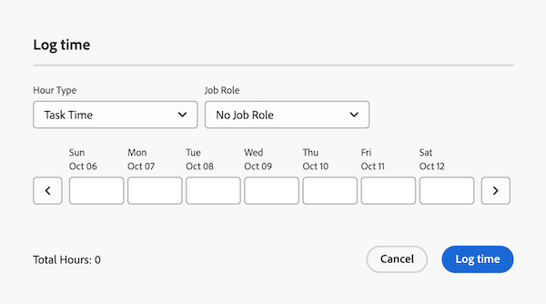

# Zeit in Prioritäten protokollieren

Sie können die Zeit für Arbeitselemente in Adobe Workfront protokollieren, um die Anzahl der Stunden anzugeben, die Sie mit deren Bearbeitung verbringen. Die Zeit, die Sie protokollieren, wird in Ihrer Arbeitszeittabelle angezeigt.

## Zugriffsanforderungen

+++ Erweitern Sie , um die Zugriffsanforderungen für die -Funktion in diesem Artikel anzuzeigen.

Sie müssen über die folgenden Zugriffsrechte verfügen, um die Schritte in diesem Artikel auszuführen und projektspezifische Stunden zu protokollieren:

<table style="table-layout:auto"> 
 <col> 
 <col> 
 <tbody> 
  <tr> 
   <td role="rowheader">Adobe Workfront-Plan</td> 
   <td> 
Beliebig
 </td> 
  </tr> 
  <tr> 
   <td role="rowheader">Adobe Workfront-Lizenz</td> 
   <td> 
Neu: 

   
Light oder höher für die Protokollierung von Stunden für eine Aufgabe oder ein Problem

   
Aktuell: 
   
Arbeit oder höher zum Protokollieren von Stunden für eine Aufgabe oder ein Problem
 </td> 
  </tr> 
  <tr> 
   <td role="rowheader">Konfigurationen der Zugriffsebene</td> 
   <td> 
Bearbeitungszugriff auf den Typ des Arbeitselements, für das Sie die Zeit protokollieren 
 
Sie benötigen beispielsweise Bearbeitungszugriff auf Anfragen, um die Zeit für Probleme zu protokollieren
 </td> 
  </tr> 
  <tr> 
   <td role="rowheader">Objektberechtigungen</td> 
   <td> 
Contribute- oder höhere Berechtigungen für das Arbeitselement, für das Sie die Zeit protokollieren, einschließlich der Berechtigungen zum Protokollieren von Stunden
 </td> 
  </tr> 
 </tbody> 
</table>

Weitere Informationen zu den Informationen in dieser Tabelle finden Sie unter [Zugriffsanforderungen in der Dokumentation zu Workfront](/help/quicksilver/administration-and-setup/add-users/access-levels-and-object-permissions/access-level-requirements-in-documentation.md).

+++

## Zeit in der Arbeitsliste protokollieren

Sie können die Zeit direkt in der Arbeitsliste protokollieren:

{{step1-to-priorities}}

1. Bewegen Sie den Mauszeiger über den Namen und klicken Sie dann auf **Zeit**.
   
1. Wählen **im Dropdown** Menü „Stundentyp“ den entsprechenden Stundentyp aus. Stundentypen sind je nachdem, was auf System-, Projekt- und Benutzerebene definiert wurde, verfügbar, wie unter Definieren von Stundentypen und Verfügbarkeit beschrieben.

1. (Bedingt) Wenn der Workfront- oder Gruppenadministrator bzw. die Gruppenadministratorin die Einstellung Aufgabengebiete zu Stundeneinträgen manuell hinzufügen aktiviert hat, wählen Sie aus dem Dropdown-Menü ein Aufgabengebiet aus. Die Funktion, die beim Zuweisen zum Arbeitselement angegeben wird, wird standardmäßig angezeigt. Wenn Ihnen im -Objekt keine Rolle zugewiesen ist, wird Ihre Primäre Rolle als Standard angezeigt. Wenn Ihnen keine Primäre Funktion zugewiesen wurde, wird kein Aufgabengebiet angezeigt.

1. Geben Sie die Zeit ein, die Sie protokollieren möchten, und klicken Sie dann auf **Zeit**.

   

## Zeit in einem Arbeitselement protokollieren

Sie können die Zeit in einem einzelnen Arbeitselement protokollieren:

{{step1-to-priorities}}

1. Klicken Sie auf den Namen eines Arbeitselements, um die Seite Überblick zu öffnen.
1. Klicken **Abschnitt „Schnellaktionen** auf **Zeit protokollieren**.
1. Wählen **im Dropdown** Menü „Stundentyp“ den entsprechenden Stundentyp aus. Stundentypen sind je nachdem, was auf System-, Projekt- und Benutzerebene definiert wurde, verfügbar, wie unter Definieren von Stundentypen und Verfügbarkeit beschrieben.
1. (Bedingt) Wenn der Workfront- oder Gruppenadministrator bzw. die Gruppenadministratorin die Einstellung Aufgabengebiete zu Stundeneinträgen manuell hinzufügen aktiviert hat, wählen Sie aus dem Dropdown-Menü ein Aufgabengebiet aus. Die Funktion, die beim Zuweisen zum Arbeitselement angegeben wird, wird standardmäßig angezeigt. Wenn Ihnen im -Objekt keine Rolle zugewiesen ist, wird Ihre Primäre Rolle als Standard angezeigt. Wenn Ihnen keine Primäre Funktion zugewiesen wurde, wird kein Aufgabengebiet angezeigt.

1. Geben Sie die Zeit ein, die Sie protokollieren möchten, und klicken Sie dann auf **Zeit**.

   
