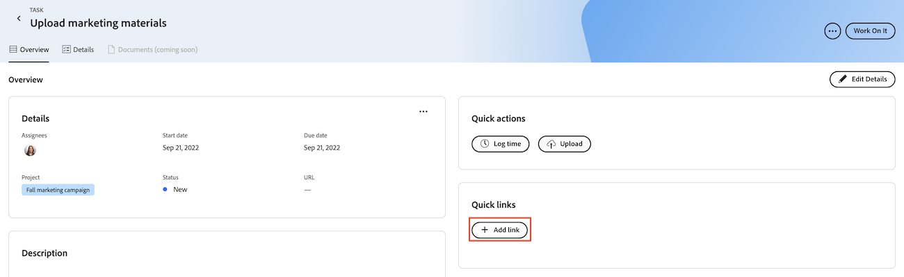

# Hinzufügen und Verwalten von Schnellverknüpfungen in Prioritäten

Sie können Links, die Sie häufig im Rahmen einer Aufgabe oder eines Problems besuchen, speichern und auf die Sie über die Registerkarte Übersicht unter Prioritäten zugreifen.

## Zugriffsanforderungen

+++ Erweitern Sie , um die Zugriffsanforderungen für die -Funktion in diesem Artikel anzuzeigen.

Sie müssen über folgenden Zugriff verfügen, um die Schritte in diesem Artikel ausführen zu können:

<table style="table-layout:auto"> 
 <col> 
 </col> 
 <col> 
 </col> 
 <tbody> 
  <tr> 
   <td role="rowheader"><strong>Adobe Workfront-Plan</strong></td> 
   <td> 
Beliebig
 </td> 
  </tr> 
  <tr> 
   <td role="rowheader"><strong>Adobe Workfront-Lizenz*</strong></td> 
   <td> 
   
Aktuell: Anfrage oder höher für Probleme; Arbeit oder höher für Aufgaben

   
Neu: Mitwirkender oder höhere oder höhere Probleme; Leicht oder höher für Aufgaben
 
   </td> 
  </tr> 
  <tr> 
   <td role="rowheader"><strong>Konfigurationen der Zugriffsebene</strong></td> 
   <td> 
Anzeigen- oder Bearbeitungszugriff für das Objekt, auf dem die Aktualisierung ausgeführt wird
</td> 
  </tr> 
  <tr> 
   <td role="rowheader"><strong>Objektberechtigungen</strong></td> 
   <td> 
Anzeigen des Zugriffs auf das Objekt
</td> 
  </tr> 
 </tbody> 
</table>

*Weitere Informationen finden Sie unter [Zugriffsanforderungen in der Dokumentation zu Workfront](/help/quicksilver/administration-and-setup/add-users/access-levels-and-object-permissions/access-level-requirements-in-documentation.md).

+++

## Hinzufügen von schnellen Links in „Prioritäten“

{{step1-to-priorities}}

1. Klicken Sie auf den Namen eines Arbeitselements, um die Seite Überblick zu öffnen.
1. Klicken Sie **Abschnitt &quot;**&quot; auf **Link hinzufügen**.
1. Fügen Sie die URL in das Feld **Link hinzufügen** ein.
1. Klicken Sie auf **Speichern**.
   

## Kopieren eines Schnelllinks in die Zwischenablage

{{step1-to-priorities}}

1. Klicken Sie auf den Namen eines Arbeitselements, um die Seite Überblick zu öffnen.
1. Suchen Sie **Abschnitt &quot;**&quot; den Link, den Sie kopieren möchten.
1. Klicken Sie auf das Symbol Kopieren .
   

## Schnelllink öffnen

{{step1-to-priorities}}

1. Klicken Sie auf den Namen eines Arbeitselements, um die Seite Überblick zu öffnen.
1. Suchen Sie **Abschnitt** Schnelllinks“ den Link, den Sie öffnen möchten.
1. Klicken Sie auf den Link. Der Link wird in einer neuen Registerkarte geöffnet.
   

## Schnellverknüpfungen löschen

{{step1-to-priorities}}

1. Klicken Sie auf den Namen eines Arbeitselements, um die Seite Überblick zu öffnen.
1. Klicken **oben rechts** Bildschirm auf „Details bearbeiten“.
   
1. Suchen Sie den Link, den Sie entfernen möchten, und klicken Sie dann auf das Symbol Löschen .
