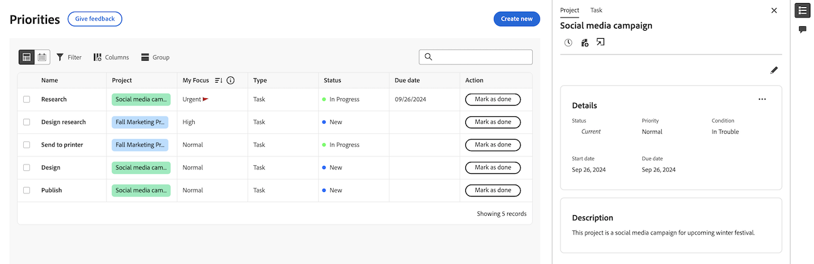

# Anzeigen von Projekt- und Aufgabendetails in der Arbeitsliste &quot;Prioritäten&quot;

Die hervorgehobenen Informationen auf dieser Seite beziehen sich auf Funktionen, die noch nicht allgemein verfügbar sind. Sie ist nur in der Vorschau-Sandbox-Umgebung verfügbar.

Sie können Projekt- und Aufgabendetails in der Liste der Prioritäten anzeigen.

## Zugriffsanforderungen

+++ Erweitern Sie , um die Zugriffsanforderungen für die Funktionalität in diesem Artikel anzuzeigen.

Sie müssen über folgenden Zugriff verfügen, um die Schritte in diesem Artikel ausführen zu können:

<table style="table-layout:auto"> 
 <col> 
 </col> 
 <col> 
 </col> 
 <tbody> 
  <tr> 
   <td role="rowheader"><strong>Adobe Workfront-Abo</strong></td> 
   <td> 
Alle
 </td> 
  </tr> 
  <tr> 
   <td role="rowheader"><strong>Adobe Workfront-Lizenz*</strong></td> 
   <td> 
   
Aktuell: Überprüfer oder höher

   
Neu: Licht oder höher
 
   </td> 
  </tr> 
  <tr> 
   <td role="rowheader"><strong>Konfigurationen auf Zugriffsebene</strong></td> 
   <td> 
Anzeigen oder Bearbeiten des Zugriffs für das Objekt, auf dem die Aktualisierung ausgeführt wird
</td> 
  </tr> 
  <tr> 
   <td role="rowheader"><strong>Objektberechtigungen</strong></td> 
   <td> 
Zugriff auf das Objekt anzeigen
</td> 
  </tr> 
 </tbody> 
</table>

*Weitere Informationen finden Sie unter [Zugriffsanforderungen in der Workfront-Dokumentation](/help/quicksilver/administration-and-setup/add-users/access-levels-and-object-permissions/access-level-requirements-in-documentation.md).

+++

## Anzeigen von Projektdetails

{{step1-to-priorities}}

1. Bewegen Sie in der Arbeitsliste den Mauszeiger über den Namen des Arbeitselements und klicken Sie dann auf das Symbol **Zusammenfassung** .
1. Klicken Sie oben im Bedienfeld &quot;Zusammenfassung&quot;auf **Projekt** . Hier können Sie
   * Anzeigen und Bearbeiten von Projektdetails und Beschreibung
   * Anzeigen und Hinzufügen von Kommentaren zum Projekt
   * Zeit erfassen
   * Datei hinzufügen
   * Direkt zum Projekt wechseln

   
   <!--new screen for prod -->

## Aufgabendetails anzeigen

{{step1-to-priorities}}

1. Bewegen Sie in der Arbeitsliste den Mauszeiger über den Arbeitsnamen und klicken Sie dann auf das Symbol **Zusammenfassung** .
1. Aufgabe ist standardmäßig ausgewählt. Hier können Sie
   * Anzeigen und Bearbeiten von Projektdetails und Beschreibung
   * Anzeigen und Hinzufügen von Kommentaren zum Projekt
   * Dokumente anzeigen und hinzufügen
   * Zeit erfassen
   * Datei hinzufügen
   * Schnelllinks hinzufügen

   
   <!--new screen for prod -->
