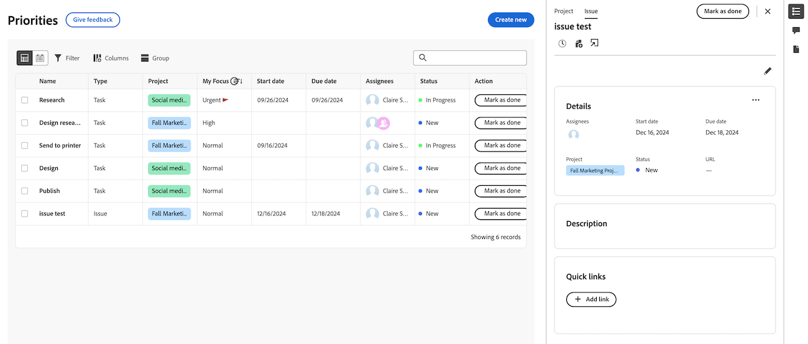

# Projekt- und Arbeitselementdetails in Prioritäten anzeigen

Die hervorgehobenen Informationen auf dieser Seite beziehen sich auf Funktionen, die noch nicht allgemein verfügbar sind. Sie ist nur in der Sandbox-Vorschau-Umgebung verfügbar.

Sie können Projekt-, Aufgaben- und Problemdetails in der Prioritäts-Arbeitsliste anzeigen.

>[!IMPORTANT]
>
>Projekte müssen den Status „Aktuell“ oder einen Status aufweisen, der „Aktuell“ entspricht, damit Projekte sowie deren untergeordnete Aufgaben und Probleme angezeigt werden.

## Zugriffsanforderungen

+++ Erweitern Sie , um die Zugriffsanforderungen für die -Funktion in diesem Artikel anzuzeigen.

Sie müssen über folgenden Zugriff verfügen, um die Schritte in diesem Artikel ausführen zu können:

<table style="table-layout:auto"> 
 <col> 
 </col> 
 <col> 
 </col> 
 <tbody> 
  <tr> 
   <td role="rowheader"><strong>Adobe Workfront-Plan</strong></td> 
   <td> 
Beliebig
 </td> 
  </tr> 
  <tr> 
   <td role="rowheader"><strong>Adobe Workfront-Lizenz*</strong></td> 
   <td> 
   
Aktuell: Prüfer oder höher

   
Neu: Licht oder höher
 
   </td> 
  </tr> 
  <tr> 
   <td role="rowheader"><strong>Konfigurationen der Zugriffsebene</strong></td> 
   <td> 
Anzeigen- oder Bearbeitungszugriff für das Objekt, auf dem die Aktualisierung ausgeführt wird
</td> 
  </tr> 
  <tr> 
   <td role="rowheader"><strong>Objektberechtigungen</strong></td> 
   <td> 
Anzeigen des Zugriffs auf das Objekt
</td> 
  </tr> 
 </tbody> 
</table>

*Weitere Informationen finden Sie unter [Zugriffsanforderungen in der Dokumentation zu Workfront](/help/quicksilver/administration-and-setup/add-users/access-levels-and-object-permissions/access-level-requirements-in-documentation.md).

+++

## Details im seitlichen Bedienfeld der Arbeitsliste anzeigen

### Projektdetails anzeigen

{{step1-to-priorities}}

1. Bewegen Sie in der Arbeitsliste den Mauszeiger über den Namen des Arbeitselements und klicken Sie dann auf **Zusammenfassung** Symbol .
1. Klicken **oben** Zusammenfassungsbereich auf „Projekt“. Hier können Sie
   * Projektdetails und -beschreibungen anzeigen und bearbeiten
   * Anzeigen und Hinzufügen von Kommentaren zum Projekt
   * Zeit erfassen
   * Datei hinzufügen
   * Gehen Sie direkt zum Projekt

   
   <!--new screen for prod -->

### Aufgabendetails anzeigen

{{step1-to-priorities}}

1. Bewegen Sie in der Arbeitsliste den Mauszeiger über den Arbeitsnamen und klicken Sie dann auf **Zusammenfassung** Symbol .
1. Aufgabe ist standardmäßig ausgewählt. Hier können Sie
   * Projekt- und Aufgabendetails und Beschreibung anzeigen und bearbeiten
   * Anzeigen und Hinzufügen von Kommentaren zum Projekt
   * Dokumente anzeigen und hinzufügen
   * Erstellen eines Korrekturabzugs
   * Zeit erfassen
   * Datei hinzufügen
   * Schnellverknüpfungen hinzufügen

   
   <!--new screen for prod -->

### Anfragedetails anzeigen

{{step1-to-priorities}}

1. Bewegen Sie in der Arbeitsliste den Mauszeiger über den Arbeitsnamen und klicken Sie dann auf **Zusammenfassung** Symbol .
1. Problem ist standardmäßig ausgewählt. Hier können Sie
   * Projekt- und Problemdetails und -beschreibung anzeigen und bearbeiten
   * Anzeigen und Hinzufügen von Kommentaren zum Projekt
* Dokumente anzeigen und hinzufügen
* Erstellen eines Korrekturabzugs
   * Zeit erfassen
   * Datei hinzufügen
   * Schnellverknüpfungen hinzufügen

  <!--new screen for prod -->

## Details auf der Detailseite anzeigen

Sie können Echtzeitaktualisierungen auf der Detailseite einer Aufgabe oder eines Problems anzeigen. Mit Echtzeit-Präsenzindikatoren können Sie auch sehen, ob andere Benutzer die Seite gleichzeitig mit Ihnen ansehen.

## Arbeitsaufgabendetails anzeigen

{{step1-to-priorities}}

1. Klicken Sie in der Arbeitsliste auf den Namen des Arbeitselements. Auf der Seite Details haben Sie folgende Möglichkeiten

* Projektdetails und -beschreibungen anzeigen und bearbeiten
* Anzeigen und Hinzufügen von Kommentaren zum Projekt
* Dokumente anzeigen und hinzufügen
* Erstellen eines Korrekturabzugs
* Zeit erfassen
* Datei hinzufügen
* Schnellverknüpfungen hinzufügen

<!-- screenshot for prod-->