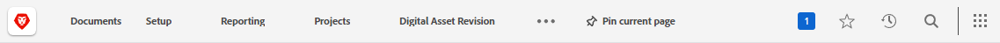

# Übersicht über die obere Navigationsleiste

<!--Audited: 01/2024-->

Die obere Navigationsleiste, die oben auf dem Bildschirm in [!DNL Adobe Workfront] angezeigt wird, ermöglicht es Ihnen, andere Bereiche der Plattform einfach zu finden und zu ihnen zu navigieren.

## Symbol [!UICONTROL Startseite]

Das **[!UICONTROL Startseite]**-Symbol  Sie zur [!UICONTROL Startseite] der standardmäßigen Landingpage.

Standardmäßig wird durch Klicken auf das Symbol Startseite der Bereich Startseite geöffnet. Weitere Informationen zur Startseite finden Sie unter [Verwenden des Bereichs [!UICONTROL Startseite] ](../../workfront-basics/using-home/using-the-home-area/use-the-home-area.md).

Ihr Workfront-Administrator kann das Startseiten -Symbol anpassen, um eine andere Seite zu öffnen, indem er eine Layout-Vorlage erstellt und sie Ihnen zuweist. Weitere Informationen finden Sie unter [Landingpage mithilfe einer Layout-Vorlage anpassen](/help/quicksilver/administration-and-setup/customize-workfront/use-layout-templates/customize-landing-page.md).

## Angeheftete Seiten

Sie können Seiten, die Sie häufig besuchen, so anheften, dass sie in der oberen Navigationsleiste angezeigt werden. Weitere Informationen zu angehefteten Seiten finden Sie unter [Anheften von Seiten zum Anpassen Ihres Arbeitsbereichs](../../workfront-basics/the-new-workfront-experience/pin-pages.md).

<!--
## [!UICONTROL Help] menu

The **[!UICONTROL Help]** menu allows you to search for help with a specific task, find more information on using [!DNL Workfront], view content related to the page you are currently on, or submit feedback about your experience.

To learn more about the Help menu, see [Access [!DNL Adobe Workfront] help](../../workfront-basics/navigate-workfront/workfront-navigation/access-workfront-help.md).
-->

## [!UICONTROL Benachrichtigungen] Menü

Das blaue nummerierte Feld oben rechts im Bildschirm  öffnet eine Liste mit Benachrichtigungen.

Über das Menü Benachrichtigungen können Sie auf folgende Elemente zugreifen:

* **Benachrichtigungen**: Hierbei handelt es sich um Warnhinweise, die von Workfront generiert werden, wenn bestimmte Bedingungen erfüllt sind, um Sie über Informationen zu informieren, die möglicherweise Ihre Aufmerksamkeit erfordern.

* **Ankündigungen**: Ankündigungen, die von Ihren Workfront-Admins zu wichtigen Themen gesendet werden.

Weitere Informationen zu Benachrichtigungen und Ankündigungen finden Sie unter [In-App-Benachrichtigungen anzeigen und verwalten](../../workfront-basics/using-notifications/view-and-manage-in-app-notifications.md).

## [!UICONTROL Favoriten] Menü

Mit dem **[!UICONTROL Favoriten]**-Symbol  wird eine Liste von Seiten im System geöffnet, die Sie als Favoriten gekennzeichnet haben. Sie können die Seite, auf der Sie sich gerade befinden, über dieses Menü hinzufügen.

Weitere Informationen zu den Favoriten finden Sie unter [Anzeigen und Verwalten von Favoriten](../../workfront-basics/navigate-workfront/recent-and-favorites/view-and-manage-favorites.md).

## [!UICONTROL Zuletzt verwendet] Menü

Mit **[!UICONTROL Symbol]** Zuletzt verwendet![[!UICONTROL  (]](assets/recents-icon-40x43.png)) wird eine Liste der Seiten geöffnet, die Sie kürzlich besucht haben.

Weitere Informationen zu den letzten Elementen finden Sie unter [Aktuelle Elemente anzeigen](../../workfront-basics/navigate-workfront/recent-and-favorites/view-recent-items.md).

## [!UICONTROL Suche] Menü

Mit dem Symbol **[!UICONTROL Suche]**  oben rechts in [!DNL Workfront] können Sie eine einfache Suche durchführen, Ihre Suche auf ein bestimmtes Objekt beschränken oder die [!UICONTROL Erweiterte Suche] verwenden, um nach einem Keyword für ein bestimmtes Objekt zu suchen und Filter zu verwenden, um Ihre Suche auf bestimmte Felder zu beschränken.

Weitere Informationen zur Suche finden Sie unter [Suche [!DNL Adobe Workfront]](../../workfront-basics/navigate-workfront/search/search-workfront.md).

## [!UICONTROL Hauptmenü]

>[!IMPORTANT]
>
>Das auf dieser Seite beschriebene Hauptmenü gilt nur für Organisationen, die noch nicht in [!DNL Adobe Experience Cloud] integriert wurden.
>
> Wenn Ihre Organisation in [!DNL Adobe Experience Cloud] integriert wurde, finden Sie weitere Informationen unter [[!DNL Adobe Unified Experience] für [!DNL Workfront]](/help/quicksilver/workfront-basics/navigate-workfront/workfront-navigation/adobe-unified-experience.md).

Mit dem Symbol **[!UICONTROL Hauptmenü]**  wird das [!UICONTROL Hauptmenü] geöffnet, über das Sie zu einem anderen Bereich von Workfront navigieren können.

Welche Optionen im [!UICONTROL Hauptmenü“ verfügbar sind] hängt von Folgendem ab:

* **Konfigurationen von Layout-Vorlagen**: Informationen dazu, wie ein [!DNL Workfront]-Administrator das [!UICONTROL Hauptmenü] einer Layout-Vorlage ändern kann, finden Sie unter [Anpassen des [!UICONTROL Hauptmenüs] mithilfe einer Layout-Vorlage](../../administration-and-setup/customize-workfront/use-layout-templates/customize-main-menu.md).

* **Lizenztyp**: Informationen zu den Standardkonfigurationen für verschiedene Lizenztypen finden Sie unter [Grundlegendes zur Navigation für einen Benutzer, der die Lizenz ](../../workfront-basics/navigate-workfront/workfront-navigation/reviewer-global-navigation-bar.md), oder [Grundlegendes zur Navigation für einen Benutzer, der die [!UICONTROL Arbeit]-Lizenz verwendet](../../workfront-basics/navigate-workfront/workfront-navigation/worker-global-navigation-bar.md).

Jedes Symbol führt Sie zu einem anderen Bereich von Workfront.

Weitere Informationen zu den einzelnen Bereichen finden Sie unter:

<!--

(NOTE: Update screenshot and add icons for new products/features.)

-->

<table style="table-layout:auto"> 
 <col> 
 <col> 
 <tbody> 
  <tr> 
   <td> 
    <ul> 
     <li>[!UICONTROL Home]: <a href="../../workfront-basics/using-home/using-the-home-area/use-the-home-area.md" class="MCXref xref">Verwenden Sie den Bereich [!UICONTROL Home]</a></li> 
     <li>[!UICONTROL Portfolios]: <a href="../../manage-work/portfolios/portfolio-management-overview.md" class="MCXref xref">Portfolio-Verwaltung</a></li> 
     <li>[!UICONTROL Programme]: <a href="../../manage-work/portfolios/create-and-manage-programs/create-and-manage-programs.md" class="MCXref xref">Erstellen und Verwalten von Programmen </a></li> 
     <li>[!UICONTROL Projects]: <a href="../../manage-work/projects/projects-overview.md" class="MCXref xref">Projekte: Artikelindex</a></li> 
     <li>[!UICONTROL Reports]: <a href="../../reports-and-dashboards/reports/reports-overview.md" class="MCXref xref">Berichte</a></li> 
     <li>[!UICONTROL Dashboards]: <a href="../../reports-and-dashboards/dashboards/dashboards-overview.md" class="MCXref xref">Dashboards</a></li> 
     <li>[!UICONTROL Kalender]: <a href="../../reports-and-dashboards/reports/calendars/calendars.md" class="MCXref xref">Kalender: Artikelindex</a></li> 
     <li>[!UICONTROL-Ressource]: <a href="../../resource-mgmt/resource-mgmt-overview/resource-management-overview.md" class="MCXref xref">Ressourcenmanagement-</a></li> 
     <li>[!UICONTROL Teams]: <a href="../../people-teams-and-groups/create-and-manage-teams/create-and-mange-teams.md" class="MCXref xref">Erstellen und Verwalten von Teams</a></li> 
     <li>[!UICONTROL Benutzer]: <a href="../../administration-and-setup/add-users/create-and-manage-users/create-and-manage-users.md" class="MCXref xref">Benutzer erstellen und verwalten</a></li> 
    </ul> </td> 
   <td> 
    <ul> 
     <li>[!UICONTROL-Anfragen]: <a href="../../manage-work/requests/create-requests/create-requests.md" class="MCXref xref">Anfragen erstellen</a></li> 
     <li>[!UICONTROL Arbeitszeittabellen]: <a href="../../timesheets/timesheets-all.md" class="MCXref xref">Arbeitszeittabellen: Artikelindex</a></li> 
     <li>[!UICONTROL-Dokumente]: <a href="../../documents/documents-overview.md" class="MCXref xref">Dokumente</a></li> 
     <li>[!UICONTROL Templates]: <a href="../../manage-work/projects/create-and-manage-templates/create-manage-templates.md" class="MCXref xref">Erstellen und Verwalten von Projektvorlagen: Artikelindex</a></li> 
     <li>[!UICONTROL Goals]: <a href="../../workfront-goals/goal-management/wf-goals-overview.md" class="MCXref xref">[!DNL Adobe Workfront Goals] Übersicht</a></li> 
     <li>[!UICONTROL Scenarios]: <a href="../../scenario-planner/scenario-planner-overview.md" class="MCXref xref">Die Übersicht über den Szenario-Planer</a></li> 
     <li>[!UICONTROL Proofing]: <a href="../../workfront-proof/workfront-proof.md" class="MCXref xref">[!DNL Workfront] Korrekturabzug: Artikelindex</a></li> 
    </ul> </td> 
  </tr> 
 </tbody> 
</table>

Im unteren Bereich des Hauptmenüs können Sie auf Folgendes zugreifen:

<table style="table-layout:auto"> 
 <col> 
 <col> 
 <tbody> 
  <tr> 
   <td> 
[!UICONTROL Setup]
 </td> 
   <td> 
Durch Klicken auf <b>[!UICONTROL Setup]</b> gelangen Sie zum Bereich [!UICONTROL Setup], in dem Sie verschiedene Aspekte Ihres [!DNL Workfront]-Kontos konfigurieren können. Abhängig von Ihren Zugriffseinstellungen können die konfigurierbaren Funktionen eingeschränkt sein.
 
Weitere Informationen zum Bereich [!UICONTROL Setup] finden Sie unter <a href="../../administration-and-setup/administration-and-setup.md" class="MCXref xref">Administration und Einrichtung: Artikelindex</a>.
 </td> 
  </tr> 
  <tr> 
   <td> 
[!UICONTROL Hilfe]
 </td> 
   <td> 
Durch Klicken auf <b>[!UICONTROL Hilfe]</b> gelangen Sie zu [!DNL Adobe Experience League], wo Sie auf Hilfeartikel zugreifen, Schulungen finden, ein Support-Ticket einreichen usw. können.
 
Weitere Informationen zu [!DNL Experience League] oder anderen Hilfemöglichkeiten finden Sie unter <a href="../../workfront-basics/tips-tricks-and-troubleshooting/guide-for-help-in-workfront.md" class="MCXref xref">Kurzanleitung zum Suchen von Hilfe in Adobe Workfront</a>.
 </td> 
  </tr>

<tr> 
   <td> 
[!UICONTROL Abmelden]
 </td> 
   <td>Durch Klicken auf <b>[!UICONTROL Logout]</b> werden Sie von der [!DNL Workfront] abgemeldet.</td> 
  </tr> 
 </tbody> 
</table>

