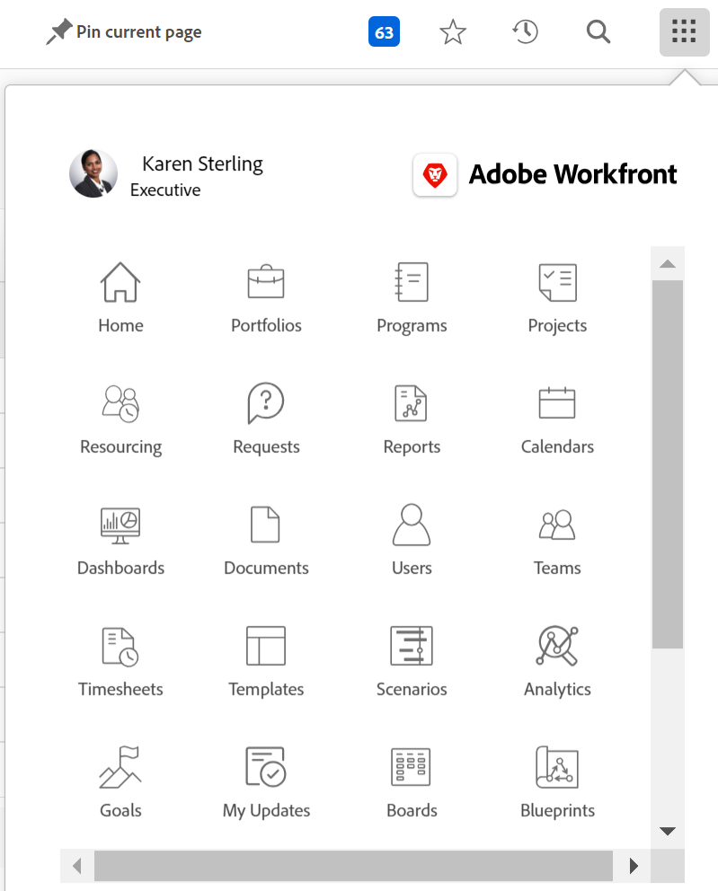

# Übersicht über die Navigationsleiste oben

Die obere Navigationsleiste, die oben auf dem Bildschirm in [!DNL Adobe Workfront] ermöglicht Ihnen, andere Bereiche der Plattform einfach zu finden und zu ihnen zu navigieren.

## [!UICONTROL Startseite] icon

Die **[!UICONTROL Startseite]** icon  bringt Sie zum [!UICONTROL Startseite] -Seite, die die Standard-Landingpage ist. Weitere Informationen zu &quot;Home&quot;finden Sie unter [Verwenden Sie die [!UICONTROL Startseite] area](../../workfront-basics/using-home/using-the-home-area/use-the-home-area.md).

## Angeheftete Seiten

Sie können häufig besuchte Seiten so anheften, dass sie in der oberen Navigationsleiste angezeigt werden. Weitere Informationen zu fixierten Seiten finden Sie unter [Seiten fixieren, um Ihren Arbeitsbereich anzupassen](../../workfront-basics/the-new-workfront-experience/pin-pages.md).

## [!UICONTROL Hilfe] Menü

Die **[!UICONTROL Hilfe]** -Menü können Sie nach Hilfe für eine bestimmte Aufgabe suchen und weitere Informationen zur Verwendung von [!DNL Workfront], sehen Sie Inhalte zu der Seite an, auf der Sie sich gerade befinden, oder senden Sie Feedback zu Ihrem Erlebnis.

Weitere Informationen zum Hilfemenü finden Sie unter [Zugriff [!DNL Adobe Workfront] help](../../workfront-basics/navigate-workfront/workfront-navigation/access-workfront-help.md).

## [!UICONTROL Benachrichtigungen] Menü

Das blaue nummerierte Feld  in der oberen rechten Ecke des Bildschirms eine Liste mit Benachrichtigungen geöffnet.

Weitere Informationen zu Benachrichtigungen finden Sie unter [Anzeigen und Verwalten von In-App-Benachrichtigungen](../../workfront-basics/using-notifications/view-and-manage-in-app-notifications.md).

## [!UICONTROL Favoriten] Menü

Die **[!UICONTROL Favoriten]** icon  öffnet eine Liste von Seiten im System, für die Sie Favoriten haben. Sie können die Seite, auf der Sie sich gerade befinden, über dieses Menü hinzufügen.

Weitere Informationen zu Favoriten finden Sie unter [Anzeigen und Verwalten von Favoriten](../../workfront-basics/navigate-workfront/recent-and-favorites/view-and-manage-favorites.md).

## [!UICONTROL Letzte] Menü

Die **[!UICONTROL Letzte]** icon ![[!UICONTROL Letzte]](assets/recents-icon-40x43.png) öffnet eine Liste der Seiten, die Sie kürzlich besucht haben.

Weitere Informationen zu Neuigkeiten finden Sie unter [Aktuelle Elemente anzeigen](../../workfront-basics/navigate-workfront/recent-and-favorites/view-recent-items.md).

## [!UICONTROL Suche] Menü

Die **[!UICONTROL Suche]** icon  in der oberen rechten Ecke von [!DNL Workfront] ermöglicht Ihnen, eine einfache Suche durchzuführen, die Suche auf ein bestimmtes Objekt zu beschränken oder [!UICONTROL Erweiterte Suche] , um nach einem Suchbegriff für ein bestimmtes Objekt zu suchen und Filter zu verwenden, um Ihre Suche auf bestimmte Felder zu beschränken.

Weitere Informationen zur Suche finden Sie unter [Suche [!DNL Adobe Workfront]](../../workfront-basics/navigate-workfront/search/search-workfront.md).

## [!UICONTROL Hauptmenü]

>[!IMPORTANT]
>
>Das auf dieser Seite beschriebene Hauptmenü gilt nur für Organisationen, die noch nicht integriert sind in [!DNL Adobe Experience Cloud].
>
> Wenn Ihr Unternehmen bei [!DNL Adobe Experience Cloud], siehe [[!DNL Adobe Unified Experience] für [!DNL Workfront]](/help/quicksilver/workfront-basics/navigate-workfront/workfront-navigation/adobe-unified-experience.md).

Die **[!UICONTROL Hauptmenü]** icon  öffnet die [!UICONTROL Hauptmenü], mit dem Sie zu einem anderen Bereich von Workfront navigieren können.

Die Optionen, die im [!UICONTROL Hauptmenü] sind abhängig von:

* **Layoutvorlagenkonfigurationen**: Um zu erfahren, wie ein [!DNL Workfront] kann der Administrator [!UICONTROL Hauptmenü] aus einer Layout-Vorlage, siehe [Anpassen der [!UICONTROL Hauptmenü] Layout-Vorlage verwenden](../../administration-and-setup/customize-workfront/use-layout-templates/customize-main-menu.md).

* **Lizenztyp**: Informationen zu den Standardkonfigurationen für verschiedene Lizenztypen finden Sie unter [Informationen zur Navigation für einen Benutzer mit einer Review-Lizenz](../../workfront-basics/navigate-workfront/workfront-navigation/reviewer-global-navigation-bar.md) oder [Die Navigation für eine [!UICONTROL Arbeit]-Lizenzanwender](../../workfront-basics/navigate-workfront/workfront-navigation/worker-global-navigation-bar.md).

Jedes Symbol bringt Sie in einen anderen Bereich des neuen [!DNL Adobe Workfront] Erlebnis. Weitere Informationen zu den einzelnen Bereichen finden Sie unter:

<!--

(NOTE: Update screenshot and add icons for new products/features.)

-->

<table style="table-layout:auto"> 
 <col> 
 <col> 
 <tbody> 
  <tr> 
   <td> 
    <ul> 
     <li>[!UICONTROL Home]: <a href="../../workfront-basics/using-home/using-the-home-area/use-the-home-area.md" class="MCXref xref">Verwenden des [!UICONTROL Home]-Bereichs</a></li> 
     <li>[!UICONTROL Portfolios]: <a href="../../manage-work/portfolios/portfolio-management-overview.md" class="MCXref xref">Portfolio-Management</a></li> 
     <li>[!UICONTROL Programme] <a href="../../manage-work/portfolios/create-and-manage-programs/create-and-manage-programs.md" class="MCXref xref">Programme erstellen und verwalten </a></li> 
     <li>[!UICONTROL Projekte]: <a href="../../manage-work/projects/projects-overview.md" class="MCXref xref">Projekte: Artikelindex</a></li> 
     <li>[!UICONTROL Berichte]: <a href="../../reports-and-dashboards/reports/reports-overview.md" class="MCXref xref">Berichte</a></li> 
     <li>[!UICONTROL Dashboards]: <a href="../../reports-and-dashboards/dashboards/dashboards-overview.md" class="MCXref xref">Dashboards</a></li> 
     <li>[!UICONTROL Kalender]: <a href="../../reports-and-dashboards/reports/calendars/calendars.md" class="MCXref xref">Kalender: Artikelindex</a></li> 
     <li>[!UICONTROL Ressourcen]: <a href="../../resource-mgmt/resource-mgmt-overview/resource-management-overview.md" class="MCXref xref">Ressourcenverwaltung </a></li> 
     <li>[!UICONTROL Teams]: <a href="../../people-teams-and-groups/create-and-manage-teams/create-and-mange-teams.md" class="MCXref xref">Erstellen und Verwalten von Teams</a></li> 
     <li>[!UICONTROL Benutzer]: <a href="../../administration-and-setup/add-users/create-and-manage-users/create-and-manage-users.md" class="MCXref xref">Benutzer erstellen und verwalten</a></li> 
    </ul> </td> 
   <td> 
    <ul> 
     <li>[!UICONTROL Anforderungen]: <a href="../../manage-work/requests/create-requests/create-requests.md" class="MCXref xref">Anforderungen erstellen</a></li> 
     <li>[!UICONTROL Timesheets]: <a href="../../timesheets/timesheets-all.md" class="MCXref xref">Timesheets: Artikelindex</a></li> 
     <li>[!UICONTROL Dokumente]: <a href="../../documents/documents-overview.md" class="MCXref xref">Dokumente</a></li> 
     <li>[!UICONTROL Vorlagen]: <a href="../../manage-work/projects/create-and-manage-templates/create-manage-templates.md" class="MCXref xref">Erstellen und Verwalten von Projektvorlagen: Artikelindex</a></li> 
     <li>[!UICONTROL Analytics]: <a href="../../enhanced-analytics/enhanced-analytics-overview.md" class="MCXref xref">Erweiterte Analyse - Übersicht</a></li> 
     <li>[!UICONTROL Ziele]: <a href="../../workfront-goals/goal-management/wf-goals-overview.md" class="MCXref xref">[!DNL Adobe Workfront Goals] Übersicht</a></li> 
     <li>[!UICONTROL Szenarios]: <a href="../../scenario-planner/scenario-planner-overview.md" class="MCXref xref">Übersicht über den Szenario-Planer</a></li> 
     <li>[!UICONTROL Testing]: <a href="../../workfront-proof/workfront-proof.md" class="MCXref xref">[!DNL Workfront] Testversand: Artikelindex</a></li> 
    </ul> </td> 
  </tr> 
 </tbody> 
</table>

Unter diesen Optionen finden Sie im [!UICONTROL Hauptmenü], können Sie auf Folgendes zugreifen:

<table style="table-layout:auto"> 
 <col> 
 <col> 
 <tbody> 
  <tr> 
   <td> 
[!UICONTROL Setup]
 </td> 
   <td> 
Klicken <b>[!UICONTROL Setup]</b> Sie gelangen in den [!UICONTROL Setup]-Bereich, in dem Sie verschiedene Aspekte Ihrer [!DNL Workfront] -Konto. Abhängig von Ihren Zugriffseinstellungen ist das, was Sie konfigurieren können, möglicherweise eingeschränkt.
 
Weitere Informationen zum [!UICONTROL Setup]-Bereich finden Sie unter <a href="../../administration-and-setup/administration-and-setup.md" class="MCXref xref">Administration und Einrichtung: Artikelindex</a>.
 </td> 
  </tr> 
  <tr> 
   <td> 
[!UICONTROL Hilfe]
 </td> 
   <td> 
Klicken <b>[!UICONTROL Hilfe]</b> bringt Sie zu [!DNL Adobe Experience League] wo Sie Hilfe-Artikel aufrufen können, Schulungen finden, ein Support-Ticket für Kunden einreichen können und so weiter.
 
Weitere Informationen unter [!DNL Experience League] oder andere Methoden, um Hilfe zu erhalten, siehe <a href="../../workfront-basics/tips-tricks-and-troubleshooting/guide-for-help-in-workfront.md" class="MCXref xref">Kurzanleitung zum Auffinden von Hilfe in Adobe Workfront</a>.
 </td> 
  </tr>

<tr> 
   <td> 
[!UICONTROL Logout]
 </td> 
   <td>Klicken <b>[!UICONTROL Logout]</b> meldet Sie sich von [!DNL Workfront].</td> 
  </tr> 
 </tbody> 
</table>
