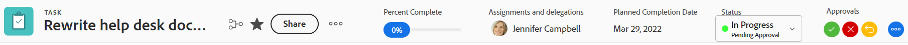
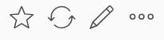

# Übersicht über Objektkopfzeilen

Sie können Informationen zu Objekten in [!DNL Adobe Workfront] auf einen Blick anzeigen, wenn Sie deren Kopfzeile überprüfen.

Zusätzlich zum Namen des Objekts kann die Kopfzeile den Eigentümer des Objekts, den Status oder den Prozentwert der Fertigstellung enthalten.

[!DNL Workfront] gibt dem Namen des Objekts Priorität, wobei ihm in der Kopfzeile so viel Platz wie möglich zugewiesen wird. Wenn ein Objektname zu lang ist, wird er abgeschnitten. Um den vollständigen Namen eines Objekts anzuzeigen, können Sie den Mauszeiger darüber bewegen.

## Zugriff auf die Kopfzeile eines Objekts

Der Zugriff auf den Header für ein Objekt in [!DNL Workfront] ist für alle Objekte, die es haben, identisch.

So greifen Sie beispielsweise auf die Kopfzeile eines Projekts zu:

1. Gehe zu einem Projekt.\
   Die Kopfzeile wird oben auf der Seite angezeigt und enthält den Namen des Projekts.

   

<!--## [!UICONTROL Home] header overview 

The following headers are available in Home:

* Task: For more information on how you can use this header, see the [Task header overview](#task-header-overview) in this article.
* Issue: For more information on how you can use this header, see the [Issue header overview](#issue-header-overview) in this article.-->

## Anpassbare Kopfzeilen

Ihr [!DNL Workfront]- oder Gruppenadministrator kann die Kopfzeile von Projekten, Aufgaben und Problemen mithilfe einer Layout-Vorlage anpassen.

In diesem Artikel werden die Standardkopfzeilen für alle Objekte beschrieben, einschließlich Projekten und Aufgaben und Problemen.

Informationen zum Anpassen von Informationen über die Kopfzeile eines Objekts finden Sie unter [Anpassen von Objektkopfzeilen mithilfe einer Layout-Vorlage](../../administration-and-setup/customize-workfront/use-layout-templates/customize-object-headers.md).

## Projektkopfzeile - Übersicht

Die Projekt-Kopfzeile zeigt standardmäßig die folgenden Informationen an:

<table style="table-layout:auto"> 
 <col> 
 <col> 
 <thead> 
  <tr> 
   <th>Kopfzeileninformationen</th> 
   <th>Notizen</th> 
  </tr> 
 </thead> 
 <tbody> 
  <tr> 
   <td role="rowheader">Breadcrumb mit übergeordneten Objekten</td> 
   <td>Wenn das Projekt mit einem Programm oder Portfolio verknüpft ist, wird es im Breadcrumb in der linken oberen Ecke der Kopfzeile angezeigt. Durch Klicken auf den Namen des übergeordneten Objekts wird dieses übergeordnete Objekt geöffnet.</td> 
  </tr> 
  <tr data-mc-conditions=""> 
   <td role="rowheader">Symbol für Objekt </td> 
   <td> 
Links neben dem Projektnamen wird das violette  [!UICONTROL Project] angezeigt.
 </td> 
  </tr> 
  <tr> 
   <td role="rowheader">Name des Projekts</td> 
   <td>Sie können den Projektnamen in der Kopfzeile bearbeiten.</td> 
  </tr> 
  <tr> 
   <td role="rowheader">Name des Objekttyps</td> 
   <td> 
Der Text "[!UICONTROL PROJECT]" wird über dem Projektnamen in der Kopfzeile angezeigt.
 </td> 
  </tr> 
  <tr> 
   <td role="rowheader">Der Aktionsbereich des Projekts</td> 
   <td> 
Neben dem Namen des Projekts wird der Bereich Aktionen angezeigt, der die Option <b>Freigeben</b> enthält.
 
  
  </td> 
  </tr> 
  <tr> 
   <td role="rowheader">[!UICONTROL Prozent abgeschlossen]</td> 
   <td>Das Projekt „Prozent abgeschlossen“ in der Kopfzeile kann nicht bearbeitet werden.</td> 
  </tr> 
  <tr> 
   <td role="rowheader">[!UICONTROL Projektbesitzer]</td> 
   <td> 
Sie können den [!UICONTROL Projektbesitzer] in der Kopfzeile bearbeiten.
 </td> 
  </tr> 
  <tr> 
   <td role="rowheader">[!UICONTROL Geplantes Abschlussdatum] </td> 
   <td> 
Sie können das Projekt [!UICONTROL Geplantes Abschlussdatum] und die Uhrzeit in der Kopfzeile bearbeiten, wenn das Projekt ab dem [!UICONTROL Abschlussdatum] geplant ist. Wenn das Projekt ab dem [!UICONTROL Startdatum] geplant ist, werden diese Informationen aus den Aufgaben im Projekt aktualisiert.
 </td> 
  </tr> 
  <tr> 
   <td role="rowheader">[!UICONTROL -Bedingung] </td> 
   <td> 
Wenn Sie den [!UICONTROL Condition Type] des Projekts auf Manuell setzen, können Sie die [!UICONTROL Condition] im Header aktualisieren.
</td> 
  </tr> 
  <tr> 
   <td role="rowheader">[!UICONTROL Status]</td> 
   <td>Sie können das Projekt [!UICONTROL Status] in der Kopfzeile bearbeiten.</td> 
  </tr> 
  <tr> 
   <td role="rowheader">Der Bereich [!UICONTROL -Genehmigungen]</td> 
   <td> 
Wenn Sie einer der genehmigenden Personen sind, verwenden Sie die folgenden Symbole, um die Genehmigungen für das Projekt zu verwalten:
 
  </img> [!UICONTROL genehmigen]
 
  </img> [!UICONTROL Reject]
 
  </img> [!UICONTROL recall]
 
Wenn Sie keine genehmigende Person sind, klicken Sie auf das Symbol [!UICONTROL Mehr] , um Informationen zum aktuellen Genehmigungsschritt anzuzeigen.
 
Weitere Informationen zu Validierungen finden Sie unter <a href="../../review-and-approve-work/manage-approvals/approval-process-in-workfront.md" class="MCXref xref">Übersicht über den Genehmigungsprozess</a>.
 </td> 
  </tr> 
 </tbody> 
</table>

## Aufgabenkopfzeile - Übersicht

Die Aufgabenkopfzeile enthält standardmäßig die folgenden Informationen:

<table style="table-layout:auto"> 
 <col> 
 <col> 
 <thead> 
  <tr> 
   <th>Kopfzeileninformationen</th> 
   <th>Notizen</th> 
  </tr> 
 </thead> 
 <tbody> 
  <tr> 
   <td role="rowheader">Breadcrumb mit übergeordneten Objekten</td> 
   <td> 
Die übergeordneten Objekte der Aufgabe werden im Breadcrumb angezeigt. Durch Klicken auf den Namen des übergeordneten Objekts wird dieses übergeordnete Objekt geöffnet.
 
Weitere Informationen finden Sie unter <a href="../../workfront-basics/the-new-workfront-experience/breadcrumb-overview.md" class="MCXref xref">Breadcrumbs - Übersicht</a>.
 </td> 
  </tr> 
  <tr data-mc-conditions=""> 
   <td role="rowheader">Symbol für Objekt </td> 
   <td> 
Links neben dem Aufgabennamen wird das grüne  [!UICONTROL Task] angezeigt.
 </td> 
  </tr> 
  <tr> 
   <td role="rowheader">Name der Aufgabe</td> 
   <td>Sie können den Aufgabennamen in der Kopfzeile bearbeiten.</td> 
  </tr> 
  <tr> 
   <td role="rowheader">Name des Objekttyps</td> 
   <td> 
Der Text "[!UICONTROL TASK]" wird oberhalb des Aufgabennamen in der Kopfzeile angezeigt.
 </td> 
  </tr> 
  <tr> 
   <td role="rowheader">Der Aktionsbereich der Aufgabe</td> 
   <td> 
Neben dem Namen der Aufgabe wird der Bereich Aktionen angezeigt, der die Option <b>Freigeben</b> enthält.
 
  
 
Wenn das Symbol Abhängigkeit angezeigt wird, können Sie auf das Symbol klicken, um Vorgänger oder Nachfolger für die Aufgabe anzuzeigen.
 </td> 
  </tr> 
  <tr> 
   <td role="rowheader">[!UICONTROL Prozent abgeschlossen]</td> 
   <td>Sie können den abgeschlossenen Prozentsatz der Aufgabe in der Kopfzeile bearbeiten.</td> 
  </tr> 
  <tr> 
   <td role="rowheader">[!UICONTROL -Zuweisungen]</td> 
   <td>Sie können die Verantwortlichen für eine Aufgabe über die Kopfzeile bearbeiten.</td> 
  </tr> 
  <tr> 
   <td role="rowheader"> 
Schaltfläche [!UICONTROL Bearbeiten], [!UICONTROL Fertig] oder [!UICONTROL Aufgabe starten]
 </td> 
   <td> 
Wenn Ihnen die Aufgabe zugewiesen ist, können Sie auf die Schaltfläche [!UICONTROL Bearbeiten] oder [!UICONTROL Aufgabe starten] klicken, um anzugeben, dass Sie die Aufgabe jetzt bearbeiten, oder auf die Schaltfläche [!UICONTROL Fertig], um anzugeben, dass Sie die Aufgabe abgeschlossen haben.
 
Informationen zum Ersetzen der Schaltfläche [!UICONTROL Work On It] durch eine Schaltfläche [!UICONTROL Start Task] finden Sie unter <a href="../../people-teams-and-groups/create-and-manage-teams/work-on-it-button-to-start-button.md" class="MCXref xref">Ersetzen der Schaltfläche [!UICONTROL Work On It] durch eine Schaltfläche Start</a>.
 </td> 
  </tr> 
  <tr> 
   <td role="rowheader">[!UICONTROL Geplantes Abschlussdatum]</td> 
   <td> 
Sie können das geplante Abschlussdatum (Geplant) und die Uhrzeit in der Kopfzeile bearbeiten.
 
Tipp: Beachten Sie, dass das [!UICONTROL Commit Date] in der Kopfzeile nicht angezeigt wird. Sie können sie auf der Seite [!UICONTROL Details] anzeigen.
 </td> 
  </tr> 
  <tr> 
   <td role="rowheader">[!UICONTROL Status]</td> 
   <td>Sie können die Aufgabe [!UICONTROL Status] in der Kopfzeile bearbeiten.</td> 
  </tr> 
  <tr> 
   <td role="rowheader">Der Bereich [!UICONTROL -Genehmigungen]</td> 
   <td> 
Wenn Sie eine der genehmigenden Personen sind, verwenden Sie die folgenden Symbole, um die Genehmigungen für die Aufgabe zu verwalten:
 
  </img> [!UICONTROL genehmigen]
 
  </img> [!UICONTROL Reject]
 
  </img> [!UICONTROL recall]
 
Wenn Sie keine genehmigende Person sind, klicken Sie auf das Symbol [!UICONTROL Mehr] , um Informationen zum aktuellen Genehmigungsschritt anzuzeigen.
 
Weitere Informationen zu Validierungen finden Sie unter <a href="../../review-and-approve-work/manage-approvals/approval-process-in-workfront.md" class="MCXref xref">Übersicht über den Genehmigungsprozess</a>.
 </td> 
  </tr> 
 </tbody> 
</table>

## Problem-Header - Übersicht

Die Problem-Kopfzeile enthält standardmäßig die folgenden Informationen:

<table style="table-layout:auto"> 
 <col> 
 <col> 
 <thead> 
  <tr> 
   <th>Kopfzeileninformationen</th> 
   <th>Notizen</th> 
  </tr> 
 </thead> 
 <tbody> 
  <tr> 
   <td role="rowheader">Breadcrumb mit übergeordneten Objekten</td> 
   <td> 
Die übergeordneten Objekte des Problems werden im Breadcrumb angezeigt. Durch Klicken auf den Namen des übergeordneten Objekts wird dieses übergeordnete Objekt geöffnet.
 
Weitere Informationen finden Sie unter <a href="../../workfront-basics/the-new-workfront-experience/breadcrumb-overview.md" class="MCXref xref">Breadcrumbs - Übersicht</a>.
 </td> 
  </tr> 
  <tr> 
   <td role="rowheader">Symbol für Objekt </td> 
   <td> 
Links neben dem Problemnamen wird das rosafarbene  [!UICONTROL Problem] angezeigt.
 </td> 
  </tr> 
  <tr> 
   <td role="rowheader">Name des Problems</td> 
   <td>Sie können den Problemnamen in der Kopfzeile bearbeiten.</td> 
  </tr> 
  <tr> 
   <td role="rowheader">Name des Objekttyps</td> 
   <td> 
Der Text "[!UICONTROL PROBLEM]" wird oberhalb des Problemnamens in der Kopfzeile angezeigt.
 </td> 
  </tr> 
  <tr> 
   <td role="rowheader">Der Aktionsbereich des Problems</td> 
   <td> 
Neben dem Namen des Problems wird der Bereich Aktionen angezeigt, der die Option <b>Freigeben</b> enthält.
 
  
Wenn das Symbol [!UICONTROL Dependency] angezeigt wird, können Sie auf das Symbol klicken, um alle Vorgänger oder Nachfolger für das Problem anzuzeigen.
  </td> 
  </tr> 
  <tr> 
   <td role="rowheader">[!UICONTROL Prozent abgeschlossen]</td> 
   <td> 
Sie können den abgeschlossenen Prozentsatz des Problems in der -Kopfzeile bearbeiten.
 </td> 
  </tr> 
  <tr> 
   <td role="rowheader">[!UICONTROL -Zuweisungen]</td> 
   <td>Sie können die Bevollmächtigten eines Problems über die -Kopfzeile bearbeiten.</td> 
  </tr> 
  <tr> 
   <td role="rowheader">Schaltfläche [!UICONTROL Bearbeiten], [!UICONTROL Fertig]  [!UICONTROL Problem starten] </td> 
   <td>Wenn Ihnen das Problem zugewiesen wurde, können Sie auf die Schaltfläche [!UICONTROL Bearbeiten] oder [!UICONTROL Problem starten] klicken, um anzugeben, dass Sie das Problem jetzt bearbeiten, oder auf die Schaltfläche [!UICONTROL Fertig], um anzugeben, dass Sie das Problem abgeschlossen haben.Informationen zum Ersetzen der Schaltfläche [!UICONTROL Work On It] durch eine Schaltfläche [!UICONTROL Start Task] finden Sie unter <a href="../../people-teams-and-groups/create-and-manage-teams/work-on-it-button-to-start-button.md" class="MCXref xref">Ersetzen der Schaltfläche [!UICONTROL Work On It] durch eine Schaltfläche Start</a>.</td> 
  </tr> 
  <tr> 
   <td role="rowheader">[!UICONTROL Geplantes Abschlussdatum]</td> 
   <td> 
Sie können das geplante Abschlussdatum (Geplant) und die Uhrzeit)  Problem in der Kopfzeile bearbeiten.
 
Tipp: Beachten Sie, dass das [!UICONTROL Commit Date] in der Kopfzeile nicht angezeigt wird. Sie können sie auf der Seite [!UICONTROL Details] anzeigen.
 </td> 
  </tr> 
  <tr> 
   <td role="rowheader">[!UICONTROL Status]</td> 
   <td>Sie können das Problem [!UICONTROL Status] in der Kopfzeile bearbeiten.</td> 
  </tr> 
  <tr> 
   <td role="rowheader">Der Bereich [!UICONTROL -Genehmigungen]</td> 
   <td> 
Wenn Sie eine der genehmigenden Personen sind, verwenden Sie die folgenden Symbole, um die Genehmigungen für das Problem zu verwalten:
 
  [!UICONTROL genehmigen]
 
  [!UICONTROL Reject]
 
  [!UICONTROL Rückruf]
 
Wenn Sie keine genehmigende Person sind, klicken Sie auf das Symbol [!UICONTROL Mehr] , um Informationen zum aktuellen Genehmigungsschritt anzuzeigen.
 
Weitere Informationen zu Validierungen finden Sie unter <a href="../../review-and-approve-work/manage-approvals/approval-process-in-workfront.md" class="MCXref xref">Übersicht über den Genehmigungsprozess</a>.
 </td> 
  </tr> 
 </tbody> 
</table>

## Programmkopfzeile - Übersicht

Die Kopfzeile des Programms enthält folgende Informationen:

<table style="table-layout:auto"> 
 <col> 
 <col> 
 <thead> 
  <tr> 
   <th>Kopfzeileninformationen</th> 
   <th>Notizen</th> 
  </tr> 
 </thead> 
 <tbody> 
  <tr> 
   <td role="rowheader">Breadcrumb mit dem Namen der Portfolio</td> 
   <td> 
Sie können über den Header des [!UICONTROL -Programms] auf [!UICONTROL Portfolio] zugreifen. Durch Klicken auf den Namen des übergeordneten Objekts wird dieses übergeordnete Objekt geöffnet.
 
Weitere Informationen finden Sie unter <a href="../../workfront-basics/the-new-workfront-experience/breadcrumb-overview.md" class="MCXref xref">Breadcrumbs - Übersicht</a>.
 </td> 
  </tr> 
  <tr> 
   <td role="rowheader">Symbol für Objekt </td> 
   <td> 
Links neben dem Programmnamen wird  orangefarbenes [!UICONTROL Program]-Symbol angezeigt.
 </td> 
  </tr> 
  <tr> 
   <td role="rowheader">Name des Programms</td> 
   <td>Sie können den Programmnamen in der Kopfzeile bearbeiten.</td> 
  </tr> 
  <tr> 
   <td role="rowheader">Name des Objekttyps</td> 
   <td> 
Wenn das Programm als [!UICONTROL Active] markiert ist, wird der Text "[!UICONTROL PROGRAM]" oberhalb des Programmnamens in der Kopfzeile angezeigt.
 </td> 
  </tr> 
  <tr> 
   <td role="rowheader">Aktivierungsstatus</td> 
   <td> 
Wenn das Programm deaktiviert ist, wird über dem Programmnamen in der Kopfzeile der Text "[!UICONTROL PROGRAM DEACTIVATED]" angezeigt.
 </td> 
  </tr> 
  <tr> 
   <td role="rowheader">Der Aktionsbereich des Programms</td> 
   <td> 
Neben dem Namen des Programms wird der Bereich Aktionen angezeigt, der die Option <b>Freigeben</b> enthält.
 
  </td> 
  </tr> 
  <tr> 
   <td role="rowheader">[!UICONTROL Prozent abgeschlossen]</td> 
   <td> 
Sie können den [!UICONTROL Percent Complete]-Wert des Programms in der Kopfzeile nicht bearbeiten. Diese Informationen werden aus den Projekten im Programm aktualisiert.
 
Tipp: Standardmäßig ist der Prozentsatz der Fertigstellung des Programms ein Durchschnitt der Prozentwerte der Fertigstellungen der Projekte in einem [!UICONTROL Aktueller Status] oder [!UICONTROL Genehmigter Status], die zum Programm gehören.
 </td> 
  </tr> 
  <tr> 
   <td role="rowheader">[!UICONTROL Programm-Manager]</td> 
   <td> 
Sie können den [!UICONTROL Program Manager] in der Kopfzeile bearbeiten. Dies ist dasselbe wie der [!UICONTROL Program Owner].
 </td> 
  </tr> 
  <tr> 
   <td role="rowheader">[!UICONTROL Geplantes Abschlussdatum]</td> 
   <td>Das Programm [!UICONTROL Geplantes Abschlussdatum] in der Kopfzeile kann nicht bearbeitet werden. Diese Informationen werden ab dem [!UICONTROL Geplantes Abschlussdatum] der Projekte im Programm aktualisiert.</td> 
  </tr> 
  <tr> 
   <td role="rowheader">Bedingung für [!UICONTROL Active Projects]</td> 
   <td>Dies ist eine Berechnung, die angibt, für welchen Prozentsatz der aktiven Projekte im Programm die [!UICONTROL -Bedingung] als [!UICONTROL On Target], [!UICONTROL At Risk] oder [!UICONTROL In Trouble] festgelegt ist.</td> 
  </tr> 
 </tbody> 
</table>

## Portfolio-Kopfzeile - Übersicht {#portfolio-header-overview}

Die Portfolio-Kopfzeile enthält die folgenden Informationen:

<table style="table-layout:auto"> 
 <col> 
 <col> 
 <thead> 
  <tr> 
   <th>Kopfzeileninformationen</th> 
   <th>Notizen</th> 
  </tr> 
 </thead> 
 <tbody> 
  <tr> 
   <td role="rowheader">Symbol für Objekt </td> 
   <td> 
Das blaue [!UICONTROL Portfolio]-Symbol wird links neben dem Portfolionamen angezeigt.
 </td> 
  </tr> 
  <tr> 
   <td role="rowheader">Name des Portfolios</td> 
   <td>Sie können den Portfolionamen in der Kopfzeile bearbeiten.</td> 
  </tr> 
  <tr> 
   <td role="rowheader">Name des Objekttyps</td> 
   <td> 
Wenn das Portfolio als aktiv markiert ist, wird der Text "[!UICONTROL PORTFOLIO]" über dem Portfolionamen in der Kopfzeile angezeigt.
 </td> 
  </tr> 
  <tr> 
   <td role="rowheader">Aktivierungsstatus</td> 
   <td> 
Wenn das Portfolio deaktiviert ist, wird der Text "[!UICONTROL PORTFOLIO DEACTIVATED]" oberhalb des Portfolionamens in der Kopfzeile angezeigt.
 </td> 
  </tr> 
  <tr> 
   <td role="rowheader">Der Aktionsbereich des Portfolios</td> 
   <td> 
Neben dem Namen des Portfolios wird der Bereich [!UICONTROL Actions] angezeigt.
 
  
</td> 
  </tr> 
  <tr> 
   <td role="rowheader">[!UICONTROL Portfolio Manager]</td> 
   <td>Sie können den [!UICONTROL Portfolio Manager] in der Kopfzeile bearbeiten. Dies ist dasselbe wie der [!UICONTROL Portfolio-Besitzer].</td> 
  </tr> 
  <tr> 
   <td role="rowheader">[!UICONTROL on time]</td> 
   <td>Dies ist eine Berechnung, wie viel Prozent der Projekte im Portfolio derzeit pünktlich sind.</td> 
  </tr> 
  <tr> 
   <td role="rowheader">[!UICONTROL für Budget]</td> 
   <td>Dies ist eine Berechnung, wie viel Prozent der Projekte im Portfolio derzeit im Budget sind.</td> 
  </tr> 
  <tr> 
   <td role="rowheader">[!UICONTROL Aligned]</td> 
   <td>Dies ist eine Berechnung, wie viel Prozent der Projekte im Portfolio mit dem Portfolio abgestimmt sind.</td> 
  </tr> 
  <tr> 
   <td role="rowheader">[!UICONTROL ROI]</td> 
   <td>Dies ist die [!UICONTROL Return on Investment]-Berechnung für alle Projekte im Portfolio.</td> 
  </tr> 
  <tr> 
   <td role="rowheader">[!UICONTROL Nettowert]</td> 
   <td>Dies ist die [!UICONTROL Nettowert]-Berechnung für alle Projekte im Portfolio.</td> 
  </tr> 
 </tbody> 
</table>

## Vorlagenkopfzeile - Übersicht {#template-header-overview}

Die Vorlagenkopfzeile zeigt die folgenden Informationen an:

<table style="table-layout:auto"> 
 <col> 
 <col> 
 <thead> 
  <tr> 
   <th>Kopfzeileninformationen</th> 
   <th>Notizen</th> 
  </tr> 
 </thead> 
 <tbody> 
  <tr> 
   <td role="rowheader">Symbol für Objekt </td> 
   <td> 
Links neben dem Vorlagennamen wird  grüne [!UICONTROL Template]-Symbol angezeigt.
 </td> 
  </tr> 
  <tr> 
   <td role="rowheader">Name der Vorlage</td> 
   <td>Sie können den Vorlagennamen in der Kopfzeile bearbeiten.</td> 
  </tr> 
  <tr> 
   <td role="rowheader">Name des Objekttyps</td> 
   <td> 
Wenn die Vorlage als aktiv markiert ist, wird der Text "[!UICONTROL TEMPLATE]" über dem Vorlagennamen in der Kopfzeile angezeigt.
 </td> 
  </tr> 
  <tr> 
   <td role="rowheader">Aktivierungsstatus</td> 
   <td> 
Wenn die Vorlage deaktiviert ist, wird über dem Vorlagennamen in der Kopfzeile der Text "[!UICONTROL TEMPLATE DEACTIVATED]" angezeigt.
 </td> 
  </tr> 
  <tr> 
   <td role="rowheader">Der Aktionsbereich der Vorlage</td> 
   <td> 
Neben dem Namen der Vorlage wird der Bereich Aktionen angezeigt.
 
  
 </td> 
  </tr> 
  <tr> 
   <td role="rowheader">[!UICONTROL Vorlagenbesitzer]</td> 
   <td>Sie können das Feld [!UICONTROL Vorlagenbesitzer] in der Kopfzeile bearbeiten.</td> 
  </tr> 
  <tr> 
   <td role="rowheader">[!UICONTROL Dauer]</td> 
   <td>Die Dauer der Vorlage. Dieses Feld kann in der Kopfzeile nicht bearbeitet werden.</td> 
  </tr> 
 </tbody> 
</table>

## Vorlagenaufgabe - Kopfzeile - Übersicht

Die Kopfzeile der Vorlagenaufgabe zeigt die folgenden Informationen an:

<table style="table-layout:auto"> 
 <col> 
 <col> 
 <thead> 
  <tr> 
   <th>Kopfzeileninformationen</th> 
   <th>Notizen</th> 
  </tr> 
 </thead> 
 <tbody> 
  <tr> 
   <td role="rowheader">Breadcrumb für übergeordnete Objekte</td> 
   <td> 
Die übergeordneten Objekte der Vorlagenaufgabe werden im Breadcrumb angezeigt. Wenn Sie auf den Namen eines übergeordneten Objekts klicken, wird dieses übergeordnete Objekt geöffnet.
 
Weitere Informationen finden Sie unter <a href="../../workfront-basics/the-new-workfront-experience/breadcrumb-overview.md" class="MCXref xref">Breadcrumbs - Übersicht</a>.
 </td> 
  </tr> 
  <tr> 
   <td role="rowheader">Symbol für Objekt </td> 
   <td> 
Links neben dem Namen der Vorlagenaufgabe wird  grüne [!UICONTROL Aufgabe]-Symbol angezeigt.
 </td> 
  </tr> 
  <tr> 
   <td role="rowheader">Name der Vorlagenaufgabe</td> 
   <td>Sie können den Namen der Vorlagenaufgabe in der Kopfzeile bearbeiten.</td> 
  </tr> 
  <tr> 
   <td role="rowheader">Name des Objekttyps</td> 
   <td> 
Der Text "[!UICONTROL TEMPLATE TASK]" wird oberhalb des Vorlagenaufgabennamens in der Kopfzeile angezeigt.
 </td> 
  </tr> 
  <tr> 
   <td role="rowheader">Der Aktionsbereich der Vorlagenaufgabe</td> 
   <td> 
Neben dem Namen der Vorlagenaufgabe wird der Bereich Aktionen angezeigt.
 
  
 </td> 
  </tr> 
  <tr> 
   <td role="rowheader">[!UICONTROL -Zuweisungen]</td> 
   <td>Sie können die [!UICONTROL Zuweisungen] der Vorlagenaufgabe in der Kopfzeile bearbeiten.</td> 
  </tr> 
  <tr> 
   <td role="rowheader">[!UICONTROL Abschlussdatum]</td> 
   <td>Dies ist der Tag in der Dauer der Vorlage, an dem die Vorlagenaufgabe abgeschlossen werden soll.</td> 
  </tr> 
 </tbody> 
</table>

## Rechnungsnachweis-Kopfzeile - Übersicht

Die Kopfzeile des Rechnungsnachweises enthält die folgenden Informationen:

<table style="table-layout:auto"> 
 <col> 
 <col> 
 <thead> 
  <tr> 
   <th>Kopfzeileninformationen</th> 
   <th>Notizen</th> 
  </tr> 
 </thead> 
 <tbody> 
  <tr> 
   <td role="rowheader">Breadcrumb für übergeordnete Objekte</td> 
   <td> 
Die übergeordneten Objekte des Rechnungsnachweises werden im Breadcrumb angezeigt. Wenn Sie auf den Namen eines übergeordneten Objekts klicken, wird dieses übergeordnete Objekt geöffnet.
 
Weitere Informationen finden Sie unter <a href="../../workfront-basics/the-new-workfront-experience/breadcrumb-overview.md" class="MCXref xref">Breadcrumbs - Übersicht</a>.
 </td> 
  </tr> 
  <tr> 
   <td role="rowheader">Symbol für Objekt </td> 
   <td> 
Das blaue Symbol [!UICONTROL Abrechnungs-Datensatz]  links neben dem Namen des Abrechnungs-Datensatzes angezeigt.
 </td> 
  </tr> 
  <tr> 
   <td role="rowheader">Name des Rechnungsnachweises</td> 
   <td>Sie können den Namen des Rechnungsnachweises in der Kopfzeile bearbeiten.</td> 
  </tr> 
  <tr> 
   <td role="rowheader">Name des Objekttyps</td> 
   <td> 
Der Text "[!UICONTROL BILLING RECORD]" wird oberhalb des Namens des Rechnungsnachweises in der Kopfzeile angezeigt.
 </td> 
  </tr> 
  <tr> 
   <td role="rowheader">Das Menü Mehr für den Rechnungsnachweis</td> 
   <td> 
Neben dem Namen des Abrechnungs-Datensatzes wird das Menü [!UICONTROL Mehr]  angezeigt, in dem Sie die folgenden Optionen auswählen können:
 
    <ul> 
     <li> 
[!UICONTROL Bearbeiten]
 </li> 
     <li> 
 Löschen 
 </li> 
    </ul>
    
<b>NOTIZ</b>

    
Das Menü Mehr wird für Rechnungsnachweise mit dem Status In Rechnung gestellt nicht angezeigt. Fakturierte Datensätze können nicht bearbeitet oder gelöscht werden.

     </td> 
  </tr> 
  <tr> 
   <td role="rowheader">[!UICONTROL Rechnungsnachweis gesamt]</td> 
   <td>Dies ist der Gesamtbetrag des Rechnungsnachweises. Dieses Feld kann nicht bearbeitet werden.</td> 
  </tr> 
  <tr> 
   <td role="rowheader">[!UICONTROL Fakturierungsdatum]</td> 
   <td>Dies ist das Datum, an dem der Rechnungsnachweis erstellt wurde, es sei denn, er wurde manuell geändert, als der Rechnungsnachweis erstellt wurde. Sie können das [!UICONTROL Abrechnungsdatum] in der Kopfzeile bearbeiten.</td> 
  </tr> 
  <tr> 
   <td role="rowheader">[!UICONTROL Status]</td> 
   <td> 
Wenn der Rechnungsnachweis den Status [!UICONTROL Abgerechnet] hat, können Sie ihn nicht mehr bearbeiten.
 
Sie können den Status des Rechnungsnachweises in der Kopfzeile bearbeiten.
 </td> 
  </tr> 
 </tbody> 
</table>

## User header - Übersicht

Die Kopfzeile des Benutzers zeigt die folgenden Informationen an:

<table style="table-layout:auto"> 
 <col> 
 <col> 
 <thead> 
  <tr> 
   <th>Kopfzeileninformationen</th> 
   <th>Notizen</th> 
  </tr> 
 </thead> 
 <tbody> 
  <tr> 
   <td role="rowheader">Profilbild des Benutzers</td> 
   <td>Das Profilbild in der Kopfzeile kann nicht aktualisiert werden.</td> 
  </tr> 
  <tr> 
   <td role="rowheader">Name des Benutzers und Titel</td> 
   <td> 
 Der Titel des Benutzers wird in Großbuchstaben über seinem Namen angezeigt. Der Name des Benutzers in der Kopfzeile kann nicht bearbeitet werden.
 </td> 
  </tr> <!--
   <tr> 
    <td role="rowheader">Name of the object type</td> 
    <td> 
The name of the object type does not display.
 </td> 
   </tr>
  --> 
  <tr> 
   <td role="rowheader">Aktivierungsstatus</td> 
   <td> 
Wenn der Benutzer deaktiviert wurde, werden der gesamte Text und das Profilbild in der Kopfzeile abgeblendet.
 </td> 
  </tr> 
  <tr> 
   <td role="rowheader">Der Aktionsbereich des Benutzers</td> 
   <td> 
Neben dem Namen des Benutzers wird der Bereich Aktionen angezeigt.
 
  
</td> 
  </tr> 
  <tr> 
   <td role="rowheader">E-Mail-Adresse</td> 
   <td>Die E-Mail-Adresse in der Kopfzeile kann nicht bearbeitet werden. Dies ist normalerweise auch der Benutzername.</td> 
  </tr> 
  <tr> 
   <td role="rowheader">Telefonnummer</td> 
   <td>Sie können die Telefonnummer in der Kopfzeile nicht bearbeiten.</td> 
  </tr> 
  <tr> 
   <td role="rowheader">Teams</td> 
   <td> 
Sie können die Teams anzeigen, denen der Benutzer angehört. Bewegen Sie den Mauszeiger über einen Team-Avatar, um den Namen des Teams anzuzeigen. Die Teams in der Kopfzeile können nicht bearbeitet werden.
 </td> 
  </tr> 
 </tbody> 
</table>

## Team-Kopfzeile - Übersicht

Die Team-Kopfzeile zeigt die folgenden Informationen an:

<table style="table-layout:auto"> 
 <col> 
 <col> 
 <thead> 
  <tr> 
   <th>Kopfzeileninformationen</th> 
   <th>Notizen</th> 
  </tr> 
 </thead> 
 <tbody> 
  <tr> 
   <td role="rowheader">Symbol für Objekt </td> 
   <td> 
Das violette Symbol [!UICONTROL Team]  links neben dem Team-Namen angezeigt.
 </td> 
  </tr> 
  <tr> 
   <td role="rowheader">Name des Teams</td> 
   <td>Sie können den Team-Namen in der Kopfzeile bearbeiten.</td> 
  </tr> 
  <tr> 
   <td role="rowheader">Name des Objekttyps</td> 
   <td> 
Der Text "[!UICONTROL TEAM]" wird oberhalb des Team-Namens in der Kopfzeile angezeigt.
 </td> 
  </tr> 
  <tr> 
   <td role="rowheader">Der Bereich „Aktionen“ des Teams</td> 
   <td> 
Neben dem Namen des Teams wird der Bereich Aktionen angezeigt.
 
  
</td> 
  </tr> 
  <tr> 
   <td role="rowheader">Profilbilder der Teammitglieder</td> 
   <td>Die Profilbilder der Team-Mitglieder. Bewegen Sie den Mauszeiger über ein Bild, um den Namen des Benutzers anzuzeigen.</td> 
  </tr> 
  <tr> 
   <td role="rowheader">Beschreibung</td> 
   <td>Dies ist eine kurze Beschreibung der Mitglieder des Teams. Die Beschreibung des Teams in der Kopfzeile kann nicht bearbeitet werden.</td> 
  </tr> 
 </tbody> 
</table>

## Übersicht über die Iterationskopfzeile

Die Kopfzeile der Iteration zeigt die folgenden Informationen an:

<table style="table-layout:auto"> 
 <col> 
 <col> 
 <thead> 
  <tr> 
   <th>Kopfzeileninformationen</th> 
   <th>Notizen</th> 
  </tr> 
 </thead> 
 <tbody> 
  <tr> 
   <td role="rowheader">Symbol für Objekt </td> 
   <td> 
Links neben dem Namen der Iteration wird  orangefarbenes [!UICONTROL Iteration]-Symbol angezeigt.
 </td> 
  </tr> 
  <tr> 
   <td role="rowheader">Name der Iteration</td> 
   <td>Sie können den Namen der Iteration in der Kopfzeile bearbeiten.</td> 
  </tr> 
  <tr> 
   <td role="rowheader">Name des Objekttyps</td> 
   <td> 
Der Text "[!UICONTROL ITERATION]" wird oberhalb des Iterationsnamens in der Kopfzeile angezeigt.
 </td> 
  </tr> 
  <tr> 
   <td role="rowheader">Der Aktionsbereich der Iteration</td> 
   <td> 
Neben dem Namen der Iteration wird der Bereich Aktionen angezeigt.
 
 
  <tr> 
   <td role="rowheader">Besitzerin bzw. Besitzer</td> 
   <td>Dies ist der [!UICONTROL Inhaber] der Iteration. Sie können den [!UICONTROL Inhaber] in der Kopfzeile nicht bearbeiten.</td> 
  </tr> 
  <tr> 
   <td role="rowheader">[!UICONTROL Zeitleiste]</td> 
   <td>Die [!UICONTROL Timeline] zeigt das Start- und Enddatum der Iteration an. Sie können die [!UICONTROL Timeline] in der Kopfzeile nicht bearbeiten.</td> 
  </tr> 
  <tr> 
   <td role="rowheader">[!UICONTROL Team]</td> 
   <td>Das Team der Iteration kann in der Kopfzeile nicht bearbeitet werden. Wenn Sie auf den Team-Namen klicken, gelangen Sie zur Seite Team .</td> 
  </tr> 
 </tbody> 
</table>

## Group header - Übersicht

Die Kopfzeile der Gruppe enthält folgende Informationen:

<table style="table-layout:auto"> 
 <col> 
 <col> 
 <thead> 
  <tr> 
   <th>Kopfzeileninformationen</th> 
   <th>Notizen</th> 
  </tr> 
 </thead> 
 <tbody> 
  <tr> 
   <td role="rowheader">Symbol für Objekt </td> 
   <td> 
Das orangefarbene [!UICONTROL Group]-Symbol wird  links neben dem Gruppennamen angezeigt.
 </td> 
  </tr> 
  <tr> 
   <td role="rowheader">Name der Gruppe</td> 
   <td>Sie können den Gruppennamen in der Kopfzeile bearbeiten.</td> 
  </tr> 
  <tr> 
   <td role="rowheader">Name des Objekttyps</td> 
   <td> 
Der Text "[!UICONTROL GROUP]" wird über dem Gruppennamen in der Kopfzeile angezeigt.
 </td> 
  </tr> 
  <tr> 
   <td role="rowheader">Der Bereich [!UICONTROL Actions] der Gruppe</td> 
   <td> 
Neben dem Namen der Gruppe wird die  [!UICONTROL Mehr] angezeigt, über die Sie die folgenden Optionen auswählen können:
 
    <ul> 
     <li> 
[!UICONTROL Bearbeiten]
 </li> 
     <li> 
[!UICONTROL Copy]
 </li> 
     <li> 
[!UICONTROL Löschen]
 </li> 
    </ul> </td> 
  </tr> 
  <tr> 
   <td role="rowheader">[!UICONTROL Business Leader]</td> 
   <td>Sie können den [!UICONTROL Business Leader] in der Kopfzeile bearbeiten.</td> 
  </tr> 
  <tr> 
   <td role="rowheader">[!UICONTROL Lizenzen in Verwendung] </td> 
   <td> 
Im Feld [!UICONTROL Lizenzen in Verwendung] wird die Anzahl der [!UICONTROL Plan]- und [!UICONTROL Work]-Lizenzanwender in der Gruppe und ihren Untergruppen angezeigt. Sie können auf die Zahlen klicken, um diese Informationen für alle 5 Lizenztypen anzuzeigen.
 
Weitere Informationen finden Sie unter <a href="../../administration-and-setup/manage-groups/create-and-manage-groups/view-number-licenses-allocated-used-group.md" class="MCXref xref">Anzeigen der Anzahl der zugeordneten und in einer Gruppe verwendeten Lizenzen in der neuen [!DNL Adobe Workfront]</a>.
 </td> 
  </tr> 
  <tr> 
   <td role="rowheader">[!UICONTROL Gruppenadministratoren]</td> 
   <td>Sie können die Gruppenadministratoren in der Kopfzeile bearbeiten.</td> 
  </tr> 
 </tbody> 
</table>

## Dokument-Header - Übersicht

In der Kopfzeile des Dokuments werden die folgenden Informationen angezeigt:

<table style="table-layout:auto"> 
 <col> 
 <col> 
 <thead> 
  <tr> 
   <th>Kopfzeileninformationen</th> 
   <th>Notizen</th> 
  </tr> 
 </thead> 
 <tbody> 
  <tr> 
   <td role="rowheader">Breadcrumb mit übergeordneten Objekten</td> 
   <td> 
Die übergeordneten Objekte des Dokuments werden im Breadcrumb angezeigt. Wenn Sie auf den Namen eines übergeordneten Objekts klicken, wird dieses übergeordnete Objekt geöffnet.
 
Weitere Informationen finden Sie unter <a href="../../workfront-basics/the-new-workfront-experience/breadcrumb-overview.md" class="MCXref xref">Breadcrumbs - Übersicht</a>.
 </td> 
  </tr> 
  <tr> 
   <td role="rowheader">Symbol für Objekt </td> 
   <td> 
Links neben dem Dokumentnamen wird das blaue  [!UICONTROL Document] angezeigt.
 </td> 
  </tr> 
  <tr> 
   <td role="rowheader">Name des Dokuments</td> 
   <td>Sie können den Dokumentnamen in der Kopfzeile bearbeiten.</td> 
  </tr> 
  <tr> 
   <td role="rowheader">Name des Objekttyps</td> 
   <td> 
Der Text "[!UICONTROL DOCUMENT]" wird oberhalb des Dokumentnamens in der Kopfzeile angezeigt.
 </td> 
  </tr> 
  <tr> 
   <td role="rowheader">Der Aktionsbereich des Dokuments</td> 
   <td> 
Neben dem Namen des Dokuments wird der Bereich Aktionen angezeigt.
 
  
</td> 
  </tr> 
  <tr> 
   <td role="rowheader">Der Bereich für die [!UICONTROL -Entscheidung] Genehmigung</td> 
   <td> Der Bereich [!UICONTROL Entscheidungen] wird in der oberen rechten Ecke der Dokumentkopfzeile angezeigt. Dieser Bereich unterscheidet sich je nach Genehmigungsphase und abhängig davon, ob Sie eine genehmigende Person, eine prüfende Person oder keines von beiden sind. <ul><li> 
Wenn Sie eine genehmigende Person sind, können Sie die folgenden Symbole verwenden, um die Genehmigungen für das Dokument zu verwalten:
 
  [!UICONTROL genehmigen]
 
  [!UICONTROL Rückruf]
 
  [!UICONTROL Reject]
 
Weitere Informationen zu Genehmigungsentscheidungen finden Sie unter <a href="../../review-and-approve-work/manage-approvals/approving-work.md" class="MCXref xref">Genehmigen von </a>.</li><li>
Als Reviewer können Sie auf die Schaltfläche Meine Überprüfung abschließen klicken, um anzugeben, dass Sie das Dokument geprüft haben.

Weitere Informationen zur Überprüfung eines Dokuments finden Sie unter <a href="../../review-and-approve-work/document-reviews-and-approvals/review-and-approve-documents/review-a-document.md" class="MCXref xref">Überprüfen eines Dokuments</a>.
</li><li>Andernfalls wird in diesem Bereich der aktuelle Prüfungs- und Genehmigungsstatus für das Dokument angezeigt.</li><ul>
 </td> 
  </tr> 
 </tbody> 
</table>

## Übersicht über die Unternehmenskopfzeile {#company-header-overview}

In der Kopfzeile des Unternehmens werden die folgenden Informationen angezeigt:

<table style="table-layout:auto"> 
 <col> 
 <col> 
 <thead> 
  <tr> 
   <th>Kopfzeileninformationen</th> 
   <th>Notizen</th> 
  </tr> 
 </thead> 
 <tbody> 
  <tr> 
   <td role="rowheader">Symbol für Objekt </td> 
   <td> 
Das blaue Symbol [!UICONTROL Unternehmen] wird  links neben dem Firmennamen angezeigt.
 </td> 
  </tr> 
  <tr> 
   <td role="rowheader">Name des Unternehmens</td> 
   <td>Sie können den Namen des Unternehmens in der Kopfzeile bearbeiten.</td> 
  </tr> 
  <tr> 
   <td role="rowheader">Name des Objekttyps</td> 
   <td> 
Der Text "[!UICONTROL COMPANY]" wird oberhalb des Firmennamens in der Kopfzeile angezeigt.
 </td> 
  </tr> 
  <tr> 
   <td role="rowheader">Das Menü Mehr des Unternehmens</td> 
   <td> 
Neben dem Namen des Unternehmens wird die  [!UICONTROL Mehr] angezeigt, über die Sie die folgenden Optionen auswählen können:
 
    <ul> 
     <li> 
[!UICONTROL Bearbeiten]
 </li> 
     <li> 
[!UICONTROL Firma löschen]
 </li> 
    </ul> </td> 
  </tr> 
 </tbody> 
</table>

## Plankopfzeile - Übersicht

Pläne sind die Objekte der [!DNL Workfront Scenario Planner]. Weitere Informationen zum [!DNL Scenario Planner] finden Sie unter [Die [!DNL Scenario Planner] Übersicht](../../scenario-planner/scenario-planner-overview.md).

Die Plankopfzeile zeigt die folgenden Informationen an:

<table style="table-layout:auto"> 
 <col> 
 <col> 
 <thead> 
  <tr> 
   <th>Kopfzeileninformationen</th> 
   <th>Notizen</th> 
  </tr> 
 </thead> 
 <tbody> 
  <tr> 
   <td role="rowheader">Zurück zu den Plänen</td> 
   <td>Durch Klicken auf diesen Link gelangen Sie zur Liste [!UICONTROL Pläne].</td> 
  </tr> 
  <tr> 
   <td role="rowheader">Symbol für Objekt </td> 
   <td> 
Links neben dem Plannamen wird  blaue [!UICONTROL Plan]-Symbol angezeigt.
 </td> 
  </tr> 
  <tr> 
   <td role="rowheader">Name des Plans</td> 
   <td>Sie können den Plannamen in der Kopfzeile bearbeiten.</td> 
  </tr> 
  <tr> 
   <td role="rowheader">Name des Objekttyps</td> 
   <td> 
Der Text "[!UICONTROL PLAN]" wird oberhalb des Plannamens in der Kopfzeile angezeigt.
 </td> 
  </tr> 
  <tr> 
   <td role="rowheader">Der Aktionsbereich des Plans</td> 
   <td> 
Neben dem Namen des Plans wird der Bereich Aktionen angezeigt.
 
  
</td> 
  </tr> 
  <tr> 
   <td role="rowheader">Zusätzliche Planaktionen</td> 
   <td> 
Unter dem Bereich Planname und Aktionen können Sie die folgenden Aktionen durchführen:
 
    <ul> 
     <li> 
<strong>[!UICONTROL Konflikte anzeigen]</strong>: Wenn Sie auf diesen Umschalter klicken, werden Konflikte in den Initiativen ein- oder ausgeblendet.
 </li> 
     <li> 
<strong>[!UICONTROL Szenarien vergleichen]</strong>: Wenn Sie auf diesen Link klicken, werden die von Ihnen erstellten Szenarien nebeneinander verglichen.
 </li> 
     <li> 
<strong>[!UICONTROL Szenario-Auswahl]</strong>: In diesem Dropdown-Menü können Sie ein Szenario kopieren oder auswählen, um ein anderes Szenario anzuzeigen.
 </li> 
    </ul> </td> 
  </tr> 
  <tr> 
   <td role="rowheader">Informationen zum Aufgabengebiet</td> 
   <td>Im Feld [!UICONTROL Aufgabengebiet] können Sie sehen, wie viele Aufgabengebiete für den Plan verfügbar sind, verglichen mit der Anzahl der erforderlichen. Wenn Sie auf das Kästchen klicken, können Sie die verfügbaren Aufgabengebiete anpassen.</td> 
  </tr> 
  <tr> 
   <td role="rowheader">[!UICONTROL Finanzinformationen]</td> 
   <td>Im Feld [!UICONTROL Financial] können Sie das Budget, die Kosten und den Auslastungsprozentsatz für den Plan sehen. Wenn Sie auf das Kästchen klicken, können Sie den Budgetbetrag anpassen und bestimmen, ob die Personalkosten im Plan enthalten sind.</td> 
  </tr> 
  <tr> 
   <td role="rowheader">[!UICONTROL Nettowert]</td> 
   <td>Im Feld [!UICONTROL Nettowert] können Sie den Nettowert des Plans basierend auf dem Budget und den Kosten sehen, die Sie für den Plan eingegeben haben.</td> 
  </tr> 
  <tr> 
   <td role="rowheader">[!UICONTROL freigegeben mit] Informationen</td> 
   <td>Die Benutzer, die Zugriff zum Anzeigen oder Verwalten des Plans haben, werden in der oberen rechten Ecke der Kopfzeile angezeigt. Wenn Sie den Mauszeiger über die Profilbilder bewegen, werden deren Namen angezeigt.</td> 
  </tr> 
  <tr> 
   <td role="rowheader">[!UICONTROL Zum Veröffentlichen wechseln]</td> 
   <td>Wenn Sie auf [!UICONTROL Zum Veröffentlichen wechseln] klicken, können Sie im angezeigten Szenario ein mit einer Initiative verknüpftes Projekt erstellen oder aktualisieren.</td> 
  </tr> 
 </tbody> 
</table>

## Zielkopfzeile - Übersicht

Wenn Ihr Unternehmen Zugriff auf Workfront Goals hat, können Sie strategische Ziele erstellen. Weitere Informationen zu [!DNL Workfront Goals] finden Sie [Erste Schritte mit [!DNL Adobe Workfront Goals]](../../workfront-goals/goal-management/getting-started-with-wf-goals.md).

Die Ziel-Kopfzeile zeigt die folgenden Informationen an:

<table style="table-layout:auto"> 
 <col> 
 <col> 
 <thead> 
  <tr> 
   <th>Kopfzeileninformationen</th> 
   <th>Notizen</th> 
  </tr> 
 </thead> 
 <tbody> 
  <tr> 
   <td role="rowheader">Symbol für Objekt </td> 
   <td> 
Links neben dem Zielnamen wird  violette [!UICONTROL Goal]-Symbol angezeigt.
 </td> 
  </tr> 
  <tr> 
   <td role="rowheader">Name des Ziels</td> 
   <td>Sie können den Zielnamen in der Kopfzeile bearbeiten.</td> 
  </tr> 
  <tr> 
   <td role="rowheader">Name des Objekttyps</td> 
   <td> 
Der Text "[!UICONTROL GOAL]" wird oberhalb des Zielnamens in der Kopfzeile angezeigt.
 </td> 
  </tr> 
  <tr> 
   <td role="rowheader">Das Menü Mehr des Ziels</td> 
   <td> 
Neben dem Namen des Ziels wird die  Mehr angezeigt.
 

   Sie können über das Menü Mehr eines Ziels die folgenden Aktionen ausführen:
   <ul><li>[!UICONTROL Bearbeiten]</li>
   <li>[!UICONTROL Ziel kopieren]</li>
   <li>[!UICONTROL Ziel löschen]</li>
   <li>[!UICONTROL Freigabe]</li>
   <li>[!UICONTROL aktivieren] oder [!UICONTROL deaktivieren]</li>
   <li>[!UICONTROL schließen] oder [!UICONTROL erneut öffnen]</li>
   </td> 
  </tr> 
  <tr> 
   <td role="rowheader">[!UICONTROL Fortschritt]</td> 
   <td>Der Prozentsatz des Fortschrittsziels, der angibt, wie viel von dem Ziel abgeschlossen wurde. Sie können den Zielfortschritt nicht aktualisieren. Workfront berechnet dies anhand des Fortschritts der einzelnen Fortschrittsindikatoren für das Ziel.</td> 
  </tr> 
  <tr> 
   <td role="rowheader">[!UICONTROL Inhaber]</td> 
   <td>Dies ist der Besitzer des Ziels. Sie können den Zielbesitzer manuell aktualisieren. Benutzer, Teams, Gruppen oder Ihre Organisation können Zielinhaber sein.</td> 
  </tr> 
  <tr> 
   <td role="rowheader">[!UICONTROL Zeitraum]</td> 
   <td>Der Zeitrahmen, in dem das Ziel abgeschlossen werden muss. </td> 
  </tr> 
  <tr> 
   <td role="rowheader">[!UICONTROL -Bedingung]</td> 
   <td>Die Zielbedingung gibt an, ob das Ziel im Zeitplan ist, um termingerecht abgeschlossen zu werden, oder ob es im Verzug ist </td> 
  </tr> 
  <tr> 
   <td role="rowheader">[!UICONTROL Status]</td> 
   <td>Gibt an, ob das Ziel aktiv, neu oder geschlossen ist. Der Zielstatus kann nicht manuell aktualisiert werden. Weitere Informationen finden Sie unter <a href="../../workfront-goals/goal-management/goal-status-overview.md" class="MCXref xref">Zielstatus - Übersicht in [!DNL Adobe Workfront Goals]</a></td> 
  </tr> 
 </tbody> 
</table>
