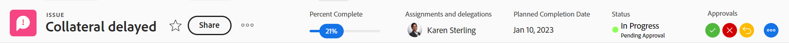

# Objektüberschriften - Übersicht

Sie können Informationen zu Objekten in [!DNL Adobe Workfront] wenn Sie die Kopfzeile überprüfen.

Zusätzlich zum Namen des Objekts kann die Kopfzeile den Eigentümer des Objekts, den Status oder die prozentuale Auffüllung enthalten.

[!DNL Workfront] gibt dem Namen des Objekts Priorität und weist ihm so viel Platz wie möglich in der Kopfzeile zu. Wenn ein Objektname zu lang ist, wird er abgeschnitten. Um den vollständigen Namen eines Objekts anzuzeigen, können Sie den Mauszeiger darüber bewegen.

## Zugriff auf die Kopfzeile eines Objekts

Zugreifen auf die Kopfzeile für ein Objekt in [!DNL Workfront] ist für alle Objekte identisch, die sie haben.

So greifen Sie beispielsweise auf die Kopfzeile eines Projekts zu:

1. Wechseln Sie zu einem Projekt.\
   Die Kopfzeile wird oben auf der Seite angezeigt und enthält den Namen des Projekts.

   

## [!UICONTROL Startseite] Kopfzeilenübersicht

Die folgenden Header sind in Home verfügbar:

* Aufgabe: Weitere Informationen zur Verwendung dieser Kopfzeile finden Sie in der [Übersicht über Aufgabenüberschriften](#task-header-overview) in diesem Artikel.
* Problem: Weitere Informationen zur Verwendung dieser Kopfzeile finden Sie in der [Problemübersicht](#issue-header-overview) in diesem Artikel.

## Anpassbare Kopfzeilen

Ihre [!DNL Workfront]  oder Gruppenadministrator kann die Kopfzeile von Projekten, Aufgaben und Problemen mithilfe einer Layoutvorlage anpassen.

In diesem Artikel werden die Standardkopfzeilen für alle Objekte beschrieben, einschließlich Projekten, Aufgaben und Problemen.

Informationen zum Anpassen von Informationen in der Kopfzeile eines Objekts finden Sie unter [Objektüberschriften mithilfe einer Layoutvorlage anpassen](../../administration-and-setup/customize-workfront/use-layout-templates/customize-object-headers.md).

## Übersicht über den Projekt-Header

In der Projektheader werden standardmäßig die folgenden Informationen angezeigt:

<table style="table-layout:auto"> 
 <col> 
 <col> 
 <thead> 
  <tr> 
   <th>Kopfzeileninformationen</th> 
   <th>Notizen</th> 
  </tr> 
 </thead> 
 <tbody> 
  <tr> 
   <td role="rowheader">Breadcrumb mit übergeordneten Objekten</td> 
   <td>Wenn das Projekt mit einem Programm oder Portfolio verknüpft ist, werden diese in der Breadcrumb-Leiste in der oberen linken Ecke der Kopfzeile angezeigt. Durch Klicken auf den Namen des übergeordneten Objekts wird dieses übergeordnete Objekt geöffnet.</td> 
  </tr> 
  <tr data-mc-conditions=""> 
   <td role="rowheader">Objektsymbol </td> 
   <td> 
Das lilafarbene [!UICONTROL Projekt-Symbol  wird links neben dem Projektnamen angezeigt.
 </td> 
  </tr> 
  <tr> 
   <td role="rowheader">Name des Projekts</td> 
   <td>Sie können den Projektnamen in der Kopfzeile bearbeiten.</td> 
  </tr> 
  <tr> 
   <td role="rowheader">Name des Objekttyps</td> 
   <td> 
Der Text "[!UICONTROL PROJECT]"wird über dem Projektnamen in der Kopfzeile angezeigt.
 </td> 
  </tr> 
  <tr> 
   <td role="rowheader">Der Aktionsbereich der Aufgabe</td> 
   <td> 
Neben dem Namen des Projekts wird der Aktionsbereich angezeigt.
 
  
  </td> 
  </tr> 
  <tr> 
   <td role="rowheader">[!UICONTROL Prozentsatz abgeschlossen]</td> 
   <td>Sie können den Prozentsatz für die Fertigstellung des Projekts in der Kopfzeile nicht bearbeiten.</td> 
  </tr> 
  <tr> 
   <td role="rowheader">[!UICONTROL Projektinhaber]</td> 
   <td> 
Sie können den [!UICONTROL Projekteigentümer] in der Kopfzeile bearbeiten.
 </td> 
  </tr> 
  <tr> 
   <td role="rowheader">[!UICONTROL Geplantes Abschlussdatum] </td> 
   <td> 
Sie können das Projekt [!UICONTROL Planes Abschlussdatum] und die Uhrzeit in der Kopfzeile bearbeiten, wenn das Projekt ab [!UICONTROL Abschlussdatum] geplant ist. Wenn das Projekt am [!UICONTROL Startdatum] geplant ist, werden diese Informationen über die Aufgaben im Projekt aktualisiert.
 </td> 
  </tr> 
  <tr> 
   <td role="rowheader">[!UICONTROL Bedingung] </td> 
   <td> 
Wenn Sie den [!UICONTROL Bedingungstyp] des Projekts auf "Manuell"festlegen, können Sie die [!UICONTROL Bedingung] des Projekts in der Kopfzeile aktualisieren.
</td> 
  </tr> 
  <tr> 
   <td role="rowheader">[!UICONTROL Status]</td> 
   <td>Sie können das Projekt [!UICONTROL Status] in der Kopfzeile bearbeiten.</td> 
  </tr> 
  <tr> 
   <td role="rowheader">Bereich [!UICONTROL Validierungen]</td> 
   <td> 
Wenn Sie einer der Genehmiger sind, verwenden Sie die folgenden Symbole, um die Genehmigungen für das Projekt zu verwalten:
 
  </img> [!UICONTROL Approve]
 
  </img> [!UICONTROL Ablehnen]
 
  </img> [!UICONTROL Recall]
 
Wenn Sie kein Genehmiger sind, klicken Sie auf das Symbol [!UICONTROL Mehr] .  , um Informationen zum aktuellen Genehmigungsschritt anzuzeigen.
 
Weitere Informationen zu Genehmigungen finden Sie unter <a href="../../review-and-approve-work/manage-approvals/approval-process-in-workfront.md" class="MCXref xref">Übersicht über den Genehmigungsprozess</a>.
 </td> 
  </tr> 
 </tbody> 
</table>

## Übersicht über Aufgabenüberschriften

Die Kopfzeile der Aufgabe enthält standardmäßig die folgenden Informationen:

<table style="table-layout:auto"> 
 <col> 
 <col> 
 <thead> 
  <tr> 
   <th>Kopfzeileninformationen</th> 
   <th>Notizen</th> 
  </tr> 
 </thead> 
 <tbody> 
  <tr> 
   <td role="rowheader">Breadcrumb mit übergeordneten Objekten</td> 
   <td> 
Die übergeordneten Objekte der Aufgabe werden im Breadcrumb angezeigt. Durch Klicken auf den Namen des übergeordneten Objekts wird dieses übergeordnete Objekt geöffnet.
 
Weitere Informationen finden Sie unter <a href="../../workfront-basics/the-new-workfront-experience/breadcrumb-overview.md" class="MCXref xref">Übersicht über Breadcrumbs</a>.
 </td> 
  </tr> 
  <tr data-mc-conditions=""> 
   <td role="rowheader">Objektsymbol </td> 
   <td> 
Das grüne [!UICONTROL Task-Symbol  wird links neben dem Aufgabennamen angezeigt.
 </td> 
  </tr> 
  <tr> 
   <td role="rowheader">Name der Aufgabe</td> 
   <td>Sie können den Aufgabennamen in der Kopfzeile bearbeiten.</td> 
  </tr> 
  <tr> 
   <td role="rowheader">Name des Objekttyps</td> 
   <td> 
Der Text "[!UICONTROL TASK]"wird über dem Aufgabennamen in der Kopfzeile angezeigt.
 </td> 
  </tr> 
  <tr> 
   <td role="rowheader">Der Aktionsbereich der Aufgabe</td> 
   <td> 
Neben dem Namen der Aufgabe wird der Bereich [!UICONTROL Aktionen] angezeigt.
 
  
 
Wenn das Symbol Abhängigkeit angezeigt wird, können Sie auf das Symbol klicken, um alle Vorgänger oder Nachfolger der Aufgabe anzuzeigen.
 </td> 
  </tr> 
  <tr> 
   <td role="rowheader">[!UICONTROL Prozentsatz abgeschlossen]</td> 
   <td>Sie können den Prozentsatz der Aufgabe bearbeiten, der in der Kopfzeile abgeschlossen ist.</td> 
  </tr> 
  <tr> 
   <td role="rowheader">[!UICONTROL Zuweisung]</td> 
   <td>Sie können die Zuweisung einer Aufgabe über die Kopfzeile bearbeiten.</td> 
  </tr> 
  <tr> 
   <td role="rowheader"> 
[!UICONTROL Bearbeiten], [!UICONTROL Fertig] oder Schaltfläche [!UICONTROL Aufgabe starten]
 </td> 
   <td> 
Wenn die Aufgabe Ihnen zugewiesen ist, können Sie auf [!UICONTROL Bearbeiten] klicken. oder [!UICONTROL Startaufgabe] -Schaltfläche, um anzugeben, dass Sie an der Aufgabe arbeiten, oder die Schaltfläche [!UICONTROL Fertig], um anzugeben, dass Sie die Aufgabe abgeschlossen haben.
 
Informationen zum Ersetzen der Schaltfläche [!UICONTROL Work On It] durch eine Schaltfläche [!UICONTROL Start Task] finden Sie unter <a href="../../people-teams-and-groups/create-and-manage-teams/work-on-it-button-to-start-button.md" class="MCXref xref">Ersetzen Sie die Schaltfläche [!UICONTROL Bearbeiten] durch die Schaltfläche [!UICONTROL Start] .</a>.
 </td> 
  </tr> 
  <tr> 
   <td role="rowheader">[!UICONTROL Geplantes Abschlussdatum]</td> 
   <td> 
Sie können die Aufgabe [!UICONTROL Geplantes Abschlussdatum] bearbeiten. und Zeit in der Kopfzeile.
 
Tipp: Beachten Sie, dass das [!UICONTROL Commit Date] nicht in der Kopfzeile sichtbar ist. Sie können sie auf der Seite [!UICONTROL Details] anzeigen.
 </td> 
  </tr> 
  <tr> 
   <td role="rowheader">[!UICONTROL Status]</td> 
   <td>Sie können die Aufgabe [!UICONTROL Status] in der Kopfzeile bearbeiten.</td> 
  </tr> 
  <tr> 
   <td role="rowheader">Bereich [!UICONTROL Validierungen]</td> 
   <td> 
Wenn Sie einer der Genehmiger sind, verwenden Sie die folgenden Symbole, um die Genehmigungen für die Aufgabe zu verwalten:
 
  </img> [!UICONTROL Approve]
 
  </img> [!UICONTROL Ablehnen]
 
  </img> [!UICONTROL Recall]
 
Wenn Sie kein Genehmiger sind, klicken Sie auf das Symbol [!UICONTROL Mehr] .  , um Informationen zum aktuellen Genehmigungsschritt anzuzeigen.
 
Weitere Informationen zu Genehmigungen finden Sie unter <a href="../../review-and-approve-work/manage-approvals/approval-process-in-workfront.md" class="MCXref xref">Übersicht über den Genehmigungsprozess</a>.
 </td> 
  </tr> 
 </tbody> 
</table>

## Problemübersicht

Die Kopfzeile des Problems enthält standardmäßig die folgenden Informationen:

<table style="table-layout:auto"> 
 <col> 
 <col> 
 <thead> 
  <tr> 
   <th>Kopfzeileninformationen</th> 
   <th>Notizen</th> 
  </tr> 
 </thead> 
 <tbody> 
  <tr> 
   <td role="rowheader">Breadcrumb mit übergeordneten Objekten</td> 
   <td> 
Die übergeordneten Objekte des Problems werden im Breadcrumb angezeigt. Durch Klicken auf den Namen des übergeordneten Objekts wird dieses übergeordnete Objekt geöffnet.
 
Weitere Informationen finden Sie unter <a href="../../workfront-basics/the-new-workfront-experience/breadcrumb-overview.md" class="MCXref xref">Übersicht über Breadcrumbs</a>.
 </td> 
  </tr> 
  <tr> 
   <td role="rowheader">Objektsymbol </td> 
   <td> 
Das rosa Symbol [!UICONTROL Problem]  wird links neben dem Problemnamen angezeigt.
 </td> 
  </tr> 
  <tr> 
   <td role="rowheader">Name des Problems</td> 
   <td>Sie können den Problemnamen in der Kopfzeile bearbeiten.</td> 
  </tr> 
  <tr> 
   <td role="rowheader">Name des Objekttyps</td> 
   <td> 
Der Text "[!UICONTROL PROBLEM]"wird oberhalb des Problemnamens in der Kopfzeile angezeigt.
 </td> 
  </tr> 
  <tr> 
   <td role="rowheader">Der Aktionsbereich des Problems</td> 
   <td> 
Neben dem Namen des Problems wird der Bereich [!UICONTROL Aktionen] angezeigt.
 
  
 
Wenn das Symbol [!UICONTROL Abhängigkeit] angezeigt wird, können Sie auf das Symbol klicken, um alle Vorgänger oder Nachfolger des Problems anzuzeigen.
  </td> 
  </tr> 
  <tr> 
   <td role="rowheader">[!UICONTROL Prozentsatz abgeschlossen]</td> 
   <td> 
Sie können den prozentualen Abschluss des Problems in der Kopfzeile bearbeiten.
 </td> 
  </tr> 
  <tr> 
   <td role="rowheader">[!UICONTROL Zuweisung]</td> 
   <td>Sie können die Zuweisung eines Problems in der Kopfzeile bearbeiten.</td> 
  </tr> 
  <tr> 
   <td role="rowheader">[!UICONTROL Bearbeiten], [!UICONTROL Fertig], oder Schaltfläche [!UICONTROL Start Issue]</td> 
   <td>Wenn das Problem Ihnen zugewiesen ist, können Sie auf [!UICONTROL Bearbeiten] klicken. oder [!UICONTROL Startproblem] -Schaltfläche, um anzugeben, dass Sie gerade an dem Problem arbeiten, oder die Schaltfläche [!UICONTROL Fertig], um anzuzeigen, dass Sie das Problem abgeschlossen haben.Informationen zum Ersetzen der Schaltfläche [!UICONTROL Work On It] durch eine Schaltfläche [!UICONTROL Start Task] finden Sie unter <a href="../../people-teams-and-groups/create-and-manage-teams/work-on-it-button-to-start-button.md" class="MCXref xref">Ersetzen Sie die Schaltfläche [!UICONTROL Bearbeiten] durch die Schaltfläche [!UICONTROL Start] .</a>.</td> 
  </tr> 
  <tr> 
   <td role="rowheader">[!UICONTROL Geplantes Abschlussdatum]</td> 
   <td> 
Sie können das Problem bearbeiten [!UICONTROL Geplantes Abschlussdatum] und Zeit in der Kopfzeile.
 
Tipp: Beachten Sie, dass das [!UICONTROL Commit Date] nicht in der Kopfzeile sichtbar ist. Sie können sie auf der Seite [!UICONTROL Details] anzeigen.
 </td> 
  </tr> 
  <tr> 
   <td role="rowheader">[!UICONTROL Status]</td> 
   <td>Sie können das Problem [!UICONTROL Status] in der Kopfzeile bearbeiten.</td> 
  </tr> 
  <tr> 
   <td role="rowheader">Bereich [!UICONTROL Validierungen]</td> 
   <td> 
Wenn Sie einer der Genehmiger sind, verwenden Sie die folgenden Symbole, um die Genehmigungen für das Problem zu verwalten:
 
  [!UICONTROL Approve]
 
  [!UICONTROL Ablehnen]
 
  [!UICONTROL Recall]
 
Wenn Sie kein Genehmiger sind, klicken Sie auf das Symbol [!UICONTROL Mehr] .  , um Informationen zum aktuellen Genehmigungsschritt anzuzeigen.
 
Weitere Informationen zu Genehmigungen finden Sie unter <a href="../../review-and-approve-work/manage-approvals/approval-process-in-workfront.md" class="MCXref xref">Übersicht über den Genehmigungsprozess</a>.
 </td> 
  </tr> 
 </tbody> 
</table>

## Übersicht über Programm-Header

Der Programmheader enthält die folgenden Informationen:

<table style="table-layout:auto"> 
 <col> 
 <col> 
 <thead> 
  <tr> 
   <th>Kopfzeileninformationen</th> 
   <th>Notizen</th> 
  </tr> 
 </thead> 
 <tbody> 
  <tr> 
   <td role="rowheader">Breadcrumb mit dem Namen des Portfolios</td> 
   <td> 
Sie können über die Kopfzeile des [!UICONTROL Portfolios] auf das [!UICONTROL Programm] zugreifen. Durch Klicken auf den Namen des übergeordneten Objekts wird dieses übergeordnete Objekt geöffnet.
 
Weitere Informationen finden Sie unter <a href="../../workfront-basics/the-new-workfront-experience/breadcrumb-overview.md" class="MCXref xref">Übersicht über Breadcrumbs</a>.
 </td> 
  </tr> 
  <tr> 
   <td role="rowheader">Objektsymbol </td> 
   <td> 
Das orangefarbene [!UICONTROL Programm-Symbol  wird links neben dem Programmnamen angezeigt.
 </td> 
  </tr> 
  <tr> 
   <td role="rowheader">Name des Programms</td> 
   <td>Sie können den Programmnamen in der Kopfzeile bearbeiten.</td> 
  </tr> 
  <tr> 
   <td role="rowheader">Name des Objekttyps</td> 
   <td> 
Wenn das Programm als [!UICONTROL aktiv] markiert ist, wird der Text "[!UICONTROL PROGRAM]" oberhalb des Programmnamens in der Kopfzeile angezeigt.
 </td> 
  </tr> 
  <tr> 
   <td role="rowheader">Aktivierungsstatus</td> 
   <td> 
Wenn das Programm deaktiviert ist, wird der Text "[!UICONTROL PROGRAM DEACTIVATED]" oberhalb des Programmnamens in der Kopfzeile angezeigt.
 </td> 
  </tr> 
  <tr> 
   <td role="rowheader">Aktionsbereich des Programms</td> 
   <td> 
Neben dem Programmnamen wird der Bereich [!UICONTROL Aktionen] angezeigt.
 
  
 </td> 
  </tr> 
  <tr> 
   <td role="rowheader">[!UICONTROL Prozentsatz abgeschlossen]</td> 
   <td> 
Sie können den [!UICONTROL Prozentwert (Complete) des Programms nicht in der Kopfzeile bearbeiten. Diese Informationen werden aus den Projekten des Programms aktualisiert.
 
Tipp: Standardmäßig entspricht der prozentuale Abschluss des Programms dem Durchschnitt der vollständigen Prozentwerte der Projekte in einem [!UICONTROL Aktuellen] oder [!UICONTROL Genehmigten Status], die zum Programm gehören.
 </td> 
  </tr> 
  <tr> 
   <td role="rowheader">[!UICONTROL Programm-Manager]</td> 
   <td> 
Sie können den [!UICONTROL Programm-Manager] in der Kopfzeile bearbeiten. Dies entspricht dem [!UICONTROL Programmeigentümer].
 </td> 
  </tr> 
  <tr> 
   <td role="rowheader">[!UICONTROL Geplantes Abschlussdatum]</td> 
   <td>Sie können das Programm [!UICONTROL Geplantes Abschlussdatum] nicht in der Kopfzeile bearbeiten. Diese Informationen werden ausgehend vom geplanten [!UICONTROL Abschlussdatum] der Projekte des Programms aktualisiert.</td> 
  </tr> 
  <tr> 
   <td role="rowheader">[!UICONTROL Bedingung für aktive Projekte]</td> 
   <td>Dies ist eine Berechnung des Prozentsatzes der aktiven Projekte im Programm, für die die [!UICONTROL Bedingung] als [!UICONTROL On Target], [!UICONTROL At Risk] oder [!UICONTROL In Trouble] festgelegt ist.</td> 
  </tr> 
 </tbody> 
</table>

## Übersicht über Portfolio-Kopfzeilen {#portfolio-header-overview}

Der Portfolioheader enthält die folgenden Informationen:

<table style="table-layout:auto"> 
 <col> 
 <col> 
 <thead> 
  <tr> 
   <th>Kopfzeileninformationen</th> 
   <th>Notizen</th> 
  </tr> 
 </thead> 
 <tbody> 
  <tr> 
   <td role="rowheader">Objektsymbol </td> 
   <td> 
Das blaue [!UICONTROL Portfolio]-Symbol wird links neben dem Portfolionamen angezeigt.
 </td> 
  </tr> 
  <tr> 
   <td role="rowheader">Name des Portfolios</td> 
   <td>Sie können den Portfolionamen in der Kopfzeile bearbeiten.</td> 
  </tr> 
  <tr> 
   <td role="rowheader">Name des Objekttyps</td> 
   <td> 
Wenn das Portfolio als aktiv markiert ist, wird der Text "[!UICONTROL PORTFOLIO]"über dem Portfolionamen in der Kopfzeile angezeigt.
 </td> 
  </tr> 
  <tr> 
   <td role="rowheader">Aktivierungsstatus</td> 
   <td> 
Wenn das Portfolio deaktiviert ist, wird der Text "[!UICONTROL PORTFOLIO DEACTIVATED]"über dem Portfolionamen in der Kopfzeile angezeigt.
 </td> 
  </tr> 
  <tr> 
   <td role="rowheader">Der Bereich [!UICONTROL Aktionen] des Portfolios</td> 
   <td> 
Neben dem Namen des Portfolios wird der Bereich [!UICONTROL Aktionen] angezeigt.
 
  
</td> 
  </tr> 
  <tr> 
   <td role="rowheader">[!UICONTROL Portfolio Manager]</td> 
   <td>Sie können den [!UICONTROL Portfolio Manager] in der Kopfzeile bearbeiten. Dies entspricht dem [!UICONTROL Portfolio Owner].</td> 
  </tr> 
  <tr> 
   <td role="rowheader">[!UICONTROL Einschaltzeit]</td> 
   <td>Dies ist eine Berechnung des Prozentsatzes der Projekte im Portfolio, die derzeit pünktlich ausgeführt werden.</td> 
  </tr> 
  <tr> 
   <td role="rowheader">[!UICONTROL on Budget]</td> 
   <td>Dies ist eine Berechnung des Prozentsatzes der Projekte im Portfolio, die derzeit mit dem Budget verbunden sind.</td> 
  </tr> 
  <tr> 
   <td role="rowheader">[!UICONTROL Aligned]</td> 
   <td>Dies ist eine Berechnung des Prozentsatzes der Projekte im Portfolio, die mit dem Portfolio abgestimmt sind.</td> 
  </tr> 
  <tr> 
   <td role="rowheader">[!UICONTROL ROI]</td> 
   <td>Dies ist die [!UICONTROL Kapitalrendite]-Berechnung für alle Projekte im Portfolio.</td> 
  </tr> 
  <tr> 
   <td role="rowheader">[!UICONTROL Nettowert]</td> 
   <td>Dies ist die [!UICONTROL Nettowertberechnung] für alle Projekte im Portfolio.</td> 
  </tr> 
 </tbody> 
</table>

## Übersicht über Vorlagenkopfzeilen {#template-header-overview}

Die Kopfzeile der Vorlage enthält die folgenden Informationen:

<table style="table-layout:auto"> 
 <col> 
 <col> 
 <thead> 
  <tr> 
   <th>Kopfzeileninformationen</th> 
   <th>Notizen</th> 
  </tr> 
 </thead> 
 <tbody> 
  <tr> 
   <td role="rowheader">Objektsymbol </td> 
   <td> 
Das grüne Symbol [!UICONTROL Vorlage] wird links neben dem Vorlagennamen angezeigt.
 </td> 
  </tr> 
  <tr> 
   <td role="rowheader">Name der Vorlage</td> 
   <td>Sie können den Vorlagennamen in der Kopfzeile bearbeiten.</td> 
  </tr> 
  <tr> 
   <td role="rowheader">Name des Objekttyps</td> 
   <td> 
Wenn die Vorlage als aktiv markiert ist, wird der Text "[!UICONTROL TEMPLATE]"über dem Vorlagennamen in der Kopfzeile angezeigt.
 </td> 
  </tr> 
  <tr> 
   <td role="rowheader">Aktivierungsstatus</td> 
   <td> 
Wenn die Vorlage deaktiviert ist, wird der Text "[!UICONTROL TEMPLATE DEACTIVATED]"über dem Vorlagennamen in der Kopfzeile angezeigt.
 </td> 
  </tr> 
  <tr> 
   <td role="rowheader">Der Aktionsbereich der Vorlage</td> 
   <td> 
Neben dem Namen der Vorlage wird der Aktionsbereich angezeigt.
 
  
 </td> 
  </tr> 
  <tr> 
   <td role="rowheader">[!UICONTROL Vorlageninhaber]</td> 
   <td>Sie können das Feld [!UICONTROL Vorlageneigentümer] in der Kopfzeile bearbeiten.</td> 
  </tr> 
  <tr> 
   <td role="rowheader">[!UICONTROL Dauer]</td> 
   <td>Die Dauer der Vorlage. Sie können dieses Feld in der Kopfzeile nicht bearbeiten.</td> 
  </tr> 
 </tbody> 
</table>

## Übersicht über die Kopfzeile von Vorlagenaufgaben

Die Kopfzeile der Vorlagenaufgabe enthält die folgenden Informationen:

<table style="table-layout:auto"> 
 <col> 
 <col> 
 <thead> 
  <tr> 
   <th>Kopfzeileninformationen</th> 
   <th>Notizen</th> 
  </tr> 
 </thead> 
 <tbody> 
  <tr> 
   <td role="rowheader">Breadcrumb zu übergeordneten Objekten</td> 
   <td> 
Die übergeordneten Objekte der Vorlagenaufgabe werden im Breadcrumb angezeigt. Durch Klicken auf den Namen eines übergeordneten Objekts wird dieses übergeordnete Objekt geöffnet.
 
Weitere Informationen finden Sie unter <a href="../../workfront-basics/the-new-workfront-experience/breadcrumb-overview.md" class="MCXref xref">Übersicht über Breadcrumbs</a>.
 </td> 
  </tr> 
  <tr> 
   <td role="rowheader">Objektsymbol </td> 
   <td> 
Das grüne [!UICONTROL Task-Symbol wird links neben dem Namen der Vorlagenaufgabe angezeigt.
 </td> 
  </tr> 
  <tr> 
   <td role="rowheader">Name der Vorlagenaufgabe</td> 
   <td>Sie können den Namen der Vorlagenaufgabe in der Kopfzeile bearbeiten.</td> 
  </tr> 
  <tr> 
   <td role="rowheader">Name des Objekttyps</td> 
   <td> 
Der Text "[!UICONTROL TEMPLATE TASK]"wird über dem Vorlagennamen der Aufgabe in der Kopfzeile angezeigt.
 </td> 
  </tr> 
  <tr> 
   <td role="rowheader">Der Aktionsbereich der Vorlagenaufgabe</td> 
   <td> 
Neben dem Namen der Vorlagenaufgabe wird der Aktionsbereich angezeigt.
 
  
 </td> 
  </tr> 
  <tr> 
   <td role="rowheader">[!UICONTROL Zuweisung]</td> 
   <td>Sie können die [!UICONTROL Zuweisungen] der Vorlagenaufgabe in der Kopfzeile bearbeiten.</td> 
  </tr> 
  <tr> 
   <td role="rowheader">[!UICONTROL Abschlussdatum]</td> 
   <td>Dies ist der Tag in der Dauer der Vorlage, an dem die Vorlagenaufgabe abgeschlossen werden soll.</td> 
  </tr> 
 </tbody> 
</table>

## Übersicht über den Rechnungsdatensatz

Die Kopfzeile des Rechnungsdatensatzes enthält die folgenden Informationen:

<table style="table-layout:auto"> 
 <col> 
 <col> 
 <thead> 
  <tr> 
   <th>Kopfzeileninformationen</th> 
   <th>Notizen</th> 
  </tr> 
 </thead> 
 <tbody> 
  <tr> 
   <td role="rowheader">Breadcrumb zu übergeordneten Objekten</td> 
   <td> 
Die übergeordneten Objekte des Rechnungsdatensatzes werden im Breadcrumb angezeigt. Durch Klicken auf den Namen eines übergeordneten Objekts wird dieses übergeordnete Objekt geöffnet.
 
Weitere Informationen finden Sie unter <a href="../../workfront-basics/the-new-workfront-experience/breadcrumb-overview.md" class="MCXref xref">Übersicht über Breadcrumbs</a>.
 </td> 
  </tr> 
  <tr> 
   <td role="rowheader">Objektsymbol </td> 
   <td> 
Das blaue Symbol [!UICONTROL Rechnungsdatensatz]  wird links neben dem Namen des Rechnungsdatensatzes angezeigt.
 </td> 
  </tr> 
  <tr> 
   <td role="rowheader">Name des Rechnungsdatensatzes</td> 
   <td>Sie können den Namen des Rechnungsdatensatzes in der Kopfzeile bearbeiten.</td> 
  </tr> 
  <tr> 
   <td role="rowheader">Name des Objekttyps</td> 
   <td> 
Der Text "[!UICONTROL BILLING RECORD]"wird über dem Namen des Rechnungsdatensatzes in der Kopfzeile angezeigt.
 </td> 
  </tr> 
  <tr> 
   <td role="rowheader">Der Aktionsbereich des Rechnungsdatensatzes</td> 
   <td> 
Neben dem Namen des Rechnungsdatensatzes finden Sie im Menü [!UICONTROL Mehr]  zeigt die folgenden Optionen an:
 
    <ul> 
     <li> 
[!UICONTROL Bearbeiten]
 </li> 
     <li> 
 
 </li> 
    </ul> </td> 
  </tr> 
  <tr> 
   <td role="rowheader">[!UICONTROL Rechnungsdatensatz insgesamt]</td> 
   <td>Dies ist der Gesamtbetrag des Rechnungsdatensatzes. Dieses Feld kann nicht bearbeitet werden.</td> 
  </tr> 
  <tr> 
   <td role="rowheader">[!UICONTROL Rechnungsdatum]</td> 
   <td>Dies ist das Datum, an dem der Rechnungsdatensatz erstellt wurde, es sei denn, er wurde beim Erstellen des Rechnungsdatensatzes manuell geändert. Sie können das [!UICONTROL Rechnungsdatum] in der Kopfzeile bearbeiten.</td> 
  </tr> 
  <tr> 
   <td role="rowheader">[!UICONTROL Status]</td> 
   <td> 
Wenn der Rechnungsdatensatz den Status [!UICONTROL Abgerechnet] aufweist, können Sie ihn nicht mehr bearbeiten.
 
Sie können den Status des Rechnungsdatensatzes in der Kopfzeile bearbeiten.
 </td> 
  </tr> 
 </tbody> 
</table>

## Übersicht über die Benutzerkopfzeilen

Die Kopfzeile des Benutzers enthält die folgenden Informationen:

<table style="table-layout:auto"> 
 <col> 
 <col> 
 <thead> 
  <tr> 
   <th>Kopfzeileninformationen</th> 
   <th>Notizen</th> 
  </tr> 
 </thead> 
 <tbody> 
  <tr> 
   <td role="rowheader">Profilbild des Benutzers</td> 
   <td>Sie können das Profilbild nicht in der Kopfzeile aktualisieren.</td> 
  </tr> 
  <tr> 
   <td role="rowheader">Name des Benutzers und Titel</td> 
   <td> 
 Der Titel des Benutzers wird in allen Großbuchstaben über seinem Namen angezeigt. Der Name des Benutzers kann nicht in der Kopfzeile bearbeitet werden.
 </td> 
  </tr> <!--
   <tr> 
    <td role="rowheader">Name of the object type</td> 
    <td> 
The name of the object type does not display.
 </td> 
   </tr>
  --> 
  <tr> 
   <td role="rowheader">Aktivierungsstatus</td> 
   <td> 
Wenn der Benutzer deaktiviert wurde, wird der gesamte Text und das Profilbild in der Kopfzeile abgeblendet angezeigt.
 </td> 
  </tr> 
  <tr> 
   <td role="rowheader">Der Aktionsbereich des Benutzers</td> 
   <td> 
Neben dem Namen des Benutzers wird der Aktionsbereich angezeigt.
 
  
</td> 
  </tr> 
  <tr> 
   <td role="rowheader">E-Mail-Adresse</td> 
   <td>Die E-Mail-Adresse im Header kann nicht bearbeitet werden. Dies ist normalerweise auch der Benutzername.</td> 
  </tr> 
  <tr> 
   <td role="rowheader">Telefonnummer</td> 
   <td>Sie können die Telefonnummer in der Kopfzeile nicht bearbeiten.</td> 
  </tr> 
  <tr> 
   <td role="rowheader">Teams</td> 
   <td> 
Sie können die Teams anzeigen, zu denen der Benutzer gehört. Bewegen Sie den Mauszeiger über einen Teamavatar, um den Namen des Teams anzuzeigen. Die Teams in der Kopfzeile können nicht bearbeitet werden.
 </td> 
  </tr> 
 </tbody> 
</table>

## Übersicht über Team-Header

In der Kopfzeile des Teams werden die folgenden Informationen angezeigt:

<table style="table-layout:auto"> 
 <col> 
 <col> 
 <thead> 
  <tr> 
   <th>Kopfzeileninformationen</th> 
   <th>Notizen</th> 
  </tr> 
 </thead> 
 <tbody> 
  <tr> 
   <td role="rowheader">Objektsymbol </td> 
   <td> 
Das lilafarbene [!UICONTROL Team-Symbol  wird links neben dem Teamnamen angezeigt.
 </td> 
  </tr> 
  <tr> 
   <td role="rowheader">Name des Teams</td> 
   <td>Sie können den Teamnamen in der Kopfzeile bearbeiten.</td> 
  </tr> 
  <tr> 
   <td role="rowheader">Name des Objekttyps</td> 
   <td> 
Der Text "[!UICONTROL TEAM]"wird oberhalb des Teamnamens in der Kopfzeile angezeigt.
 </td> 
  </tr> 
  <tr> 
   <td role="rowheader">Der Aktionsbereich des Teams</td> 
   <td> 
Neben dem Namen des Teams wird der Bereich [!UICONTROL Aktionen] angezeigt.
 
  
</td> 
  </tr> 
  <tr> 
   <td role="rowheader">Profilbilder von Teammitgliedern</td> 
   <td>Die Profilbilder der Teammitglieder. Bewegen Sie den Mauszeiger über ein Bild, um den Namen des Benutzers anzuzeigen.</td> 
  </tr> 
  <tr> 
   <td role="rowheader">Beschreibung</td> 
   <td>Dies ist eine kurze Beschreibung der Mitglieder des Teams. Die Beschreibung des Teams kann nicht in der Kopfzeile bearbeitet werden.</td> 
  </tr> 
 </tbody> 
</table>

## Iteration-Header - Übersicht

Die Iterationskopfzeile enthält die folgenden Informationen:

<table style="table-layout:auto"> 
 <col> 
 <col> 
 <thead> 
  <tr> 
   <th>Kopfzeileninformationen</th> 
   <th>Notizen</th> 
  </tr> 
 </thead> 
 <tbody> 
  <tr> 
   <td role="rowheader">Objektsymbol </td> 
   <td> 
Das orangefarbene Symbol [!UICONTROL Iteration]  wird links neben dem Iterationsnamen angezeigt.
 </td> 
  </tr> 
  <tr> 
   <td role="rowheader">Name der Iteration</td> 
   <td>Sie können den Iterationsnamen in der Kopfzeile bearbeiten.</td> 
  </tr> 
  <tr> 
   <td role="rowheader">Name des Objekttyps</td> 
   <td> 
Der Text "[!UICONTROL ITERATION]"wird oberhalb des Iterationsnamens in der Kopfzeile angezeigt.
 </td> 
  </tr> 
  <tr> 
   <td role="rowheader">Der Aktionsbereich der Iteration</td> 
   <td> 
In der oberen rechten Ecke der Kopfzeile wird der Aktionsbereich angezeigt.
 
  
</td> 
  </tr> 
  <tr> 
   <td role="rowheader">Inhaber</td> 
   <td>Dies ist der [!UICONTROL Eigentümer] der Iteration. Sie können den [!UICONTROL Inhaber] nicht in der Kopfzeile bearbeiten.</td> 
  </tr> 
  <tr> 
   <td role="rowheader">[!UICONTROL Timeline]</td> 
   <td>Die [!UICONTROL Timeline] zeigt das Start- und Enddatum der Iteration an. Sie können die [!UICONTROL Timeline] nicht in der Kopfzeile bearbeiten.</td> 
  </tr> 
  <tr> 
   <td role="rowheader">[!UICONTROL Team]</td> 
   <td>Das Team der Iteration kann nicht in der Kopfzeile bearbeitet werden. Wenn Sie auf den Teamnamen klicken, gelangen Sie zur Team-Seite.</td> 
  </tr> 
 </tbody> 
</table>

## Übersicht über Gruppenüberschriften

Die Gruppenüberschrift enthält die folgenden Informationen:

<table style="table-layout:auto"> 
 <col> 
 <col> 
 <thead> 
  <tr> 
   <th>Kopfzeileninformationen</th> 
   <th>Notizen</th> 
  </tr> 
 </thead> 
 <tbody> 
  <tr> 
   <td role="rowheader">Objektsymbol </td> 
   <td> 
Das orangefarbene Symbol [!UICONTROL Group]  wird links neben dem Gruppennamen angezeigt.
 </td> 
  </tr> 
  <tr> 
   <td role="rowheader">Name der Gruppe</td> 
   <td>Sie können den Gruppennamen in der Kopfzeile bearbeiten.</td> 
  </tr> 
  <tr> 
   <td role="rowheader">Name des Objekttyps</td> 
   <td> 
Der Text "[!UICONTROL GROUP]"wird über dem Gruppennamen in der Kopfzeile angezeigt.
 </td> 
  </tr> 
  <tr> 
   <td role="rowheader">Der Bereich [!UICONTROL Aktionen] der Gruppe</td> 
   <td> 
Neben dem Namen der Gruppe befindet sich das Menü [!UICONTROL Mehr] .  zeigt die folgenden Optionen an:
 
    <ul> 
     <li> 
[!UICONTROL Bearbeiten]
 </li> 
     <li> 
[!UICONTROL Copy]
 </li> 
     <li> 
[!UICONTROL Löschen]
 </li> 
    </ul> </td> 
  </tr> 
  <tr> 
   <td role="rowheader">[!UICONTROL Business Leader]</td> 
   <td>Sie können den [!UICONTROL Business Leader] in der Kopfzeile bearbeiten.</td> 
  </tr> 
  <tr> 
   <td role="rowheader">[!UICONTROL Verwendete Lizenzen] </td> 
   <td> 
Im Feld [!UICONTROL Lizenzen in Verwendung] wird die Anzahl der [!UICONTROL Plan]- und [!UICONTROL Work]-Lizenzanwender in der Gruppe und ihren Untergruppen angezeigt. Sie können auf die Zahlen klicken, um diese Informationen für alle fünf Lizenztypen anzuzeigen.
 
Weitere Informationen finden Sie unter <a href="../../administration-and-setup/manage-groups/create-and-manage-groups/view-number-licenses-allocated-used-group.md" class="MCXref xref">Anzahl der in einer Gruppe zugewiesenen und verwendeten Lizenzen in der neuen [!DNL Adobe Workfront] Erlebnis</a>.
 </td> 
  </tr> 
  <tr> 
   <td role="rowheader">[!UICONTROL Gruppenadministratoren]</td> 
   <td>Sie können die Gruppenadministratoren in der Kopfzeile bearbeiten.</td> 
  </tr> 
 </tbody> 
</table>

## Übersicht über Dokumentüberschriften

Die Kopfzeile des Dokuments enthält die folgenden Informationen:

<table style="table-layout:auto"> 
 <col> 
 <col> 
 <thead> 
  <tr> 
   <th>Kopfzeileninformationen</th> 
   <th>Notizen</th> 
  </tr> 
 </thead> 
 <tbody> 
  <tr> 
   <td role="rowheader">Breadcrumb mit übergeordneten Objekten</td> 
   <td> 
Die übergeordneten Objekte des Dokuments werden im Breadcrumb angezeigt. Durch Klicken auf den Namen eines übergeordneten Objekts wird dieses übergeordnete Objekt geöffnet.
 
Weitere Informationen finden Sie unter <a href="../../workfront-basics/the-new-workfront-experience/breadcrumb-overview.md" class="MCXref xref">Übersicht über Breadcrumbs</a>.
 </td> 
  </tr> 
  <tr> 
   <td role="rowheader">Objektsymbol </td> 
   <td> 
Das blaue [!UICONTROL Dokument] Symbol  wird links neben dem Dokumentnamen angezeigt.
 </td> 
  </tr> 
  <tr> 
   <td role="rowheader">Name des Dokuments</td> 
   <td>Sie können den Dokumentnamen in der Kopfzeile bearbeiten.</td> 
  </tr> 
  <tr> 
   <td role="rowheader">Name des Objekttyps</td> 
   <td> 
Der Text "[!UICONTROL DOCUMENT]"wird über dem Dokumentnamen in der Kopfzeile angezeigt.
 </td> 
  </tr> 
  <tr> 
   <td role="rowheader">Der Aktionsbereich des Dokuments</td> 
   <td> 
Neben dem Namen des Dokuments wird der Aktionsbereich angezeigt.
 
  
</td> 
  </tr> 
  <tr> 
   <td role="rowheader">Das Genehmigungsgebiet [!UICONTROL Decision]</td> 
   <td> 
Wenn sich das Dokument in einem Genehmigungsschritt befindet, wird der Bereich [!UICONTROL Entscheidungen] in der oberen rechten Ecke der Kopfzeile des Dokuments angezeigt.
 
Verwenden Sie die folgenden Symbole, um die Genehmigungen für das Dokument zu verwalten:
 
  [!UICONTROL Approve]
 
  [!UICONTROL Recall]
 
  [!UICONTROL Ablehnen]
 
Weitere Informationen zu Genehmigungsentscheidungen finden Sie unter <a href="../../review-and-approve-work/manage-approvals/approving-work.md" class="MCXref xref">Validierung der Arbeit </a>.
 </td> 
  </tr> 
 </tbody> 
</table>

## Übersicht über Firmenübersichten {#company-header-overview}

In der Kopfzeile des Unternehmens werden die folgenden Informationen angezeigt:

<table style="table-layout:auto"> 
 <col> 
 <col> 
 <thead> 
  <tr> 
   <th>Kopfzeileninformationen</th> 
   <th>Notizen</th> 
  </tr> 
 </thead> 
 <tbody> 
  <tr> 
   <td role="rowheader">Objektsymbol </td> 
   <td> 
Das blaue Symbol [!UICONTROL Company]  wird links neben dem Unternehmensnamen angezeigt.
 </td> 
  </tr> 
  <tr> 
   <td role="rowheader">Name des Unternehmens</td> 
   <td>Sie können den Namen des Unternehmens in der Kopfzeile bearbeiten.</td> 
  </tr> 
  <tr> 
   <td role="rowheader">Name des Objekttyps</td> 
   <td> 
Der Text "[!UICONTROL COMPANY]"wird über dem Unternehmensnamen in der Kopfzeile angezeigt.
 </td> 
  </tr> 
  <tr> 
   <td role="rowheader">Aktionsbereich des Unternehmens</td> 
   <td> 
Neben dem Namen des Unternehmens befindet sich das [!UICONTROL Mehr] Menü.  zeigt die folgenden Optionen an:
 
    <ul> 
     <li> 
[!UICONTROL Bearbeiten]
 </li> 
     <li> 
[!UICONTROL Unternehmen löschen]
 </li> 
    </ul> </td> 
  </tr> 
 </tbody> 
</table>

## Übersicht über Plankopfzeilen

Pläne sind Objekte der [!DNL Workfront Scenario Planner]. Informationen zum [!DNL Scenario Planner], siehe [Die [!DNL Scenario Planner] Übersicht](../../scenario-planner/scenario-planner-overview.md).

Die Kopfzeile Plan enthält die folgenden Informationen:

<table style="table-layout:auto"> 
 <col> 
 <col> 
 <thead> 
  <tr> 
   <th>Kopfzeileninformationen</th> 
   <th>Notizen</th> 
  </tr> 
 </thead> 
 <tbody> 
  <tr> 
   <td role="rowheader">Zurück zu den Plänen</td> 
   <td>Wenn Sie auf diesen Link klicken, gelangen Sie zur Liste [!UICONTROL Pläne] .</td> 
  </tr> 
  <tr> 
   <td role="rowheader">Objektsymbol </td> 
   <td> 
Das blaue Symbol [!UICONTROL Plan] wird links neben dem Plannamen angezeigt.
 </td> 
  </tr> 
  <tr> 
   <td role="rowheader">Name des Plans</td> 
   <td>Sie können den Plannamen in der Kopfzeile bearbeiten.</td> 
  </tr> 
  <tr> 
   <td role="rowheader">Name des Objekttyps</td> 
   <td> 
Der Text "[!UICONTROL PLAN]"wird über dem Plannamen in der Kopfzeile angezeigt.
 </td> 
  </tr> 
  <tr> 
   <td role="rowheader">Aktionsbereich des Plans</td> 
   <td> 
Neben dem Namen des Plans wird der Aktionsbereich angezeigt.
 
  
</td> 
  </tr> 
  <tr> 
   <td role="rowheader">Zusätzliche Planmaßnahmen</td> 
   <td> 
Unter dem Plannamen und dem Aktionsbereich können Sie die folgenden Aktionen durchführen:
 
    <ul> 
     <li> 
<strong>[!UICONTROL Konflikte anzeigen]</strong>: Wenn Sie auf diesen Umschalter klicken, werden Konflikte in den Initiativen ein- oder ausgeblendet.
 </li> 
     <li> 
<strong>[!UICONTROL Vergleichsszenarien]</strong>: Wenn Sie auf diesen Link klicken, werden die von Ihnen erstellten Szenarien nebeneinander verglichen.
 </li> 
     <li> 
<strong>[!UICONTROL Szenarioauswahl]</strong>: In diesem Dropdownmenü können Sie ein Szenario kopieren oder auswählen, um ein anderes Szenario anzuzeigen.
 </li> 
    </ul> </td> 
  </tr> 
  <tr> 
   <td role="rowheader">Aufgabenrolleninformationen</td> 
   <td>Im Feld [!UICONTROL Job Role] können Sie sehen, wie viele Jobrollen für den Plan verfügbar sind, verglichen mit der erforderlichen Anzahl. Wenn Sie auf das Kästchen klicken, können Sie die verfügbaren Auftragsrollen anpassen.</td> 
  </tr> 
  <tr> 
   <td role="rowheader">[!UICONTROL Finanzinformationen]</td> 
   <td>Im Feld [!UICONTROL Financial] können Sie den Budget-, Kosten- und Nutzungsprozentsatz des Plans anzeigen. Wenn Sie auf das Kästchen klicken, können Sie den Budgetbetrag anpassen und bestimmen, ob die Personalkosten im Plan enthalten sind.</td> 
  </tr> 
  <tr> 
   <td role="rowheader">[!UICONTROL Nettowert]</td> 
   <td>Im Feld [!UICONTROL Nettowert] können Sie den Nettowert des Plans basierend auf dem Budget und den Kosten sehen, die Sie für den Plan eingegeben haben.</td> 
  </tr> 
  <tr> 
   <td role="rowheader">[!UICONTROL Für Informationen freigegeben</td> 
   <td>Die Benutzer, die Zugriff auf das Anzeigen oder Verwalten des Plans haben, werden in der oberen rechten Ecke der Kopfzeile angezeigt. Wenn Sie den Mauszeiger über die Profilbilder bewegen, werden deren Namen angezeigt.</td> 
  </tr> 
  <tr> 
   <td role="rowheader">[!UICONTROL Zur Veröffentlichung wechseln]</td> 
   <td>Wenn Sie auf [!UICONTROL Zur Veröffentlichung wechseln] klicken, können Sie im angezeigten Szenario ein Projekt erstellen oder aktualisieren, das mit einer Initiative verknüpft ist.</td> 
  </tr> 
 </tbody> 
</table>

## Zielkopfzeile - Übersicht

Sie können strategische Ziele erstellen, wenn Ihr Unternehmen Zugriff auf Workfront-Ziele hat. Weitere Informationen finden Sie unter [!DNL Workfront Goals], siehe [Erste Schritte mit [!DNL Adobe Workfront Goals]](../../workfront-goals/goal-management/getting-started-with-wf-goals.md).

Die Ziel-Kopfzeile enthält die folgenden Informationen:

<table style="table-layout:auto"> 
 <col> 
 <col> 
 <thead> 
  <tr> 
   <th>Kopfzeileninformationen</th> 
   <th>Notizen</th> 
  </tr> 
 </thead> 
 <tbody> 
  <tr> 
   <td role="rowheader">Objektsymbol </td> 
   <td> 
Das lilafarbene [!UICONTROL Ziel]-Symbol  wird links neben dem Zielnamen angezeigt.
 </td> 
  </tr> 
  <tr> 
   <td role="rowheader">Name des Ziels</td> 
   <td>Sie können den Zielnamen in der Kopfzeile bearbeiten.</td> 
  </tr> 
  <tr> 
   <td role="rowheader">Name des Objekttyps</td> 
   <td> 
Der Text "[!UICONTROL GOAL]"wird über dem Zielnamen in der Kopfzeile angezeigt.
 </td> 
  </tr> 
  <tr> 
   <td role="rowheader">Der Aktionsbereich des Ziels</td> 
   <td> 
Neben dem Namen des Ziels wird der Aktionsbereich angezeigt.
 
  

   Sie können die folgenden Aktionen im Aktionsbereich des Ziels durchführen:
   <ul><li>[!UICONTROL Bearbeiten]</li>
   <li>[!UICONTROL Kopierziel]</li>
   <li>[!UICONTROL Löschziel]</li>
   <li>[!UICONTROL Share]</li>
   <li>[!UICONTROL Activate] oder [!UICONTROL Deactivate]</li>
   <li>[!UICONTROL Close] oder [!UICONTROL Reopen]</li>
   </td> 
  </tr> 
  <tr> 
   <td role="rowheader">[!UICONTROL Fortschritt]</td> 
   <td>Der Prozentsatz des Fortschrittsziels, der angibt, wie viel des Ziels erreicht wurde. Der Zielfortschritt kann nicht aktualisiert werden. Workfront berechnet sie auf Grundlage des Fortschritts jedes Fortschrittsindikators für das Ziel.</td> 
  </tr> 
  <tr> 
   <td role="rowheader">[!UICONTROL Inhaber]</td> 
   <td>Dies ist der Eigentümer des Ziels. Sie können den Zieleigentümer manuell aktualisieren. Benutzer, Teams, Gruppen oder Ihr Unternehmen können Zieleigentümer sein.</td> 
  </tr> 
  <tr> 
   <td role="rowheader">[!UICONTROL Zeitraum]</td> 
   <td>Der Zeitraum, in dem das Ziel abgeschlossen werden muss. </td> 
  </tr> 
  <tr> 
   <td role="rowheader">[!UICONTROL Bedingung]</td> 
   <td>Die Zielbedingung gibt an, ob das Ziel rechtzeitig erreicht werden soll oder ob es im Rückstand ist </td> 
  </tr> 
  <tr> 
   <td role="rowheader">[!UICONTROL Status]</td> 
   <td>Gibt an, ob das Ziel aktiv, neu oder geschlossen ist. Sie können den Zielstatus nicht manuell aktualisieren. Weitere Informationen finden Sie unter <a href="../../workfront-goals/goal-management/goal-status-overview.md" class="MCXref xref">Übersicht über den Zielstatus in [!DNL Adobe Workfront Goals]</a></td> 
  </tr> 
 </tbody> 
</table>